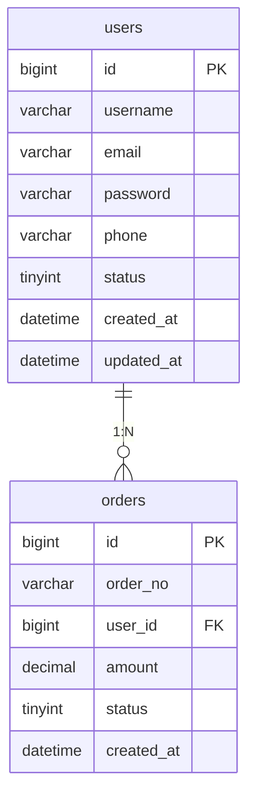
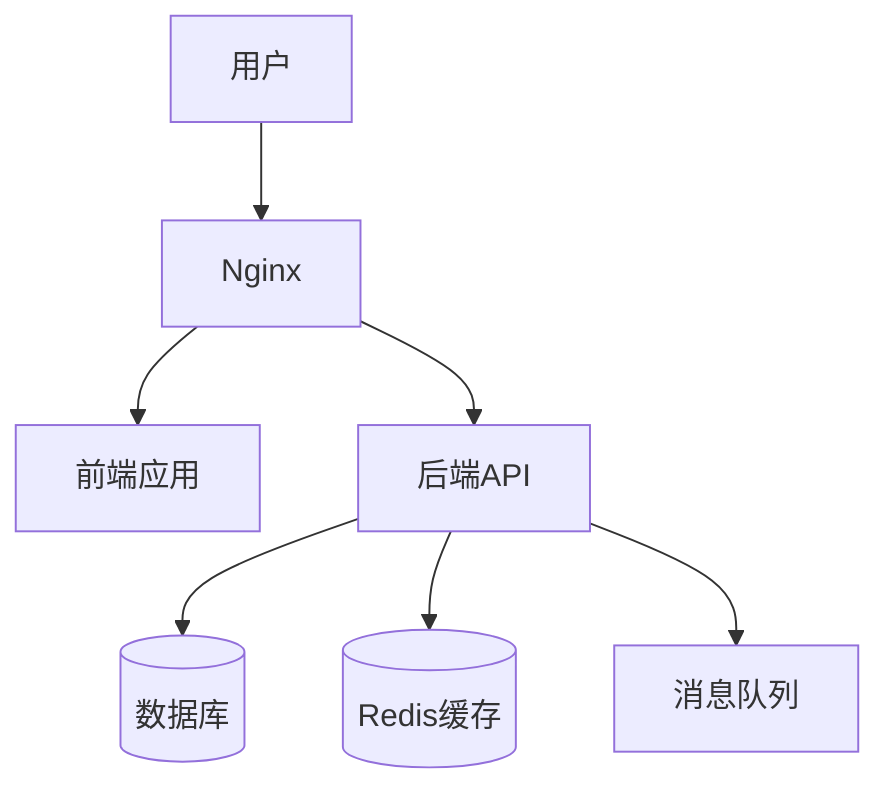
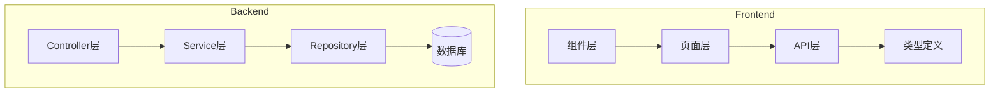
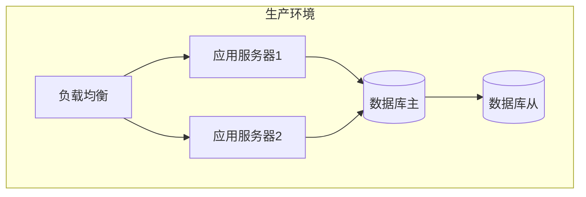

# Doc Generate - 项目文档一键生成

## Description

此技能用于项目文档生成，包括API文档、数据库文档、架构文档、README等，确保项目文档完整、准确、易读。

## Usage Scenario

- 项目启动时
- 新功能开发完成后
- API接口开发完成后
- 项目交接时
- 定期文档更新

## Instructions

### 1. README 文档生成

#### 标准README模板

```markdown
# [项目名称]

> [项目简短描述]

## 功能特性

- 功能1
- 功能2
- 功能3

## 技术栈

### 前端
- React 18.x
- TypeScript 5.x
- Vite 5.x
- [其他技术]

### 后端
- Spring Boot 3.x
- Java 17
- [数据库]
- [其他技术]

## 快速开始

### 前置要求

- Node.js 18+
- Java 17+
- [数据库]

### 安装运行

```bash
# 后端
cd backend
mvn spring-boot:run

# 前端
cd frontend
npm install
npm run dev
```

## 项目结构

```
project/
├── backend/
│   ├── src/
│   │   ├── main/
│   │   │   ├── java/
│   │   │   │   └── com/project/
│   │   │   │       ├── controller/  # 控制器
│   │   │   │       ├── service/     # 服务层
│   │   │   │       ├── repository/  # 数据访问
│   │   │   │       └── model/       # 实体类
│   │   │   └── resources/
│   │   │       └── application.yml
│   │   └── test/
│   └── pom.xml
├── frontend/
│   ├── src/
│   │   ├── components/  # 组件
│   │   ├── pages/       # 页面
│   │   ├── api/         # API接口
│   │   └── types/       # 类型定义
│   └── package.json
└── docs/               # 文档
```

## API 文档

- [接口1](#接口1)
- [接口2](#接口2)
- [接口3](#接口3)

## 数据库设计

- [表1](#表1)
- [表2](#表2)

## 配置说明

### 环境变量

```env
# 数据库配置
DB_HOST=localhost
DB_PORT=3306
DB_NAME=your_db

# 其他配置
API_URL=http://localhost:8080
```

## 开发指南

### 代码规范
- [前端规范](./docs/frontend-guidelines.md)
- [后端规范](./docs/backend-guidelines.md)

### 提交规范
```
feat: 新功能
fix: 修复bug
docs: 文档更新
style: 代码格式
refactor: 重构
test: 测试相关
chore: 构建/工具
```

## 部署指南

### Docker部署

```bash
docker-compose up -d
```

### 传统部署

见 [部署文档](./docs/deployment.md)

## 常见问题

### Q: 如何配置数据库？
A: 参考 [配置说明](#配置说明)

### Q: 如何运行测试？
A: 见 [测试文档](./docs/testing.md)

## 贡献指南

欢迎提交PR！请先阅读 [贡献指南](./CONTRIBUTING.md)

## 许可证

[选择的许可证]

## 联系方式

- 项目地址: [GitHub URL]
- 问题反馈: [Issues URL]
- 邮件: [email]
```

### 2. API文档生成

#### Swagger/OpenAPI 注解

```java
// SpringDoc OpenAPI 注解
@Operation(summary = "获取用户信息", description = "根据用户ID获取用户详细信息")
@ApiResponses(value = {
    @ApiResponse(responseCode = "200", description = "成功"),
    @ApiResponse(responseCode = "404", description = "用户不存在")
})
@GetMapping("/users/{id}")
public ResponseEntity<User> getUser(@PathVariable Long id) {
    // ...
}
```

#### API文档模板

```markdown
# API 文档

## 基础信息

- Base URL: `http://localhost:8080/api`
- 认证方式: Bearer Token
- 数据格式: JSON

## 认证接口

### 用户登录

**接口:** `POST /auth/login`

**请求参数:**
```json
{
  "username": "string",
  "password": "string"
}
```

**响应示例:**
```json
{
  "code": 200,
  "message": "success",
  "data": {
    "token": "eyJhbGciOiJIUzI1NiIs...",
    "user": {
      "id": 1,
      "username": "admin"
    }
  }
}
```

## 用户接口

### 获取用户列表

**接口:** `GET /users`

**请求参数:**
| 参数 | 类型 | 必填 | 说明 |
|------|------|------|------|
| page | int | 否 | 页码，默认1 |
| size | int | 否 | 每页数量，默认20 |

**响应示例:**
```json
{
  "code": 200,
  "data": {
    "list": [],
    "total": 100,
    "page": 1,
    "size": 20
  }
}
```

### 创建用户

**接口:** `POST /users`

**请求参数:**
```json
{
  "username": "string",
  "email": "string",
  "phone": "string"
}
```

## 错误码说明

| 错误码 | 说明 |
|--------|------|
| 200 | 成功 |
| 400 | 请求参数错误 |
| 401 | 未授权 |
| 403 | 禁止访问 |
| 404 | 资源不存在 |
| 500 | 服务器错误 |
```

### 3. 数据库文档生成

#### 数据库文档模板

```markdown
# 数据库设计文档

## 概述

- 数据库类型: [MySQL/PostgreSQL/SQL Server]
- 字符集: [UTF8MB4]
- 表数量: [N]

## 表结构

### users - 用户表

| 字段名 | 类型 | 长度 | 必填 | 默认值 | 说明 |
|--------|------|------|------|--------|------|
| id | BIGINT | - | 是 | - | 主键，自增 |
| username | VARCHAR | 50 | 是 | - | 用户名，唯一 |
| email | VARCHAR | 100 | 是 | - | 邮箱，唯一 |
| password | VARCHAR | 255 | 是 | - | 密码（加密存储） |
| phone | VARCHAR | 20 | 否 | NULL | 手机号 |
| status | TINYINT | - | 是 | 1 | 状态: 0-禁用, 1-启用 |
| created_at | DATETIME | - | 是 | CURRENT_TIMESTAMP | 创建时间 |
| updated_at | DATETIME | - | 是 | CURRENT_TIMESTAMP ON UPDATE | 更新时间 |

**索引:**
- PRIMARY KEY: id
- UNIQUE KEY: uk_username (username)
- UNIQUE KEY: uk_email (email)
- KEY: idx_status (status)
- KEY: idx_created (created_at)

### orders - 订单表

| 字段名 | 类型 | 长度 | 必填 | 默认值 | 说明 |
|--------|------|------|------|--------|------|
| id | BIGINT | - | 是 | - | 主键，自增 |
| order_no | VARCHAR | 32 | 是 | - | 订单号，唯一 |
| user_id | BIGINT | - | 是 | - | 用户ID |
| amount | DECIMAL | 10,2 | 是 | - | 订单金额 |
| status | TINYINT | - | 是 | 0 | 状态: 0-待支付, 1-已支付, 2-已取消 |
| created_at | DATETIME | - | 是 | CURRENT_TIMESTAMP | 创建时间 |

**索引:**
- PRIMARY KEY: id
- UNIQUE KEY: uk_order_no (order_no)
- KEY: idx_user_id (user_id)
- KEY: idx_status (status)
- KEY: idx_created (created_at)

**关系:**
- orders.user_id → users.id (一对多)

## ER图



## 数据字典

### 状态枚举

#### user.status
| 值 | 说明 |
|----|------|
| 0 | 禁用 |
| 1 | 启用 |

#### order.status
| 值 | 说明 |
|----|------|
| 0 | 待支付 |
| 1 | 已支付 |
| 2 | 已取消 |
```

### 4. 架构文档生成

#### 架构文档模板

```markdown
# 系统架构文档

## 系统概述

[系统概述说明]

## 架构图



## 技术架构

### 前端技术栈
- 框架: React 18
- 语言: TypeScript 5
- 构建工具: Vite 5
- UI组件: [Ant Design / MUI / ...]
- 状态管理: [Redux / Zustand / ...]
- 路由: React Router 6

### 后端技术栈
- 框架: Spring Boot 3
- 语言: Java 17
- ORM: Spring Data JPA / MyBatis
- 数据库: [MySQL / PostgreSQL]
- 缓存: Redis
- 文档: SpringDoc OpenAPI

### 基础设施
- Web服务器: Nginx
- 容器: Docker
- CI/CD: [GitHub Actions / GitLab CI]

## 模块架构



## 核心模块说明

### 用户模块
- 功能: 用户注册、登录、信息管理
- 接口: `/api/users/*`
- 表: users

### 订单模块
- 功能: 订单创建、查询、状态管理
- 接口: `/api/orders/*`
- 表: orders

## 部署架构



## 安全架构

### 认证授权
- 认证: JWT Token
- 授权: 基于角色的权限控制(RBAC)

### 数据安全
- 密码加密: BCrypt
- 敏感数据加密: AES
- HTTPS传输加密
- SQL注入防护: 参数化查询
- XSS防护: 输入验证和输出编码

## 性能优化

### 缓存策略
- Redis缓存热点数据
- 本地缓存(Caffeine)
- CDN加速静态资源

### 数据库优化
- 索引优化
- 查询优化
- 读写分离
- 分库分表(后期)
```

### 5. 自动化文档生成工具

#### Javadoc/Swagger配置

```xml
<!-- pom.xml -->
<dependency>
    <groupId>org.springdoc</groupId>
    <artifactId>springdoc-openapi-starter-webmvc-ui</artifactId>
    <version>2.3.0</version>
</dependency>
```

#### TypeDoc配置

```json
{
  "entryPoints": ["src/index.ts"],
  "out": "docs/api",
  "excludeExternals": true
}
```

## Examples

### 完整项目文档结构示例

```
docs/
├── README.md                    # 项目说明
├── architecture.md              # 架构文档
├── database.md                  # 数据库文档
├── api.md                       # API文档
├── deployment.md                # 部署文档
├── frontend-guidelines.md       # 前端开发规范
├── backend-guidelines.md        # 后端开发规范
├── testing.md                   # 测试文档
└── changelog.md                 # 变更日志
```
