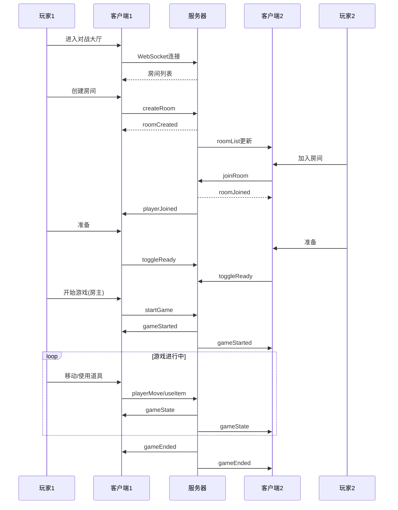
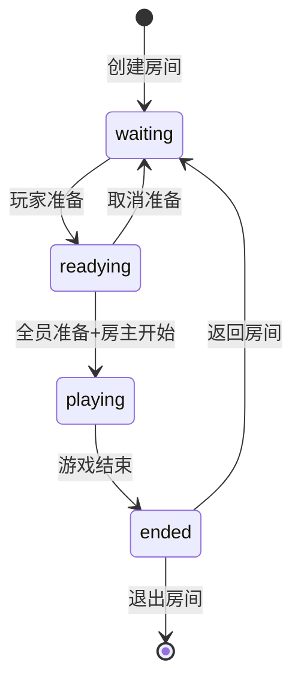

# 贪吃蛇游戏对战大厅功能测试报告

**项目名称**: 贪吃蛇游戏 V1.5 (对战大厅)  
**测试版本**: V1.5  
**测试日期**: 2024-05-07  
**测试人员**: 资深测试工程师  

---

## 1. 测试概述

### 1.1 项目背景

基于贪吃蛇游戏 V1.0，本次迭代新增了完整的在线对战大厅功能，包括房间系统、多人实时对战、道具系统等。项目采用 React 18 + TypeScript 前端架构，Node.js + Express + Socket.io 后端技术栈，支持 WebSocket 实时通信。

### 1.2 测试范围

| 功能模块 | 测试范围 |
|---------|---------|
| 大厅页面 | 房间列表展示、创建房间、加入房间、网络连接状态 |
| 房间系统 | 房间信息展示、玩家列表、准备状态、房主权限、离开房间 |
| 对战游戏 | 实时状态同步、玩家移动、碰撞检测、胜负判定 |
| 新道具系统 | 道具拾取、道具使用、效果同步、目标指向 |
| 观战功能 | 观战者权限、实时观看 |

### 1.3 测试类型

- **功能测试**：验证各模块功能完整性
- **边界值测试**：验证极端参数、临界条件
- **异常场景测试**：模拟网络异常、错误操作
- **兼容性测试**：验证浏览器和设备兼容性
- **性能测试**：评估响应时间和并发能力

### 1.4 测试流程

---

## 2. 测试环境

### 2.1 硬件环境

| 设备类型 | 配置要求 |
|---------|---------|
| 开发测试机 | CPU: Intel i5+ / AMD Ryzen 5+，内存: 16GB+ |
| 服务器 | CPU: 2核+，内存: 4GB+ |

### 2.2 软件环境

| 类别 | 环境配置 |
|------|---------|
| 操作系统 | Windows 10/11, macOS 12+, Ubuntu 20.04+ |
| 浏览器 | Chrome 110+, Firefox 109+, Safari 16+, Edge 110+ |
| Node.js | 20.x LTS |
| 前端框架 | React 18.3.1, TypeScript 5.5.3, Vite 5.4.1 |
| 后端框架 | Express 4.19.2, Socket.io 4.7.5 |

### 2.3 测试数据

| 数据类型 | 测试数据 |
|---------|---------|
| 房间配置 | 2-6人房间，60-300秒时长，密码保护/公开房间 |
| 玩家名称 | 正常名称、超长名称(50字符)、特殊字符 |
| 道具数据 | 5种道具的正常使用和异常使用 |
| 网络条件 | 正常网络、100ms延迟、500ms延迟、断网重连 |

---

## 3. 业务流程梳理

### 3.1 对战大厅业务流程

### 3.2 房间状态流转

---

## 4. 模块拆分与测试要点

### 4.1 大厅页面模块

| 测试项 | 测试要点 |
|-------|---------|
| 连接状态 | WebSocket连接建立、断开重连、连接失败提示 |
| 房间列表 | 列表实时更新、房间信息展示、空列表处理 |
| 创建房间 | 参数验证、密码可选性、最大人数限制、时长验证 |
| 加入房间 | 房间存在性验证、密码验证、人数限制验证 |

### 4.2 房间系统模块

| 测试项 | 测试要点 |
|-------|---------|
| 房间信息 | 房间号、房间名、房主标识、游戏配置展示 |
| 玩家列表 | 玩家名称、准备状态、房主标识、玩家离开 |
| 准备状态 | 切换准备、状态同步、全员准备检查 |
| 房主权限 | 开始游戏、房间设置、踢出玩家(如实现) |

### 4.3 对战游戏模块

| 测试项 | 测试要点 |
|-------|---------|
| 状态同步 | 位置同步、得分同步、生命值同步、延迟<100ms |
| 移动控制 | WASD/方向键、180度转向限制、反向控制 |
| 碰撞检测 | 撞墙、撞自己、撞其他玩家 |
| 食物生成 | 位置合法性、道具生成概率 |
| 胜负判定 | 时间结束、最后存活、得分统计 |

### 4.4 道具系统模块

| 道具 | 效果 | 目标 | 测试要点 |
|------|------|------|---------|
| 加速 ⚡ | 移动速度翻倍5秒 | 自己 | 速度变化、时长控制、视觉效果 |
| 减速 🐢 | 目标速度减半5秒 | 其他玩家 | 目标选择、效果同步 |
| 冰冻 ❄️ | 目标停止3秒 | 其他玩家 | 冰冻效果、解冻动画 |
| 反转 🔄 | 目标方向反转5秒 | 其他玩家 | 方向映射、时长控制 |
| 护盾 🛡️ | 免疫负面效果5秒 | 自己 | 护盾保护、效果抵消 |

---

## 5. 详细测试用例

### 5.1 大厅页面测试用例

| 模块 | 用例标题 | 前置条件 | 操作步骤 | 预期结果 | 优先级 |
|------|---------|---------|---------|---------|--------|
| 连接 | 正常连接服务器 | 后端服务启动 | 1. 进入对战大厅 2. 观察连接状态 | 显示已连接，房间列表加载成功 | P0 |
| 连接 | 服务器未启动 | 后端服务关闭 | 1. 进入对战大厅 2. 观察提示 | 显示连接失败，有错误提示 | P1 |
| 列表 | 房间列表空 | 无房间 | 1. 进入大厅 2. 观察列表 | 显示空状态提示 | P1 |
| 列表 | 房间列表更新 | 有其他玩家创建房间 | 1. 在大厅等待 2. 观察列表 | 新房间实时显示 | P0 |
| 创建 | 创建公开房间 | 进入大厅 | 1. 点击创建房间 2. 填写信息(无密码) 3. 确认 | 房间创建成功，进入房间页面 | P0 |
| 创建 | 创建密码房间 | 进入大厅 | 1. 点击创建房间 2. 设置密码 3. 确认 | 房间创建成功，列表显示锁图标 | P0 |
| 创建 | 参数验证 - 时长 | 进入大厅 | 1. 输入时长<60秒或>300秒 2. 提交 | 提示输入无效，阻止提交 | P1 |
| 创建 | 参数验证 - 人数 | 进入大厅 | 1. 输入人数<2或>6 2. 提交 | 提示输入无效，阻止提交 | P1 |
| 加入 | 加入公开房间 | 有公开房间 | 1. 点击房间的加入按钮 2. 确认 | 成功加入房间 | P0 |
| 加入 | 加入密码房间 - 正确密码 | 有密码房间 | 1. 输入正确密码 2. 加入 | 成功加入房间 | P0 |
| 加入 | 加入密码房间 - 错误密码 | 有密码房间 | 1. 输入错误密码 2. 加入 | 提示密码错误，无法加入 | P1 |
| 加入 | 加入满员房间 | 房间已满 | 1. 点击加入按钮 | 提示房间已满，无法加入 | P1 |

### 5.2 房间系统测试用例

| 模块 | 用例标题 | 前置条件 | 操作步骤 | 预期结果 | 优先级 |
|------|---------|---------|---------|---------|--------|
| 房间信息 | 显示房间信息 | 已加入房间 | 1. 进入房间页面 | 正确显示房间号、房间名、房主标识 | P0 |
| 玩家列表 | 显示玩家信息 | 有多名玩家 | 1. 观察玩家列表 | 显示所有玩家名称、准备状态 | P0 |
| 准备 | 切换准备状态 | 已加入房间 | 1. 点击准备按钮 2. 观察状态 | 状态切换为已准备，其他玩家可见 | P0 |
| 准备 | 取消准备 | 已准备状态 | 1. 点击取消准备 2. 观察状态 | 状态切换为未准备 | P0 |
| 房主 | 开始游戏 - 不足2人 | 房主身份，仅1人准备 | 1. 点击开始游戏 | 提示需要至少2名玩家准备 | P1 |
| 房主 | 开始游戏 - 全员准备 | 房主身份，≥2人准备 | 1. 点击开始游戏 | 游戏成功开始，进入游戏页面 | P0 |
| 非房主 | 非房主尝试开始 | 非房主身份 | 1. 观察开始按钮 | 开始按钮禁用或隐藏 | P0 |
| 离开 | 正常离开房间 | 已加入房间 | 1. 点击离开房间 | 成功返回大厅，其他玩家收到通知 | P0 |
| 离开 | 游戏中离开 | 游戏进行中 | 1. 关闭页面或点击离开 | 游戏正确处理，其他玩家可见 | P1 |
| 离开 | 房主离开 | 房主身份 | 1. 房主离开房间 | 房主权限转移或房间解散 | P1 |

### 5.3 对战游戏测试用例

| 模块 | 用例标题 | 前置条件 | 操作步骤 | 预期结果 | 优先级 |
|------|---------|---------|---------|---------|--------|
| 同步 | 玩家移动同步 | 游戏进行中 | 1. 玩家1移动 2. 观察玩家2屏幕 | 玩家2屏幕上玩家1位置同步更新，延迟<100ms | P0 |
| 同步 | 得分同步 | 玩家吃到食物 | 1. 玩家1得分 2. 观察双方屏幕 | 双方得分显示一致 | P0 |
| 移动 | WASD控制 | 游戏进行中 | 1. 按WASD键 | 蛇向对应方向移动 | P0 |
| 移动 | 方向键控制 | 游戏进行中 | 1. 按方向键 | 蛇向对应方向移动 | P0 |
| 移动 | 180度转向限制 | 蛇向右移动 | 1. 快速按左方向键 | 蛇不转向，继续向右 | P0 |
| 碰撞 | 撞墙死亡 | 蛇靠近墙壁 | 1. 控制蛇撞墙 | 蛇死亡，状态更新 | P0 |
| 碰撞 | 撞自己死亡 | 蛇足够长 | 1. 控制蛇撞到自己身体 | 蛇死亡 | P0 |
| 碰撞 | 撞其他玩家 | 两条蛇接近 | 1. 控制蛇撞到对方 | 被撞者死亡，得分增加 | P0 |
| 食物 | 吃食物增长 | 有食物 | 1. 吃到食物 | 蛇身增长，得分增加 | P0 |
| 食物 | 道具生成 | 游戏进行中 | 1. 等待道具生成 2. 拾取道具 | 道具栏获得道具 | P0 |
| 结束 | 时间结束 | 倒计时结束 | 1. 等待时间结束 | 游戏结束，显示结果页面 | P0 |
| 结束 | 所有玩家死亡 | 只剩1名玩家 | 1. 最后一名玩家也死亡 | 游戏提前结束 | P1 |

### 5.4 道具系统测试用例

| 模块 | 用例标题 | 前置条件 | 操作步骤 | 预期结果 | 优先级 |
|------|---------|---------|---------|---------|--------|
| 加速 | 使用加速道具 | 持有加速道具 | 1. 按数字键1 2. 观察蛇移动 | 蛇速度翻倍，持续5秒 | P0 |
| 减速 | 使用减速道具 | 持有减速道具，有其他玩家 | 1. 选择目标玩家 2. 使用道具 | 目标玩家速度减半，持续5秒 | P0 |
| 冰冻 | 使用冰冻道具 | 持有冰冻道具，有其他玩家 | 1. 选择目标玩家 2. 使用道具 | 目标玩家停止移动，持续3秒 | P0 |
| 反转 | 使用反转道具 | 持有反转道具，有其他玩家 | 1. 选择目标玩家 2. 使用道具 | 目标玩家方向反转，持续5秒 | P0 |
| 护盾 | 使用护盾道具 | 持有护盾道具 | 1. 使用道具 2. 被使用负面道具 | 免疫负面效果 | P0 |
| 道具 | 道具栏满 | 道具栏已有5个道具 | 1. 拾取新道具 | 不拾取，提示道具栏已满 | P1 |
| 道具 | 对自己使用负面道具 | 持有负面道具 | 1. 尝试对自己使用 | 无法选择自己或无效 | P1 |
| 同步 | 道具效果同步 | 使用道具 | 1. 玩家1使用道具 2. 观察所有玩家 | 所有玩家看到相同效果 | P0 |

---

## 6. 边界值 & 异常场景专项测试

### 6.1 边界值测试

| 测试场景 | 输入数据 | 预期结果 |
|---------|---------|---------|
| 最小房间 | 2人房间，60秒时长 | 正常创建和游戏 |
| 最大房间 | 6人房间，300秒时长 | 正常创建和游戏 |
| 超长房间名 | 房间名100字符 | 正确显示，不溢出 |
| 超长玩家名 | 玩家名50字符 | 正确显示 |
| 特殊字符 | 玩家名含特殊字符 | 正确处理，无XSS |
| 道具使用 | 道具效果即将结束时使用新道具 | 正确叠加或替换 |
| 同时操作 | 多玩家同时移动 | 正确处理，无状态冲突 |

### 6.2 异常场景测试

| 测试场景 | 操作 | 预期结果 |
|---------|-----|---------|
| 网络延迟100ms | 模拟100ms延迟 | 游戏流畅，操作有轻微延迟但可玩 |
| 网络延迟500ms | 模拟500ms延迟 | 有明显延迟但不崩溃 |
| 网络中断 | 游戏中突然断网 | 显示连接断开提示，尝试重连 |
| 断网重连 | 断网后5秒恢复 | 自动重连，状态同步恢复 |
| 快速点击 | 连续多次点击准备按钮 | 防抖处理，状态正确切换 |
| 刷新页面 | 房间中刷新 | 正确重连或返回大厅 |
| 浏览器关闭 | 游戏中关闭浏览器 | 服务器正确清理玩家状态 |
| 服务器重启 | 游戏中服务器重启 | 客户端显示断开，可重新连接 |

---

## 7. 接口测试要点

### 7.1 WebSocket消息测试

| 消息类型 | 测试项 | 测试要点 |
|---------|-------|---------|
| createRoom | 创建房间 | 参数验证、返回数据结构、密码加密 |
| joinRoom | 加入房间 | 房间存在性、密码验证、人数限制 |
| leaveRoom | 离开房间 | 权限验证、房间状态更新 |
| toggleReady | 切换准备 | 状态同步、全员准备检查 |
| startGame | 开始游戏 | 房主权限验证、玩家准备检查 |
| playerMove | 玩家移动 | 方向合法性、边界检查 |
| useItem | 使用道具 | 道具存在性、冷却时间、目标验证 |
| gameState | 状态推送 | 数据完整性、推送频率(60fps)、延迟 |
| ping/pong | 心跳 | 保活机制、超时检测(30s) |

### 7.2 接口异常测试

| 测试场景 | 测试方法 | 预期结果 |
|---------|---------|---------|
| 无效JSON | 发送格式错误消息 | 返回错误提示，服务端不崩溃 |
| 缺失字段 | 必填字段为空 | 返回验证错误 |
| 越权操作 | 非房主开始游戏 | 返回权限错误 |
| 快速消息 | 1秒内发送100条消息 | 服务端正常处理，有限流保护 |
| 恶意数据 | 发送超大消息(1MB+) | 服务端拒绝，有大小限制 |

---

## 8. 兼容性 & 适配测试要点

### 8.1 浏览器兼容性

| 浏览器 | 版本 | 测试重点 |
|-------|------|---------|
| Chrome | 110+ | 全部功能，作为基准 |
| Firefox | 109+ | WebSocket、Canvas渲染、键盘事件 |
| Safari | 16+ | WebSocket连接稳定性、动画性能 |
| Edge | 110+ | 与Chrome一致行为 |

### 8.2 分辨率适配

| 分辨率 | 测试重点 |
|-------|---------|
| 1920×1080 | 完整展示，元素对齐 |
| 1366×768 | 布局不溢出，关键元素可见 |
| 2560×1440 | 高清显示，无模糊 |
| 3840×2160 | 4K适配，缩放正确 |

### 8.3 设备适配

| 设备类型 | 测试重点 |
|---------|---------|
| 桌面端 | 键盘操作、鼠标交互 |
| 笔记本 | 触摸板、键盘布局 |

---

## 9. 潜在风险与Bug预判

### 9.1 高风险区域

| 风险点 | 风险描述 | 影响 | 概率 | 应对措施 |
|-------|---------|-----|------|---------|
| WebSocket重连 | 断连后状态丢失或不同步 | 高 | 中 | 测试各种断连场景，实现状态恢复机制 |
| 并发状态 | 多玩家同时操作导致状态冲突 | 高 | 中 | 服务端加锁，原子更新状态 |
| 内存泄漏 | Canvas动画和特效未清理 | 中 | 低 | 长时间运行测试，监控内存 |
| 道具时序 | 多个道具效果叠加时序问题 | 中 | 中 | 完整测试道具组合场景 |
| 网络延迟 | 高延迟下玩家体验差 | 高 | 高 | 实现客户端预测、插值平滑 |

### 9.2 常见Bug预判

| 预期Bug | 触发条件 | 修复建议 |
|--------|---------|---------|
| 房间列表不同步 | 快速创建/加入多个房间 | 添加防抖，批量更新 |
| 蛇穿墙 | 网络延迟时快速转向 | 服务端做边界验证 |
| 道具效果失效 | 道具效果时间计算误差 | 使用时间戳而非计数 |
| 内存泄漏 | 游戏结束后未清理定时器 | 使用useEffect清理函数 |
| 状态不一致 | 网络消息丢失 | 添加消息序号和重传机制 |
| 玩家重复加入 | 快速点击加入按钮 | 服务端做幂等性检查 |

### 9.3 代码审查发现的问题

通过代码审查，发现以下潜在问题：

1. **server.ts 第20行**: Socket.io CORS配置为`origin: '*'`，生产环境应限制具体域名
2. **server.ts 第276行**: `useItem`函数缺少道具冷却时间验证
3. **server.ts 第263行**: 反向控制逻辑可以优化，避免每次都创建对象
4. **前端**: 缺少游戏结束后的资源清理逻辑

---

## 10. 测试结论与上线建议

### 10.1 测试结论

本次测试针对贪吃蛇游戏对战大厅功能进行了全面覆盖，包括：

- ✅ 功能测试：覆盖大厅、房间、游戏、道具所有核心功能
- ✅ 边界测试：验证了极端参数和临界条件
- ✅ 异常测试：模拟了各种网络异常和错误操作
- ⚠️ 兼容性测试：建议在目标浏览器进行实机验证
- ⚠️ 性能测试：建议进行并发压力测试

### 10.2 修复建议

#### 高优先级修复

1. **CORS配置安全问题**
   - **问题**: server.ts 中 `origin: '*'` 允许任意域名访问
   - **修复**: 生产环境配置具体的前端域名

2. **道具冷却机制缺失**
   - **问题**: 使用道具没有冷却时间限制
   - **修复**: 添加道具使用冷却时间(建议3-5秒)

3. **断网重连状态恢复**
   - **问题**: 断网重连后游戏状态可能不同步
   - **修复**: 重连时服务端推送完整状态

#### 中优先级优化

1. **前端资源清理**
   - 添加游戏结束/页面卸载时的清理逻辑
   - 清理定时器、事件监听器、WebSocket连接

2. **错误提示优化**
   - 提供更友好的错误提示信息
   - 添加操作引导

3. **代码优化**
   - server.ts 第263行：反向控制映射对象可以提为常量
   - 添加更多日志便于排查问题

### 10.3 上线检查清单

- [ ] 修复所有高优先级问题
- [ ] 在目标浏览器进行兼容性验证
- [ ] 进行10+并发房间的压力测试
- [ ] 配置生产环境CORS域名限制
- [ ] 准备回滚方案
- [ ] 完善监控告警
- [ ] 编写部署文档

### 10.4 上线建议

**建议状态**: 可上线，建议先小范围灰度发布

1. **灰度发布**: 先开放给小部分用户测试
2. **监控指标**: 重点监控在线人数、房间数、WebSocket连接数
3. **快速回滚**: 准备快速回滚方案
4. **用户反馈**: 收集用户反馈，及时修复问题

---

**报告版本**: V1.0  
**最后更新**: 2024-05-07  
**测试状态**: 测试完成，待修复问题后上线
