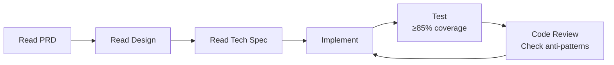

# AGENTS.md — oes-acct-vouch

为本仓库编码的 AI 智能体指南。所有代码必须遵循 Java 最佳实践 / Idiomatic Java、SOLID/DRY 设计原则，并达到高测试覆盖率和高性能标准。

---

## 1. 仓库概览

**oes-acct-vouch** 是望海康信 OES（Operational Excellence System）的会计凭证录入前后端组件。核心业务挑战是**动态辅助核算（辅助核算）机制**：科目绑定最多 8 个动态辅助核算维度 + 5 个其他辅助核算维度，系统须在运行时动态解析、渲染、校验并按 OES 行存储模型（一对多）持久化这些多维核算值。

| 维度 | 说明 |
|------|------|
| 后端 | Java 25 + Spring Boot 3.4.x + JdbcTemplate + SQL Server |
| 前端 | React 18 + TypeScript + Ant Design 5 + Zustand |
| 构建 | Maven 3.9+ |
| 数据库 | SQL Server (OESCQET-0408) |

---

## 2. 核心领域规则（严禁修改）

这些是 OES 原生规则，任何偏离均会破坏与现有 OES 报表和工作流的兼容性。

### 2.1 科目 → 辅助核算类型解析

```java
// 遍历 check_type1~8
// check_type{n} 存储核算类型名称（如"部门"），非 check_id
for (int i = 1; i <= 8; i++) {
    String checkTypeName = switch (i) {
        case 1 -> subj.getCheckType1();
        // ... 枚举所有 8 个字段
        default -> null;
    };
    if (checkTypeName != null && !checkTypeName.isBlank()) {
        // 绑定了一个辅助核算类型
    }
}
```

### 2.2 其他辅助核算（v2.1）

科目还可能有 `other_checktype1~5`，通过 `acct_subj_other_fz_setting` 配置表定义：

| 配置 | 含义 |
|------|------|
| `input_type=3` | 文本框录入 |
| `input_type=4` | 字典选择录入 |
| `is_show=0/1` | 是否显示 |
| `is_require=0/1` | 是否必填 |

特殊字段映射（当配置名称为特定值时自动触发）：
| other_checktype 值 | 写入字段 |
|---|---|
| 日期 → `info_fzhs{N}` + `order_date` + `occur_date` |
| 结算方式 → `info_fzhs{N}` + `pay_type_id` |
| 票据号 → `info_fzhs{N}` + `cheq_no` + `order_no` |
| 回单号 → `info_fzhs{N}` + `receipt_no` |

### 2.3 OES 行存储模型（关键）

```java
// 一笔分录（acct_vouch_detail）→ 多行 acct_check_items（一对多）
// Line 1: 标准辅助核算行（checktype1~50 存储辅助核算值）
// Line 2+: 其他辅助核算行（info_fzhs1~5 + 特殊业务字段）
// 保存策略：全量替换（DELETE + 批量 INSERT）
```

### 2.4 用户 → 员工 → 部门关联

```sql
-- 使用 ACCOUNT 字段（非 ID），通过 emp_code 关联
SELECT u.NAME, e.emp_name, d.dept_name
FROM up_org_user u
LEFT JOIN sys_emp e ON u.emp_code = e.emp_code
LEFT JOIN sys_dept d ON e.dept_id = d.dept_id
WHERE u.ACCOUNT = :account
```

---

## 3. 设计原则：SOLID + DRY

### 3.1 单一职责原则

每个类应只有一个职责，通过类名清晰表达：

```java
// ✅ 正确：命名即职责
public class AccountingStandardsValidator { /* 仅做校验 */ }
public class VouchNoGenerator { /* 仅做凭证号生成 */ }
public class DynamicSqlBuilder { /* 仅做动态 SQL 构建 */ }
public class TableNameWhitelist { /* 仅做表名白名单校验 */ }

// ❌ 错误：模糊的命名和混杂的职责
public class VouchUtil { /* 什么都有 */ }
public class CheckHelper { /* 不知道做什么 */ }
```

包结构：
```
com.oes.acct.vouch
├── controller/       # REST 控制器，薄层
├── service/          # 业务逻辑
├── repository/       # 数据访问（JdbcTemplate）
├── model/dto/        # 请求/响应 DTO（Record）
├── model/vo/         # 视图对象
├── model/entity/     # 数据库实体
├── validator/        # 校验逻辑
├── cache/            # 缓存逻辑
├── config/           # Spring 配置
├── exception/        # 异常定义 + 全局处理器
└── util/             # 工具类（无状态静态方法）
```

**关键原则**：如果一个方法无法用一句话说明它的职责，说明它应该拆分。

### 3.2 开闭原则

通过组合而非修改来扩展：

```java
// ✅ 正确：新增校验规则通过新增方法实现，不修改现有逻辑
public class AccountingStandardsValidator {
    private static final List<ValidationFunction> RULES = List.of(
        AccountingStandardsValidator::validateBalance,
        AccountingStandardsValidator::validateCheckCompleteness,
        AccountingStandardsValidator::validateSubjectLeafLevel
    );

    public void validate(VouchSaveRequest request) {
        for (var rule : RULES) {
            ValidationResult result = rule.apply(request);
            if (result.hasError()) throw new BusinessException(result.errorCode(), result.message());
        }
    }
}

@FunctionalInterface
interface ValidationFunction {
    ValidationResult apply(VouchSaveRequest request);
}
```

### 3.3 里氏替换原则

- Repository 接口定义契约，任何 `JdbcTemplate` 实现必须可替换
- DTO/Record 是不可变值载体，无继承行为

### 3.4 接口隔离原则

```java
// ✅ 正确：按业务维度拆分为小接口
public interface VouchRepository { /* 仅凭证主表操作 */ }
public interface VouchDetailRepository { /* 仅分录操作 */ }
public interface CheckItemsRepository { /* 仅辅助核算操作 */ }

// ❌ 错误：大而全的接口
public interface VouchDao { /* 包含主表/分录/辅助核算所有方法 */ }
```

### 3.5 依赖倒置原则

```java
// ✅ 正确：依赖接口，而非具体实现
@Service
public class VouchService {
    private final VouchRepository vouchRepository;
    private final VouchDetailRepository detailRepository;
    private final CheckItemsRepository checkItemsRepository;

    // 构造器注入（Spring 自动推断）
    public VouchService(VouchRepository vouchRepository, /* ... */) {
        this.vouchRepository = vouchRepository;
        // ...
    }
}

// ❌ 错误：直接依赖 JdbcTemplate
public class VouchService {
    @Autowired
    private JdbcTemplate jdbcTemplate; // 跳过 Repository 层
}
```

### 3.6 DRY（Don't Repeat Yourself）

```java
// ✅ 正确：集中化错误码
public final class ErrorCodes {
    private ErrorCodes() {} // 工具类私有构造器
    public static final int SUCCESS = 0;
    public static final int IMBALANCE = 1001;
    public static final int CHECK_REQUIRED_MISSING = 1004;
    public static final int SUBJECT_NOT_LEAF = 1008;
    public static final int VOUCH_NO_CONFLICT = 1012;
}

// ✅ 正确：统一响应封装
public record ApiResponse<T>(int code, String message, T data) {
    public static <T> ApiResponse<T> success(T data) {
        return new ApiResponse<>(0, "success", data);
    }
    public static <T> ApiResponse<T> error(int code, String message) {
        return new ApiResponse<>(code, message, null);
    }
}

// ✅ 正确：集中化动态 SQL 构建
// 所有 checktype 列的 INSERT/UPDATE/CLEAR 都由 DynamicSqlBuilder 一处构建
```

---

## 4. Java 习惯用法

### 4.1 Records 用于 DTO/VO

```java
// 不可变数据传输对象
public record VouchLoadRequest(
    @NotBlank String account,
    String vouchId,               // null = 新增，非空 = 编辑
    @NotBlank String compCode,
    @NotBlank String copyCode,
    @NotBlank String acctYear
) {}

// 带工厂方法的 Record
public record VouchSaveRequest(
    @NotNull VouchMainDTO vouch,
    @NotEmpty List<VouchDetailDTO> details
) {
    public VouchSaveRequest {
        // 紧凑构造器：校验逻辑
        if (details.isEmpty()) throw new IllegalArgumentException("分录不能为空");
    }
}
```

### 4.2 构造器注入（禁止 @Autowired 字段注入）

```java
// ✅ 正确（Spring Boot 3.x 推荐）
@RestController
public class VouchController {
    private final VouchService vouchService;

    public VouchController(VouchService vouchService) {
        this.vouchService = vouchService;
    }
}

// ❌ 禁止
@Autowired
private VouchService vouchService;
```

### 4.3 BigDecimal 处理金额（禁止 double/float）

```java
// ✅ 正确
BigDecimal debit = detail.getAmtDebit() != null ? detail.getAmtDebit() : BigDecimal.ZERO;
if (debit.compareTo(BigDecimal.ZERO) < 0) {
    throw new BusinessException(ErrorCodes.AMOUNT_INVALID, "金额不能为负数");
}
if (debit.scale() > 2) {
    throw new BusinessException(ErrorCodes.AMOUNT_INVALID, "金额最多两位小数");
}

// ❌ 禁止
double debit = detail.getAmtDebit(); // 精度丢失
```

### 4.4 StringBuilder 构建动态 SQL

```java
// ✅ 正确
public String buildInsertCheckItemSql(int checkId) {
    return new StringBuilder("INSERT INTO acct_check_items (vouch_detail_id, checktype")
        .append(checkId)
        .append(") VALUES (?, ?)")
        .toString();
}
// 注意：checkId 来自数据库 sys_check_define，非用户输入，安全
```

### 4.5 KeyHolder 获取自增主键

```java
public long insertVouch(VouchMainDTO vouch) {
    var sql = "INSERT INTO acct_vouch (comp_code, copy_code, acct_year, vouch_date, ...) VALUES (?, ?, ?, ?, ...)";
    var keyHolder = new GeneratedKeyHolder();
    jdbcTemplate.update(con -> {
        var ps = con.prepareStatement(sql, Statement.RETURN_GENERATED_KEYS);
        ps.setString(1, vouch.compCode());
        // ... 设置其他参数
        return ps;
    }, keyHolder);
    return keyHolder.getKey().longValue();
}
```

### 4.6 SLF4J 参数化日志

```java
// ✅ 正确（禁止字符串拼接）
log.info("凭证保存成功: vouchId={}, vouchNo={}, account={}", vouchId, vouchNo, account);
```

### 4.7 Switch 表达式

```java
public String resolveErrorMessage(int errorCode) {
    return switch (errorCode) {
        case ErrorCodes.IMBALANCE -> "借贷不平衡";
        case ErrorCodes.CHECK_REQUIRED_MISSING -> "必填辅助核算未填写";
        case ErrorCodes.SUBJECT_NOT_LEAF -> "科目非末级";
        case ErrorCodes.VOUCH_NO_CONFLICT -> "凭证号生成繁忙，请重试";
        default -> "未知错误(" + errorCode + ")";
    };
}
```

### 4.8 Optional 处理可能为空的结果

```java
// ✅ 正确
public Optional<VouchMainDTO> findById(long vouchId) {
    var sql = "SELECT * FROM acct_vouch WHERE vouch_id = ?";
    return jdbcTemplate.query(sql, new BeanPropertyRowMapper<>(VouchMainDTO.class), vouchId)
        .stream()
        .findFirst();
}

// 在 Service 层使用
var vouch = vouchRepository.findById(vouchId)
    .orElseThrow(() -> new BusinessException(ErrorCodes.VOUCH_NOT_FOUND, "凭证不存在"));
```

---

## 5. 代码质量规范

### 5.1 命名规范

| 类别 | 规范 | 示例 |
|------|------|------|
| 类名 | 名词，大驼峰 | `VouchService`, `CheckItemsRepository` |
| 接口 | 名词，大驼峰 | `VouchRepository`（实现类：`JdbcVouchRepository`） |
| 方法 | 动词，小驼峰 | `findById()`, `saveVouch()`, `resolveSubjChecks()` |
| 常量 | UPPER_SNAKE_CASE | `MAX_RETRIES`, `BALANCE_TOLERANCE` |
| 包名 | 全小写 | `com.oes.acct.vouch` |
| 布尔方法 | `is/has/can` 开头 | `isLast()`, `hasCheckItems()`, `canSave()` |
| 参数 | 有意义的单/双词 | `account` 而非 `a`, `compCode` 而非 `cc` |

### 5.2 注释规范

```java
// 不需要 Javadoc 的简单 getter/setter —— Record 自带
// public record VouchMainDTO(Long vouchId, String compCode, ...) {}

// 需要注释的场景：非常规的业务逻辑、性能优化原因、特定 bug 的 workaround
/**
 * 使用全量替换策略保存辅助核算。
 * 设计决策：OES 行模型要求一个分录对应多行 check_items，
 * 增量更新复杂度高（需逐行比对），因此采用 DELETE + 批量 INSERT。
 * 数据量级小（每分录 ≤6 行），性能可接受。
 */
public void saveCheckItems(long detailId, List<CheckItemDTO> items) {
    // ...
}
```

### 5.3 异常处理规范

```java
// 层级结构：
// BusinessException — 业务异常（含错误码），ControllerAdvice 捕获后给用户友好提示
// DataAccessException — 数据访问异常（Spring 转换），记录日志后转为 BusinessException
// RuntimeException — 未预期异常，记录 ERROR 日志，统一返回 500

// Controller 层：薄，仅参数校验 + 调用 Service，不捕获业务异常
// Service 层：只抛出 BusinessException，不捕获
// GlobalExceptionHandler：统一捕获并转化

@RestControllerAdvice
public class GlobalExceptionHandler {
    @ExceptionHandler(BusinessException.class)
    public ApiResponse<Void> handleBusiness(BusinessException e) {
        log.warn("业务异常: code={}, message={}", e.getCode(), e.getMessage());
        return ApiResponse.error(e.getCode(), e.getMessage());
    }

    @ExceptionHandler(DataAccessException.class)
    public ApiResponse<Void> handleDataAccess(DataAccessException e) {
        log.error("数据库异常: ", e);
        return ApiResponse.error(ErrorCodes.DB_EXCEPTION, "数据库操作失败");
    }

    @ExceptionHandler(Exception.class)
    public ApiResponse<Void> handleUnknown(Exception e) {
        log.error("未预期异常: ", e);
        return ApiResponse.error(9999, "系统内部错误");
    }
}
```

---

## 6. 测试质量规范

### 6.1 总体要求

| 指标 | 要求 |
|------|------|
| 行覆盖率 | ≥85%（整体），≥90%（Validator/Generator） |
| 分支覆盖率 | ≥75%（整体），≥85%（Validator） |
| 测试用例 | 每方法 ≥2 个（成功 + 失败），边界值覆盖 |
| 命名约定 | `{methodName}_{scenario}_{expectedResult}` |
| 断言风格 | AssertJ（fluent assertions）|
| Mock 框架 | Mockito |

### 6.2 测试类结构

```java
// ✅ 正确
class AccountingStandardsValidatorTest {
    private AccountingStandardsValidator validator;

    @BeforeEach
    void setUp() {
        validator = new AccountingStandardsValidator(new JdbcVouchRepository(...));
    }

    @Test
    void validateBalance_whenDebitEqualsCredit_success() {
        // Arrange
        var request = createValidRequest();
        // Act & Assert
        assertThatCode(() -> validator.validate(request))
            .doesNotThrowAnyException();
    }

    @Test
    void validateBalance_whenDebitNotEqualsCredit_throwsException() {
        // Arrange
        var request = createImbalancedRequest();
        // Act & Assert
        assertThatThrownBy(() -> validator.validate(request))
            .isInstanceOf(BusinessException.class)
            .satisfies(e -> {
                var be = (BusinessException) e;
                assertThat(be.getCode()).isEqualTo(ErrorCodes.IMBALANCE);
            });
    }

    @Test
    void validateSubjectLeafLevel_whenNotLeaf_throwsException() {
        // Arrange
        var request = createRequestWithNonLeafSubject();
        // Act & Assert
        assertThatThrownBy(() -> validator.validate(request))
            .isInstanceOf(BusinessException.class)
            .hasFieldOrPropertyWithValue("code", ErrorCodes.SUBJECT_NOT_LEAF);
    }
}
```

### 6.3 集成测试（Testcontainers）

```java
// 使用 Testcontainers SQL Server 镜像进行集成测试
@Testcontainers
@SpringBootTest
class VouchServiceIntegrationTest {
    @Container
    static SQLServerContainer<?> sqlServer = new SQLServerContainer<>("mcr.microsoft.com/mssql/server:2022-latest");

    @DynamicPropertySource
    static void configureProperties(DynamicPropertyRegistry registry) {
        registry.add("spring.datasource.url", sqlServer::getJdbcUrl);
        registry.add("spring.datasource.username", sqlServer::getUsername);
        registry.add("spring.datasource.password", sqlServer::getPassword);
    }

    @Autowired
    private VouchService vouchService;

    @Test
    void saveVouch_withValidData_shouldPersistAllThreeTables() {
        // 1. 准备测试数据
        // 2. 调用保存
        // 3. 验证三表数据一致
    }
}
```

### 6.4 关键测试场景

| 模块 | 测试场景 |
|------|---------|
| AccountingStandardsValidator | 10 条规则全部覆盖（AC-01 ~ AC-10），含边界值 |
| VouchNoGenerator | 并发 100 线程生成 → 不重复、不跳号 |
| DynamicSqlBuilder | 表名白名单攻击测试、where_sql 参数化绑定 |
| VouchService | 三表事务原子性、任何步骤失败回滚验证 |
| NavigationService | 边界条件（首张/最后一张）、作废凭证排除 |
| CheckItemsRepository | 一对多 INSERT/UPDATE/DELETE、全量替换策略 |

---

## 7. 性能规范

### 7.1 缓存策略

```java
// 1. sys_check_define 全量缓存（启动时加载 + 定时刷新）
// 数据量小（<200 条），全量加载内存开销低

@Component
public class CheckDefineCache {
    private final Map<Integer, SysCheckDefine> cache = new ConcurrentHashMap<>();
    private final JdbcTemplate jdbcTemplate;

    public CheckDefineCache(JdbcTemplate jdbcTemplate) {
        this.jdbcTemplate = jdbcTemplate;
        loadAll();
    }

    @PostConstruct
    public void loadAll() {
        var defines = jdbcTemplate.query(
            "SELECT * FROM sys_check_define WHERE is_stop = '0'",
            new BeanPropertyRowMapper<>(SysCheckDefine.class)
        );
        defines.forEach(d -> cache.put(d.getCheckId(), d));
        log.info("辅助核算定义缓存加载完成: {} 条", defines.size());
    }

    @Scheduled(fixedRate = 300_000) // 5 分钟刷新
    public void refresh() { loadAll(); }

    public SysCheckDefine get(int checkId) {
        var define = cache.get(checkId);
        if (define == null) throw new BusinessException(ErrorCodes.PARAM_INVALID, "不存在的辅助核算定义: " + checkId);
        return define;
    }
}
```

### 7.2 SQL 索引优化

- 所有 `SELECT` 查询必须命中索引（EXPLAIN 验证）
- 核心查询使用覆盖索引（`INCLUDE` 非键列）
- `acct_vouch(comp_code, copy_code, acct_year, acct_month, vouch_no)` — 凭证导航复合索引
- `acct_check_items(vouch_detail_id)` — 辅助核算查询
- 禁止在 `WHERE` 子句中对索引列使用函数包裹

### 7.3 连接池配置

```yaml
spring:
  datasource:
    hikari:
      minimum-idle: 5
      maximum-pool-size: 20
      idle-timeout: 300000
      max-lifetime: 1200000
      connection-timeout: 30000
      pool-name: OesAcctVouchPool
```

### 7.4 虚拟线程

启用虚拟线程提升 I/O 密集型数据库操作性能：

```yaml
spring:
  threads:
    virtual:
      enabled: true
```

---

## 8. 数据库安全规范

### 8.1 SQL 注入防护

```java
// ✅ 正确：
// 1. table_id 通过白名单校验（动态加载 + 静态兜底）
// 2. where_sql 中的 :compCode 等占位符替换为 ? 并使用参数化绑定
// 3. 所有值参数使用 PreparedStatement 的 ? 占位符

// ❌ 禁止：
// String sql = "SELECT * FROM " + tableId + " WHERE " + whereSql.replace(":compCode", compCode);
```

### 8.2 表名白名单

```java
// 启动时从 sys_check_define 动态加载 +
// 静态兜底集合（防御 sys_check_define 数据异常）
private static final Set<String> FALLBACK_TABLES = Set.of(
    "sys_dept", "sys_emp", "sys_supplier", "sys_customer",
    "sys_project", "sys_branch", /* ... */
);
```

### 8.3 并发安全

| 场景 | 控制手段 |
|------|---------|
| 凭证号生成 | `WITH (UPDLOCK, SERIALIZABLE)` + Redis 分布式锁降级 |
| 三表保存 | `@Transactional(isolation=READ_COMMITTED, rollbackFor=Exception.class, timeout=30)` |
| 辅助核算保存 | 全量替换策略天然幂等 |

---

## 9. 事务规范

```java
// 核心保存事务
@Transactional(
    isolation = Isolation.READ_COMMITTED,
    propagation = Propagation.REQUIRED,
    timeout = 30,                    // 30 秒超时
    rollbackFor = Exception.class    // 任何异常触发回滚
)
public SaveResult saveVouch(VouchSaveRequest request) {
    // 1. 校验（AccountingStandardsValidator）
    // 2. 生成凭证号（VouchNoGenerator）
    // 3. INSERT/UPDATE acct_vouch
    // 4. DELETE 级联（标记删除的分录 → 先删 acct_check_items）
    // 5. INSERT/UPDATE acct_vouch_detail
    // 6. 全量替换 acct_check_items（DELETE + 批量 INSERT）
    // 任何步骤失败 → 全部回滚
}
```

---

## 10. 凭证号生成（并发安全）

```java
@Service
public class VouchNoGenerator {
    private static final String LOCK_KEY_PREFIX = "oes:vouch:no:";
    private static final int MAX_RETRIES = 5;
    private static final long RETRY_DELAY_MS = 100;

    private final StringRedisTemplate redisTemplate;
    private final JdbcTemplate jdbcTemplate;

    public int nextVouchNo(String compCode, String copyCode, String acctYear, String acctMonth) {
        var lockKey = LOCK_KEY_PREFIX + compCode + ":" + copyCode + ":" + acctYear + ":" + acctMonth;
        // 优先 Redis 锁
        for (int i = 0; i < MAX_RETRIES; i++) {
            Boolean acquired = redisTemplate.opsForValue().setIfAbsent(lockKey, "1", Duration.ofSeconds(10));
            if (Boolean.TRUE.equals(acquired)) {
                try {
                    Integer maxNo = jdbcTemplate.queryForObject(
                        "SELECT ISNULL(MAX(vouch_no), 0) FROM acct_vouch " +
                        "WITH (UPDLOCK, SERIALIZABLE) " +
                        "WHERE comp_code = ? AND copy_code = ? AND acct_year = ? AND acct_month = ?",
                        Integer.class, compCode, copyCode, acctYear, acctMonth
                    );
                    return (maxNo != null ? maxNo : 0) + 1;
                } finally {
                    redisTemplate.delete(lockKey);
                }
            }
            Thread.sleep(RETRY_DELAY_MS * (i + 1));
        }
        throw new BusinessException(ErrorCodes.VOUCH_NO_CONFLICT, "凭证号生成繁忙");
    }
}
```

---

## 11. 常见反模式（禁止）

1. **字段注入** `@Autowired private X x` → 必须用构造器注入
2. **SQL 字符串拼接值** → 必须用 `?` 占位符
3. **`double`/`float` 处理金额** → 必须用 `BigDecimal`
4. **一个分录一行 acct_check_items** → 必须是一对多（Line 1 + Line 2+）
5. **`sendStringParametersAsUnicode=false`** → 导致中文乱码，禁止设置
6. **`SELECT MAX()+1` 无锁** → 并发竞态，必须用 UPDLOCK 或 Redis 锁
7. **吞异常** `catch(Exception) {}` → 必须记录日志并重新抛出
8. **`System.out.println`** → 必须用 SLF4J
9. **Controller 里写业务逻辑** → Controller 是薄层，仅做参数校验和路由
10. **大量数据全表查询不使用 OFFSET FETCH** → 必须分页
11. **在循环中单条 SQL INSERT** → 必须使用 `batchUpdate()`
12. **用 `u_id` 做用户-员工关联** → 类型不匹配（int vs varchar），必须用 `emp_code`

---

## 12. 关键文件映射

| 文件 | 用途 |
|------|------|
| `AITest/specs/w5/oes-acct-vouch/0001-oes-acct-vouch-req-prd-by-deepseek.md` | PRD — 需求规格说明书（权威） |
| `AITest/specs/w5/oes-acct-vouch/0001-oes-acct-vouch-req-design-by-deepseek.md` | 设计说明书 |
| `AITest/specs/w5/oes-acct-vouch/0002-oes-acct-vouch-tech-by-by-deepseek.md` | 技术选型与规格 |
| `AITest/specs/w5/oes-acct-vouch/table/*.sql` | 数据库 DDL 参考 |
| `AITest/specs/w5/oes-acct-vouch/Instructions.md` | 原始任务指令 |
| `AITest/code/w5/oes-acct-vouch/` | 实现代码目录 |

---

## 13. 开发工作流

每一步都要阅读对应规范文档后进行。



1. **读规范**：`PRD → 设计 → 技术规格`，理解 OES 原生规则后再编码
2. **设计**：遵循 SOLID/DRY 原则设计类结构
3. **实现**：遵循 Java 习惯用法（Records、构造器注入、BigDecimal、参数化日志）
4. **测试**：单元测试 + 集成测试，覆盖 10 条会计准则校验和并发场景
5. **验证**：确认符合 OES 兼容性（行存储模型、ACCOUNT 字段、checktype 列映射）
6. **审查**：检查反模式清单、性能、安全漏洞
