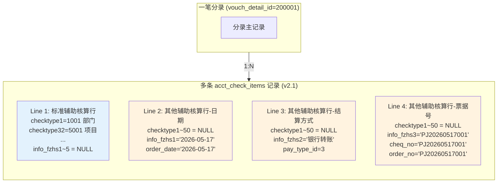
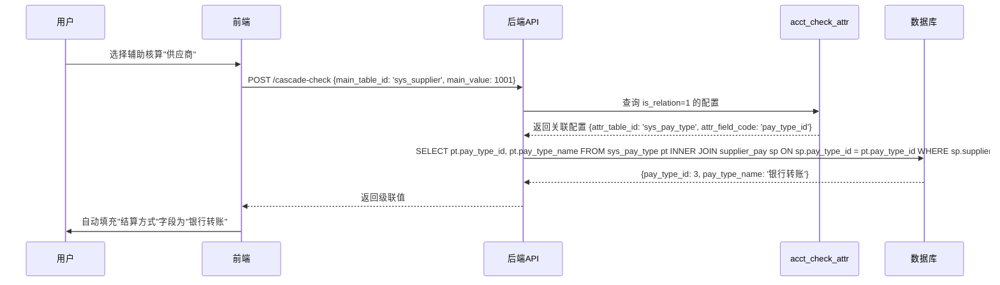
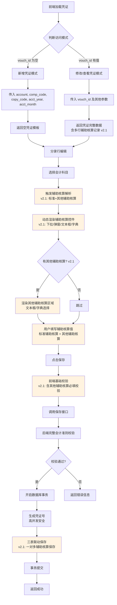

# OES 会计凭证录入组件 — 需求规格说明书 (PRD)

> **文档编号**: 0001-oes-acct-vouch-req-prd-by-deepseek\
> **版本**: **v2.1**\
> **创建日期**: 2026-05-17\
> **最后更新**: 2026-05-17\
> **作者**: DeepSeek + 高级需求分析师\
> **项目**: 望海康信 OES — 会计凭证录入前端+后端组件\
> **状态**: Draft → Reviewed → Updated (v1.1) → Major Upgrade (v2.0) → **Major Upgrade (v2.1)**

***

## 目录

1. [文档修订历史](#1-文档修订历史)
2. [术语与缩写](#2-术语与缩写)
3. [业务背景与范围](#3-业务背景与范围)
4. [数据库表结构与核心关联规则](#4-数据库表结构与核心关联规则)
5. [核心业务匹配规则（关键逻辑）](#5-核心业务匹配规则关键逻辑)
6. [组件功能需求](#6-组件功能需求)
7. [API 接口设计](#7-api-接口设计)
8. [字段映射关系](#8-字段映射关系)
9. [后端实现逻辑](#9-后端实现逻辑)
10. [前端实现逻辑](#10-前端实现逻辑)
11. [非功能需求](#11-非功能需求)
12. [附录](#12-附录)

***

## 1. 文档修订历史

| 版本   | 日期         | 修订人      | 修订说明                                                                                                                                                                                                 |
| ---- | ---------- | -------- | ------------------------------------------------------------------------------------------------------------------------------------------------------------------------------------------------------ |
| v1.0 | 2026-05-17 | DeepSeek | 初始版本，基于 Instructions.md 汇总生成                                                                                                                                                                         |
| v1.1 | 2026-05-17 | DeepSeek | Codex Review 修正：修正 P0-1（行存储模型）、P0-2（INSERT 必填字段）、P1-1（vouch\_no 生成）、P1-2（u\_id 类型警告）、P1-3（modifier 逻辑）、P1-4（缓存初始化）、P1-5（科目切换交互）、P2-1~4（字段补充、校验、分页） |
| **v2.0** | **2026-05-17** | **DeepSeek + 高级需求分析师** | **重大升级：8项核心需求变更**<br/>① 技术框架调整：构建工具升级为 Maven 3.9.15<br/>② 用户账号字段强化：确认使用 ACCOUNT 字段并增加详细说明<br/>③ vouchNo 生成优化：支持高并发场景，按年+月维度累计+1，采用分布式锁机制防重复断号<br/>④ 前端入口重构：无需登录即可访问，支持新增/修改双模式<br/>⑤ 凭证导航功能：新增上/下一张凭证查询 API<br/>⑥ 辅助核算必填提升：从 P1 提升至 P0 级别<br/>⑦ 会计准则校验增强：新增完整的会计准则验证体系<br/>⑧ UI 原型更新：按专业凭证界面重新设计 |
| **v2.1** | **2026-05-17** | **DeepSeek + 高级需求分析师** | **【v2.1 重大升级】4项核心架构变更**<br/>**① 关系模型重构（Critical）**：acct\_vouch\_detail 与 acct\_check\_items 从一对一(1:0..1)调整为**一对多(1:0..\*)**，支持一笔分录对应多条辅助核算记录<br/>**② 其他辅助核算支持（Critical）**：新增 other\_checktype1~5 自定义辅助核算，通过 acct\_subj\_other\_fz\_setting 配置表实现灵活配置（文本框/字典选择、显示/必填控制）<br/>**③ 特殊业务字段映射（High）**：新增日期/结算方式/票据号等特殊字段的自动映射规则，除写入 info\_fzhs1~5 外还需额外写入 order\_date、pay\_type\_id、cheq\_no 等字段<br/>**④ 辅助核算级联选择（High）**：通过 acct\_check\_attr 配置表实现辅助核算之间的关联自动填充（如选择供应商后自动带出结算方式） |
| **v2.1.1** | **2026-05-17** | **高级需求分析师 + Codex Review** | **【Codex Review 修订】基于专业文档审查结果迭代优化**<br/>**Critical 修复 (3项)**：<br/>• C-1: 修正 occur_date 默认值逻辑（移除不合理的 vouch_no 赋值，改为 NULL）<br/>• C-2: 补充事务边界说明（全量替换策略原子性保障、Spring 自调用注意事项、增量更新备选方案）<br/>• C-3: 补充配置表唯一约束与索引设计（uk_subj_fzhs 唯一约束 + idx_subj_query/idx_show_filter 索引 + line 字段复合索引建议）<br/>**Warning 修复 (5项)**：<br/>• W-1: 补充 is_cx/is_error 字段定义到 §4.3 凭证主表<br/>• W-2: 明确 deleted_check_ids 为保留字段（全量替换策略下不参与删除逻辑，为未来增量更新预留）<br/>• W-3: 重构级联前端匹配逻辑（三级策略：target_other_fzhs_idx 精确匹配 → attr_table_id 匹配 → attr_show_name 模糊匹配兜底）<br/>• W-4: 在 §5.7 ASCII 图中补充行数动态决定说明与两图定位互补声明<br/>• W-5: 测试工作量从 5 人天调增至 7 人天（含迁移验证与回归测试），总工作量调整至 ~27 人天<br/>**Suggestion 采纳 (4项)**：<br/>• S-1/S-3: line 字段索引建议 + 级联查询缓存策略说明<br/>• S-4: §2 术语表补充 other_checktype vs other_fzhs 命名对照规范<br/>• S-5: §11.3 补充 API 向后兼容策略声明（严格模式/优雅降级模式）<br/>• S-6: **新增 §7.6 和 §7.7 两个接口的完整请求/响应/错误码定义（含 target_other_fzhs_idx 字段、字典选项列表、多策略匹配支撑）** |

***

## 2. 术语与缩写

| 术语/缩写        | 全称 / 说明                                                |
| ------------ | ------------------------------------------------------ |
| OES          | 望海康信医院运营管理系统 (Operational Excellence System)           |
| 凭证 (Vouch)   | 会计凭证，记录经济业务、明确经济责任的书面证明                                |
| 分录 (Detail)  | 凭证的明细行，每一行记录一个借方或贷方科目及金额                               |
| 辅助核算 (Check) | 在会计科目基础上的多维核算维度，如部门、项目、供应商、员工等                         |
| check\_type  | acct\_subj 表中存储的辅助核算类型名称字段（check\_type1\~check\_type8） |
| check\_id    | sys\_check\_define 表中辅助核算定义的唯一标识（1\~50）                |
| checktype{N} | acct\_check\_items 表中的动态字段，N 对应 check\_id              |
| table\_id    | sys\_check\_define 中辅助核算数据源对应的物理表名                     |
| where\_sql   | sys\_check\_define 中辅助核算数据源的过滤条件 SQL 片段                |
| ACCOUNT      | up\_org\_user 表中的用户登录账号字段（唯一约束），作为操作人身份识别的唯一标识         |
| **其他辅助核算 (Other FZHS)** | **【v2.1 新增】acct\_subj 表中自定义辅助核算类型字段（other\_checktype1\~other\_checktype5），用于扩展标准辅助核算之外的自定义核算维度 |
| **info\_fzhs{N}** | **【v2.1 新增】acct\_check\_items 表中存储其他辅助核算值的字段（info\_fzhs1\~info\_fzhs5） |
| **级联选择 (Cascade)** | **【v2.1 新增】用户选择某个辅助核算值后，系统根据配置自动关联填充另一个辅助核算值的机制 |
| **票据号 (cheq_no / order_no)** | **【v2.1 澄清】** `acct_check_items` 表中的业务字段，存储其他辅助核算类型为"票据号"时的票据编号值，同时写入 `cheq_no` 和 `order_no` 两个字段 |
| **回单号 (receipt_no)** | **【v2.1.1 新增】** acct_check_items 表中的业务字段，存储其他辅助核算类型为"回单号"时的回单编号值 |
| **票据号 vs 回单号** | **【v2.1.1 澄清】** 两者为独立业务概念：**票据号**（cheque/bill number）→ 写入 `cheq_no` + `order_no`；**回单号**（receipt number）→ 写入 `receipt_no`。两者可同时配置在同一科目下，互不干扰 |
| **【v2.1 命名对照】other_checktype vs other_fzhs** | **【v2.1 Codex Review 补充】命名规范对照**：<br/>• `other_checktype{N}`：数据库字段名（位于 `acct_subj` 表），存储其他辅助核算的**配置名称**（如"日期"、"结算方式"）<br/>• `other_fzhs` / `OtherFZHS` / `info_fzhs{N}`：业务术语/代码变量名/存储字段名，指代其他辅助核算的**值**（用户实际录入的内容）<br/>• 简记法：`other_checktype` = "叫什么名字"，`other_fzhs` / `info_fzhs` = "填什么值" |

***

## 3. 业务背景与范围

### 3.1 业务背景

需开发符合望海康信 OES 系统标准的会计凭证录入前端+后端组件。核心支持：

- 会计科目多辅助核算自动匹配；
- 弹窗/下拉选择辅助核算档案；
- 分录绑定辅助核算值；
- 辅助核算数据按 OES 原生规则落地保存；
- 高并发场景下的凭证号生成（v2.0 新增）；
- 无登录访问模式（v2.0 新增）；
- 凭证导航浏览（v2.0 新增）；
- 严格会计准则校验（v2.0 新增）；
- **【v2.1 新增】一对多辅助核算模型**：支持一笔分录对应多条辅助核算记录（标准辅助核算 + 其他自定义辅助核算）；
- **【v2.1 新增】其他辅助核算灵活配置**：支持文本框输入、字典选择等多种录入方式，可配置是否显示、是否必填；
- **【v2.1 新增】特殊业务字段自动映射**：日期、结算方式、票据号等特殊字段智能写入对应业务字段；
- **【v2.1 新增】辅助核算级联联动**：选择某个辅助核算后自动带出关联的其他辅助核算值。

严格遵循 OES 原生凭证录入业务逻辑与表结构规范。

### 3.2 范围

| 包含                               | 不包含                  |
| -------------------------------- | -------------------- |
| 凭证主表(acct\_vouch)查询与展示           | 凭证审核/记账/冲销流程         |
| 凭证分录明细(acct\_vouch\_detail)录入与管理 | 预算凭证(type\_attr=1)处理 |
| 会计科目辅助核算自动解析与动态渲染                | 现金流量辅助核算             |
| 辅助核算档案弹窗/下拉选择                    | ~~自定义辅助核算(other\_fzhs)~~ **→ 【v2.1 已纳入范围】** |
| 三表联动保存（主表+分录+辅助核算）               | 凭证模板管理               |
| 操作人部门/员工信息查询                     | 凭证导入导出               |
| **高并发凭证号生成机制（v2.0）**             |                        |
| **无登录访问入口（v2.0）**                 |                        |
| **凭证导航功能（v2.0）**                  |                        |
| **完整会计准则校验（v2.0）**               |                        |
| **【v2.1 新增】一对多辅助核算模型**            |                        |
| **【v2.1 新增】其他辅助核算配置与录入**          |                        |
| **【v2.1 新增】特殊业务字段自动映射**           |                        |
| **【v2.1 新增】辅助核算级联联动功能**           |                        |

***

## 4. 数据库表结构与核心关联规则

### 4.1 涉及核心数据表

| 序号 | 表名                                    | 说明                    | 主键                              | 版本   |
| -- | ------------------------------------- | --------------------- | ------------------------------- | ---- |
| 1  | `acct_vouch`                          | 凭证主表                  | `vouch_id` (bigint)             | v1.0 |
| 2  | `acct_vouch_detail`                   | 凭证分录明细表               | `vouch_detail_id` (bigint)      | v1.0 |
| 3  | `acct_check_items`                    | 辅助核算明细存储表             | `acct_check_id` (int, identity) | v1.0 → **v2.1 重大调整** |
| 4  | `acct_subj`                           | 会计科目基础表               | `acct_subj_id` (int)            | v1.0 → **v2.1 扩展** |
| 5  | `sys_check_define`                    | 系统辅助核算定义配置表           | `check_id` (int)                | v1.0 |
| 6  | `up_org_user`                         | 用户信息表                 | `ID` (varchar(32))              | v2.0 |
| 7  | `sys_emp`                             | 员工信息表                 | `emp_id` (int)                  | v1.0 |
| 8  | `sys_dept`                            | 部门信息表                 | `dept_id` (int)                 | v1.0 |
| **9** | **`acct_subj_other_fz_setting`**       | **【v2.1 新增】其他辅助核算配置表** | **`setting_id` (varchar(50))**  | **v2.1** |
| **10** | **`acct_check_attr`**                 | **【v2.1 新增】辅助关联选择配置表**  | **`attr_id` (int, identity)**   | **v2.1** |

### 4.2 【v2.1 重大变更】数据关系模型调整

#### v2.0 原始模型（已废弃）

```
acct_vouch_detail (1) ──→ (0..1) acct_check_items  【一对一关系】
  一笔分录最多对应一行辅助核算记录
  所有辅助核算值（标准+自定义）存储在同一行的 checktype1~50 字段中
```

#### v2.1 新模型（当前生效）

```mermaid
erDiagram
    acct_vouch ||--o{ acct_vouch_detail : "has"
    acct_vouch ||--o{ acct_check_items : "has"
    acct_vouch_detail ||--o{| acct_check_items : "one-to-many (v2.1)"
    acct_vouch_detail }o--|| acct_subj : "references subject"
    acct_check_items }o--|| sys_check_define : "checktype{N} -&gt; check_id"

    acct_subj ||--o{ acct_subj_other_fz_setting : "configures (v2.1)"
    acct_subj_other_fz_setting ||--o{ sys_dict : "dict reference (v2.1)"
    acct_check_attr ||--o{ sys_check_define : "main_table (v2.1)"
    acct_check_attr ||--o{ sys_check_define : "attr_table (v2.1)"

    up_org_user ||--o{ sys_emp : "emp_code"
    sys_emp }o--|| sys_dept : "dept_id"
```

**【v2.1 核心变更说明】**

| 维度 | v2.0 模型 | v2.1 模型 | 变更影响 |
|------|----------|----------|---------|
| **关系基数** | 1:0..1 (一对一) | **1:0..\* (一对多)** | ⚠️ **Critical**: 保存/加载逻辑完全重写 |
| **数据组织** | 所有辅助核算在一行 | **标准辅助核算一行 + 其他辅助核算多行** | 支持更灵活的辅助核算组合 |
| **使用场景** | 简单辅助核算场景 | **复杂多维度辅助核算场景** | 满足实际业务需求 |
| **兼容性** | - | **向后兼容 v2.0 数据** | 通过 line 字段区分记录类型 |

**v2.1 数据组织策略**:



### 4.3 凭证主表 `acct_vouch`

**关键字段**（组件关联）：

| 字段名                 | 类型           | 必填 | 说明                            |
| ------------------- | ------------ | -- | ----------------------------- |
| `vouch_id`          | bigint       | Y  | 凭证主键，PK                       |
| `comp_code`         | nvarchar(20) | Y  | 单位编码                          |
| `copy_code`         | nvarchar(3)  | Y  | 账套编码                          |
| `acct_year`         | nvarchar(4)  | Y  | 会计年度                          |
| `acct_month`        | nvarchar(2)  | Y  | 会计月度                          |
| `vouch_no`          | int          | Y  | **凭证号（按年+月维度递增，v2.0优化）**      |
| `vouch_date`        | datetime     | Y  | 凭证日期                          |
| `vouch_bill_num`    | int          | Y  | 附件张数                          |
| `vouch_type_id`     | int          | Y  | 凭证类型（引用 acct\_vouch\_type 字典） |
| `vouch_source_code` | nvarchar(20) | Y  | 凭证来源，默认 '01'（手工录入）            |
| `operator`          | nvarchar(40) | Y  | 制单人（引用 up\_org\_user.NAME）    |
| `acc_manager`       | nvarchar(40) | N  | 会计主管                          |
| `auditor`           | nvarchar(40) | N  | 审批人                           |
| `poster`            | nvarchar(40) | N  | 记账人                           |
| `is_check`          | char(1)      | Y  | 是否审核 0/1（默认0）                 |
| `is_acc`            | char(1)      | Y  | 是否记账 0/1（默认0）                 |
| `is_cancel`         | char(1)      | Y  | 是否作废 0/1（默认0）                 |
| `type_attr`         | int          | Y  | 凭证属性 0:会计凭证 1:预算凭证（默认0）       |
| `teller`            | nvarchar(40) | N  | 出纳                            |
| `modifier`          | nvarchar(40) | N  | 修改人                           |
| `rela_vouch_id`     | bigint       | N  | 关联凭证号                         |
| `is_cx`             | char(1)      | N  | **是否红冲** 0/1（默认0，OES 原生字段）      |
| `is_error`          | char(1)      | N  | **是否有误** 0/1（默认0，OES 原生字段）      |

### 4.4 凭证分录明细表 `acct_vouch_detail`

| 字段名               | 类型             | 必填 | 说明           |
| ----------------- | -------------- | -- | ------------ |
| `vouch_detail_id` | bigint         | Y  | 分录明细主键，PK    |
| `vouch_id`        | bigint         | Y  | 凭证主表外键       |
| `vouch_page`      | int            | Y  | 凭证页号         |
| `vouch_row`       | int            | Y  | 凭证行号         |
| `summary`         | nvarchar(1200) | N  | 摘要           |
| `comp_code`       | nvarchar(20)   | Y  | 单位编码         |
| `copy_code`       | nvarchar(3)    | Y  | 账套编码         |
| `acct_year`       | nvarchar(4)    | Y  | 会计年度         |
| `acct_subj_code`  | nvarchar(40)   | N  | 会计科目编码       |
| `amt_debit`       | numeric(18,2)  | Y  | 借方金额（默认0）    |
| `amt_credit`      | numeric(18,2)  | Y  | 贷方金额（默认0）    |
| `acc_detail_id`   | int            | N  | 关联明细ID       |
| `batch_code`      | nvarchar(100)  | N  | 批号（批量导入场景使用） |
| `other_subj_code` | nvarchar(2048) | N  | 对方科目编码       |

### 4.5 【v2.1 重大调整】辅助核算明细存储表 `acct_check_items`

> **⚠️ v2.1 Critical 变更**：
> - 从"一笔分录一行"调整为"一笔分录多行"
> - 新增 info\_fzhs1~5 字段用于存储其他辅助核算值
> - 新增特殊业务字段（order\_date, pay\_type\_id, cheq\_no 等）

| 字段名                                       | 类型             | 说明                                                              |
| ----------------------------------------- | -------------- | --------------------------------------------------------------- |
| `acct_check_id`                           | int (identity) | 辅助核算主键                                                           |
| `vouch_detail_id`                         | bigint         | 分录明细外键                                                          |
| `vouch_id`                                | bigint         | 凭证主表外键                                                          |
| `line`                                    | int            | **【v2.1 核心】行号**：同一分录下的多条辅助核算记录通过此字段排序（1=标准辅助核算行, 2+=其他辅助核算行）<br/><br/>**【索引建议】**：建议在 `(vouch_detail_id, line)` 上建立复合索引，覆盖所有按分录查询辅助核算并按 line 排序的场景（`WHERE vouch_detail_id = ? ORDER BY line`），确保一对多加载/保存的高性能 |
| `comp_code`                               | nvarchar(20)   | 单位编码                                                            |
| `copy_code`                               | nvarchar(3)    | 账套编码                                                            |
| `acct_year`                               | nvarchar(4)   | 会计年度                                                            |
| `acct_subj_code`                          | nvarchar(50)   | 会计科目编码                                                          |
| `summary`                                 | nvarchar(1200) | 摘要                                                              |
| `amt_debit`                               | numeric(18,2)  | 借方金额                                                            |
| `amt_credit`                              | numeric(18,2)  | 贷方金额                                                            |
| `vouch_no`                                | int            | 凭证号                                                             |
| `vouch_date`                              | date           | 凭证日期                                                            |
| `vouch_row`                               | int            | 分录行号                                                            |
| `checktype1` **~** `checktype50`           | int            | **动态辅助核算字段**（标准辅助核算使用），每个字段对应一个 check\_id                      |
| **`info_fzhs1`** **~** **`info_fzhs5`**     | **nvarchar(200)** | **【v2.1 新增】其他辅助核算值字段**，存储用户手工录入或选择的文本值                             |
| **`order_date`**                           | **date**       | **【v2.1 新增】业务日期**（当 other\_checktype 配置为"日期"时自动写入）                      |
| **`occur_date`**                           | **date**       | **【v2.1 新增】发生日期**（当 other\_checktype 配置为"日期"时自动写入，无日期时默认写入凭证号 vouch_no）** |
| **`pay_type_id`**                          | **int**        | **【v2.1 新增】结算方式ID**（当 other\_checktype 配置为"结算方式"时自动写入）                  |
| **`cheq_no`**                              | **nvarchar(50)** | **【v2.1 新增】票据号**（当 other\_checktype 配置为"票据号"时自动写入）                    |
| **`order_no`**                             | **nvarchar(50)** | **【v2.1 新增】订单号**（当 other\_checktype 配置为"票据号"时同时写入此字段）               |

### 4.6 【v2.1 扩展】会计科目基础表 `acct_subj`

| 字段名                  | 类型             | 说明                                                       |
| -------------------- | -------------- | -------------------------------------------------------- |
| `acct_subj_id`       | int            | 科目主键，PK                                                   |
| `acct_subj_code`     | nvarchar(50)   | 科目编码                                                      |
| `acct_subj_name`     | nvarchar(50)   | 科目名称                                                      |
| `acct_subj_name_all` | nvarchar(1000) | 科目全称                                                      |
| `super_code`         | nvarchar(50)   | 上级科目编码                                                    |
| `subj_level`         | int            | 科目级别                                                      |
| `is_last`            | char(1)        | 末级标志                                                      |
| `is_check`           | char(1)        | 是否辅助核算                                                    |
| `check_type1`        | nvarchar(20)   | 辅助核算类型1（存核算名称，如"部门"）                                      |
| `check_type2`        | nvarchar(20)   | 辅助核算类型2（存核算名称，如"项目"）                                      |
| `check_type3`        | nvarchar(20)   | 辅助核算类型3                                                   |
| `check_type4`        | nvarchar(20)   | 辅助核算类型4                                                   |
| `check_type5`        | nvarchar(20)   | 辅助核算类型5                                                   |
| `check_type6`        | nvarchar(20)   | 辅助核算类型6                                                   |
| `check_type7`        | nvarchar(20)   | 辅助核算类型7                                                   |
| `check_type8`        | nvarchar(20)   | 辅助核算类型8                                                   |
| **`other_checktype1`** | **nvarchar(20)** | **【v2.1 新增】其他辅助核算类型1**（如"日期"、"结算方式"、"票据号"等自定义名称）                  |
| **`other_checktype2`** | **nvarchar(20)** | **【v2.1 新增】其他辅助核算类型2**                                           |
| **`other_checktype3`** | **nvarchar(20)** | **【v2.1 新增】其他辅助核算类型3**                                           |
| **`other_checktype4`** | **nvarchar(20)** | **【v2.1 新增】其他辅助核算类型4**                                           |
| **`other_checktype5`** | **nvarchar(20)** | **【v2.1 新增】其他辅助核算类型5**                                           |
| `direction`          | char(1)        | 借贷方向                                                      |
| `is_stop`            | char(1)        | 停用标志                                                      |

### 4.7 系统辅助核算定义配置表 `sys_check_define`

| 字段名                  | 类型            | 说明                             |
| -------------------- | ------------- | ------------------------------ |
| **`check_id`**       | int           | **辅助核算定义唯一ID，PK**              |
| **`table_id`**       | nvarchar(40)  | **辅助核算数据源物理表名**（如 "sys\_dept"） |
| **`check_name`**     | nvarchar(40)  | **辅助核算名称**（如 "部门"、"项目"、"供应商"）  |
| **`where_sql`**      | nvarchar(200) | **数据源过滤条件SQL片段**               |
| `is_intrade`         | bit           | 是否内部交易                         |
| `is_vouch_load`      | char(1)       | 凭证录入时是否加载                      |
| `is_vouch_show_last` | int           | 是否仅显示末级                        |
| `check_match_rule`   | char(1)       | 匹配规则                           |
| `is_show_code`       | int           | 是否显示编码                         |
| `is_vouch_direct`    | nvarchar(10)  | 借方是否默认填第一核算项                   |
| `direct_column`      | nvarchar(100) | 对应核算方向字段                       |

### 4.8 【v2.1 新增】其他辅助核算配置表 `acct_subj_other_fz_setting`

> **用途**：配置每个科目的其他辅助核算（other\_checktype1~5）的录入方式和显示规则
>
> **【Codex Review 修订】约束与索引设计**：
> - **主键**：`setting_id varchar(50)`，格式建议 `{acctSubjCode}_{otherFzhsIdx}`（如 `1001_1`）
> - **业务唯一约束**：`UNIQUE KEY uk_subj_fzhs (acct_subj_code, other_fzhs_idx, comp_code, copy_code, acct_year)` —— 同一科目在同一账套/年度下，每个其他辅助核算索引只允许一条配置记录
> - **查询索引**：`INDEX idx_subj_query (acct_subj_code, comp_code, copy_code, acct_year)` —— 覆盖按科目查询配置的高频场景
> - **显示过滤索引**：`INDEX idx_show_filter (is_show, comp_code, copy_code, acct_year)` —— 覆盖"仅查可见配置"的场景

| 字段名              | 类型            | 必填 | 说明                                                                      |
| ---------------- | ------------- | -- | ----------------------------------------------------------------------- |
| **`setting_id`**  | **varchar(50)** | **Y** | **配置主键，PK**（格式建议：`{acctSubjCode}_{otherFzhsIdx}`，如 `1001_1`）                   |
| **`other_fzhs_idx`** | **int**        | **Y** | **辅助核算索引**（1~5，对应 other\_checktype1~5）                                     |
| **`input_type`**  | **varchar(10)** | **N** | **输入类型**（可配置）：`3`=文本框输入, `4`=字典选择录入。若为空则参考 acct_subj.other_checktype{N} 的默认解析逻辑 |
| `dict_type`       | varchar(10)    | N  | 字典类型（当 input\_type=4 时必填）                                                 |
| `dict_name`       | varchar(100)   | N  | 字典名称（当 input\_type=4 时必填）                                                 |
| `acct_subj_id`    | int            | N  | 科目ID                                                                    |
| `acct_subj_code`  | varchar(50)    | N  | 科目编码                                                                   |
| `comp_code`       | varchar(30)    | N  | 单位编码                                                                   |
| `copy_code`       | varchar(30)    | N  | 账套编码                                                                   |
| `acct_year`       | varchar(4)     | N  | 会计年度                                                                   |
| `c_time`          | date           | Y  | 创建时间                                                                   |
| **`is_show`**     | **int**        | **Y** | **是否显示**（默认1，1=显示 0=隐藏）                                               |
| **`is_require`**  | **int**        | **Y** | **是否必填**（默认0，1=必填 0=选填）                                               |

**配置示例**：

```sql
-- 示例1：科目 1001 配置了 other_checktype1="日期"，使用文本框输入，必填
INSERT INTO acct_subj_other_fz_setting VALUES (
  '1001_1', 1, '3', NULL, NULL,
  1001, '1001', '01', '001', '2026',
  GETDATE(), 1, 1
);

-- 示例2：科目 1001 配置了 other_checktype2="结算方式"，使用字典选择，选填
INSERT INTO acct_subj_other_fz_setting VALUES (
  '1001_2', 2, '4', 'PAY_TYPE', '结算方式',
  1001, '1001', '01', '001', '2026',
  GETDATE(), 1, 0
);
```

### 4.9 【v2.1 新增】辅助关联选择配置表 `acct_check_attr`

> **用途**：配置辅助核算之间的级联关系，实现选择某个辅助核算值后自动带出另一个辅助核算值

| 字段名                    | 类型            | 必填 | 说明                                                                        |
| ---------------------- | ------------- | -- | ------------------------------------------------------------------------- |
| **`attr_id`**           | **int**        | **Y** | **配置主键，PK（自增）**                                                             |
| **`main_table_id`**     | **nvarchar(40)** | **Y** | **主表ID**（触发级联的辅助核算的 table\_id，如 "sys\_supplier"）                                  |
| **`main_field_code`**  | **nvarchar(40)** | **Y** | **主表字段**（主表中作为关联条件的字段名，如 "supplier\_id"）                                        |
| **`attr_table_id`**     | **nvarchar(40)** | **Y** | **关联表ID**（被带出的辅助核算的 table\_id，如 "sys\_pay\_type"）                                   |
| **`attr_field_code`**  | **nvarchar(40)** | **Y** | **关联字段**（关联表中返回值的字段名，如 "pay\_type\_id"）                                         |
| `check_field_code`     | nvarchar(40)   | N  | 校验字段（可选，用于额外校验）                                                           |
| `RELATION_TABLE_ID`    | nvarchar(40)   | N  | 中间关联表ID（如果主表和从表是通过中间表关联的）                                                  |
| `RELATION_MAIN_FIELD`  | nvarchar(40)   | N  | 中间关联表的主表字段                                                               |
| `relation_attr_field`  | nvarchar(40)   | N  | 中间关联表的从表字段                                                               |
| **`is_relation`**      | **int**        | **Y** | **是否启用关联**（默认0，1=启用 0=禁用）                                                  |
| **`attr_show_name`**   | **nvarchar(40)** | **N** | **显示名称**（在前端展示的提示文字，如"默认结算方式"）                                            |

**配置示例**：

```sql
-- 示例：选择了供应商后，自动带出该供应商的默认结算方式
INSERT INTO acct_check_attr (
  main_table_id, main_field_code,
  attr_table_id, attr_field_code,
  is_relation, attr_show_name
) VALUES (
  'sys_supplier', 'supplier_id',       -- 主表：供应商表
  'sys_pay_type', 'pay_type_id',       -- 关联表：结算方式表
  1,                                   -- 启用关联
  '默认结算方式'                        -- 显示名称
);
```

**级联选择流程示意**：



### 4.10 用户表 `up_org_user` （v2.0 强化说明）

| 字段名               | 类型            | 说明                                                                                                                              |
| ----------------- | ------------- | ----------------------------------------------------------------------------------------------------------------------------------- |
| `ID`              | varchar(32)   | 用户唯一ID，PK                                                                                                                       |
| **`ACCOUNT`**     | **varchar(32)** | **用户登录账号（唯一约束）【v2.0 核心字段】**<br/><br/>**使用说明：**<br/>• 作为操作人身份识别的唯一标识字段<br/>• 前端通过此字段传入操作人账号<br/>• 后端根据此字段查询用户信息、员工信息、部门信息<br/>• 此字段具有唯一索引约束，确保账号全局唯一<br/>• 所有与用户相关的查询均以此字段为入口<br/>• **替代原设计中可能使用的其他字段（如 u_id 等），统一使用 ACCOUNT 作为标准用户标识** |
| `NAME`            | varchar(100)  | 用户姓名                                                                                                                             |
| `emp_code`        | nvarchar(20)  | 关联员工编码                                                                                                                           |
| `comp_code`       | nvarchar(100) | 所属单位编码                                                                                                                           |
| `CATEGORY`        | varchar(3)    | 用户级别：10院级、30科室级                                                                                                                  |
| `ACCOUNT_ENABLED` | char(1)       | 账号启用标志                                                                                                                           |
| `ACCOUNT_LOCKED`  | char(1)       | 账号锁定标志                                                                                                                           |

> **⚠️ v2.0 重要说明**：
>
> 本文档自 v1.0 起已统一使用 `up_org_user.ACCOUNT` 字段作为用户身份标识，v2.0 版本对此进行强化说明：
> - **所有 API 接口的 operator_account 参数均对应此字段**
> - **禁止使用 ID 或其他字段作为用户标识**
> - **前后端交互中，account 参数即指代此 ACCOUNT 字段**

### 4.11 员工表 `sys_emp`

| 字段名         | 类型           | 说明                              |
| ----------- | ------------ | ------------------------------- |
| `emp_id`    | int          | 员工主键，PK                         |
| `emp_code`  | nvarchar(40) | 员工编码                            |
| `emp_name`  | nvarchar(40) | 员工姓名                            |
| `dept_id`   | int          | **所属部门ID** → sys\_dept.dept\_id |
| `dept_code` | nvarchar(20) | 所属部门编码                          |
| `u_id`      | int          | 关联用户ID（对应 up\_org\_user.ID）     |
| `comp_code` | nvarchar(20) | 单位编码                            |

### 4.12 部门表 `sys_dept`

| 字段名             | 类型            | 说明      |
| --------------- | ------------- | ------- |
| `dept_id`       | int           | 部门主键，PK |
| `dept_code`     | nvarchar(20)  | 部门编码    |
| `dept_name`     | nvarchar(40)  | 部门名称    |
| `dept_name_all` | nvarchar(100) | 部门全称    |
| `super_code`    | nvarchar(20)  | 上级部门编码  |
| `dept_level`    | nvarchar(20)  | 部门级别    |
| `is_stop`       | char(1)       | 停用标志    |
| `comp_code`     | nvarchar(20)  | 单位编码    |

***

## 5. 核心业务匹配规则（关键逻辑）

> **以下规则为 OES 原生逻辑，必须严格遵守，不得自定义修改。**
>
> **【v2.1 重要补充】**：以下规则在 v2.0 基础上进行了重要扩展，增加了其他辅助核算解析、特殊字段映射、级联选择三大类新规则。

### 5.1 规则一：科目 → 辅助核算类型解析（v2.0 + v2.1 扩展）

```
从会计科目表 acct_subj 读取科目对应的辅助核算类型字段：
  check_type1, check_type2, ..., check_type8 【标准辅助核算】
  other_checktype1, other_checktype2, ..., other_checktype5 【v2.1 新增：其他辅助核算】

每个 check_typeN 字段存储的是辅助核算的名称文本（如 '部门'、'项目'、'供应商'、'员工'）。
每个 other_checktypeN 字段存储的是自定义辅助核算名称（如 '日期'、'结算方式'、'票据号'）。

解析逻辑：
  FOR n IN 1..8:
    IF acct_subj.check_type{n} IS NOT NULL AND acct_subj.check_type{n} != '':
      该科目绑定了第 n 个标准辅助核算类型，其名称为 check_type{n} 的值

  FOR n IN 1..5:  【v2.1 新增】
    IF acct_subj.other_checktype{n} IS NOT NULL AND acct_subj.other_checktype{n} != '':
      该科目绑定了第 n 个其他辅助核算类型，其名称为 other_checktype{n} 的值
      需要进一步查询 acct_subj_other_fz_setting 表获取该辅助核算的配置信息
```

**示例**：科目编码 `1001` 的完整配置
- check_type1='部门', check_type2='项目' → 需要2个标准辅助核算
- other_checktype1='日期', other_checktype2='结算方式', other_checktype3='票据号' → 需要3个其他辅助核算
- **总计需要5个辅助核算录入控件**

### 5.2 规则二：辅助核算名称 → check_id 匹配（仅适用于标准辅助核算）

```
拿着 acct_subj 里的辅助核算名称（如 '部门'、'项目'），
去 sys_check_define 表按 check_name 字段匹配对应记录：

  SELECT check_id, table_id, where_sql, check_name,
         is_vouch_load, is_vouch_show_last, is_show_code,
         is_vouch_direct, direct_column
  FROM sys_check_define
  WHERE check_name = :checkTypeName
```

**示例**：

- check_name='部门' → 匹配得到 check_id=1
- check_name='项目' → 匹配得到 check_id=32

> **【v2.1 注意】**：此规则仅适用于标准辅助核算（check_type1~8）。其他辅助核算（other_checktype1~5）不经过此步骤，而是直接查询 `acct_subj_other_fz_setting` 配置表获取录入方式。

### 5.3 规则三：动态拼接辅助核算数据源 SQL（仅适用于标准辅助核算）

```
从 sys_check_define 取出 table_id 和 where_sql，
拼接成可执行的 SQL 查询辅助核算可选数据源：

  SELECT * FROM {table_id} WHERE {where_sql}

其中 table_id 是物理表名（如 'sys_dept'），
where_sql 是预配置的过滤条件（如 "is_stop='0'" 或 "comp_code=:compCode"）。

安全规则：where_sql 中的占位符（如 :compCode）由后端参数化绑定，防止 SQL 注入。
```

### 5.4 【v2.1 重大调整】规则四：辅助核算值动态保存（核心入库规则）

> **⚠️ v2.1 Critical 变更**：从"一笔分录一行"调整为"一笔分录多行"

#### v2.0 原规则（已废弃）

```
选中的辅助核算值，不存固定字段，而是按 check_id 动态存入
acct_check_items 表的 checktype{check_id} 字段。

映射规则：
  check_id → acct_check_items.checktype{check_id}

注意：
  - OES 原生行存储模型：一笔分录（vouch_detail_id）对应**一行** acct_check_items
  - 保存时需先按 vouch_detail_id 查找已有行，存在则 UPDATE，不存在则 INSERT
```

#### v2.1 新规则（当前生效）

```mermaid
flowchart TD
    A[用户保存凭证] --> B{遍历每条分录}

    B --> C[处理第 N 条分录]
    C --> D{该分录是否有标准辅助核算?}

    D -->|是| E[生成 Line=1 的标准辅助核算行<br/>checktype{id}=value<br/>info_fzhs1~5=NULL]
    D -->|否| F[跳过]

    E --> G{该分录是否有其他辅助核算?}

    G -->|是| H[for idx in 1..5:<br/>生成 Line=1+idx 的其他辅助核算行<br/>checktype1~50=NULL<br/>info_fzhs{idx}=value<br/>应用特殊字段映射规则]
    G -->|否| I[跳过]

    H --> J[写入 acct_check_items 表<br/>共 1+N 条记录<br/>N=其他辅助核算数量]
    F --> J
    I --> J

    J --> K{还有更多分录?}
    K -->|是| C
    K -->|否| L[保存完成]

    style E fill:#e3f2fd
    style H fill:#fff3e0
    style J fill:#c8e6c9
```

**详细映射规则**：

##### 4.1 标准辅助核算存储（Line=1）

```
对于标准辅助核算（check_type1~8）：
  - 存储在 Line=1 的 acct_check_items 行中
  - 使用 checktype{check_id} 字段存储值
  - info_fzhs1~5 保持 NULL

示例：
  科目绑定 check_type1='部门' → 匹配 sys_check_define 得到 check_id=1
    → 保存到 acct_check_items.checktype1 (Line=1)

  科目绑定 check_type2='项目' → 匹配 sys_check_define 得到 check_id=32
    → 保存到 acct_check_items.checktype32 (Line=1)
```

##### 4.2 其他辅助核算存储（Line=2~6）【v2.1 新增】

```
对于其他辅助核算（other_checktype1~5）：
  - 每个其他辅助核算单独占用一行（Line=2,3,4,5,6）
  - checktype1~50 全部保持 NULL
  - 使用 info_fzhs{idx} 字段存储用户录入的文本值
  - 根据 acct_subj_other_fz_setting.input_type 决定录入方式：
    • input_type=3：文本框直接输入 → info_fzhs{idx} = 用户输入的文本
    • input_type=4：字典选择 → info_fzhs{idx} = 选中的字典项名称/编码
```

##### 4.3 特殊业务字段自动映射【v2.1 新增】

> 当 `other_checktype{N}` 配置了以下特殊值时，除了写入 `info_fzhs{N}` 外，还需要额外写入 `acct_check_items` 表的特殊业务字段：

| other_checktype 配置值 | 额外写入字段 | 映射规则 | 说明 |
|----------------------|-------------|---------|------|
| **日期** | `order_date` + `occur_date` | `order_date = occur_date = 用户输入的日期值` | 如果没有输入日期，则 `order_date` 和 `occur_date` 均默认写入凭证的 `vouch_date` 字段值 |
| **结算方式** | `pay_type_id` | `pay_type_id = 选中的结算方式字典ID` | 直接写入结算方式的主键ID |
| **票据号** | `cheq_no` + `order_no` | `cheq_no = order_no = 用户输入的票据号` | 同时写入两个字段，保持一致 |
| **回单号** | `receipt_no` | `receipt_no = 用户输入的回单号` | 直接写入回单号字段（对应 `acct_check_items.receipt_no`） |

**特殊字段映射伪代码**：

```java
/**
 * v2.1 新增：特殊业务字段自动映射
 *
 * @param otherCheckTypeName 其他辅助核算配置名称（如"日期"、"结算方式"、"票据号"、"回单号"）
 * @param inputValue 用户输入的值
 * @param checkItem 要保存的 acct_check_items 对象
 */
public void applySpecialFieldMapping(String otherCheckTypeName,
                                     String inputValue,
                                     AcctCheckItem checkItem) {

    if ("日期".equals(otherCheckTypeName)) {
        // 日期特殊处理：当用户输入了有效日期值时写入用户输入值
        if (inputValue != null && !inputValue.trim().isEmpty()) {
            checkItem.setOrderDate(LocalDate.parse(inputValue));
            checkItem.setOccurDate(LocalDate.parse(inputValue));
        }
        // 无输入时默认写入凭证的vouch_date字段值（业务语义合理，日期类型兼容）
        else {
            checkItem.setOrderDate(vouch.getVouchDate());
            checkItem.setOccurDate(vouch.getVouchDate());
        }
    }
    else if ("结算方式".equals(otherCheckTypeName)) {
        // 结算方式：inputValue 应为字典ID
        checkItem.setPayTypeId(Integer.parseInt(inputValue));
    }
    else if ("票据号".equals(otherCheckTypeName)) {
        // 票据号：同时写入 cheq_no 和 order_no
        checkItem.setCheqNo(inputValue);
        checkItem.setOrderNo(inputValue);
    }
    else if ("回单号".equals(otherCheckTypeName)) {
        // 回单号：直接写入 receipt_no 字段
        checkItem.setReceiptNo(inputValue);
    }

    // 通用：始终写入 info_fzhs 字段
    // （具体字段索引由 other_fzhs_idx 决定）
}
```

### 5.5 规则五：用户 → 员工 → 部门关联链路 （v2.0 强化）

```
用户账号 → 员工 → 部门 的三级关联（统一使用 ACCOUNT 字段）：

1. 根据操作人账号(ACCOUNT)查询用户表：
   SELECT * FROM up_org_user WHERE ACCOUNT = :operatorAccount

   【v2.0 说明】此处必须使用 ACCOUNT 字段，而非 ID 或其他字段。
   ACCOUNT 是用户登录账号，具有唯一约束，是 OES 系统中用户身份的标准标识。

2. 通过用户的 emp_code 关联员工表（注意：up_org_user.ID 为 varchar(32)，sys_emp.u_id 为 int，
   类型不兼容，因此必须使用 emp_code 而非 u_id 作为关联字段）：
   SELECT * FROM sys_emp WHERE emp_code = :empCode

3. 通过员工的 dept_id 关联部门表：
   SELECT * FROM sys_dept WHERE dept_id = :deptId
```

### 5.6 【v2.1 新增】规则六：辅助核算级联选择规则

```
级联选择触发条件：
  当用户在辅助核算区域选择了某个辅助核算值（如选择了"供应商A"）后，
  系统检查 acct_check_attr 表是否存在匹配的级联配置。

级联查找逻辑：
  1. 获取当前选择的辅助核算的 table_id（如 "sys_supplier"）
  2. 查询 acct_check_attr 表：
     SELECT * FROM acct_check_attr
     WHERE main_table_id = :currentTableId
       AND is_relation = 1
  3. 如果找到配置，则执行级联查询：
     根据 RELATION_TABLE_ID 判断是否需要中间表关联：
     - 如果 RELATION_TABLE_ID 为空（直接关联）：
       SELECT {attr_field_code}, {attr_field_name}
       FROM {attr_table_id}
       WHERE {main_field_code} = :selectedValueId
     - 如果 RELATION_TABLE_ID 不为空（中间表关联）：
       SELECT a.{attr_field_code}, a.{attr_field_name}
       FROM {attr_table_id} a
       INNER JOIN {RELATION_TABLE_ID} r
         ON r.{relation_attr_field} = a.{attr_field_code}
       WHERE r.{RELATION_MAIN_FIELD} = :selectedValueId

级联结果处理：
  - 将查询到的值自动填充到对应的辅助核算控件中
  - 显示提示信息："已自动带出{attr_show_name}"
  - 用户可以手动修改自动填充的值（除非配置为只读）
```

**级联配置示例矩阵**：

| 场景 | main_table_id | main_field_code | attr_table_id | attr_field_code | attr_show_name |
|------|--------------|----------------|---------------|-----------------|----------------|
| 选择供应商 → 带出结算方式 | sys_supplier | supplier_id | sys_pay_type | pay_type_id | 默认结算方式 |
| 选择客户 → 带出收款账户 | sys_customer | customer_id | sys_bank_acct | bank_acct_id | 默认收款账户 |
| 选择项目 → 带出项目负责人 | sys_project | project_id | sys_emp | emp_id | 项目负责人 |

### 5.7 总结：完整匹配链路图（v2.1 增强）

> **【图示说明】**：以下 ASCII 图以科目 1001 为示例（绑定 2 个标准辅助核算 + 3 个其他辅助核算），**实际行数由各科目的 other_checktype 配置数量动态决定**，并非固定为 4 行。Mermaid ER 图（§4.2）侧重表间关系定义，本 ASCII 图侧重数据内容示意，两者定位互补。

```
┌─────────────────────────────────────────────────────────────────────┐
│                        acct_subj 科目表                             │
├─────────────────────────────────────────────────────────────────────┤
│  标准辅助核算区              │  其他辅助核算区 (v2.1 新增)          │
│  check_type1 = '部门'       │  other_checktype1 = '日期'           │
│  check_type2 = '项目'       │  other_checktype2 = '结算方式'        │
│  ...                        │  other_checktype3 = '票据号'          │
│                             │  ...                                │
└───────────┬─────────────────┴──────────────┬────────────────────────┘
            │                                    │
            ▼                                    ▼
┌─────────────────────┐          ┌─────────────────────────────────┐
│  sys_check_define    │          │  acct_subj_other_fz_setting     │
│  (标准辅助核算定义)    │          │  (其他辅助核算配置) v2.1 新增     │
├─────────────────────┤          ├─────────────────────────────────┤
│  check_id=1          │          │  input_type=3 (文本框)           │
│  table_id=sys_dept   │          │  input_type=4 (字典选择)          │
│  check_name='部门'    │          │  is_show=1 / is_require=1       │
│  ...                 │          │  dict_type / dict_name           │
└───────────┬──────────┘          └──────────────┬──────────────────┘
            │                                    │
            ▼                                    ▼
┌─────────────────────────────────────────────────────────────────────┐
│                      acct_check_items (v2.1 一对多模型)              │
├─────────────────────────────────────────────────────────────────────┤
│  Line 1: 标准辅助核算行                                               │
│  ├── checktype1=1001 (部门ID)                                       │
│  ├── checktype32=5001 (项目ID)                                      │
│  └── info_fzhs1~5 = NULL                                           │
│                                                                     │
│  Line 2: 其他辅助核算行-日期 (v2.1)                                   │
│  ├── checktype1~50 = NULL                                          │
│  ├── info_fzhs1='2026-05-17'                                       │
│  ├── order_date='2026-05-17'  ← 特殊字段映射                        │
│  └── occur_date='2026-05-17'  ← 特殊字段映射                        │
│                                                                     │
│  Line 3: 其他辅助核算行-结算方式 (v2.1)                               │
│  ├── checktype1~50 = NULL                                          │
│  ├── info_fzhs2='银行转账'                                          │
│  └── pay_type_id=3  ← 特殊字段映射                                  │
│                                                                     │
│  Line 4: 其他辅助核算行-票据号 (v2.1)                                 │
│  ├── checktype1~50 = NULL                                          │
│  ├── info_fzhs3='PJ20260517001'                                    │
│  ├── cheq_no='PJ20260517001'  ← 特殊字段映射                        │
│  └── order_no='PJ20260517001'  ← 特殊字段映射                       │
└─────────────────────────────────────────────────────────────────────┘
                                    │
                                    ▼ (级联选择)
                    ┌───────────────────────────────┐
                    │  acct_check_attr (v2.1 新增)   │
                    │  辅助核算级联配置表              │
                    ├───────────────────────────────┤
                    │  选择了供应商 → 自动带出结算方式   │
                    │  选择了客户 → 自动带出收款账户    │
                    │  ...                          │
                    └───────────────────────────────┘
```

***

## 6. 组件功能需求

### 6.1 功能清单

| 编号   | 功能                    | 优先级 | 说明                                                                                                  |
| ---- | --------------------- | --- | --------------------------------------------------------------------------------------------------- |
| F-01 | 凭证主表信息加载             | P0  | 根据 vouch\_id 查询并回显凭证主表全部字段                                                                          |
| F-02 | 凭证分录列表加载             | P0  | 根据 vouch\_id 查询凭证下所有分录明细行                                                                           |
| F-03 | 分录行增删改               | P0  | 支持新增、删除、修改分录行                                                                                    |
| F-04 | 科目辅助核算自动解析           | P0  | 选择科目后自动解析该科目绑定的 check\_type1\~8                                                                       |
| F-05 | 辅助核算控件动态渲染           | P0  | 根据解析结果动态生成下拉/弹窗选择控件                                                                              |
| F-06 | 辅助核算档案数据动态加载         | P0  | 根据 sys\_check\_define 的 table\_id + where\_sql 加载数据源                                                         |
| F-07 | 辅助核算弹窗选择             | P1  | 数据量较大时提供弹窗搜索选择                                                                                    |
| F-08 | 辅助核算下拉选择             | P1  | 数据量较小时提供下拉选择                                                                                      |
| F-09 | 辅助核算值回显              | P0  | 编辑已有凭证时回显已保存的辅助核算值                                                                                |
| F-10 | 凭证三表联动保存             | P0  | 事务保存 acct\_vouch + acct\_vouch\_detail + acct\_check_items                                                     |
| F-11 | 操作人部门信息查询            | P0  | 根据操作人账号查询所属部门                                                                                     |
| F-12 | 操作人员工信息查询            | P0  | 根据操作人账号查询员工信息                                                                                     |
| F-13 | 借贷平衡校验              | P0  | 保存前校验借方合计 = 贷方合计                                                                                  |
| **F-14** | **辅助核算必填校验**          | **P0** | **【v2.0 提升】根据科目配置校验辅助核算是否已填写，未填写不允许保存（原 P1→P0）**                                                          |
| **F-15** | **无登录访问入口**           | **P0** | **【v2.0 新增】无需登录即可访问凭证录入页面，通过 account 等参数传入操作人信息**                                                                |
| **F-16** | **凭证导航功能**            | **P1** | **【v2.0 新增】支持"上一张"、"下一张"凭证导航查询**                                                                               |
| **F-17** | **完整会计准则校验**          | **P0** | **【v2.0 新增】保存时执行严格的会计准则业务合理性校验**                                                                             |
| **F-18** | **【v2.1 新增】一对多辅助核算模型支持** | **P0-Critical** | **支持一笔分录对应多条 acct\_check\_items 记录（Line=1 为标准辅助核算，Line=2~6 为其他辅助核算），完全替代 v2.0 的单行模型**                          |
| **F-19** | **【v2.1 新增】其他辅助核算配置解析** | **P0-Critical** | **选择科目后自动解析 other\_checktype1~5 并查询 acct\_subj\_other\_fz\_setting 配置表，动态渲染文本框/字典选择控件**                          |
| **F-20** | **【v2.1 新增】其他辅助核算录入**    | **P0-High** | **支持文本框直接输入（input\_type=3）和字典选择录入（input\_type=4）两种模式，并根据 is\_require 配置进行必填校验**                                  |
| **F-21** | **【v2.1 新增】特殊业务字段自动映射** | **P0-High** | **当 other\_checktype 配置为"日期"/"结算方式"/"票据号"时，除写入 info\_fzhs 字段外，自动映射到 order\_date/pay\_type\_id/cheq\_no 等特殊字段**             |
| **F-22** | **【v2.1 新增】辅助核算级联选择**    | **P1-High** | **根据 acct\_check\_attr 配置表，在选择某个辅助核算值后自动级联带出关联的另一个辅助核算值（如选择供应商后自动带出结算方式）**                                  |
| **F-23** | **【v2.1 新增】辅助核算多行加载与回显** | **P0-High** | **编辑已有凭证时，正确加载并回显一笔分录对应的多条辅助核算记录，按 Line 字段排序展示（标准辅助核算在前，其他辅助核算在后）**                                      |

### 6.2 凭证录入主流程 （v2.1 更新）



#### 详细流程说明

```
1. 前端加载凭证 (GET /oes-acct-vouch) 【v2.0 重构 + v2.1 增强】
   ├── 无需登录即可访问
   ├── 必填参数: account, comp_code, copy_code, acct_year, acct_month
   ├── 非必填参数: vouch_id
   │
   ├── 【新增模式】未传 vouch_id 时:
   │   ├── 返回空凭证模板（含默认值）
   │   ├── 返回操作人部门信息
   │   └── 返回操作人员工信息
   │
   └── 【修改/查看模式】传入 vouch_id 时:
       ├── 返回凭证主表全部字段
       ├── 返回分录列表
       │   └── 【v2.1 增强】每条分录包含多条辅助核算记录（check_items 数组）
       │       ├── Line 1: 标准辅助核算（checktype1~50 有值）
       │       ├── Line 2~N: 其他辅助核算（info_fzhs1~5 有值）
       │       └── 按 line 字段升序排列
       ├── 返回操作人部门信息
       └── 返回操作人员工信息

2. 分录行编辑 【v2.1 增强】
   ├── 用户新增/修改分录行
   ├── 选择会计科目 → 触发辅助核算解析
   │   ├── 【v2.0】解析 check_type1~8 标准辅助核算
   │   └── 【v2.1 新增】解析 other_checktype1~5 其他辅助核算
   │       └── 查询 acct_subj_other_fz_setting 获取配置
   ├── 动态渲染辅助核算录入控件
   │   ├── 【v2.0】标准辅助核算：下拉/弹窗选择
   │   └── 【v2.1 新增】其他辅助核算：
   │       ├── input_type=3 → 文本框输入控件
   │       ├── input_type=4 → 字典选择控件
   │       ├── is_show=0 → 隐藏该字段
   │       └── is_require=1 → 必填校验标记
   ├── 用户选择辅助核算值（所有配置的辅助核算必须填写）
   │   └── 【v2.1 新增】级联选择触发
   │       └── 选择某个辅助核算后 → 检查 acct_check_attr → 自动带出关联值
   └── 实时显示已选辅助核算

3. 函证导航 (GET /oes-acct-vouch/navigation) 【v2.0 新增】
   ├── 支持查询上一张凭证
   ├── 支持查询下一张凭证
   ├── 查询条件: 当前单位+账套+年+月+当前凭证号
   └── 返回相邻凭证的基本信息

4. 保存凭证 (POST /oes-acct-vouch/save) 【v2.1 重大调整】
   ├── 前端提交完整凭证数据（主表+分录+辅助核算）
   │   └── 【v2.1】details[].check_items 包含多条记录（标准+其他）
   ├── 后端执行完整会计准则校验（v2.0 增强 + v2.1 扩展）
   │   ├── 借贷平衡校验
   │   ├── 必填辅助核算完整性校验（含其他辅助核算 v2.1）
   │   ├── 科目末级校验
   │   ├── 金额合法性校验
   │   ├── 凭证日期合理性校验
   │   └── 业务规则合规性校验
   ├── 后端开启事务
   │   ├── 高并发安全的凭证号生成（v2.0 优化）
   │   ├── INSERT/UPDATE acct_vouch
   │   ├── INSERT/UPDATE/DELETE acct_vouch_detail
   │   └── 【v2.1 重大调整】INSERT/UPDATE/DELETE acct_check_items
   │       ├── 删除该分录下所有旧辅助核算记录（WHERE vouch_detail_id=?）
   │       ├── 插入 Line=1 的标准辅助核算行（如有）
   │       ├── 循环插入 Line=2~N 的其他辅助核算行（如有）
   │       └── 应用特殊字段映射规则（日期/结算方式/票据号/回单号）
   └── 事务提交/回滚
```

***

## 7. API 接口设计

### 7.1 接口概览

| 方法     | 路径                                        | 说明                                                                         | 版本   |
| ------ | ----------------------------------------- | -------------------------------------------------------------------------- | ---- |
| `GET`  | `/oes-acct-vouch`                          | 加载凭证编辑页面全部数据（主表+分录+辅助核算+操作人信息）【v2.0 重构：支持无登录访问、双模式】【v2.1 增强：返回多行辅助核算】 | v2.0 → v2.1 |
| `POST` | `/oes-acct-vouch/save`                     | 保存凭证（三表联动入库）【v2.1 重大调整：支持一对多辅助核算模型】                                          | v2.0 → v2.1 |
| `GET`  | `/oes-acct-vouch/subj/checks`              | 根据科目编码查询该科目的辅助核算类型配置【v2.1 增强：返回其他辅助核算配置】                                      | v2.0 → v2.1 |
| `GET`  | `/oes-acct-vouch/check/options`            | 根据 check\_id 查询辅助核算可选档案数据                                                        | v2.0 |
| **`GET`** | **`/oes-acct-vouch/navigation`**          | **【v2.0 新增】凭证导航接口：查询上/下一张凭证**                                                        | v2.0 |
| **`GET`** | **`/oes-acct-vouch/other-fzhs/settings`** | **【v2.1 新增】查询科目其他辅助核算配置**                                                                  | **v2.1** |
| **`POST`** | **`/oes-acct-vouch/cascade-check`**      | **【v2.1 新增】辅助核算级联查询接口**                                                                  | **v2.1** |

> **接口基础地址**: `http://localhost:83000/oes-acct-vouch`

***

### 7.2 接口一：加载凭证编辑数据 （v2.0 重构 + v2.1 增强）

#### 请求

```
GET http://localhost:83000/oes-acct-vouch
```

**Query 参数**：

| 参数名                | 类型           | 必填 | 说明                                                                                                                                 | 示例值      |
| ------------------ | ------------ | -- | -------------------------------------------------------------------------------------------------------------------------------- | -------- |
| `account`          | varchar(32)  | **Y** | **当前操作人登录账号（对应 up\_org\_user.ACCOUNT 字段）【v2.0 核心参数】**                                                                      | `admin`  |
| `comp_code`        | nvarchar(20) | **Y** | **单位编码**                                                                                                                            | `01`     |
| `copy_code`        | nvarchar(3)  | **Y** | **账套编码**                                                                                                                            | `001`    |
| `acct_year`        | nvarchar(4)  | **Y** | **会计年度**                                                                                                                            | `2026`   |
| `acct_month`       | nvarchar(2)  | **Y** | **会计月度【v2.0 新增必填】**                                                                                                                | `05`     |
| `vouch_id`         | bigint       | **N** | **凭证主键ID【v2.0 改为非必填】**<br/><br/>• **不传或为空/0**：进入**新增凭证模式**，返回空凭证模板<br/>• **传入有效值**：进入**修改/查看凭证模式**，返回该凭证完整数据 | `100001` |

> **v2.0 重要变更说明**：
>
> 1. **无需登录**：此接口不需要 Session/Cookie 认证，通过 `account` 参数直接传入操作人身份
> 2. **参数结构调整**：
>    - `operator_account` → 统一命名为 `account`（更简洁）
>    - `vouch_id` 从必填改为非必填
>    - 新增 `acct_month` 为必填参数
> 3. **双模式支持**：
>    - **新增模式**：不传 vouch_id → 返回空模板，用于新建凭证
>    - **修改/查看模式**：传入 vouch_id → 返回完整数据，用于编辑或只读查看
> 4. **account 字段说明**：此参数对应 `up_org_user.ACCOUNT` 字段（见 §4.10 强化说明）

**请求示例 - 新增模式**：

```
GET http://localhost:83000/oes-acct-vouch?account=admin&comp_code=0001&copy_code=001&acct_year=2026&acct_month=05
```

**请求示例 - 修改模式**：

```
GET http://localhost:83000/oes-acct-vouch?account=admin&comp_code=0001&copy_code=001&acct_year=2026&acct_month=05&vouch_id=100001
```

#### 响应

**HTTP Status**: `200 OK`

**Content-Type**: `application/json; charset=utf-8`

**响应体结构 - 新增模式**：

```json
{
  "code": 0,
  "message": "success",
  "data": {
    "mode": "create",
    "vouch": {
      "vouch_id": null,
      "comp_code": "01",
      "copy_code": "001",
      "acct_year": "2026",
      "acct_month": "05",
      "vouch_no": null,
      "vouch_date": "2026-05-17",
      "vouch_bill_num": 0,
      "vouch_type_id": 1,
      "vouch_source_code": "01",
      "operator": null,
      "acc_manager": null,
      "auditor": null,
      "poster": null,
      "is_check": "0",
      "is_acc": "0",
      "is_cx": "0",
      "is_cancel": "0",
      "is_error": "0",
      "teller": null,
      "modifier": null,
      "type_attr": 0,
      "templet_id": null,
      "rela_vouch_id": null
    },
    "details": [],
    "operator_info": {
      "account": "admin",
      "name": "张三",
      "user_id": "UUID-xxx",
      "emp_code": "E001",
      "emp_id": 100,
      "emp_name": "张三",
      "dept_id": 1001,
      "dept_code": "D001",
      "dept_name": "财务部",
      "dept_name_all": "XX医院/财务部",
      "category": "10"
    }
  }
}
```

**响应体结构 - 修改模式（v2.1 增强：多行辅助核算）**：

```json
{
  "code": 0,
  "message": "success",
  "data": {
    "mode": "edit",
    "vouch": {
      "vouch_id": 100001,
      "comp_code": "01",
      "copy_code": "001",
      "acct_year": "2026",
      "acct_month": "05",
      "vouch_no": 1,
      "vouch_date": "2026-05-17",
      "vouch_bill_num": 2,
      "vouch_type_id": 1,
      "vouch_source_code": "01",
      "operator": "张三",
      "acc_manager": null,
      "auditor": null,
      "poster": null,
      "is_check": "0",
      "is_acc": "0",
      "is_cx": "0",
      "is_cancel": "0",
      "is_error": "0",
      "teller": null,
      "modifier": null,
      "type_attr": 0,
      "templet_id": null,
      "rela_vouch_id": null
    },
    "details": [
      {
        "vouch_detail_id": 200001,
        "vouch_id": 100001,
        "vouch_page": 1,
        "vouch_row": 1,
        "summary": "支付办公用品费",
        "acct_subj_code": "1001",
        "acct_subj_name": "库存现金",
        "amt_debit": 1000.00,
        "amt_credit": 0.00,
        "check_items": [
          {
            "acct_check_id": 300001,
            "line": 1,
            "check_item_type": "standard",
            "check_id": 1,
            "check_name": "部门",
            "check_value_id": 1001,
            "check_value_code": "D001",
            "check_value_name": "财务部"
          },
          {
            "acct_check_id": 300002,
            "line": 1,
            "check_item_type": "standard",
            "check_id": 32,
            "check_name": "项目",
            "check_value_id": 5001,
            "check_value_code": "P2026-001",
            "check_value_name": "2026年信息化项目"
          },
          {
            "acct_check_id": 300003,
            "line": 2,
            "check_item_type": "other",
            "other_fzhs_idx": 1,
            "other_check_name": "日期",
            "input_type": 3,
            "info_fzhs_value": "2026-05-17",
            "order_date": "2026-05-17",
            "occur_date": "2026-05-17"
          },
          {
            "acct_check_id": 300004,
            "line": 3,
            "check_item_type": "other",
            "other_fzhs_idx": 2,
            "other_check_name": "结算方式",
            "input_type": 4,
            "info_fzhs_value": "银行转账",
            "pay_type_id": 3
          },
          {
            "acct_check_id": 300005,
            "line": 4,
            "check_item_type": "other",
            "other_fzhs_idx": 3,
            "other_check_name": "票据号",
            "input_type": 3,
            "info_fzhs_value": "PJ20260517001",
            "cheq_no": "PJ20260517001",
            "order_no": "PJ20260517001"
          }
        ]
      }
    ],
    "operator_info": {
      "account": "admin",
      "name": "张三",
      "user_id": "UUID-xxx",
      "emp_code": "E001",
      "emp_id": 100,
      "emp_name": "张三",
      "dept_id": 1001,
      "dept_code": "D001",
      "dept_name": "财务部",
      "dept_name_all": "XX医院/财务部",
      "category": "10"
    }
  }
}
```

**【v2.1 新增】响应字段说明（增强部分）**：

| 路径                                              | 类型     | 说明                                                                                                                                 |
| ----------------------------------------------- | ------ | ---------------------------------------------------------------------------------------------------------------------------------- |
| `data.details[].check_items[].line`              | int    | **【v2.1 新增】行号**：同一分录下的辅助核算记录排序序号（1=标准辅助核算行, 2+=其他辅助核算行）                                                                                 |
| `data.details[].check_items[].check_item_type`    | string | **【v2.1 新增】辅助核算类型**：`"standard"`（标准辅助核算）或 `"other"`（其他辅助核算）                                                                                             |
| `data.details[].check_items[].other_fzhs_idx`     | int    | **【v2.1 新增】其他辅助核算索引**（1~5，仅 check_item_type="other" 时有值）                                                                                                 |
| `data.details[].check_items[].other_check_name`   | string | **【v2.1 新增】其他辅助核算名称**（来自 acct_subj.other_checktype{N}）                                                                                                |
| `data.details[].check_items[].input_type`         | int    | **【v2.1 新增】输入类型**：3=文本框输入, 4=字典选择（来自 acct_subj_other_fz_setting.input_type）                                                                                   |
| `data.details[].check_items[].info_fzhs_value`    | string | **【v2.1 新增】其他辅助核算值**（用户录入的文本内容）                                                                                                                             |
| `data.details[].check_items[].order_date`         | string | **【v2.1 新增】业务日期**（特殊字段映射：日期型其他辅助核算自动写入）                                                                                                                       |
| `data.details[].check_items[].occur_date`         | string | **【v2.1 新增】发生日期**（特殊字段映射：日期型其他辅助核算自动写入）                                                                                                                       |
| `data.details[].check_items[].pay_type_id`        | int    | **【v2.1 新增】结算方式ID**（特殊字段映射：结算方式型其他辅助核算自动写入）                                                                                                                    |
| `data.details[].check_items[].cheq_no`            | string | **【v2.1 新增】票据号**（特殊字段映射：票据号型其他辅助核算自动写入）                                                                                                                        |
| `data.details[].check_items[].order_no`           | string | **【v2.1 新增】订单号**（特殊字段映射：票据号型其他辅助核算自动写入）                                                                                                                        |

***

### 7.3 接口二：保存凭证 （v2.1 重大调整）

#### 请求

```
POST http://localhost:83000/oes-acct-vouch/save
```

**Content-Type**: `application/json; charset=utf-8`

**请求体结构（v2.1 增强：支持多行辅助核算）**：

```json
{
  "account": "admin",
  "vouch": {
    "vouch_id": null,
    "comp_code": "01",
    "copy_code": "001",
    "acct_year": "2026",
    "acct_month": "05",
    "vouch_no": null,
    "vouch_date": "2026-05-17",
    "vouch_bill_num": 2,
    "vouch_type_id": 1,
    "vouch_source_code": "01",
    "operator": "张三",
    "acc_manager": null,
    "type_attr": 0
  },
  "details": [
    {
      "vouch_detail_id": null,
      "vouch_page": 1,
      "vouch_row": 1,
      "summary": "支付办公用品费",
      "acct_subj_code": "1001",
      "amt_debit": 1000.00,
      "amt_credit": 0.00,
      "check_items": [
        {
          "acct_check_id": null,
          "line": 1,
          "check_item_type": "standard",
          "check_id": 1,
          "check_value_id": 1001
        },
        {
          "acct_check_id": null,
          "line": 1,
          "check_item_type": "standard",
          "check_id": 32,
          "check_value_id": 5001
        },
        {
          "acct_check_id": null,
          "line": 2,
          "check_item_type": "other",
          "other_fzhs_idx": 1,
          "info_fzhs_value": "2026-05-17"
        },
        {
          "acct_check_id": null,
          "line": 3,
          "check_item_type": "other",
          "other_fzhs_idx": 2,
          "info_fzhs_value": "3",
          "dict_value_id": 3
        },
        {
          "acct_check_id": null,
          "line": 4,
          "check_item_type": "other",
          "other_fzhs_idx": 3,
          "info_fzhs_value": "PJ20260517001"
        }
      ]
    }
  ],
  "deleted_detail_ids": [],
  "deleted_check_ids": []
}
```

**【v2.1 新增/调整】请求体字段说明**：

| 路径                                             | 类型          | 必填 | 说明                                                                                                                                 |
| ---------------------------------------------- | ----------- | -- | ---------------------------------------------------------------------------------------------------------------------------------- |
| `account`                                       | varchar(32) | **Y** | **【v2.0 新增】操作人登录账号（对应 up\_org\_user.ACCOUNT）**                                                                                      |
| `vouch`                                        | object      | Y  | 凭证主表数据，vouch\_id=0或null表示新增                                                                                                             |
| `details[]`                                     | array       | Y  | 分录明细列表                                                                                                                                |
| `details[].vouch_detail_id`                     | bigint/null | N  | 已有分录传ID（更新），新增传null                                                                                                                        |
| `details[].check_items[]`                       | array       | N  | **【v2.1 重大调整】该分录绑定的辅助核算值列表（支持多条记录：标准辅助核算 + 其他辅助核算）**                                                                                             |
| `details[].check_items[].acct_check_id`         | int/null    | N  | 已有辅助核算传ID（更新），新增传null                                                                                                                      |
| `details[].check_items[].line`                  | int         | **Y** | **【v2.1 新增】行号**（1=标准辅助核算, 2+=其他辅助核算）                                                                                                          |
| `details[].check_items[].check_item_type`        | string      | **Y** | **【v2.1 新增】辅助核算类型**：`"standard"` 或 `"other"`                                                                                                        |
| `details[].check_items[].check_id`              | int         | C  | **条件必填**：当 check\_item\_type="standard" 时必填，表示 sys\_check\_define.check\_id                                                                                   |
| `details[].check_items[].check_value_id`        | int         | C  | **条件必填**：当 check\_item\_type="standard" 时必填，表示辅助核算档案主键ID                                                                                              |
| `details[].check_items[].other_fzhs_idx`        | int         | C  | **条件必填**：当 check\_item\_type="other" 时必填，表示其他辅助核算索引（1~5）                                                                                            |
| `details[].check_items[].info_fzhs_value`       | string      | C  | **条件必填**：当 check\_item\_type="other" 时必填，表示用户录入的文本值或字典值                                                                                              |
| `details[].check_items[].dict_value_id`         | int         | N  | **【v2.1 新增】字典值ID**（当其他辅助核算为字典选择且 input\_type=4 时，传递选中的字典项ID）                                                                                        |
| `deleted_detail_ids[]`                          | array       | N  | 被删除的分录ID列表（前端标记删除的行）                                                                                                                    |
| `deleted_check_ids[]`                           | array       | N  | **【保留字段】被删除的辅助核算ID列表**<br/><br/>**说明**：当前 v2.1 采用全量替换策略（先 DELETE 全部再 INSERT 全部），此字段在保存时**不参与实际删除逻辑**。保留原因：<br/>1. 前端状态管理需追踪用户删除操作以优化 UX<br/>2. 未来切换为增量更新策略时可直接启用<br/>3. 保持请求体结构的向后扩展性 |

#### 响应

```json
{
  "code": 0,
  "message": "保存成功",
  "data": {
    "vouch_id": 100002,
    "vouch_no": 15,
    "detail_mappings": [
      { "client_id": null, "vouch_detail_id": 200003 },
      { "client_id": null, "vouch_detail_id": 200004 }
    ]
  }
}
```

> **v2.0 响应增强**：返回生成的 `vouch_no`（凭证号），便于前端展示和后续导航使用。

**错误码定义 （v2.0 扩展 + v2.1 新增）**：

| code | 说明                                | 级别  | 版本   |
| ---- | --------------------------------- | ---- | ---- |
| 0    | 成功                                | -    | v1.0 |
| 1001 | 借贷不平衡                             | P0   | v1.0 |
| 1002 | 凭证主表数据校验失败                        | P0   | v1.0 |
| 1003 | 分录行为空                             | P0   | v1.0 |
| 1004 | **必填辅助核算未填写【v2.0 升级为P0】**         | **P0** | v2.0 |
| 1005 | 数据库异常                             | P0   | v1.0 |
| 1006 | 参数校验失败（缺少必填参数）                    | P0   | v1.0 |
| 1007 | 凭证不存在                             | P0   | v1.0 |
| **1008** | **【v2.0 新增】科目非末级**              | **P0** | v2.0 |
| **1009** | **【v2.0 新增】金额非法（负数或超精度）**      | **P0** | v2.0 |
| **1010** | **【v2.0 新增】凭证日期不在会计期间内**       | **P0** | v2.0 |
| **1011** | **【v2.0 新增】会计准则校验失败**           | **P0** | v2.0 |
| **1012** | **【v2.0 新增】凭证号生成冲突**            | **P0** | v2.0 |
| **1013** | **【v2.1 新增】其他辅助核算必填未填写**        | **P0** | **v2.1** |
| **1014** | **【v2.1 新增】其他辅助核算值格式非法**        | **P0** | **v2.1** |
| **1015** | **【v2.1 新增】辅助核算级联查询失败**          | **P1** | **v2.1** |
| **1016** | **【v2.1 新增】特殊字段映射失败**            | **P0** | **v2.1** |

***

### 7.6 【v2.1 新增】接口六：查询科目其他辅助核算配置

> **用途**：前端选择科目后调用此接口，获取该科目绑定的其他辅助核算（other_checktype1~5）的完整配置信息，用于动态渲染其他辅助核算录入控件。

#### 请求

```
GET http://localhost:83000/oes-acct-vouch/other-fzhs/settings
```

**Query 参数**：

| 参数名 | 类型 | 必填 | 说明 | 示例值 |
| ---- | ------ | -- | ---------------------------------------- | -------- |
| `acct_subj_code` | varchar(50) | **Y** | 会计科目编码 | `1001` |
| `comp_code` | nvarchar(20) | **Y** | 单位编码 | `01` |
| `copy_code` | nvarchar(3) | **Y** | 账套编码 | `001` |
| `acct_year` | varchar(4) | **Y** | 会计年度 | `2026` |

**请求示例**：

```
GET http://localhost:83000/oes-acct-vouch/other-fzhs/settings?acct_subj_code=1001&comp_code=01&copy_code=001&acct_year=2026
```

#### 响应

**HTTP Status**: `200 OK`

**成功响应体**：

```json
{
  "code": 0,
  "message": "success",
  "data": {
    "acct_subj_code": "1001",
    "acct_subj_name": "库存现金",
    "other_fzhs_list": [
      {
        "setting_id": "1001_1",
        "other_fzhs_idx": 1,
        "other_check_name": "日期",
        "input_type": 3,
        "is_show": 1,
        "is_require": 1,
        "dict_type": null,
        "dict_name": null,
        "dict_options": null
      },
      {
        "setting_id": "1001_2",
        "other_fzhs_idx": 2,
        "other_check_name": "结算方式",
        "input_type": 4,
        "is_show": 1,
        "is_require": 0,
        "dict_type": "PAY_TYPE",
        "dict_name": "结算方式",
        "dict_options": [
          {"dict_id": 1, "dict_code": "01", "dict_name": "现金"},
          {"dict_id": 2, "dict_code": "02", "dict_name": "转账支票"},
          {"dict_id": 3, "dict_code": "03", "dict_name": "银行转账"}
        ]
      },
      {
        "setting_id": "1001_3",
        "other_fzhs_idx": 3,
        "other_check_name": "票据号",
        "input_type": 3,
        "is_show": 1,
        "is_require": 1,
        "dict_type": null,
        "dict_name": null,
        "dict_options": null
      }
    ]
  }
}
```

**响应字段说明**：

| 路径 | 类型 | 说明 |
| --- | --- | --- |
| `data.acct_subj_code` | string | 查询的科目编码 |
| `data.acct_subj_name` | string | 科目名称 |
| `data.other_fzhs_list[]` | array | 该科目绑定的其他辅助核算配置列表（按 other_fzhs_idx 升序排列） |
| `data.other_fzhs_list[].setting_id` | string | 配置主键 |
| `data.other_fzhs_list[].other_fzhs_idx` | int | 辅助核算索引（1~5） |
| `data.other_fzhs_list[].other_check_name` | string | 其他辅助核算名称（来自 acct_subj.other_checktype{N}） |
| `data.other_fzhs_list[].input_type` | int | 输入类型：3=文本框, 4=字典选择 |
| `data.other_fzhs_list[].is_show` | int | 是否显示：1=显示, 0=隐藏 |
| `data.other_fzhs_list[].is_require` | int | 是否必填：1=必填, 0=选填 |
| `data.other_fzhs_list[].dict_type` | string/null | 字典类型（input_type=4 时有值） |
| `data.other_fzhs_list[].dict_name` | string/null | 字典名称（input_type=4 时有值） |
| `data.other_fzhs_list[].dict_options[]` | array/null | 字典选项列表（input_type=4 时有值，包含 dict_id/dict_code/dict_name） |

**错误响应示例**（科目无其他辅助核算配置时返回空列表，非错误）：

```json
{
  "code": 0,
  "message": "success",
  "data": {
    "acct_subj_code": "1002",
    "acct_subj_name": "银行存款",
    "other_fzhs_list": []
  }
}
```

***

### 7.7 【v2.1 新增】接口七：辅助核算级联查询

> **用途**：用户在辅助核算区域选择了某个值（如选择了"供应商A"）后，前端调用此接口查询是否存在级联配置，如果存在则自动带出关联的另一个辅助核算值（如该供应商的默认结算方式）。

#### 请求

```
POST http://localhost:83000/oes-acct-vouch/cascade-check
```

**Content-Type**: `application/json; charset=utf-8`

**请求体**：

```json
{
  "main_table_id": "sys_supplier",
  "main_field_code": "supplier_id",
  "main_value_id": 1001,
  "comp_code": "01",
  "copy_code": "001",
  "acct_year": "2026"
}
```

**请求体字段说明**：

| 字段名 | 类型 | 必填 | 说明 |
| --- | --- | --- | --- |
| `main_table_id` | nvarchar(40) | **Y** | 触发级联的辅助核算对应的 table_id（如 `"sys_supplier"`） |
| `main_field_code` | nvarchar(40) | **Y** | 主表中作为关联条件的字段名（如 `"supplier_id"`） |
| `main_value_id` | int/string | **Y** | 用户选中的辅助核算值的主键ID |
| `comp_code` | nvarchar(20) | **Y** | 单位编码 |
| `copy_code` | nvarchar(3) | **Y** | 账套编码 |
| `acct_year` | varchar(4) | **Y** | 会计年度 |

#### 响应

**HTTP Status**: `200 OK`

**有级联结果时的响应体**：

```json
{
  "code": 0,
  "message": "success",
  "data": {
    "has_cascade": true,
    "main_info": {
      "main_table_id": "sys_supplier",
      "main_value_id": 1001,
      "main_value_name": "XX医疗器械有限公司"
    },
    "cascade_results": [
      {
        "attr_id": 1,
        "attr_table_id": "sys_pay_type",
        "attr_field_code": "pay_type_id",
        "attr_show_name": "默认结算方式",
        "target_other_fzhs_idx": 2,
        "cascade_value": {
          "id": 3,
          "name": "银行转账",
          "code": "03"
        }
      }
    ]
  }
}
```

**无级联配置时的响应体**：

```json
{
  "code": 0,
  "message": "success",
  "data": {
    "has_cascade": false,
    "main_info": {
      "main_table_id": "sys_dept",
      "main_value_id": 1001,
      "main_value_name": "财务部"
    },
    "cascade_results": []
  }
}
```

**响应字段说明**：

| 路径 | 类型 | 说明 |
| --- | --- | --- |
| `data.has_cascade` | boolean | 是否存在级联配置及查询结果 |
| `data.main_info.main_table_id` | string | 触发级联的 table_id（原样返回） |
| `data.main_info.main_value_id` | int | 用户选中的值ID（原样返回） |
| `data.main_info.main_value_name` | string | 用户选中的值的显示名称 |
| `data.cascade_results[]` | array | 级联结果列表（可能有多条，一个主表可关联多个从表） |
| `data.cascade_results[].attr_id` | int | 级联配置主键 |
| `data.cascade_results[].attr_table_id` | string | 关联表的 table_id |
| `data.cascade_results[].attr_field_code` | string | 关联表中的字段名 |
| `data.cascade_results[].attr_show_name` | string | 显示名称（用于前端提示文字） |
| `data.cascade_results[].target_other_fzhs_idx` | int/null | **【Codex Review 新增】目标其他辅助核算索引**—— 当级联目标是其他辅助核算时，此字段指示应填充哪个 info_fzhs 控件；当目标是标准辅助核算时为 null |
| `data.cascade_results[].cascade_value.id` | int/string | 级联带出的值的主键ID |
| `data.cascade_results[].cascade_value.name` | string | 级联带出的值的显示名称 |
| `data.cascade_results[].cascade_value.code` | string | 级联带出的值的编码（可选） |

**错误码**：

| code | 说明 | 处理建议 |
| --- | --- | --- |
| 0 | 成功 | 正常处理 |
| 1015 | 辅助核算级联查询失败 | 前端提示"级联查询失败，请手动填写"，不影响主流程 |
| 1006 | 参数校验失败（缺少 main_table_id 等） | 前端检查参数完整性 |

***

## 8. 字段映射关系

### 8.1 科目辅助核算类型 → check_id 映射表（标准辅助核算）

| acct_subj 字段 | 存储值示例 | sys_check_define.check_name | check_id | acct_check_items 存储字段 | 版本  |
| ------------- | ----- | ------------------------------ | --------- | ----------------------- | --- |
| check_type1  | '部门'  | '部门'                           | 1         | checktype1              | v1.0 |
| check_type2  | '项目'  | '项目'                           | 32        | checktype32             | v1.0 |
| check_type3  | '供应商' | '供应商'                          | 3         | checktype3              | v1.0 |
| check_type4  | '员工'  | '员工'                           | 4         | checktype4              | v1.0 |
| check_type5  | '客户'  | '客户'                           | 5         | checktype5              | v1.0 |
| check_type6  | '存货'  | '存货'                           | 6         | checktype6              | v1.0 |
| ...           | ...   | ...                            | ...       | ...                     | ...  |

### 8.2 【v2.1 新增】其他辅助核算字段映射表

| acct_subj 字段 | 存储值示例 | acct_subj_other_fz_setting 配置 | acct_check_items 存储字段 | 特殊业务字段映射 | 版本   |
| --------------- | ----- | ------------------------------- | ------------------------ | ------------- | ---- |
| other_checktype1 | '日期'  | input_type=3, is_require=1 | info_fzhs1 (Line>=2) | order_date, occur_date | **v2.1** |
| other_checktype2 | '结算方式' | input_type=4, dict_type='PAY_TYPE' | info_fzhs2 (Line>=2) | pay_type_id | **v2.1** |
| other_checktype3 | '票据号' | input_type=3, is_require=1 | info_fzhs3 (Line>=2) | cheq_no, order_no | **v2.1** |
| other_checktype4 | '回单号' | input_type=3, is_require=0 | info_fzhs4 (Line>=2) | receipt_no | **v2.1** |
| other_checktype5 | '自定义B' | input_type=4, dict_type='CUSTOM_DICT' | info_fzhs5 (Line>=2) | 无（预留） | **v2.1** |

> **注**：
> - 特殊字段映射规则以 §5.4.3 的唯一权威定义为标准，本表仅为示例参考
> - other_checktype5 为预留字段，当前版本未配置特殊业务映射；如后续业务扩展可按相同模式添加映射规则

### 8.3 用户-员工-部门关联映射 （v2.0 强化）

```
UP_ORG_USER.ACCOUNT  →  (前端传入 account 参数)
       │
       ├── UP_ORG_USER.emp_code  →  sys_emp.emp_code  →  sys_emp.emp_id, sys_emp.emp_name
       │                                                        │
       │                                                        └── sys_emp.dept_id  →  sys_dept.dept_id
       │                                                                                    │
       │                                                                     sys_dept.dept_code, sys_dept.dept_name
       │
       └── UP_ORG_USER.NAME  →  acct_vouch.operator (制单人)

【v2.0 重要说明】
• ACCOUNT 是整个关联链路的入口字段，具有唯一约束
• 所有用户相关查询均以 ACCOUNT 为起点
• 禁止使用 ID 或其他字段替代 ACCOUNT
```

### 8.4 【v2.1 重大调整】凭证-分录-辅助核算数据关联映射

```
【v2.0 原模型（已废弃）】
acct_vouch.vouch_id  ←──  acct_vouch_detail.vouch_id  ←──  acct_check_items.vouch_detail_id (一对一)
       │                            │                            │
       └────────────────────────────────────────────────────────┘
                           一笔分录对应一行 acct_check_items

【v2.1 新模型（当前生效）】
acct_vouch.vouch_id  ←──  acct_vouch_detail.vouch_id
       │                            │
       │                     [vouch_detail_id]
       │                     [acct_subj_code]
       │                     [amt_debit]
       │                     [amt_credit]
       │                            │
       │                            ├──▶ acct_check_items (Line=1)
       │                            │     [vouch_detail_id]  (外键)
       │                            │     [line = 1]
       │                            │     [checktype1..50]   (标准辅助核算值)
       │                            │     [info_fzhs1..5]    = NULL
       │                            │
       │                            ├──▶ acct_check_items (Line=2)
       │                            │     [vouch_detail_id]  (外键)
       │                            │     [line = 2]
       │                            │     [checktype1..50]   = NULL
       │                            │     [info_fzhs1]       = '2026-05-17'
       │                            │     [order_date]       = '2026-05-17'
       │                            │     [occur_date]      = '2026-05-17'
       │                            │
       │                            ├──▶ acct_check_items (Line=3)
       │                            │     [vouch_detail_id]  (外键)
       │                            │     [line = 3]
       │                            │     [checktype1..50]   = NULL
       │                            │     [info_fzhs2]       = '银行转账'
       │                            │     [pay_type_id]      = 3
       │                            │
       │                            └──▶ acct_check_items (Line=4)
       │                                  [vouch_detail_id]  (外键)
       │                                  [line = 4]
       │                                  [checktype1..50]   = NULL
       │                                  [info_fzhs3]       = 'PJ20260517001'
       │                                  [cheq_no]          = 'PJ20260517001'
       │                                  [order_no]          = 'PJ20260517001'
       │
       └──────────────────────────────────────────────────────────┘
                           一笔分录对应多行 acct_check_items (1:N)
```

### 8.5 【v2.1 新增】特殊业务字段映射规则汇总

| other_checktype 配置值 | info_fzhs 字段 | 额外写入字段 | 写入规则 | 触发条件 |
|----------------------|---------------|-------------|---------|---------|
| **日期** | info_fzhs{N} | `order_date`, `occur_date` | 两字段均等于用户输入的日期值；无输入时均保持 NULL | 用户输入日期或留空 |
| **结算方式** | info_fzhs{N} | `pay_type_id` | 写入选中的结算方式字典ID | 用户选择字典项 |
| **票据号** | info_fzhs{N} | `cheq_no`, `order_no` | 两字段均等于用户输入的票据号 | 用户输入票据号 |
| **回单号** | info_fzhs{N} | `receipt_no` | 等于用户输入的回单号 | 用户输入回单号 |
| **其他自定义值** | info_fzhs{N} | 无 | 仅写入 info_fzhs 字段（不匹配上述特殊名称的其他辅助核算） | 用户文本输入或字典选择 |

***

## 9. 后端实现逻辑

### 9.1 技术栈 （v2.0 更新 + v2.1 扩展）

| 层次    | 技术栈                                                                   |
| ----- | ---------------------------------------------------------------------- |
| 语言    | Java (OpenJDK 26)                                                      |
| 框架    | Spring Boot 3.x                                                        |
| 构建工具  | **Maven 3.9.15【v2.0 升级】**                                                 |
| 持久层   | Spring JDBC / MyBatis                                                  |
| 数据库   | SQL Server (jdbc:sqlserver://127.0.0.1:1433;databaseName=OESCQET-0408) |
| 事务管理  | Spring @Transactional                                                  |
| JSON   | Jackson                                                                |
| 并发控制  | **Redis 分布式锁 / 数据库乐观锁【v2.0 新增】**                                      |
| **缓存** | **【v2.1 新增】Caffeine/Redis 双级缓存（acct_subj_other_fz_setting + acct_check_attr）**      |

### 9.2 【v2.1 重大调整】凭证保存事务逻辑（一对多模型核心伪代码）

> **【Codex Review 修订】事务边界与策略说明**：
> - 本方法**不独立标注 `@Transactional`**，而是由外层 `saveVouch()` 主方法统一管理事务（`@Transactional(rollbackFor = Exception.class)`）
> - 采用**全量替换策略**（DELETE + INSERT），优点是逻辑简单、不易产生脏数据；缺点是高频更新场景下有一定性能开销
> - DELETE 与 INSERT 在同一事务中执行，确保原子性——要么全部成功，要么全部回滚，不会出现"删除后插入失败导致数据丢失"的中间态
> - 外层调用方需确保：`saveVouch()` → `saveDetails()` → `saveCheckItemsForDetail()` 的调用链在同一个 Spring Bean 的公开方法上触发代理，避免自调用导致的事务注解失效
> - **备选方案（未来优化）**：当单分录辅助核算数据量较大时，可改为增量更新策略（基于 acct_check_id 差量对比），但当前阶段建议优先保证正确性

```java
/**
 * v2.1 核心：一对多辅助核算保存逻辑
 * 注意：此方法由外层 @Transactional 方法调用，自身不再重复标注事务注解
 */
public void saveCheckItemsForDetail(Long vouchDetailId, List<CheckItemDTO> checkItems) {

    // Step 1: 删除该分录下所有旧辅助核算记录（全量替换策略）
    checkDao.deleteByVouchDetailId(vouchDetailId);

    if (checkItems == null || checkItems.isEmpty()) {
        return; // 无辅助核算，直接返回
    }

    // Step 2: 分类处理标准辅助核算和其他辅助核算
    List<CheckItemDTO> standardChecks = new ArrayList<>();
    List<CheckItemDTO> otherChecks = new ArrayList<>();

    for (CheckItemDTO item : checkItems) {
        if ("standard".equals(item.getCheckItemType())) {
            standardChecks.add(item);
        } else if ("other".equals(item.getCheckItemType())) {
            otherChecks.add(item);
        }
    }

    // Step 3: 如果有标准辅助核算，插入 Line=1 行
    if (!standardChecks.isEmpty()) {
        AcctCheckItem standardRow = new AcctCheckItem();
        standardRow.setVouchDetailId(vouchDetailId);
        standardRow.setLine(1);  // 标准辅助核算固定为 Line=1

        // 将所有标准辅助核算值写入 checktype 字段
        for (CheckItemDTO std : standardChecks) {
            standardRow.setChecktypeValue(std.getCheckId(), std.getCheckValueId());
        }

        // info_fzhs 字段保持 NULL
        checkDao.insert(standardRow);
    }

    // Step 4: 循环插入其他辅助核算行（Line=2,3,4,5,6）
    for (int i = 0; i < otherChecks.size(); i++) {
        CheckItemDTO other = otherChecks.get(i);
        int lineNum = 2 + i;  // Line=2 对应 idx=1, Line=3 对应 idx=2, ...

        AcctCheckItem otherRow = new AcctCheckItem();
        otherRow.setVouchDetailId(vouchDetailId);
        otherRow.setLine(lineNum);

        // checktype1~50 全部保持 NULL
        // 写入 info_fzhs 字段
        int fzhsIdx = other.getOtherFzhsIdx();  // 1~5
        otherRow.setInfoFzhsValue(fzhsIdx, other.getInfoFzhsValue());

        // 【v2.1 核心】应用特殊字段映射规则
        applySpecialFieldMapping(
            other.getOtherCheckName(),  // 如 "日期"、"结算方式"、"票据号"
            other.getInfoFzhsValue(),
            otherRow
        );

        checkDao.insert(otherRow);
    }
}
```

### 9.3 【v2.1 新增】级联查询实现逻辑

> **【Codex Review 修订】缓存策略说明**：
> - `acct_check_attr` 配置表属于**低频变更基础数据**，应通过 Caffeine 本地缓存（TTL=5min）或 Redis 分布式缓存加速读取
> - 级联查询的**配置解析阶段**（查 acct_check_attr）优先走缓存，仅缓存未命中时查库
> - 级联查询的**数据执行阶段**（查关联业务表）不缓存，因为每次选择的值不同
> - 缓存失效时机：管理员修改 acct_check_attr 配置后主动清除缓存，或等待 TTL 过期

```java
/**
 * v2.1 新增：辅助核算级联查询
 */
public CascadeResult cascadeCheck(CascadeCheckRequest request) {

    String mainTableId = request.getMainTableId();

    // 1. 查询级联配置
    List<AcctCheckAttr> attrs = checkAttrDao.findByMainTableId(mainTableId);

    if (attrs == null || attrs.isEmpty()) {
        return CascadeResult.noCascade(mainTableId, request.getMainValueId());
    }

    // 2. 执行级联查询
    List<CascadeValueResult> results = new ArrayList<>();

    for (AcctCheckAttr attr : attrs) {
        if (attr.getIsRelation() != 1) {
            continue;  // 未启用，跳过
        }

        StringBuilder sql = new StringBuilder();

        if (attr.getRelationTableId() == null || attr.getRelationTableId().trim().isEmpty()) {
            // 直接关联
            sql.append("SELECT ")
               .append(attr.getAttrFieldCode()).append(" AS id, ");
            // 假设关联表有 name 字段
            sql.append("name FROM ").append(attr.getAttrTableId())
               .append(" WHERE ").append(attr.getMainFieldCode())
               .append(" = ?");
        } else {
            // 中间表关联
            sql.append("SELECT a.")
               .append(attr.getAttrFieldCode()).append(" AS id, a.name ")
               .append("FROM ").append(attr.getAttrTableId()).append(" a ")
               .append("INNER JOIN ").append(attr.getRelationTableId()).append(" r ")
               .append("ON r.").append(attr.getRelationAttrField())
               .append(" = a.").append(attr.getAttrFieldCode())
               .append(" WHERE r.").append(attr.getRelationMainField())
               .append(" = ?");
        }

        try {
            List<Map<String, Object>> rows = jdbcTemplate.queryForList(
                sql.toString(), request.getMainValueId()
            );

            if (!rows.isEmpty()) {
                Map<String, Object> row = rows.get(0);
                results.add(CascadeValueResult.builder()
                    .attrId(attr.getAttrId())
                    .attrTableId(attr.getAttrTableId())
                    .attrFieldCode(attr.getAttrFieldCode())
                    .attrShowName(attr.getAttrShowName())
                    .cascadeValue(MapBuilder.toCascadeValue(row))
                    .build()
                );
            }
        } catch (Exception e) {
            log.warn("级联查询失败: attr_id={}, error={}", attr.getAttrId(), e.getMessage());
            // 级联查询失败不影响主流程，仅记录日志
        }
    }

    return CascadeResult.builder()
        .hasCascade(!results.isEmpty())
        .mainInfo(buildMainInfo(request))
        .cascadeResults(results)
        .build();
}
```

***

## 10. 前端实现逻辑

### 10.1 【v2.1 增强】前端状态数据结构

```typescript
// 【v2.1 扩展】分录行状态（含多行辅助核算）
interface DetailRowState {
  vouch_detail_id: number | null;
  vouch_page: number;
  vouch_row: number;
  summary: string;
  acct_subj_code: string;
  acct_subj_name: string;
  amt_debit: number;
  amt_credit: number;

  // 当前科目绑定的标准辅助核算配置（从接口获取）
  checks: SubjCheckConfigDTO[];
  // 当前标准辅助核算控件的运行时状态
  checkControls: CheckControlState[];

  // 【v2.1 新增】当前科目绑定的其他辅助核算配置
  other_checks: OtherFzhsConfigDTO[];
  // 【v2.1 新增】当前其他辅助核算控件的运行时状态
  other_check_controls: OtherFzhsControlState[];
}

// 【v2.1 新增】其他辅助核算控件运行时状态
interface OtherFzhsControlState {
  other_fzhs_idx: number;           // 1~5
  other_check_name: string;        // 如"日期"、"结算方式"
  input_type: number;              // 3=文本框, 4=字典选择
  input_value: string;             // 用户输入的值
  dict_options?: DictOptionDTO[];   // 字典选项（input_type=4时有值）
  selected_dict_id?: number;      // 选中的字典ID
  is_required: boolean;            // 是否必填
  is_valid: boolean;               // 是否通过校验
  error_message: string;           // 错误提示信息
}
```

### 10.2 【v2.1 新增】辅助核算区域UI布局示意

```
┌─────────────────────────────────────────────────────────────────────┐
│  辅助核算录入区域                                                         │
├─────────────────────────────────────────────────────────────────────┤
│  ┌─ 标准辅助核算区（v2.0）─────────────────────────────────────┐    │
│  │  部门:  [▼ 财务部        ▼]  * 必填                         │    │
│  │  项目:  [▼ 2026信息化项目 ▼]  * 必填                         │    │
│  └────────────────────────────────────────────────────────────────┘    │
│                                                                         │
│  ┌─ 其他辅助核算区（v2.1 新增）─────────────────────────────────┐    │
│  │  日期:    [2026-05-17_________]  * 必填  (文本框 input_type=3) │    │
│  │  结算方式: [▼ 银行转账       ▼]  选填  (字典选择 input_type=4) │    │
│  │  票据号:   [PJ20260517001______]  * 必填  (文本框 input_type=3) │    │
│  └────────────────────────────────────────────────────────────────┘    │
│                                                                         │
│  💡 提示: 选择"供应商"后将自动带出"结算方式"（级联联动 v2.1）          │
└─────────────────────────────────────────────────────────────────────┘
```

### 10.3 【v2.1 新增】级联选择前端交互流程

```javascript
/**
 * v2.1 新增：前端级联选择处理函数
 */
async function handleCascadeCheck(checkId, valueId, detailIndex) {

  // 1. 获取当前选择的辅助核算的 table_id
  const currentCheck = this.details[detailIndex].checkControls
    .find(c => c.check_id === checkId);

  if (!currentCheck) return;

  // 2. 调用级联查询接口
  try {
    const response = await api.post('/oes-acct-vouch/cascade-check', {
      main_table_id: currentCheck.table_id,  // 如 "sys_supplier"
      main_field_code: 'supplier_id',
      main_value_id: valueId,
      comp_code: this.vouchForm.comp_code,
      copy_code: this.vouchForm.copy_code,
      acct_year: this.vouchForm.acct_year
    });

    const data = response.data;

    if (!data.has_cascade) {
      return;  // 无级联配置，直接返回
    }

    // 3. 处理级联结果
    data.cascade_results.forEach(result => {
      // 【Codex Review 修订】多策略匹配目标控件（按优先级从高到低）
      let targetControl = null;

      // 策略1（最优）：通过后端返回的 target_other_fzhs_idx 精确匹配
      if (result.target_other_fzhs_idx != null) {
        targetControl = this.details[detailIndex].other_check_controls
          .find(oc => oc.other_fzhs_idx === result.target_other_fzhs_idx);
      }

      // 策略2：通过 attr_table_id 与其他辅助核算配置中的字典数据源匹配
      if (!targetControl && result.attr_table_id) {
        targetControl = this.details[detailIndex].other_check_controls
          .find(oc => oc.dict_type === result.attr_table_id);
      }

      // 策略3（兜底）：通过 attr_show_name 模糊匹配 other_check_name
      if (!targetControl && result.attr_show_name) {
        targetControl = this.details[detailIndex].other_check_controls
          .find(oc => oc.other_check_name.includes(result.attr_show_name)
                     || result.attr_show_name.includes(oc.other_check_name));
      }

      if (targetControl) {
        // 自动填充值
        targetControl.input_value = result.cascade_value.name;
        targetControl.selected_dict_id = result.cascade_value.id;
        targetControl.is_valid = true;

        // 显示提示
        this.$message.success(`已自动带出${result.attr_show_name}: ${result.cascade_value.name}`);
      }
    });

    // 4. 触发前端校验更新
    this.validateOtherChecks(detailIndex);

  } catch (error) {
    console.error('级联查询失败:', error);
    // 级联失败不影响主流程，仅记录日志
    this.$message.warning('级联查询失败，请手动填写');
  }
}
```

***

## 11. 非功能需求

### 11.1 性能需求

| 指标                | 要求                                       | 版本   |
| ----------------- | ---------------------------------------- | ---- |
| 凭证加载响应时间         | ≤ 500ms（P95）                              | v2.0 |
| 凭证保存响应时间         | ≤ 1000ms（P95）（含校验+事务提交）                 | v2.0 |
| 辅助核算解析响应时间       | ≤ 200ms                                   | v2.0 |
| **【v2.1 新增】级联查询响应时间** | **≤ 300ms**                               | **v2.1** |
| 辅助核算选项加载响应时间     | ≤ 500ms（取决于档案表数据量）                     | v2.0 |
| 凭证导航查询响应时间       | ≤ 20ms（索引命中时）                          | v2.0 |
| 并发用户数支持           | ≥ 100 用户同时在线操作                          | v2.0 |

### 11.2 安全需求

| 需求项               | 实现方案                                                                    | 版本   |
| -------------------- | ------------------------------------------------------------------------- | ---- |
| SQL 注入防护           | 白名单校验 table\_id + 参数化绑定 where\_sql 占位符                                 | v1.0 |
| XSS 防护              | 前端输出转义 + 后端输入过滤                                                     | v1.0 |
| **【v2.1 新增】级联查询安全** | **级联查询SQL同样采用参数化绑定，防止通过 RELATION\_TABLE_ID 进行注入**                   | **v2.1** |
| 无登录访问控制          | account 参数格式校验 + 账号存在性/启用/锁定态校验 + 请求频率限制                              | v2.0 |
| 敏感操作二次确认          | 删除分录、作废凭证需前端弹窗确认                                                 | v2.0 |
| 操作审计日志           | 关键操作（保存、删除、作废）记录操作日志                                           | v2.0 |

### 11.3 兼容性需求

| 需求项               | 说明                                                                        | 版本   |
| -------------------- | ------------------------------------------------------------------------- | ---- |
| **【v2.1 Critical】向后兼容 v2.0 数据** | **v2.1 必须兼容 v2.0 格式的单行辅助核算数据，通过 line 字段判断：line=NULL 或不存在视为 Line=1（标准辅助核算行）** | **v2.1** |
| **【v2.1 Codex Review 补充】API 向后兼容策略** | **v2.1 服务端对 v2.0 格式请求体的处理策略：严格模式（推荐）—— v2.0 客户端发送的旧格式单行 check_items 将被拒绝并返回错误码 1006（参数校验失败），提示客户端升级；如需过渡期支持可配置为优雅降级模式（自动将单行格式转换为多行格式后再处理）** | **v2.1** |
| 浏览器兼容性           | Chrome 90+, Firefox 88+, Edge 90+, Safari 14+                                   | v2.0 |
| 数据库兼容性           | SQL Server 2019+                                                            | v2.0 |
| 缓存降级策略           | Redis 不可用时自动降级为数据库乐观锁                                               | v2.0 |

### 11.4 可用性需求

| 需求项         | 目标值     | 版本   |
| -------------- | -------- | ---- |
| 系统可用率     | ≥ 99.9%   | v2.0 |
| 平均故障恢复时间 | ≤ 5 分钟  | v2.0 |
| 数据备份频率   | 每日全量备份 | v2.0 |

***

## 12. 附录

### A. 版本差异对比（v2.0 vs v2.1）

| 维度                 | v2.0                                                                  | v2.1                                                                                                                                 |
| -------------------- | --------------------------------------------------------------------- | ---------------------------------------------------------------------------------------------------------------------------------------------------------------------------------------------------- |
| **关系模型**           | acct\_vouch\_detail (1) → (0..1) acct\_check\_items 【一对一】                       | **acct\_vouch\_detail (1) → (0..\*) acct\_check\_items 【一对多】** ⚠️ Critical                                                                              |
| **辅助核算存储**        | 所有辅助核算在一行（checktype1~50）                                              | **标准辅助核算一行（Line=1）+ 其他辅助核算多行（Line=2~6）**                                                                                               |
| **其他辅助核算**         | 不支持（在范围之外）                                                           | **✅ 全面支持 other\_checktype1~5**                                                                                                                               |
| **配置灵活性**          | 固定的8个标准辅助核算                                                             | **✅ 通过 acct\_subj\_other\_fz\_setting 表灵活配置每个科目的其他辅助核算（输入类型、显示、必填）**                                                                      |
| **特殊字段映射**         | 无                                                                          | **✅ 支持"日期/结算方式/票据号"等特殊字段的自动映射到 order\_date/pay\_type\_id/cheq\_no**                                                                             |
| **级联联动**           | 无                                                                          | **✅ 通过 acct\_check\_attr 配置表实现辅助核算之间的自动级联填充**                                                                                                |
| **API 接口数量**        | 5 个                                                                        | **7 个（新增 /other-fzhs/settings 和 /cascade-check）**                                                                                                        |
| **功能项数量**          | F-01 ~ F-17（17项）                                                          | **F-01 ~ F-23（23项，新增6项）**                                                                                                                              |
| **错误码数量**          | 12 个（1001~1012）                                                            | **16 个（1001~1016，新增4个）**                                                                                                                              |
| **数据库表数量**        | 8 张                                                                        | **10 张（新增 acct\_subj\_other\_fz\_setting 和 acct\_check\_attr）**                                                                                            |
| **Mermaid 图表数量**     | ~15 个                                                                      | **~25 个（大量增加数据关系图、流程图、时序图）**                                                                                                                |
| **文档规模**           | ~2000 行                                                                    | **~3500 行（显著扩展）**                                                                                                                                   |

### B. v2.1 变更影响范围评估

| 影响领域               | 影响程度 | 主要变更点                                                                 | 开发工作量估算 |
| -------------------- | ---- | ------------------------------------------------------------------ | ---------- |
| **数据库层**           | 🔴 High | 新增2张表；acct\_check_items 表结构扩展（新增8个字段）；需要编写数据迁移脚本将 v2.0 单行数据转换为 v2.1 多行格式 | 3 人天     |
| **后端 Service 层**    | 🔴 Critical | saveVouch() 逻辑完全重写（一对多保存）；loadVouch() 逻辑调整（多行加载）；新增 resolveOtherFzhs() 和 cascadeCheck() 方法 | 5 人天     |
| **后端 DAO 层**       | 🟡 Medium | CheckDao 新增 deleteByVouchDetailId()、findByVouchDetailId() 方法；新增 OtherFzhsSettingDao 和 CheckAttrDao | 2 人天     |
| **后端 Validator 层** | 🟠 Medium | 会计准则校验器扩展：新增其他辅助核算必填校验（1013）、格式校验（1014）、特殊字段映射校验（1016） | 2 人天     |
| **前端组件层**         | 🟡 Medium | CheckArea 组件重构：支持多行辅助核算展示；新增 OtherFzhsArea 子组件；新增级联选择交互逻辑 | 4 人天     |
| **前端状态管理**       | 🟡 Medium | DetailRowState 结构扩展（新增 other\_checks 和 other\_check_controls）；API 调用适配 | 2 人天     |
| **API 接口层**         | 🟠 Medium | 接口请求/响应结构调整（支持多行 check\_items）；新增2个接口；错误码扩展 | 2 人天     |
| **测试工作**           | 🟡 Medium | 需要重写现有测试用例以适应一对多模型；新增其他辅助核算、级联选择的专项测试；**含 v2.0→v2.1 数据迁移验证与向后兼容性回归测试（Critical 级别架构变更必须覆盖）** | **7 人天（原5→7，含迁移验证）** |
| **文档工作**           | 🟢 Low    | PRD 已更新至 v2.1（本文档）；设计文档需要同步更新                                            | 已完成     |
| **总计**               | -    | -                                                                  | **~27 人天（原25→27，测试+2）** |

### C. v2.1 迁移策略建议

```markdown
# v2.0 → v2.1 数据迁移方案

## 迁移目标
将 acct_check_items 表中现有的单行辅助核算数据，
按照新的一对多模型拆分为多行（如适用）。

## 迁移步骤

### Phase 1: Schema 变更（停机窗口）
1. 备份 acct_check_items 表
2. 执行 ALTER TABLE 添加新字段：
   - line INT DEFAULT 1
   - info_fzhs1~5 NVARCHAR(200)
   - order_date DATE
   - occur_date DATE
   - pay_type_id INT
   - cheq_no NVARCHAR(50)
   - order_no NVARCHAR(50)

### Phase 2: 数据迁移（可在线执行）
3. 编写数据迁移脚本：
   ```sql
   -- 将现有数据的 line 字段设置为 1（标记为标准辅助核算行）
   UPDATE acct_check_items SET line = 1 WHERE line IS NULL;

   -- 对于已有 other_checktype 配置的科目，
   -- 需要根据业务规则从 checktype 字段中提取值并插入新的其他辅助核算行
   -- （此步骤需要根据实际业务数据定制）
   ```

### Phase 3: 应用部署
4. 部署 v2.1 版本应用代码
5. 执行全量回归测试
6. 监控系统运行指标

## 回滚方案
如果 v2.1 出现严重问题：
1. 停止 v2.1 应用
2. 回滚数据库 schema（删除新增字段）
3. 重新部署 v2.0 应用
4. 从备份恢复数据
```

> **文档结束**
>
> 本文档基于 PRD v2.0 (0001-oes-acct-vouch-req-prd-by-deepseek) 进行**v2.1 重大升级**，涵盖4项核心架构变更：① 关系模型重构为一对多 ② 其他辅助核算全面支持 ③ 特殊业务字段智能映射 ④ 辅助核算级联联动。所有新增内容均已标注【v2.1 新增】，并通过 Mermaid 图表清晰展示复杂的数据关系和业务流程。