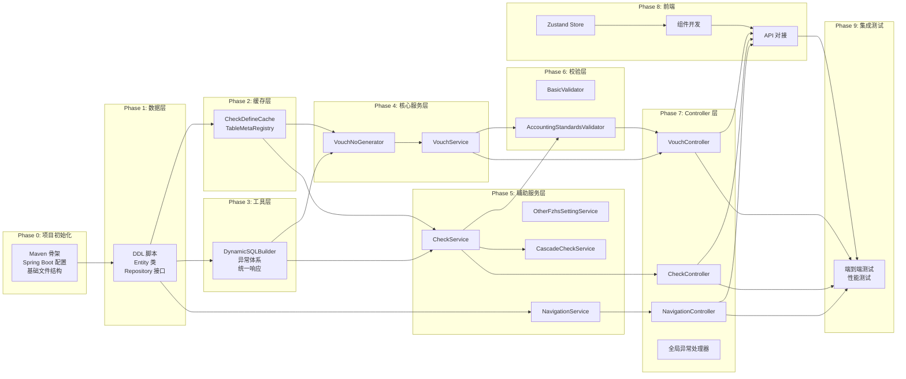
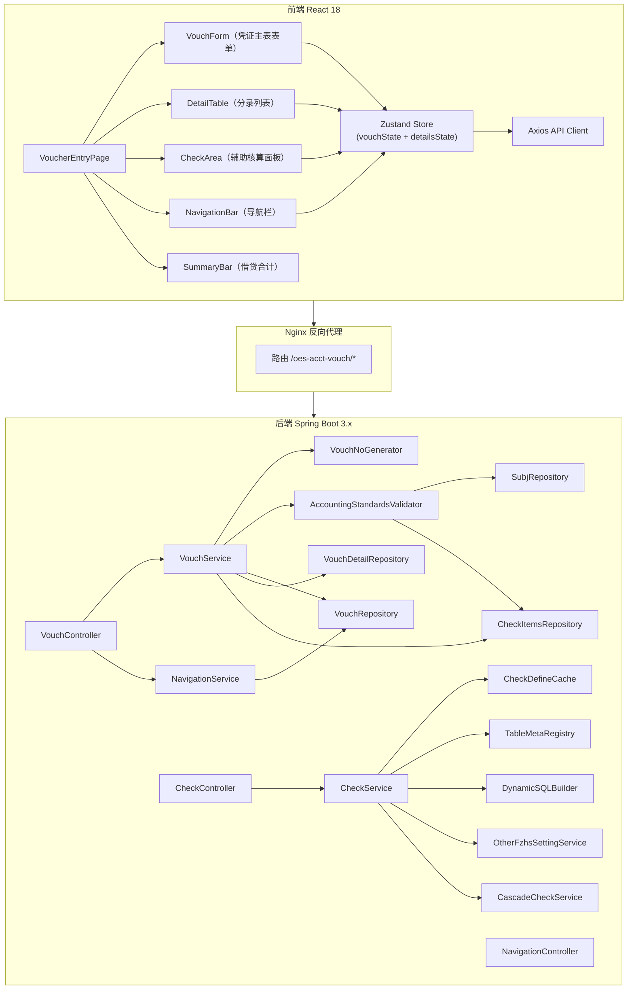
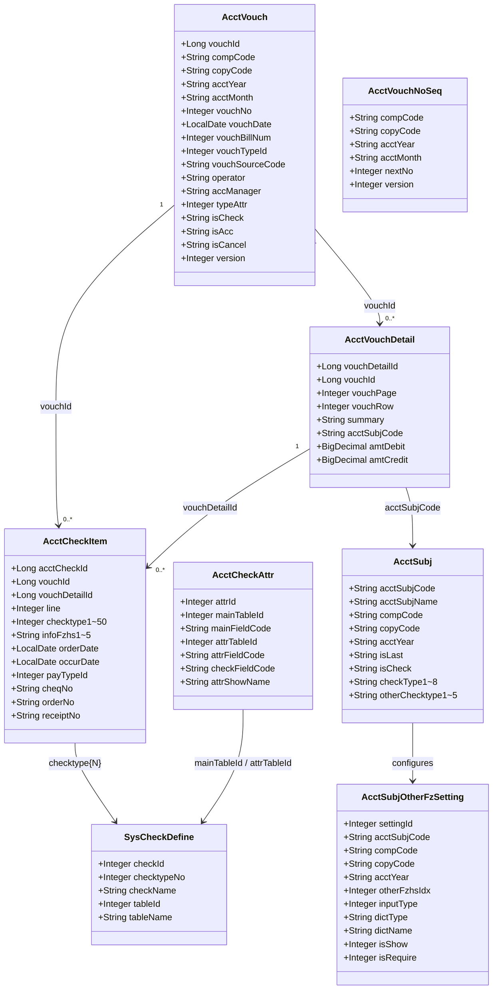
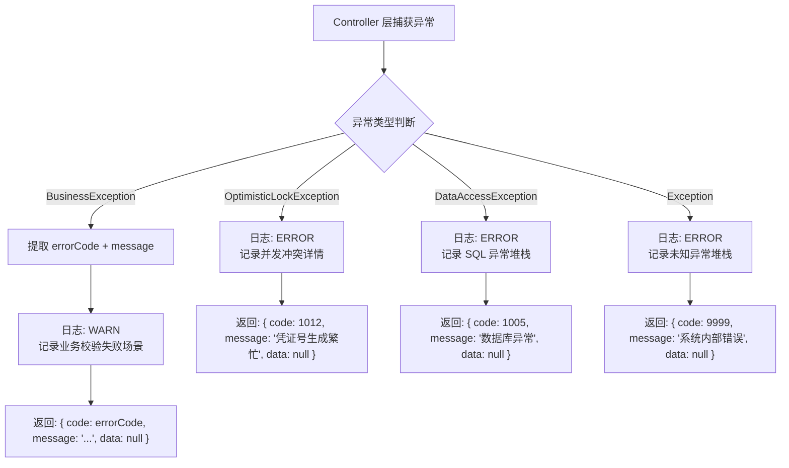
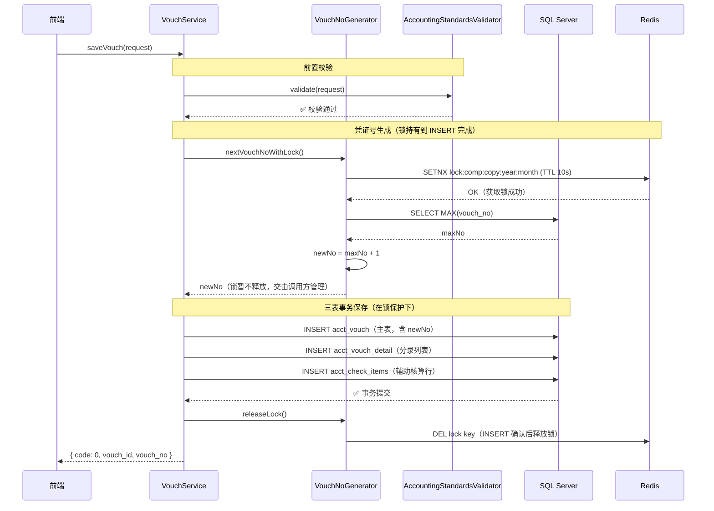
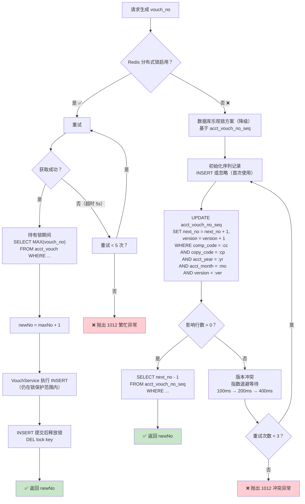
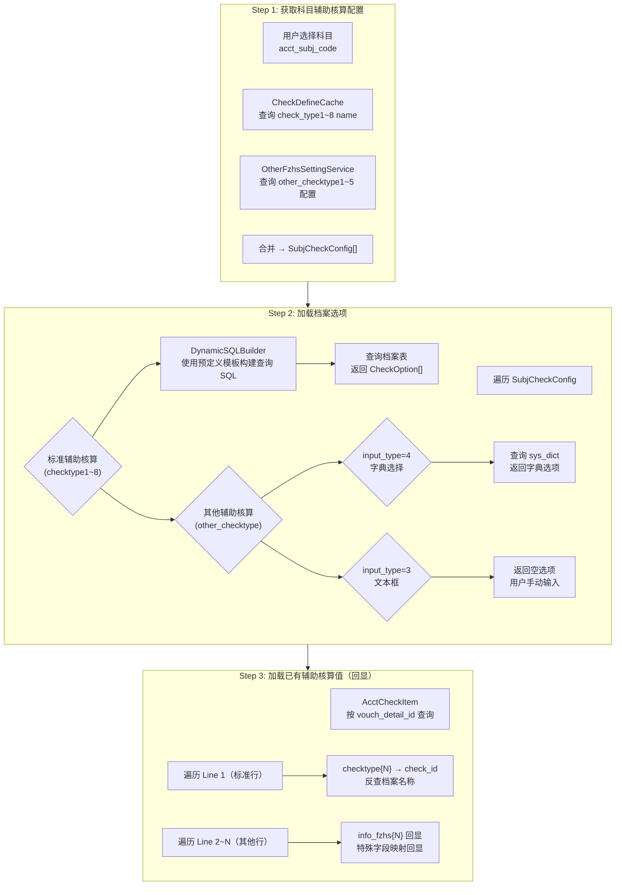
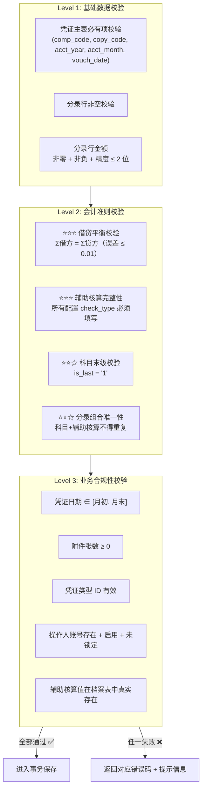
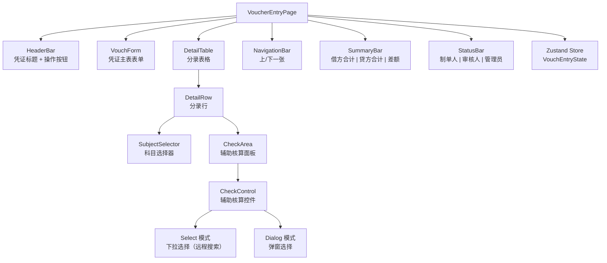
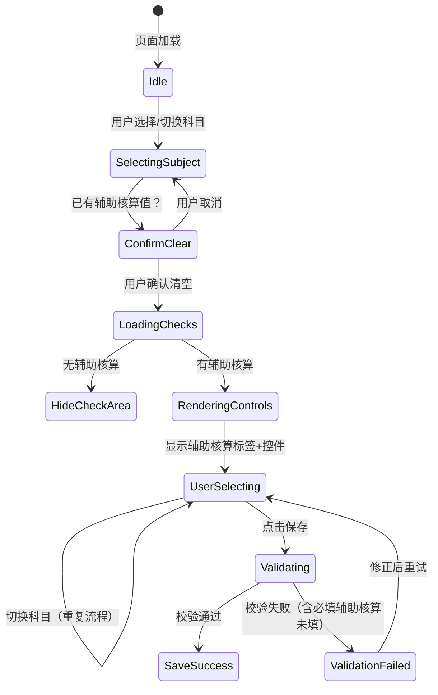

# OES 会计凭证录入组件 — 实现计划

> **文档编号**: 0003-oes-acct-vouch-plan-by-deepseek  
> **版本**: v1.1  
> **创建日期**: 2026-05-17  
> **最后更新**: 2026-05-17  
> **作者**: DeepSeek  
> **项目**: 望海康信 OES — 会计凭证录入前端+后端组件  
> **基于**: 设计说明书 v2.1 (0003-oes-acct-vouch-req-design-by-deepseek)  
> **审查修复**: Codex Review (0003-oes-acct-vouch-plan-revie-deepseek.md) — 修复 E-1/E-2/E-3 + W-1/W-2/W-3/W-4  
> **状态**: Updated (v1.1)

---

## 目录

1. [总体策略与里程碑](#1-总体策略与里程碑)
2. [前后端模块依赖关系](#2-前后端模块依赖关系)
3. [Phase 0：项目初始化与环境搭建](#3-phase-0项目初始化与环境搭建)
4. [Phase 1：数据层 — 表创建 + Entity + Repository](#4-phase-1数据层--表创建--entity--repository)
5. [Phase 2：缓存层 — CheckDefineCache + TableMetaRegistry](#5-phase-2缓存层--checkdefinecache--tablemetaregistry)
6. [Phase 3：工具层 — DynamicSQLBuilder + 异常体系](#6-phase-3工具层--dynamicsqlbuilder--异常体系)
7. [Phase 4：核心服务层 — VouchNoGenerator + VouchService](#7-phase-4核心服务层--vouchnogenerator--vouchservice)
8. [Phase 5：辅助服务层](#8-phase-5辅助服务层)
9. [Phase 6：校验层](#9-phase-6校验层)
10. [Phase 7：Controller 层 — REST API 入口](#10-phase-7controller-层--rest-api-入口)
11. [Phase 8：前端实现 — React 组件 + Zustand Store](#11-phase-8前端实现--react-组件--zustand-store)
12. [Phase 9：集成测试与端到端验证](#12-phase-9集成测试与端到端验证)
13. [Phase 10：部署配置与上线 Checklist](#13-phase-10部署配置与上线-checklist)
14. [风险识别与缓解措施](#14-风险识别与缓解措施)
15. [附录：工时估算](#15-附录工时估算)

---

## 1. 总体策略与里程碑

### 1.1 实现策略

采用**自底向上（Bottom-Up）+ 前后端并行**的分阶段交付策略：

1. **先数据，后逻辑**：从数据库 DDL → Entity → Repository → Service → Controller，逐层向上构建
2. **先核后辅**：优先实现凭证核心三表保存（VouchService），再实现辅助核算解析、导航等辅助服务
3. **后端先行，前端并行**：当后端 Repository 层完成后，前端可基于 Mock 数据同步开发，最终联调
4. **先测试后集成**：每个模块交付时附带单元测试，最终阶段进行集成测试

### 1.2 里程碑

| 里程碑 | 阶段 | 预计周期 | 交付物 |
|--------|------|---------|--------|
| M0 | Phase 0 | 0.5 天 | Maven 项目骨架、配置文件、基础结构 |
| M1 | Phase 1~2 | 1 天 | 数据库表 + Entity + Repository + Cache |
| M2 | Phase 3~4 | 1.5 天 | 工具层 + 核心服务（凭证保存、凭证号生成） |
| M3 | Phase 5~6 | 1.5 天 | 辅助服务 + 会计准则校验体系 |
| M4 | Phase 7 | 0.5 天 | Controller 层 + 统一异常处理 |
| M5 | Phase 8 | 2 天 | 前端功能完备 |
| M6 | Phase 9~10 | 1 天 | 集成测试 + 部署上线 |

**总工期估算：约 8 个工作日**

### 1.3 阶段依赖关系图



---

## 2. 前后端模块依赖关系

### 2.1 模块调用链



### 2.2 关键接口契约

| 接口路径 | 方法 | 输入 | 输出 | 调用方 → 被调方 |
|----------|------|------|------|----------------|
| `GET /oes-acct-vouch` | loadVouch | `account`, `vouch_id?` | `VouchLoadResponse` | VouchController → VouchService |
| `POST /oes-acct-vouch/save` | saveVouch | `VouchSaveRequest` | `SaveVouchResult` | VouchController → VouchService → Validator |
| `GET /oes-acct-vouch/subj/checks` | getSubjChecks | `subj_code`, `comp_code`, ... | `List<SubjCheckConfig>` | CheckController → CheckService |
| `GET /oes-acct-vouch/check/options` | getCheckOptions | `check_id`, `comp_code`, ... | `List<CheckOption>` | CheckController → CheckService |
| `GET /oes-acct-vouch/navigation` | navigate | `vouch_id`, `direction`, ... | `NavigationResult` | NavigationController → NavigationService |

---

## 3. Phase 0：项目初始化与环境搭建

### 3.1 任务清单

| 序号 | 任务 | 输出物 | 依赖 |
|------|------|--------|------|
| 0.1 | 创建 Maven 项目骨架 `oes-acct-vouch` | `pom.xml`（含 Spring Boot 3.x、MyBatis、Redis、Jackson 等依赖） | — |
| 0.2 | 配置 `application.yml` / `application-dev.yml` | 数据源、Redis、服务端口等配置 | 0.1 |
| 0.3 | 创建基础包结构 | 空包目录：controller / service / repository / model / validator / cache / config / exception / util | 0.1 |
| 0.4 | 配置 Maven 编译器（OpenJDK 26） | `pom.xml` 中 `maven-compiler-plugin` 配置 | 0.1 |
| 0.5 | 创建 Spring Boot 启动类 `OesAcctVouchApplication` | 启动类 + @SpringBootApplication | 0.2 |
| 0.6 | 配置全局 Jackson ObjectMapper | 日期格式 `yyyy-MM-dd`、时区、null 处理 | 0.2 |
| 0.7 | 前端项目初始化（React 18 + TypeScript + Ant Design 5 + Vite） | `package.json`、`tsconfig.json`、`vite.config.ts` | — |

### 3.2 关键配置项

```yaml
# application.yml 核心配置
server:
  port: 83000

spring:
  datasource:
    url: jdbc:sqlserver://127.0.0.1:1433;databaseName=OESCQET-0408;encrypt=false
    username: oes_app
    password: ${DB_PASSWORD}
    hikari:
      maximum-pool-size: 20
      minimum-idle: 5
      connection-timeout: 30000
      idle-timeout: 600000

  redis:
    host: ${REDIS_HOST:127.0.0.1}
    port: 6379
    timeout: 3000
    lettuce:
      pool:
        max-active: 16
        max-idle: 8
        min-idle: 4

oes:
  acct:
    vouch:
      vouch-no:
        redis-lock-ttl: 10000
        redis-lock-wait: 5000
        redis-lock-retry-delay: 100
        redis-lock-max-retries: 5
        optimistic-lock-max-retries: 3
        optimistic-lock-initial-delay-ms: 100
        optimistic-lock-backoff-multiplier: 2.0
      validation:
        balance-tolerance: 0.01
        enabled: true
```

### 3.3 启用/禁用开关

| 配置项 | 默认值 | 说明 |
|--------|--------|------|
| `oes.acct.vouch.validation.enabled` | `true` | 会计准则校验总开关，关闭后仅做基础校验 |
| `oes.acct.vouch.vouch-no.redis-lock-enabled` | `true` | Redis 分布式锁开关，关闭后直接走乐观锁降级方案 |

---

## 4. Phase 1：数据层 — 表创建 + Entity + Repository

### 4.1 任务清单

| 序号 | 任务 | 输出物 | 依赖 |
|------|------|--------|------|
| 1.1 | 编写 DDL 脚本：`acct_vouch` 表 + 索引 + **唯一约束** | `sql/001_create_acct_vouch.sql` | — |
| 1.2 | 编写 DDL 脚本：`acct_vouch_detail` 表 + 索引 | `sql/002_create_acct_vouch_detail.sql` | 1.1 |
| 1.3 | 编写 DDL 脚本：`acct_check_items` 表 + 索引 | `sql/003_create_acct_check_items.sql` | 1.1 |
| 1.4 | 编写 DDL 脚本：`acct_subj_other_fz_setting` 表 + 索引【v2.1】 | `sql/004_create_acct_subj_other_fz_setting.sql` | — |
| 1.5 | 编写 DDL 脚本：`acct_check_attr` 表 + 索引【v2.1】 | `sql/005_create_acct_check_attr.sql` | — |
| 1.6 | 编写 DDL 脚本：`acct_vouch_no_seq` 独立序列号表【用于乐观锁降级】 | `sql/006_create_acct_vouch_no_seq.sql` | — |
| 1.7 | 创建 Entity 类：`AcctVouch` | `model/entity/AcctVouch.java` | 1.1 |
| 1.8 | 创建 Entity 类：`AcctVouchDetail` | `model/entity/AcctVouchDetail.java` | 1.2 |
| 1.9 | 创建 Entity 类：`AcctCheckItem` | `model/entity/AcctCheckItem.java` | 1.3 |
| 1.10 | 创建 Entity 类：`AcctSubjOtherFzSetting`【v2.1】 | `model/entity/AcctSubjOtherFzSetting.java` | 1.4 |
| 1.11 | 创建 Entity 类：`AcctCheckAttr`【v2.1】 | `model/entity/AcctCheckAttr.java` | 1.5 |
| 1.12 | 创建 Entity 类：`AcctVouchNoSeq`【用于乐观锁降级】 | `model/entity/AcctVouchNoSeq.java` | 1.6 |
| 1.13 | 创建 Entity 类：`AcctSubj` + `SysCheckDefine` + `SysEmp` + `SysDept` | 对应实体 | — |
| 1.14 | 创建 Repository 接口：`VouchRepository` | `repository/VouchRepository.java` | 1.7 |
| 1.15 | 创建 Repository 接口：`VouchDetailRepository` | `repository/VouchDetailRepository.java` | 1.8 |
| 1.16 | 创建 Repository 接口：`CheckItemsRepository` | `repository/CheckItemsRepository.java` | 1.9 |
| 1.17 | 创建 Repository 接口：`SubjRepository` | `repository/SubjRepository.java` | 1.13 |
| 1.18 | 创建 Repository 接口：`CheckDefineRepository` | `repository/CheckDefineRepository.java` | 1.13 |
| 1.19 | 创建 Repository 接口：`OtherFzSettingRepository`【v2.1】 | `repository/OtherFzSettingRepository.java` | 1.10 |
| 1.20 | 创建 Repository 接口：`CheckAttrRepository`【v2.1】 | `repository/CheckAttrRepository.java` | 1.11 |
| 1.21 | 创建 Repository 接口：`VouchNoSeqRepository`【乐观锁降级】 | `repository/VouchNoSeqRepository.java` | 1.12 |
| 1.22 | 编写 Repository 单元测试 | 各 Repository 的 JdbcTemplate 测试 | 1.14~1.21 |

### 4.2 Entity 关系图



### 4.3 Repository 接口设计原则

每个 Repository 接口遵循**接口隔离原则**，按表维度拆分：

```java
// VouchRepository — 仅操作 acct_vouch 表
public interface VouchRepository {
    Optional<AcctVouch> findById(Long vouchId);
    List<AcctVouch> findByCompCopyYearMonth(String compCode, String copyCode, String acctYear, String acctMonth);
    int maxVouchNo(String compCode, String copyCode, String acctYear, String acctMonth);
    long insert(AcctVouch vouch);
    int update(AcctVouch vouch);
}

// VouchDetailRepository — 仅操作 acct_vouch_detail 表
public interface VouchDetailRepository {
    List<AcctVouchDetail> findByVouchId(Long vouchId);
    long insert(AcctVouchDetail detail);
    int update(AcctVouchDetail detail);
    int deleteById(Long vouchDetailId);
    int deleteByVouchId(Long vouchId);
    void batchInsert(List<AcctVouchDetail> details);
}

// CheckItemsRepository — 仅操作 acct_check_items 表
public interface CheckItemsRepository {
    List<AcctCheckItem> findByVouchId(Long vouchId);
    List<AcctCheckItem> findByDetailId(Long vouchDetailId);
    int deleteByDetailId(Long vouchDetailId);
    int deleteByVouchId(Long vouchId);
    void batchInsert(List<AcctCheckItem> items);
}

// VouchNoSeqRepository — 专用序列号表操作（乐观锁降级方案）
public interface VouchNoSeqRepository {
    /**
     * 乐观锁方式更新序列号
     * @return 影响行数（0 = 并发冲突，需重试）
     */
    int incrementAndGet(String compCode, String copyCode, String acctYear, String acctMonth, int expectedVersion);

    /**
     * 初始化序列号记录（首次使用某个月份时）
     */
    void initIfAbsent(String compCode, String copyCode, String acctYear, String acctMonth);
}
```

### 4.4 数据库优化注意事项

| 表名 | 关键索引 / 约束 | 优化理由 |
|------|---------------|---------|
| `acct_vouch` | `UQ_acct_vouch_no` **UNIQUE** (comp_code, copy_code, acct_year, acct_month, vouch_no) INCLUDE (...) | **凭证号唯一约束 — 兜底防线**；凭证导航、凭证号 MAX 查询的核心索引 |
| `acct_vouch_detail` | `IX_acct_vouch_detail_vouch_id` (vouch_id) INCLUDE (...) | 加载凭证时的核心查询路径 |
| `acct_check_items` | `IX_acct_check_items_vouch_detail_id` (vouch_detail_id) | v2.1 一对多模型，按 detail_id 查询频率最高 |
| `acct_subj_other_fz_setting` | `uk_subj_fzhs` UNIQUE (acct_subj_code, other_fzhs_idx, comp_code, copy_code, acct_year) | 唯一约束防止重复配置 |
| `acct_vouch_no_seq` | PRIMARY KEY (comp_code, copy_code, acct_year, acct_month) | 乐观锁降级方案的序列号表 |

> **⚠️ 关键约束说明**：`UQ_acct_vouch_no` 唯一索引是凭证号生成的**最后一道兜底防线**。即使 Redis 锁或乐观锁因极端并发出现竞态，唯一索引将确保数据库层拒绝重复凭证号，保证数据完整性。

---

## 5. Phase 2：缓存层 — CheckDefineCache + TableMetaRegistry

### 5.1 任务清单

| 序号 | 任务 | 输出物 | 依赖 |
|------|------|--------|------|
| 2.1 | 实现 `CheckDefineCache`：@PostConstruct 全量加载 sys_check_define | `cache/CheckDefineCache.java` | 1.18 |
| 2.2 | 实现定时刷新机制（@Scheduled fixedDelay=5min） | CheckDefineCache.refresh() | 2.1 |
| 2.3 | 实现 `TableMetaRegistry`：table_id → 表名/主键/列名映射 | `cache/TableMetaRegistry.java` | 1.18 |
| 2.4 | 缓存层单元测试 | 测试全量加载、刷新、并发读取 | 2.1~2.3 |

### 5.2 CheckDefineCache 设计要点

```java
@Component
public class CheckDefineCache {
    private final Map<Integer, SysCheckDefine> cache = new ConcurrentHashMap<>();
    private final CheckDefineRepository repository;

    @PostConstruct
    public void init() {
        List<SysCheckDefine> allDefines = repository.findAll();
        allDefines.forEach(d -> cache.put(d.getCheckId(), d));
    }

    @Scheduled(fixedDelayString = "${oes.acct.vouch.cache.check-define-refresh-ms:300000}")
    public void refresh() {
        List<SysCheckDefine> allDefines = repository.findAll();
        cache.clear();
        allDefines.forEach(d -> cache.put(d.getCheckId(), d));
    }

    public SysCheckDefine getCheckDefine(Integer checkId) {
        SysCheckDefine def = cache.get(checkId);
        if (def == null) {
            throw new BusinessException(ErrorCode.PARAM_INVALID, "不存在的辅助核算定义: checkId=" + checkId);
        }
        return def;
    }
}
```

---

## 6. Phase 3：工具层 — DynamicSQLBuilder + 异常体系

### 6.1 任务清单

| 序号 | 任务 | 输出物 | 依赖 |
|------|------|--------|------|
| 3.1 | 实现 `ErrorCode` 枚举 | `exception/ErrorCode.java` | — |
| 3.2 | 实现 `BusinessException`（含 errorCode） | `exception/BusinessException.java` | 3.1 |
| 3.3 | 实现 `OptimisticLockException` | `exception/OptimisticLockException.java` | — |
| 3.4 | 实现统一响应封装 `ApiResponse<T>` | `model/dto/ApiResponse.java` | — |
| 3.5 | 实现全局异常处理器 `GlobalExceptionHandler`（@RestControllerAdvice） | `exception/GlobalExceptionHandler.java` | 3.2~3.4 |
| 3.6 | 实现 `TableMeta` 封装类 | `model/vo/TableMeta.java` | — |
| 3.7 | 实现 `DynamicSQLBuilder`：预定义模板 + 白名单 + 参数化 SQL | `util/DynamicSQLBuilder.java` | 2.3, 3.6 |
| 3.8 | 实现 `WhereSqlTemplate` 枚举：预定义的安全查询模板 | `util/WhereSqlTemplate.java` | — |
| 3.9 | 工具层单元测试 | 测试 SQL 拼接、异常处理链 | 3.1~3.8 |

### 6.2 异常处理流程



### 6.3 DynamicSQLBuilder 设计要点（Review 修复：模板化防注入）

```java
/**
 * 预定义的安全查询模板枚举。
 * 所有 whereSql 必须从此枚举中选取，拒绝接收任意字符串。
 * 通过预定义模板 + 白名单表名 + 参数化绑定三层防护 SQL 注入。
 */
public enum WhereSqlTemplate {
    BY_COMP_COPY_YEAR(
        "comp_code = ? AND copy_code = ? AND acct_year = ?",
        List.of("compCode", "copyCode", "acctYear")
    ),
    BY_COMP_COPY_YEAR_KEYWORD(
        "comp_code = ? AND copy_code = ? AND acct_year = ? AND name LIKE ?",
        List.of("compCode", "copyCode", "acctYear", "keyword")
    );

    private final String whereClause; // 无表名，仅条件部分
    private final List<String> paramNames;

    public String getWhereClause() { return whereClause; }
    public int paramCount() { return paramNames.size(); }
}

@Component
public class DynamicSQLBuilder {
    private final TableMetaRegistry tableMetaRegistry;

    /**
     * 构建安全的档案表查询 SQL
     * @param tableId 表标识（白名单校验）
     * @param template 预定义的安全查询模板（禁止接收任意字符串）
     * @return 参数化 SQL 字符串（不含用户输入的表名或条件片段）
     */
    public String buildQuerySQL(String tableId, WhereSqlTemplate template) {
        // 1. 白名单校验 tableId
        if (!tableMetaRegistry.contains(tableId)) {
            throw new BusinessException(1006, "非法的辅助核算表名: " + tableId);
        }
        // 2. 从元数据获取白名单表名
        String safeTableName = tableMetaRegistry.getTableMeta(tableId).getTableName();
        // 3. 使用预定义模板（不拼接任何用户输入）
        return "SELECT id, code, name FROM " + safeTableName
               + " WHERE " + template.getWhereClause();
    }
}
```

---

## 7. Phase 4：核心服务层 — VouchNoGenerator + VouchService

### 7.1 任务清单

| 序号 | 任务 | 输出物 | 依赖 |
|------|------|--------|------|
| 4.1 | 实现 `VouchNoGenerator`：Redis 分布式锁方案（锁持有到 INSERT 完成） | `service/VouchNoGenerator.java` | 2.1, 3.1 |
| 4.2 | 实现 `VouchNoGenerator`：数据库乐观锁降级方案（基于 `acct_vouch_no_seq` 版本号乐观锁） | 同上（同文件内双策略） | 4.1, 1.21 |
| 4.3 | 实现 `VouchService.saveVouch()` 核心方法 | `service/VouchService.java` | 4.2, 1.14~1.16 |
| 4.4 | 实现 `VouchService` 内部方法：凭证主表保存、分录保存、辅助核算保存 | 同上 | 4.3 |
| 4.5 | 实现 `VouchService` 删除分录/辅助核算行逻辑 | 同上 | 4.3 |
| 4.6 | 实现操作人解析：account → 用户+员工+部门 | `service/VouchService.resolveOperatorName()` | 1.13 |
| 4.7 | 实现 ID 生成：`nextVouchId()`、`nextDetailId()` | 同上 | 4.3 |
| 4.8 | 实现 DTO/VO：`VouchSaveRequest`、`VouchLoadResponse`、`SaveVouchResult` | `model/dto/*.java` | — |
| 4.9 | 核心服务层单元测试（Mock JdbcTemplate） | 测试各种保存路径 | 4.1~4.8 |

### 7.2 凭证保存核心流程（Review 修复：Redis 锁持有到 INSERT 完成后释放）



> **设计决策**：Redis 锁的持有期覆盖 `SELECT MAX → INSERT` 全过程，确保凭证号生成的原子性。锁在 INSERT 事务提交后释放。TTL 设置为 10s，超出则自动释放防止死锁。**兜底**：即使锁异常释放导致并发问题，`UQ_acct_vouch_no` 唯一索引会拒绝重复凭证号。

### 7.3 凭证号生成双方案流程图（Review 修复）



### 7.4 VouchService 事务边界设计

```java
@Service
@Transactional(rollbackFor = Exception.class)
public class VouchService {

    public SaveVouchResult saveVouch(VouchSaveRequest request) {
        // Step 1: 前置校验（不开事务）
        accountingStandardsValidator.validate(request);

        // Step 2: 解析操作人
        String operatorName = resolveOperatorName(request.getAccount());

        // Step 3: 生成凭证号（Redis 锁 或 乐观锁降级）
        //         Redis 锁在方法内部获取，由 VouchService 在 INSERT 后释放
        int newVouchNo = vouchNoGenerator.nextVouchNoWithLock(...);

        try {
            // Step 4: 保存凭证主表（在锁保护下）
            Long vouchId = saveVouchMain(request.getVouch(), true, operatorName, newVouchNo);

            // Step 5: 保存分录 + 辅助核算（全量替换策略）
            saveOrUpdateDetails(request.getDetails(), vouchId, request.getVouch());

            // Step 6: 返回结果
            return new SaveVouchResult(vouchId, newVouchNo);
        } finally {
            // Step 7: INSERT 完成后释放 Redis 锁
            vouchNoGenerator.releaseLock(...);
        }
    }
}
```

---

## 8. Phase 5：辅助服务层

### 8.1 任务清单

| 序号 | 任务 | 输出物 | 依赖 |
|------|------|--------|------|
| 5.1 | 实现 `CheckService.resolveSubjChecks()`：解析科目辅助核算配置 | `service/CheckService.java` | 1.17, 2.1 |
| 5.2 | 实现 `CheckService.loadCheckOptions()`：加载档案表选项 | 同上 | 3.7 |
| 5.3 | 实现 `CheckService.resolveCheckItems()`：辅助核算行反查回显 | 同上 | 1.16, 2.1 |
| 5.4 | 实现 `OtherFzhsSettingService.getSettings()`：查询其他辅助核算配置 | `service/OtherFzhsSettingService.java` | 1.19 |
| 5.5 | 实现 `OtherFzhsSettingService.getDictOptions()`：查询字典选项 | 同上 | — |
| 5.6 | 实现 `CascadeCheckService.cascadeCheck()`：级联辅助核算查询 | `service/CascadeCheckService.java` | 1.20, 3.7 |
| 5.7 | 实现级联查询：直接关联模式 `resolveDirectCascade()` | 同上 | 5.6 |
| 5.8 | 实现级联查询：中间表关联模式 `resolveRelationCascade()` | 同上 | 5.6 |
| 5.9 | 实现 `NavigationService.navigateVouch()`：上/下一张凭证导航 | `service/NavigationService.java` | 1.14 |
| 5.10 | 实现 `NavigationService.getSummaryPreview()`：导航摘要预览 | 同上 | 5.9 |
| 5.11 | 实现 DTO/VO：`SubjCheckConfig`、`CheckOption`、`NavigationRequest`、`NavigationResult` | `model/dto/*.java` | — |
| 5.12 | 辅助服务层单元测试 | 测试各服务方法 | 5.1~5.11 |

### 8.2 辅助核算配置 → 选项 → 行解析流程



### 8.3 凭证导航逻辑

```sql
-- 下一张凭证（按 vouch_id 升序）
SELECT TOP 1 *
FROM acct_vouch
WHERE comp_code = :compCode
  AND copy_code = :copyCode
  AND acct_year = :acctYear
  AND acct_month = :acctMonth
  AND vouch_id > :currentVouchId
  AND is_cancel = '0'   -- 排除作废凭证
ORDER BY vouch_id ASC;

-- 上一张凭证（按 vouch_id 降序）
SELECT TOP 1 *
FROM acct_vouch
WHERE comp_code = :compCode
  AND copy_code = :copyCode
  AND acct_year = :acctYear
  AND acct_month = :acctMonth
  AND vouch_id < :currentVouchId
  AND is_cancel = '0'
ORDER BY vouch_id DESC;
```

---

## 9. Phase 6：校验层

### 9.1 任务清单

| 序号 | 任务 | 输出物 | 依赖 |
|------|------|--------|------|
| 6.1 | 实现三级校验体系框架 + ValidationRule 接口 | `validator/AccountingStandardsValidator.java` | 3.1, 1.17 |
| 6.2 | 实现 Level 1 基础数据校验：凭证主表必有项、分录非空、金额格式 | 同上 | 6.1 |
| 6.3 | 实现 Level 2 会计准则校验：借贷平衡、辅助核算完整性、科目末级、分录唯一性 | 同上 | 6.1 |
| 6.4 | 实现 Level 3 业务合规性校验：日期期间、账号有效性、档案值存在性 | 同上 | 6.1, 1.16 |
| 6.5 | 实现 `BasicValidator`：基础数据格式校验 | `validator/BasicValidator.java` | — |
| 6.6 | 校验层单元测试 | 覆盖三级各校验规则 | 6.1~6.5 |

### 9.2 三级校验体系



### 9.3 校验规则扩展性设计

```java
@Component
public class AccountingStandardsValidator {

    @FunctionalInterface
    public interface ValidationRule {
        void validate(VouchSaveRequest request);
    }

    private final List<ValidationRule> rules = new ArrayList<>();

    public AccountingStandardsValidator(
            VouchRepository vouchRepository,
            SubjRepository subjRepository) {
        // Level 1
        rules.add(this::validateRequiredFields);
        rules.add(this::validateDetailNonEmpty);
        rules.add(this::validateAmountFormat);
        // Level 2
        rules.add(this::validateBalance);
        rules.add(this::validateCheckCompleteness);
        rules.add(this::validateSubjectLeaf);
        rules.add(this::validateCombinationUniqueness);
        // Level 3
        rules.add(this::validateDateInPeriod);
        rules.add(this::validateAttachmentCount);
        rules.add(this::validateVouchType);
        rules.add(this::validateOperatorAccount);
        rules.add(this::validateCheckValueExists);
    }

    public void validate(VouchSaveRequest request) {
        for (ValidationRule rule : rules) {
            rule.validate(request);
        }
    }
}
```

---

## 10. Phase 7：Controller 层 — REST API 入口

### 10.1 任务清单

| 序号 | 任务 | 输出物 | 依赖 |
|------|------|--------|------|
| 7.1 | 实现 `VouchController.loadVouch()`：凭证加载接口 | `controller/VouchController.java` | 4.8 |
| 7.2 | 实现 `VouchController.saveVouch()`：凭证保存接口 | 同上 | 7.1, 4.8 |
| 7.3 | 实现 `CheckController.getSubjChecks()`：科目辅助核算配置 | `controller/CheckController.java` | 5.1 |
| 7.4 | 实现 `CheckController.getCheckOptions()`：辅助核算选项查询 | 同上 | 5.2 |
| 7.5 | 实现 `NavigationController.navigate()`：凭证导航接口 | `controller/NavigationController.java` | 5.9 |
| 7.6 | 全局异常处理器完善 | 复用 Phase 3 成果 | — |
| 7.7 | Controller 层单元测试（MockMvc） | 测试各接口路径 | 7.1~7.6 |

### 10.2 Controller 层设计原则（Review 修复：移除多余依赖）

```java
@RestController
@RequestMapping("/oes-acct-vouch")
public class VouchController {

    private final VouchService vouchService;

    // 仅注入 VouchService — 导航和辅助核算有各自专用的 Controller
    public VouchController(VouchService vouchService) {
        this.vouchService = vouchService;
    }

    /**
     * 加载凭证编辑页数据
     * GET /oes-acct-vouch?account=admin&vouch_id=
     * 
     * 无登录访问：通过 account 参数校验操作人身份
     * 安全校验：格式检查 → 存在性检查 → 启用/锁定状态检查
     */
    @GetMapping
    public ApiResponse<VouchLoadResponse> loadVouch(
            @RequestParam @Size(max = 32) @Pattern(regexp = "^[a-zA-Z0-9_]+$") String account,
            @RequestParam(required = false) Long vouchId) {
        VouchLoadResponse response = vouchService.loadVouch(account, vouchId);
        return ApiResponse.success(response);
    }

    /**
     * 保存凭证
     * POST /oes-acct-vouch/save
     */
    @PostMapping("/save")
    public ApiResponse<SaveVouchResult> saveVouch(
            @RequestBody @Valid VouchSaveRequest request) {
        SaveVouchResult result = vouchService.saveVouch(request);
        return ApiResponse.success(result);
    }
}
```

### 10.3 无登录访问安全控制

| 安全维度 | 控制措施 | 实现位置 |
|---------|---------|---------|
| account 参数格式 | 仅允许字母数字下划线，长度 ≤ 32，正则校验 | Controller 层 @Pattern |
| 账号存在性 | 在 up_org_user 中真实存在 | VouchService.resolveOperatorName() |
| 账号启用态 | ACCOUNT_ENABLED = '1' | VouchService 查询时校验 |
| 账号锁定态 | ACCOUNT_LOCKED = '0' | VouchService 查询时校验 |
| 已审核凭证修改保护 | 后端校验 is_check = '0' 才允许修改 | VouchService.saveVouch() |
| 请求频率限制 | Nginx 层 Rate Limiting | Nginx 配置 |
| 关键操作审计 | 凭证创建/修改/删除记录审计日志 | VouchService + AOP |

### 10.4 接口一览

| 方法 | 路径 | 说明 | 事务性 |
|------|------|------|--------|
| `GET` | `/oes-acct-vouch` | 加载凭证编辑页数据（无登录 + 双模式） | 否 |
| `POST` | `/oes-acct-vouch/save` | 保存凭证（三表联动） | **是** |
| `GET` | `/oes-acct-vouch/subj/checks` | 查询科目辅助核算配置 | 否 |
| `GET` | `/oes-acct-vouch/check/options` | 查询辅助核算可选档案数据 | 否 |
| `GET` | `/oes-acct-vouch/navigation` | 凭证导航（上/下一张） | 否 |

---

## 11. Phase 8：前端实现 — React 组件 + Zustand Store

### 11.1 任务清单

| 序号 | 任务 | 输出物 | 依赖 |
|------|------|--------|------|
| 8.1 | 搭建前端项目：React 18 + TypeScript + Vite | `package.json`、vite 配置 | — |
| 8.2 | 安装依赖：Ant Design 5、Zustand、Axios | `package.json` | 8.1 |
| 8.3 | 定义 TypeScript 类型：`VouchEntryState`、`DetailRowState`、`CheckControlState` 等 | `types/vouch.ts` | — |
| 8.4 | 实现 Zustand Store：凭证状态管理 | `store/vouchStore.ts` | 8.3 |
| 8.5 | 实现 API 层：`VouchApi`（Axios 封装） | `api/vouchApi.ts` | — |
| 8.6 | 实现 **VoucherEntryPage** 主页面组件 | `pages/VoucherEntryPage.tsx` | 8.2~8.5 |
| 8.7 | 实现 **VouchForm** 凭证主表表单组件 | `components/VouchForm.tsx` | 8.6 |
| 8.8 | 实现 **DetailTable** 分录表格组件（含科目选择器） | `components/DetailTable.tsx` | 8.6 |
| 8.9 | 实现 **CheckArea** 辅助核算面板组件 | `components/CheckArea.tsx` | 8.6, 5.3 |
| 8.10 | 实现辅助核算控件组件（Select / Dialog 双模式，支持远程搜索） | `components/CheckControl.tsx` | 8.9 |
| 8.11 | 实现 **NavigationBar** 导航栏组件 | `components/NavigationBar.tsx` | 8.6 |
| 8.12 | 实现 **SummaryBar** 借贷合计展示条 | `components/SummaryBar.tsx` | 8.6 |
| 8.13 | 实现 **StatusBar** 操作人/状态栏 | `components/StatusBar.tsx` | 8.6 |
| 8.14 | 实现前端校验逻辑（借贷平衡、必填项等） | `utils/validation.ts` | — |
| 8.15 | 实现科目选择联动：清空+重新加载辅助核算 | `hooks/useSubjectChange.ts` | 8.10 |
| 8.16 | 实现页面加载流程（新增/编辑双模式） | `hooks/usePageLoad.ts` | 8.5 |
| 8.17 | 前端单元测试（React Testing Library） | 测试各组件渲染与交互 | 8.6~8.16 |

> **💡 性能优化建议**：当档案表数据量超过 5000 条时，Select 下拉框应使用 `showSearch` + 远程搜索（`fetchOptions`），避免一次性加载全部选项导致页面卡顿。

### 11.2 前端组件树



### 11.3 科目选中联动流程



---

## 12. Phase 9：集成测试与端到端验证

### 12.1 任务清单

| 序号 | 任务 | 输出物 | 依赖 |
|------|------|--------|------|
| 9.1 | 编写凭证加载集成测试（新增/编辑双模式） | `test/.../VouchLoadIntegrationTest.java` | Phase 7 |
| 9.2 | 编写凭证保存集成测试（三表联动校验） | `test/.../VouchSaveIntegrationTest.java` | Phase 7 |
| 9.3 | 编写辅助核算解析集成测试 | `test/.../CheckServiceIntegrationTest.java` | Phase 7 |
| 9.4 | 编写凭证导航集成测试 | `test/.../NavigationIntegrationTest.java` | Phase 7 |
| 9.5 | 编写会计准则校验集成测试（三级 10 条规则） | `test/.../ValidationIntegrationTest.java` | Phase 7 |
| 9.6 | 编写凭证号生成并发测试（模拟高并发场景，验证唯一约束兜底） | `test/.../VouchNoConcurrencyTest.java` | 7.2 |
| 9.7 | 前端端到端测试（Cypress / Playwright） | 凭证录入、保存、导航流程 | Phase 8 |
| 9.8 | 回归测试：全部 Pipeline（checkstyle + 单元测试 + 集成测试） | CI 流水线配置 | 9.1~9.7 |

### 12.2 测试数据准备

```sql
-- 测试环境准备脚本
INSERT INTO acct_subj (acct_subj_code, acct_subj_name, comp_code, copy_code, acct_year, is_last, is_check, check_type1, check_type2)
VALUES ('1001', '库存现金', '01', '01', '2026', '1', '1', '部门', '项目');

INSERT INTO sys_check_define (check_id, checktype_no, check_name, table_id, table_name)
VALUES (1001, 1, '部门', 1, 'sys_dept');

INSERT INTO sys_dept (dept_id, dept_code, dept_name, comp_code)
VALUES (1, 'D001', '财务部', '01');

-- 初始化序列号表记录（用于乐观锁降级测试）
INSERT INTO acct_vouch_no_seq (comp_code, copy_code, acct_year, acct_month, next_no, version)
VALUES ('01', '01', '2026', '05', 1, 0);
```

### 12.3 性能测试关注点

| 测试场景 | 关注指标 | 预期目标 |
|---------|---------|---------|
| 凭证保存（单条分录 + 8 条辅助核算） | 响应时间 TP99 | < 500ms |
| 凭证加载（修改模式，50 条分录） | 响应时间 TP99 | < 800ms |
| 凭证号生成高并发（100 并发） | 无重复号 + 唯一索引无冲突 | 100% |
| 辅助核算选项加载（档案表 10000 条，远程搜索） | 响应时间（首次/模糊搜索） | < 200ms |
| 凭证导航（百万级凭证表） | 响应时间 | < 50ms |

---

## 13. Phase 10：部署配置与上线 Checklist

### 13.1 部署配置

| 配置项 | 开发环境 | 生产环境 |
|--------|---------|---------|
| 服务端口 | 83000 | 83000 |
| JVM 堆内存 | 2GB | 8GB |
| 数据库连接池 | 10 | 20 |
| Redis 连接池 | 8 | 16 |
| 凭证号锁 TTL | 10000ms | 10000ms |
| 缓存刷新间隔 | 5min | 5min |

### 13.2 上线 Checklist

| 序号 | 检查项 | 确认 |
|------|--------|------|
| □ | DDL 脚本已在目标库执行（含 `UQ_acct_vouch_no` 唯一索引） | |
| □ | `acct_vouch_no_seq` 表已创建（乐观锁降级方案） | |
| □ | 数据库唯一索引已创建（凭证号兜底防线） | |
| □ | Redis 连接可用 | |
| □ | Nginx 路由 /oes-acct-vouch/* 已配置 + Rate Limiting 已启用 | |
| □ | application.yml 配置正确（密码占位符已替换） | |
| □ | 前端静态资源已部署到 CDN / Nginx | |
| □ | CI/CD Pipeline 全部通过 | |
| □ | 凭证号并发测试通过（无重复号，唯一索引无冲突） | |
| □ | 会计准则校验规则全部验证 | |
| □ | 无登录访问安全策略已启用（account 格式 + 存在性 + 启用态 + 锁定态） | |
| □ | 审计日志已接入（凭证创建/修改/删除关键操作） | |
| □ | 监控告警已配置（响应时间、错误率、凭证号生成成功率） | |
| □ | 慢 SQL 日志已配置 | |

---

## 14. 风险识别与缓解措施

| 风险编号 | 风险描述 | 概率 | 影响 | 缓解措施 |
|---------|---------|------|------|---------|
| R-01 | Redis 不可用导致凭证号生成失败 | 低 | 高 | 乐观锁降级方案（基于 `acct_vouch_no_seq`）自动切换 |
| R-02 | 高并发下凭证号重复 | 低 | 高 | Redis 锁（主） + 乐观锁（备）双重保障；**`UQ_acct_vouch_no` 唯一索引兜底** |
| R-03 | 辅助核算档案表结构变更 | 中 | 中 | DynamicSQLBuilder 基于 TableMetaRegistry 元数据 + 预定义 WhereSqlTemplate，表结构变更仅需新增模板 |
| R-04 | 前端科目选择联动性能 | 低 | 中 | 异步加载 + 缓存辅助核算配置；Select 组件远程搜索 |
| R-05 | 大事务超时（50 条分录 + 大量辅助核算） | 低 | 中 | @Transactional 超时配置 + 保存前全量校验减少回滚 |
| R-06 | 无登录访问被滥用 | 中 | 高 | account 参数多层校验（格式+存在+启用+锁定）+ Nginx Rate Limiting + 操作审计日志 |
| R-07 | v2.1 一对多迁移导致数据兼容性问题 | 中 | 高 | 新老模型通过 line 字段区分；迁移脚本确保向后兼容 |

---

## 15. 附录：工时估算

### 15.1 工时汇总

| 阶段 | 任务 | 后端工时 | 前端工时 | 测试工时 | 合计 |
|------|------|---------|---------|---------|------|
| Phase 0 | 项目初始化 | 0.5d | 0.5d | — | 1.0d |
| Phase 1 | 数据层（含序列号表） | 1.0d | — | 0.5d | 1.5d |
| Phase 2 | 缓存层 | 0.5d | — | 0.3d | 0.8d |
| Phase 3 | 工具层（含模板化 SQL） | 0.5d | — | 0.3d | 0.8d |
| Phase 4 | 核心服务层（双方案+锁时序修复） | 1.5d | — | 0.5d | 2.0d |
| Phase 5 | 辅助服务层 | 1.5d | — | 0.5d | 2.0d |
| Phase 6 | 校验层 | 1.0d | — | 0.5d | 1.5d |
| Phase 7 | Controller 层 | 0.5d | — | 0.3d | 0.8d |
| Phase 8 | 前端实现（含远程搜索优化） | — | 2.5d | 0.5d | 3.0d |
| Phase 9 | 集成测试（含并发测试） | 0.5d | 0.5d | 1.0d | 2.0d |
| Phase 10 | 部署上线 | 0.5d | 0.3d | — | 0.8d |
| **总计** | | **8.0d** | **3.8d** | **4.4d** | **16.2d** |

> **说明**：工时估算基于单人全职开发。前端+后端可并行推进，实际日历工期约 8 个工作日。

### 15.2 后端包结构全景

```
com.oes.acct.vouch
├── OesAcctVouchApplication.java              # Spring Boot 启动类
│
├── config/
│   ├── TransactionConfig.java                 # 事务配置
│   ├── RedisConfig.java                       # Redis 连接配置
│   ├── DataSourceConfig.java                  # 数据源配置
│   └── JacksonConfig.java                     # Jackson 全局配置
│
├── controller/
│   ├── VouchController.java                   # 凭证加载/保存 REST API
│   ├── CheckController.java                   # 辅助核算配置/选项 REST API
│   └── NavigationController.java              # 凭证导航 REST API
│
├── service/
│   ├── VouchService.java                      # 凭证三表保存核心业务
│   ├── VouchNoGenerator.java                  # 凭证号高并发生成（Redis锁+乐观锁双方案）
│   ├── CheckService.java                      # 辅助核算解析与查询
│   ├── OtherFzhsSettingService.java           # 【v2.1】其他辅助核算配置查询
│   ├── CascadeCheckService.java               # 【v2.1】辅助核算级联选择
│   └── NavigationService.java                 # 凭证导航逻辑
│
├── validator/
│   ├── AccountingStandardsValidator.java      # 会计准则三级校验
│   └── BasicValidator.java                    # 基础数据格式校验
│
├── repository/
│   ├── VouchRepository.java                   # acct_vouch 表操作
│   ├── VouchDetailRepository.java             # acct_vouch_detail 表操作
│   ├── CheckItemsRepository.java              # acct_check_items 表操作
│   ├── SubjRepository.java                    # acct_subj 查询
│   ├── CheckDefineRepository.java             # sys_check_define 查询
│   ├── OtherFzSettingRepository.java          # acct_subj_other_fz_setting 查询
│   ├── CheckAttrRepository.java               # acct_check_attr 查询
│   └── VouchNoSeqRepository.java              # acct_vouch_no_seq 序列号表操作
│
├── cache/
│   ├── CheckDefineCache.java                  # sys_check_define 全量内存缓存
│   └── TableMetaRegistry.java                 # 档案表元数据注册表
│
├── model/
│   ├── entity/
│   │   ├── AcctVouch.java
│   │   ├── AcctVouchDetail.java
│   │   ├── AcctCheckItem.java
│   │   ├── AcctSubj.java
│   │   ├── SysCheckDefine.java
│   │   ├── AcctSubjOtherFzSetting.java
│   │   ├── AcctCheckAttr.java
│   │   └── AcctVouchNoSeq.java                # 【新增】序列号表实体
│   ├── dto/
│   │   ├── ApiResponse.java
│   │   ├── VouchSaveRequest.java
│   │   ├── VouchLoadResponse.java
│   │   ├── SaveVouchResult.java
│   │   ├── NavigationRequest.java
│   │   ├── NavigationResult.java
│   │   ├── SubjCheckConfig.java
│   │   ├── CheckOption.java
│   │   └── OperatorInfo.java
│   └── vo/
│       ├── VouchVO.java
│       ├── DetailVO.java
│       ├── CheckItemVO.java
│       └── TableMeta.java
│
├── exception/
│   ├── ErrorCode.java                         # 错误码枚举
│   ├── BusinessException.java                 # 业务异常（含错误码）
│   ├── OptimisticLockException.java           # 乐观锁异常
│   └── GlobalExceptionHandler.java            # 全局异常处理器
│
└── util/
    ├── DynamicSQLBuilder.java                 # 动态 SQL 拼接（模板化）
    └── WhereSqlTemplate.java                  # 【新增】预定义安全查询模板枚举
```

### 15.3 前端文件结构

```
frontend/
├── package.json
├── tsconfig.json
├── vite.config.ts
├── index.html
│
├── src/
│   ├── main.tsx                               # 入口
│   ├── App.tsx                                # 路由配置
│   │
│   ├── types/
│   │   └── vouch.ts                           # 凭证相关 TypeScript 类型定义
│   │
│   ├── api/
│   │   ├── client.ts                          # Axios 实例配置
│   │   └── vouchApi.ts                        # 凭证 API 封装
│   │
│   ├── store/
│   │   └── vouchStore.ts                      # Zustand 状态管理
│   │
│   ├── pages/
│   │   └── VoucherEntryPage.tsx               # 凭证录入主页面
│   │
│   ├── components/
│   │   ├── VouchForm.tsx                      # 凭证主表表单
│   │   ├── DetailTable.tsx                    # 分录表格
│   │   ├── DetailRow.tsx                      # 分录行
│   │   ├── SubjectSelector.tsx                # 科目选择器
│   │   ├── CheckArea.tsx                      # 辅助核算面板
│   │   ├── CheckControl.tsx                   # 辅助核算控件（支持远程搜索）
│   │   ├── NavigationBar.tsx                  # 导航栏
│   │   ├── SummaryBar.tsx                     # 合计条
│   │   └── StatusBar.tsx                      # 状态栏
│   │
│   ├── hooks/
│   │   ├── useSubjectChange.ts                # 科目切换联动
│   │   ├── usePageLoad.ts                     # 页面加载
│   │   └── useSaveVouch.ts                    # 凭证保存
│   │
│   └── utils/
│       └── validation.ts                      # 前端校验逻辑
│
└── __tests__/
    ├── components/
    └── hooks/
```

---

> **文档结束**  
> 本文档基于设计说明书 v2.1 (0003-oes-acct-vouch-req-design-by-deepseek) 制定实现计划，并经 Codex Review (0003-oes-acct-vouch-plan-revie-deepseek.md) 审查后修复了 3 个 Error 和 4 个 Warning 问题。  
> **关键修复**：① 乐观锁采用 `acct_vouch_no_seq` 版本号方案（E-1）；② 增加 `UQ_acct_vouch_no` 唯一索引兜底（E-2）；③ Repository 接口与流程图统一（E-3）；④ DynamicSQLBuilder 采用预定义模板防注入（W-1）；⑤ VouchController 移除多余依赖（W-2）；⑥ Redis 锁持有到 INSERT 完成后释放（W-3）；⑦ 补充无登录访问安全控制矩阵（W-4）。
