# OES 会计凭证录入组件 — 设计说明书

> **文档编号**: 0001-oes-acct-vouch-req-design-by-deepseek\
> **版本**: **v2.1**\
> **创建日期**: 2026-05-17\
> **最后更新**: 2026-05-17\
> **作者**: DeepSeek + 资深全栈架构师\
> **项目**: 望海康信 OES — 会计凭证录入前端+后端组件\
> **状态**: Draft → Updated (v2.1)\
> **基于**: PRD v2.1.1 (0001-oes-acct-vouch-req-prd-by-deepseek)

## 修订历史

| 版本       | 日期             | 修订人            | 修订说明                                                                                                                                                                                                                                                                                                                                               |
| -------- | -------------- | -------------- | -------------------------------------------------------------------------------------------------------------------------------------------------------------------------------------------------------------------------------------------------------------------------------------------------------------------------------------------------- |
| v1.0     | 2026-05-17     | DeepSeek       | 初始设计版本，基于 PRD v1.0                                                                                                                                                                                                                                                                                                                                 |
| v2.0     | 2026-05-17     | DeepSeek + 架构师 | **重大升级**：无登录访问、凭证导航、高并发凭证号生成、会计准则校验体系                                                                                                                                                                                                                                                                                                              |
| **v2.1** | **2026-05-17** | **资深全栈架构师**    | **【v2.1 重大升级】4项核心架构变更① 关系模型重构（Critical）**：acct\_vouch\_detail 与 acct\_check\_items 从一对一调整为**一对多(1:0..\*)② 其他辅助核算支持（Critical）**：新增 acct\_subj\_other\_fz\_setting 配置表 + OtherFzhsSettingService 模块**③ 特殊业务字段映射（High）**：日期/结算方式/票据号智能写入 order\_date/pay\_type\_id/cheq\_no 等字段**④ 辅助核算级联选择（High）**：新增 acct\_check\_attr 配置表 + CascadeCheckService 模块 |

***

## 目录

1. [系统架构总览](#1-系统架构总览)
2. [模块划分与职责](#2-模块划分与职责)
3. [核心类设计](#3-核心类设计)
4. [数据库设计](#4-数据库设计)
5. [接口详细设计](#5-接口详细设计)
6. [核心流程设计](#6-核心流程设计)
7. [前端组件设计](#7-前端组件设计)
8. [异常处理与错误码](#8-异常处理与错误码)
9. [安全设计](#9-安全设计)
10. [部署架构](#10-部署架构)

***

## 1. 系统架构总览

### 1.1 分层架构

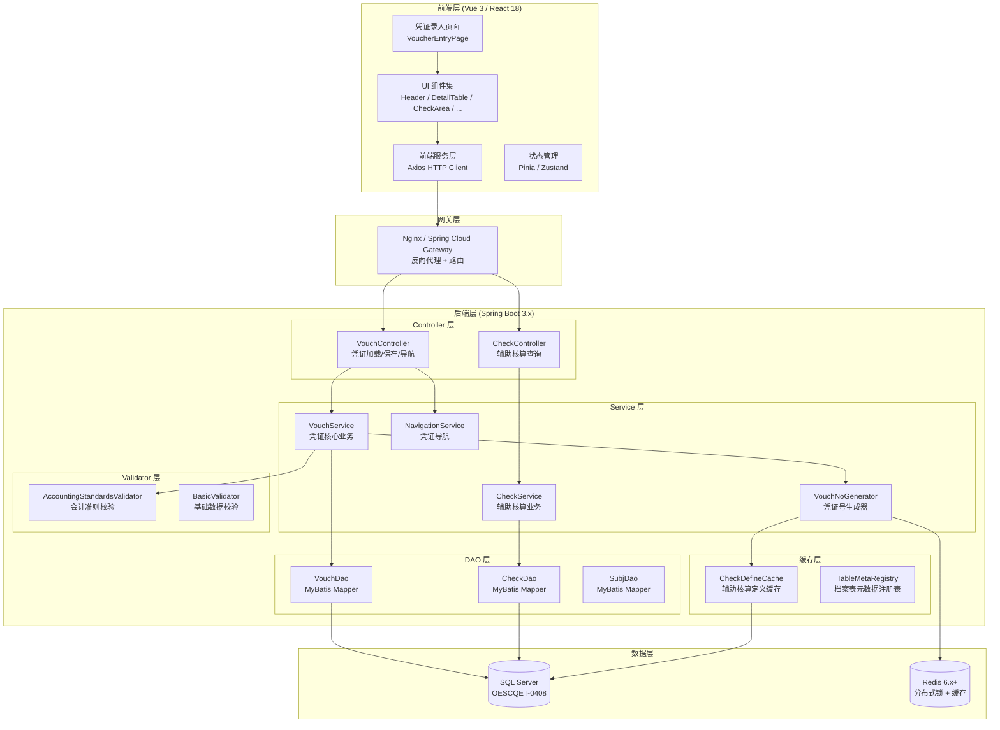

### 1.2 技术栈选型

| 层次       | 技术选型                               | 版本         | 说明                                                        |
| -------- | ---------------------------------- | ---------- | --------------------------------------------------------- |
| 前端框架     | Vue 3 / React 18                   | 3.x / 18.x | 与 OES 前端技术栈保持一致                                           |
| UI 组件库   | Element Plus / Ant Design          | 最新稳定版      | 专业凭证界面布局                                                  |
| HTTP 客户端 | Axios                              | 1.x        | 前后端通信                                                     |
| 状态管理     | Pinia / Zustand                    | 最新稳定版      | 凭证数据状态管理                                                  |
| 后端语言     | Java (OpenJDK)                     | 26         | 长期支持版本                                                    |
| 框架       | Spring Boot                        | 3.x        | 企业级应用框架                                                   |
| 构建工具     | Maven                              | **3.9.15** | v2.0 升级                                                   |
| 持久层      | MyBatis + Spring JDBC              | 最新稳定版      | OAS 原生 SQL 控制                                             |
| 数据库      | SQL Server                         | 2019+      | jdbc:sqlserver://127.0.0.1:1433;databaseName=OESCQET-0408 |
| 缓存       | Redis                              | 6.x+       | 分布式锁 + 数据缓存                                               |
| JSON     | Jackson                            | 最新稳定版      | 序列化/反序列化                                                  |
| 事务管理     | Spring @Transactional              | —          | 声明式事务                                                     |
| 测试       | JUnit 5 + Mockito + Testcontainers | —          | 单元集成测试                                                    |

### 1.3 包结构设计

```
com.oes.acct.vouch
├── controller
│   ├── VouchController.java          # 凭证加载、保存 REST API
│   ├── CheckController.java           # 辅助核算配置/选项 REST API
│   └── NavigationController.java      # 凭证导航 REST API
│
├── service
│   ├── VouchService.java             # 凭证三表保存核心业务
│   ├── CheckService.java              # 辅助核算解析与查询
│   ├── NavigationService.java         # 凭证导航逻辑
│   └── VouchNoGenerator.java          # 凭证号高并发生成
│
├── validator
│   ├── AccountingStandardsValidator.java  # 会计准则三级校验
│   └── BasicValidator.java                # 基础数据格式校验
│
├── dao
│   ├── VouchDao.java                 # acct_vouch + acct_vouch_detail 操作
│   ├── CheckDao.java                  # acct_check_items 操作
│   └── SubjDao.java                   # acct_subj + sys_check_define 查询
│
├── cache
│   ├── CheckDefineCache.java          # sys_check_define 全量内存缓存
│   └── TableMetaRegistry.java         # table_id 到列名的元数据映射
│
├── model
│   ├── entity
│   │   ├── AcctVouch.java            # acct_vouch 实体
│   │   ├── AcctVouchDetail.java      # acct_vouch_detail 实体
│   │   ├── AcctCheckItem.java        # acct_check_items 实体
│   │   ├── AcctSubj.java              # acct_subj 实体
│   │   └── SysCheckDefine.java        # sys_check_define 实体
│   ├── dto
│   │   ├── VouchSaveRequest.java     # 保存凭证请求 DTO
│   │   ├── VouchLoadResponse.java    # 加载凭证响应 DTO
│   │   ├── NavigationRequest.java    # 导航查询请求 DTO
│   │   ├── NavigationResult.java     # 导航查询结果 DTO
│   │   ├── SubjCheckConfig.java      # 科目辅助核算配置 DTO
│   │   └── CheckOption.java          # 辅助核算选项 DTO
│   └── vo
│       ├── VouchVO.java               # 凭证展示 VO
│       ├── DetailVO.java              # 分录展示 VO
│       ├── CheckItemVO.java           # 辅助核算回显 VO
│       └── OperatorInfoVO.java        # 操作人信息 VO
│
├── config
│   ├── TransactionConfig.java         # 事务配置
│   ├── RedisConfig.java               # Redis 连接配置
│   └── DataSourceConfig.java          # 数据源配置
│
├── common
│   ├── Result.java                    # 统一响应封装 {code, message, data}
│   ├── BusinessException.java         # 业务异常（含错误码）
│   ├── ErrorCode.java                 # 错误码枚举
│   └── OptimisticLockException.java   # 乐观锁异常
│
└── util
    ├── DynamicSQLBuilder.java         # 动态 SQL 拼接（档案表查询）
    └── TableMeta.java                 # 档案表元数据封装
```

***

## 2. 模块划分与职责

### 2.1 模块依赖关系

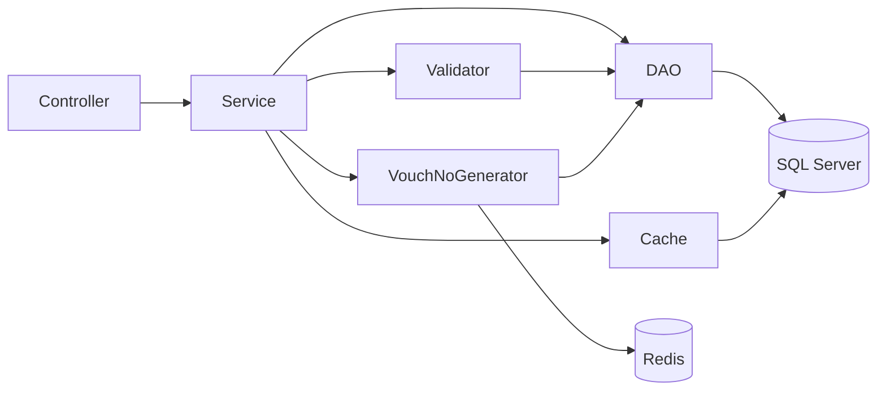

### 2.2 模块职责矩阵

| 模块                               | 核心职责                                  | 关键方法                                                                   |
| -------------------------------- | ------------------------------------- | ---------------------------------------------------------------------- |
| **VouchController**              | 凭证加载/保存接口入口，参数校验                      | `loadVouch()`, `saveVouch()`                                           |
| **CheckController**              | 辅助核算配置/选项查询接口                         | `getSubjChecks()`, `getCheckOptions()`                                 |
| **NavigationController**         | 凭证导航接口入口                              | `navigate()`                                                           |
| **VouchService**                 | 三表事务保存，操作人解析                          | `saveVouch()`, `resolveOperatorName()`                                 |
| **CheckService**                 | 辅助核算解析、回显、值存在性校验                      | `resolveSubjChecks()`, `loadCheckOptions()`, `resolveCheckItems()`     |
| **NavigationService**            | 上/下一张凭证查询（含作废排除）                      | `navigateVouch()`, `getSummaryPreview()`                               |
| **VouchNoGenerator**             | Redis 分布式锁/乐观锁双方案凭证号生成                | `nextVouchNoWithLock()`, `nextVouchNoWithOptimisticLock()`             |
| **AccountingStandardsValidator** | 三级 10 条会计准则校验                         | `validate()`                                                           |
| **CheckDefineCache**             | sys\_check\_define 全量缓存（启动加载 + 定时刷新）  | `init()`, `getCheckDefine()`, `refresh()`                              |
| **DynamicSQLBuilder**            | 根据 table\_id + where\_sql 参数化动态拼接 SQL | `buildQuerySQL()`, `resolveTableMeta()`                                |
| **OtherFzhsSettingService**      | **【v2.1 新增】其他辅助核算配置查询与解析**            | `getSettings()`, `getDictOptions()`                                    |
| **CascadeCheckService**          | **【v2.1 新增】辅助核算级联查询（含直接关联/中间表关联）**    | `cascadeCheck()`, `resolveDirectCascade()`, `resolveRelationCascade()` |

***

## 3. 核心类设计

### 3.1 VouchService 核心类

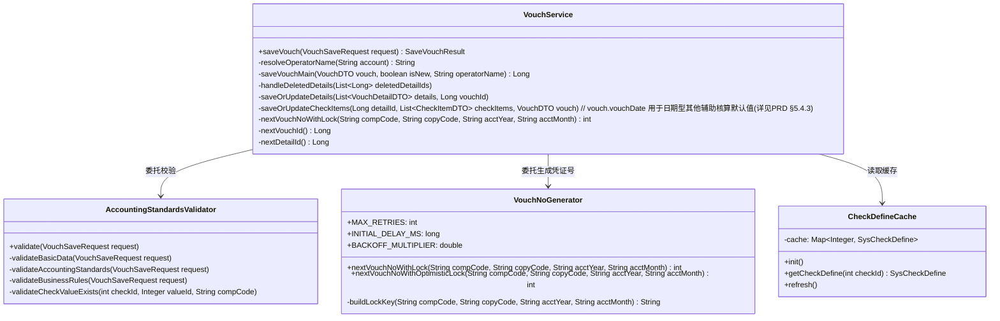

### 3.2 辅助核算解析核心类

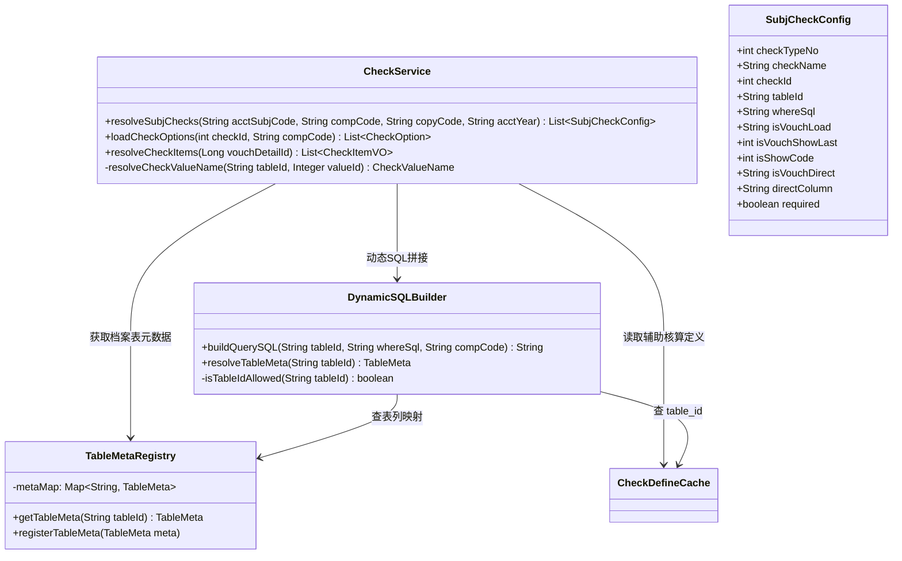

### 3.3 数据模型关系

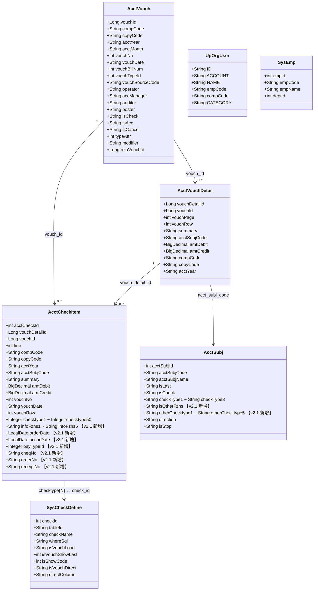

***

## 4. 数据库设计

### 4.1 核心表关系 ER 图

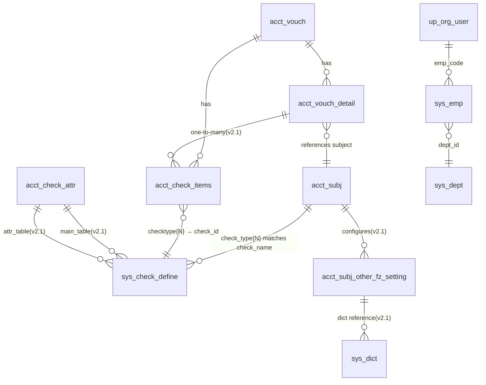

### 4.2 关键索引设计

```sql
-- acct_vouch 表索引
CREATE INDEX IX_acct_vouch_comp_copy_year_month
    ON acct_vouch (comp_code, copy_code, acct_year, acct_month, vouch_no)
    INCLUDE (vouch_id, vouch_date, operator, is_check, is_acc, is_cancel);

-- acct_vouch_detail 表索引
CREATE INDEX IX_acct_vouch_detail_vouch_id
    ON acct_vouch_detail (vouch_id)
    INCLUDE (vouch_detail_id, vouch_page, vouch_row, acct_subj_code, amt_debit, amt_credit);

-- acct_check_items 表索引
CREATE INDEX IX_acct_check_items_vouch_id
    ON acct_check_items (vouch_id)
    INCLUDE (vouch_detail_id, acct_check_id);

CREATE INDEX IX_acct_check_items_vouch_detail_id
    ON acct_check_items (vouch_detail_id);

-- acct_subj 表索引
CREATE INDEX IX_acct_subj_code_comp_copy_year
    ON acct_subj (acct_subj_code, comp_code, copy_code, acct_year)
    INCLUDE (acct_subj_name, is_last, is_check, check_type1, check_type2,
             check_type3, check_type4, check_type5, check_type6, check_type7, check_type8);

-- 【v2.1 新增】acct_subj_other_fz_setting 表索引
CREATE UNIQUE INDEX uk_subj_fzhs
    ON acct_subj_other_fz_setting (acct_subj_code, other_fzhs_idx, comp_code, copy_code, acct_year);

CREATE INDEX idx_subj_query
    ON acct_subj_other_fz_setting (acct_subj_code, comp_code, copy_code, acct_year)
    INCLUDE (input_type, dict_type, dict_name, is_show, is_require);

CREATE INDEX idx_show_filter
    ON acct_subj_other_fz_setting (is_show, comp_code, copy_code, acct_year);

-- 【v2.1 新增】acct_check_attr 表索引
CREATE INDEX IX_acct_check_attr_main_table
    ON acct_check_attr (main_table_id)
    INCLUDE (attr_table_id, attr_field_code, check_field_code, attr_show_name);

CREATE INDEX IX_acct_check_attr_attr_table
    ON acct_check_attr (attr_table_id)
    INCLUDE (main_table_id, main_field_code, attr_field_code, attr_show_name);
```

### 4.3 vouch\_no 序列化生成策略

凭证号生成规则：按 `comp_code + copy_code + acct_year + acct_month` 维度，**每月从 1 开始累计 +1**。

```
vouch_no 生成算法（无持久化序列号表方案）

当前月最大号查询:
  SELECT ISNULL(MAX(vouch_no), 0) FROM acct_vouch
  WHERE comp_code = :compCode
    AND copy_code = :copyCode
    AND acct_year = :acctYear
    AND acct_month = :acctMonth

新号计算:
  newVouchNo = maxVouchNo + 1
```

> **设计决策说明**：不使用独立序列号表的原因是：(1) 凭证号仅在 INSERT 时确定，不存在预占号场景；(2) 分布式锁保证了 MAX+1 的原子性；(3) 减少一次额外的 INSERT 操作，降低事务复杂度。

***

## 5. 接口详细设计

### 5.1 接口一览

| 方法     | 路径                              | 说明                   | 事务性   |
| ------ | ------------------------------- | -------------------- | ----- |
| `GET`  | `/oes-acct-vouch`               | 加载凭证编辑页数据（无登录 + 双模式） | 否     |
| `POST` | `/oes-acct-vouch/save`          | 保存凭证（三表联动）           | **是** |
| `GET`  | `/oes-acct-vouch/subj/checks`   | 查询科目辅助核算配置           | 否     |
| `GET`  | `/oes-acct-vouch/check/options` | 查询辅助核算可选档案数据         | 否     |
| `GET`  | `/oes-acct-vouch/navigation`    | 凭证导航（上/下一张）          | 否     |

### 5.2 接口时序图

#### 5.2.1 凭证加载流程

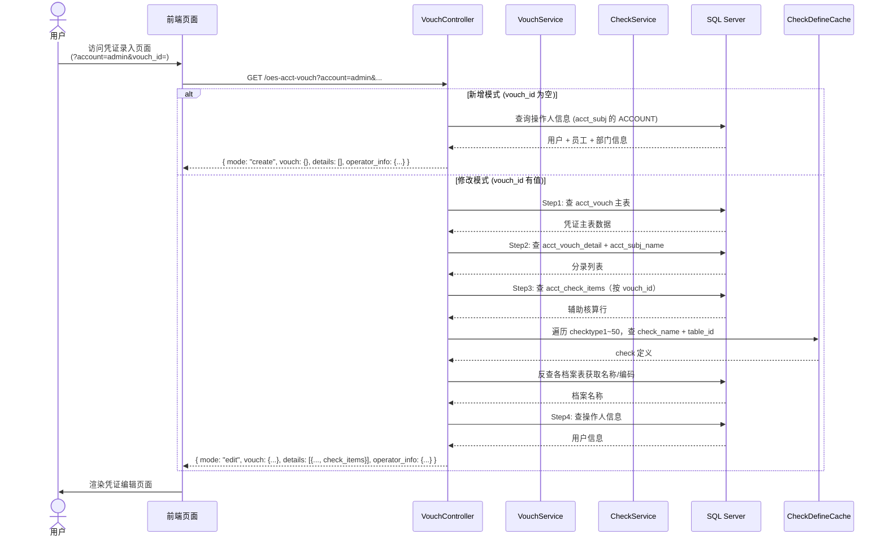

#### 5.2.2 凭证保存流程

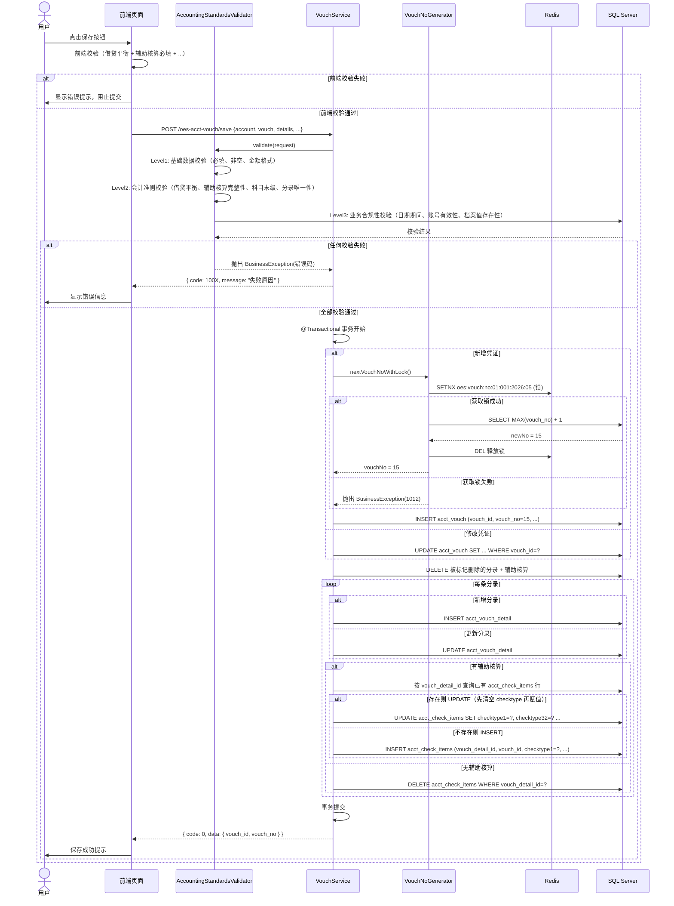

#### 5.2.3 科目选择 → 辅助核算动态渲染流程

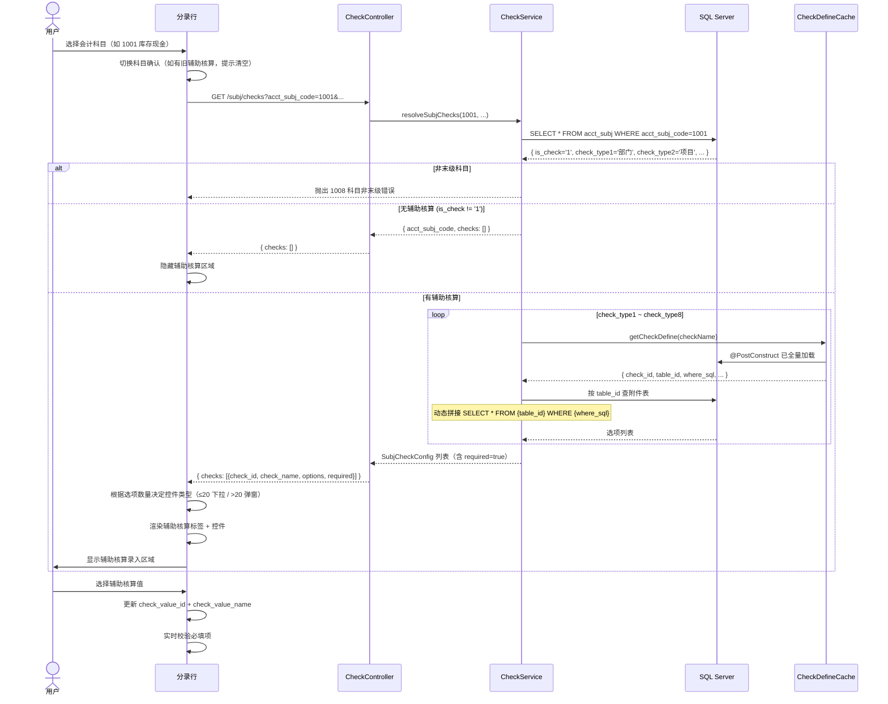

### 5.3 凭证导航接口设计

#### 5.3.1 导航查询优化策略

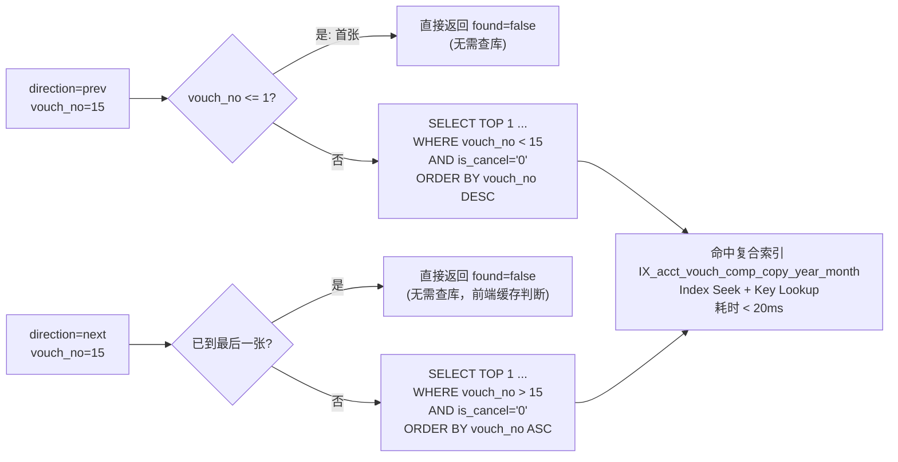

***

## 6. 核心流程设计

### 6.1 凭证号生成 — 双方案策略

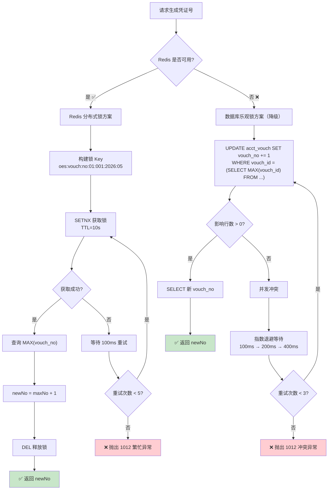

### 6.2 会计准则三级校验体系

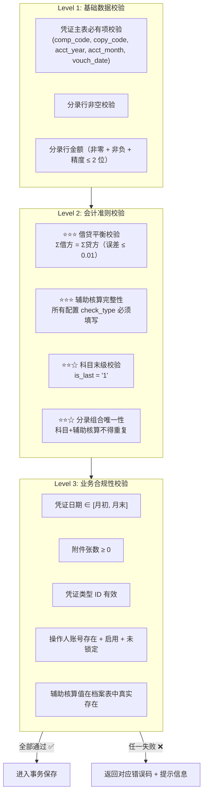

### 6.3 【v2.1 重大调整】辅助核算 — 一对多行存储模型

> **⚠️ v2.1 Critical 变更**：从"一笔分录一行"（一对一）调整为"一笔分录多行"（一对多）。
> 标准辅助核算占一行（Line=1），每个其他辅助核算各占一行（Line=2\~N）。
> **表间 ER 关系参见 §4.1 核心表关系 ER 图**，本图仅展示一对多模型的数据内容示例。

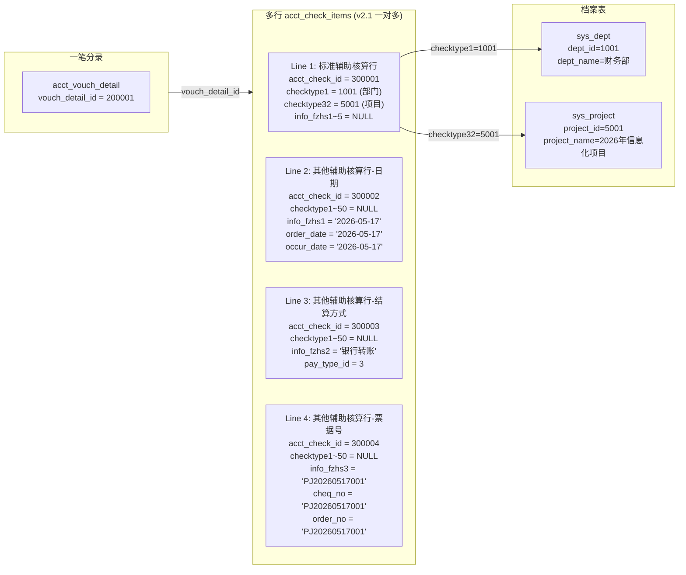

**【v2.1】一对多行存储模型设计要点**：

1. 一个 `vouch_detail_id` 对应 **零到多行** `acct_check_items`
2. **Line=1**：标准辅助核算行，`checktype1~50` 存储标准辅助核算值，`info_fzhs1~5` 保持 NULL
3. **Line≥2**：其他辅助核算行（每行对应一个 other\_checktype），`checktype1~50` 全部 NULL，仅使用 `info_fzhs1~5` 及特殊业务字段
4. `checktype{N}` 中的 `N` 对应 `sys_check_define.check_id`
5. 标准辅助核算未使用的 `checktype` 字段保持 `NULL`
6. 保存时：全量替换策略 — `DELETE WHERE vouch_detail_id=?` + 批量 INSERT 所有行（Line=1 及 Line≥2）
7. 回显时：按 `vouch_detail_id` 查出所有行，按 `line` 排序，区分标准行（line=1）和其他行（line≥2）
8. 推荐复合索引：`(vouch_detail_id, line)` 覆盖所有按分录查询辅助核算并按行号排序的场景

### 6.4 用户 → 员工 → 部门三级关联链路

```
前端传入 account = 'admin'
         │
         ▼
up_org_user.ACCOUNT = 'admin'     ← 使用 ACCOUNT 字段（唯一约束）
         │
         ├── up_org_user.NAME = '张三'    → acct_vouch.operator
         │
         └── up_org_user.emp_code = 'E001'
                    │
                    ▼
         sys_emp.emp_code = 'E001'
         sys_emp.emp_id = 100
         sys_emp.emp_name = '张三'
                    │
                    ▼
         sys_emp.dept_id = 1001
                    │
                    ▼
         sys_dept.dept_id = 1001
         sys_dept.dept_code = 'D001'
         sys_dept.dept_name = '财务部'
```

> **关联 SQL**：见 PRD §9.2 Step4，使用 `LEFT JOIN` 三级关联，确保用户表为主表。

***

## 7. 前端组件设计

### 7.1 组件树与状态管理

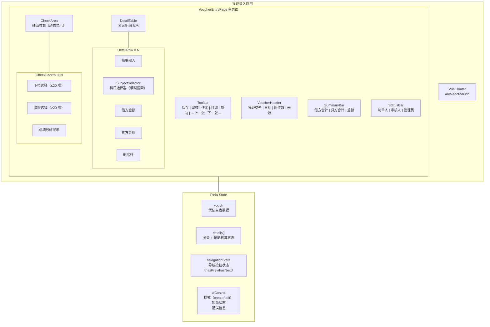

### 7.2 前端状态数据结构

```typescript
// 凭证录入页面全局状态 (Pinia Store)
interface VouchEntryState {
  // 访问模式
  mode: 'create' | 'edit';

  // 操作人信息
  account: string;
  operatorInfo: OperatorInfo | null;

  // 凭证主表表单
  vouchForm: {
    vouch_id: number | null;
    comp_code: string;
    copy_code: string;
    acct_year: string;
    acct_month: string;
    vouch_no: number | null;
    vouch_date: string;
    vouch_bill_num: number;
    vouch_type_id: number;
    vouch_source_code: string;
    operator: string;
    acc_manager: string | null;
    type_attr: number;
  };

  // 分录列表
  details: DetailRowState[];

  // 被删除的 ID 列表（标记删除，提交时传给后端）
  deletedDetailIds: number[];
  deletedCheckIds: number[];

  // 导航状态
  navigationState: {
    hasNext: boolean;
    hasPrev: boolean;
    isLoading: boolean;
  };

  // UI 状态
  uiControl: {
    loading: boolean;
    saving: boolean;
    errors: string[];
    showCheckArea: boolean;
  };
}

// 分录行状态（含辅助核算）
interface DetailRowState {
  vouch_detail_id: number | null;
  vouch_page: number;
  vouch_row: number;
  summary: string;
  acct_subj_code: string;
  acct_subj_name: string;
  amt_debit: number;
  amt_credit: number;

  // 当前科目绑定的辅助核算配置（从接口获取）
  checks: SubjCheckConfigDTO[];
  // 当前辅助核算控件的运行时状态
  checkControls: CheckControlState[];
}

// 辅助核算控件运行时状态
interface CheckControlState {
  check_id: number;
  check_name: string;
  check_type_no: number;
  control_type: 'select' | 'dialog';
  options: CheckOptionDTO[];
  selected_value_id: number | null;
  selected_value_name: string;
  required: boolean;        // v2.0: 全部 true
  validated: boolean;       // v2.0: 是否已校验
}

// 操作人信息
interface OperatorInfo {
  account: string;
  name: string;
  user_id: string;
  emp_code: string;
  emp_id: number;
  emp_name: string;
  dept_id: number;
  dept_code: string;
  dept_name: string;
  dept_name_all: string;
  category: string;
}
```

### 7.3 前端 — 科目选中的联动流程

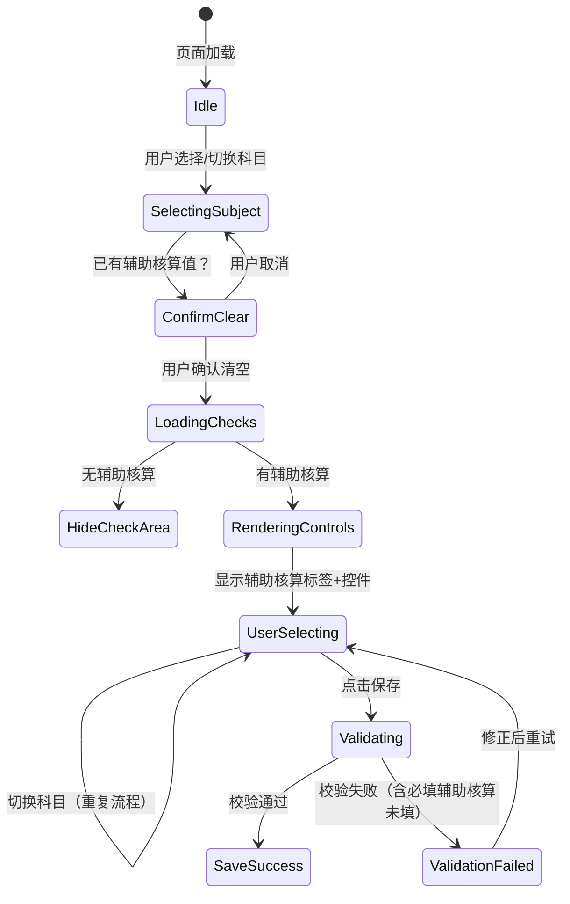

***

## 8. 异常处理与错误码

### 8.1 错误码枚举定义

```java
public enum ErrorCode {
    SUCCESS(0, "成功"),

    // Level1: 基础数据校验错误 (1001~1007)
    IMBALANCE(1001, "借贷不平衡"),
    VOUCH_DATA_INVALID(1002, "凭证主表数据校验失败"),
    DETAIL_EMPTY(1003, "分录行为空"),
    CHECK_REQUIRED_MISSING(1004, "必填辅助核算未填写"),
    DB_EXCEPTION(1005, "数据库异常"),
    PARAM_INVALID(1006, "参数校验失败"),
    VOUCH_NOT_FOUND(1007, "凭证不存在"),

    // Level2: 会计准则校验错误 (1008~1011)
    SUBJECT_NOT_LEAF(1008, "科目非末级"),
    AMOUNT_INVALID(1009, "金额非法（负数或超精度）"),
    DATE_OUT_OF_RANGE(1010, "凭证日期不在会计期间内"),
    DUPLICATE_COMBINATION(1011, "会计准则校验失败（分录组合重复）"),

    // Level3: 并发/系统错误 (1012)
    VOUCH_NO_CONFLICT(1012, "凭证号生成冲突");

    private final int code;
    private final String message;

    // getters...
}
```

### 8.2 异常处理策略

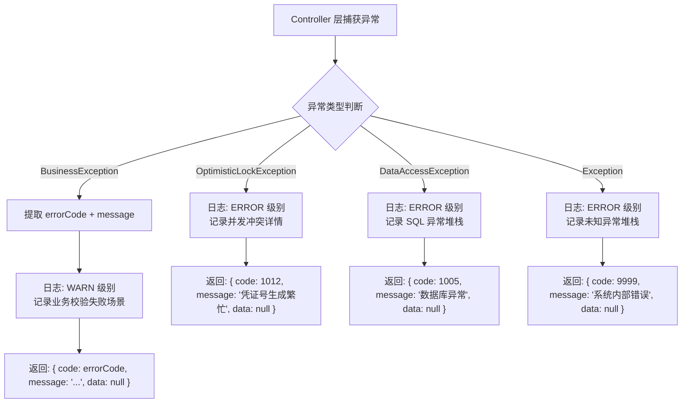

### 8.3 事务回滚策略

| 场景                 | 回滚触发条件              | 回滚范围       | 幂等处理               |
| ------------------ | ------------------- | ---------- | ------------------ |
| 会计准则校验失败           | 任意 AC-01\~AC-10 未通过 | 不开启事务，无需回滚 | —                  |
| 凭证号生成冲突（Redis 锁超时） | 获取锁失败或等待超时          | 不开启事务，无需回滚 | 前端重试               |
| 凭证号生成冲突（乐观锁用尽）     | 3 次重试均失败            | 不开启事务，无需回滚 | 前端重试               |
| 主表 INSERT 失败       | SQLException        | 全部回滚       | 无（vouch\_id 是新生成的） |
| 分录 INSERT 失败       | SQLException        | 全部回滚       | 无                  |
| 辅助核算保存失败           | SQLException        | 全部回滚       | 无                  |
| 数据库连接超时            | DataAccessException | 全部回滚       | 前端提示重试             |

***

## 9. 安全设计

### 9.1 SQL 注入防护

```java
// ❌ 禁止：字符串拼接
String sql = "SELECT * FROM " + tableId + " WHERE " + whereSql; // 危险！

// ✅ 正确：白名单 + 参数化绑定
public String buildQuerySQL(String tableId, String whereSql, String compCode) {
    // 1. 白名单校验 table_id
    if (!tableMetaRegistry.contains(tableId)) {
        throw new BusinessException(1006, "非法的辅助核算表名: " + tableId);
    }

    // 2. 使用参数化占位符
    StringBuilder sql = new StringBuilder();
    sql.append("SELECT id, code, name FROM ").append(sanitizeTableName(tableId));
    if (whereSql != null && !whereSql.trim().isEmpty()) {
        // 仅允许预定义的占位符格式
        String resolved = whereSql
            .replace(":compCode", "?")   // 参数化
            .replace(":copyCode", "?")
            .replace(":acctYear", "?");
        sql.append(" WHERE ").append(resolved);
    }
    return sql.toString();
}
```

### 9.2 无登录访问安全策略

```
┌──────────────────────────────────────────────────────────────┐
│                    无登录访问安全控制矩阵                        │
├──────────────────────────────────────────────────────────────┤
│  1. account 参数校验                                          │
│     ├── 格式: 仅允许字母数字下划线，长度 ≤ 32                    │
│     ├── 存在性: 在 up_org_user 中真实存在                      │
│     ├── 启用态: ACCOUNT_ENABLED = '1'                        │
│     └── 锁定态: ACCOUNT_LOCKED = '0'                         │
│                                                              │
│  2. 敏感操作二次确认                                           │
│     ├── 删除分录 → 前端弹窗确认                                │
│     ├── 作废凭证 → 前端弹窗确认 + 后端记录操作日志               │
│     └── 修改已审核凭证 → 前端弹警告 + 后端校验 is_check=0        │
│                                                              │
│  3. 防滥用措施                                                │
│     ├── 请求频率限制 (Rate Limiting) — Nginx 层               │
│     └── 关键操作审计日志                                       │
└──────────────────────────────────────────────────────────────┘
```

### 9.3 并发安全控制

| 场景           | 风险       | 控制手段                      |
| ------------ | -------- | ------------------------- |
| 凭证号生成        | 重复号 / 断号 | Redis 分布式锁（主）+ 乐观锁（备）     |
| 三表事务保存       | 部分写入     | @Transactional 声明式事务      |
| 辅助核算行 UPDATE | 覆盖其他并发写入 | OES 行模型保证一条分录只对应一行        |
| 凭证导航         | 幻读       | READ COMMITTED + 前端缓存过期策略 |

***

## 10. 部署架构

### 10.1 部署拓扑

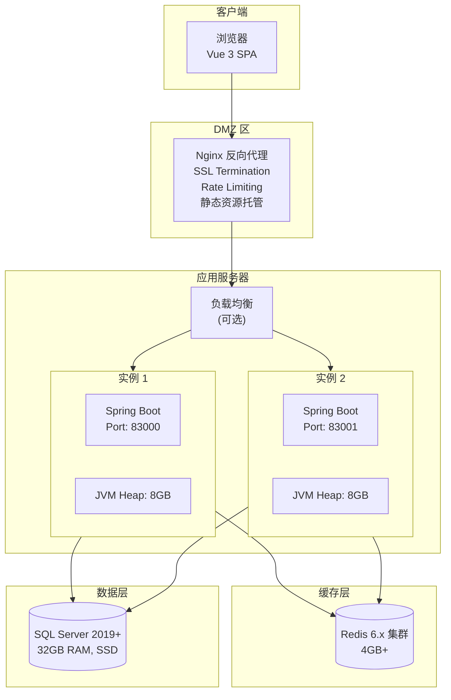

### 10.2 关键配置项

```yaml
# application.yml
server:
  port: 83000

spring:
  datasource:
    url: jdbc:sqlserver://127.0.0.1:1433;databaseName=OESCQET-0408;encrypt=false
    username: oes_app
    password: ${DB_PASSWORD}
    hikari:
      maximum-pool-size: 20
      minimum-idle: 5
      connection-timeout: 30000
      idle-timeout: 600000

  redis:
    host: ${REDIS_HOST:127.0.0.1}
    port: 6379
    timeout: 3000
    lettuce:
      pool:
        max-active: 16
        max-idle: 8
        min-idle: 4

# 凭证模块自定义配置
oes:
  acct:
    vouch:
      vouch-no:
        redis-lock-ttl: 10000        # Redis 锁持有时间 (ms)
        redis-lock-wait: 5000         # Redis 锁等待超时 (ms)
        redis-lock-retry-delay: 100   # Redis 锁重试间隔 (ms)
        redis-lock-max-retries: 5     # Redis 锁最大重试次数
        optimistic-lock-max-retries: 3          # 乐观锁最大重试次数
        optimistic-lock-initial-delay-ms: 100   # 乐观锁初始退避 (ms)
        optimistic-lock-backoff-multiplier: 2.0 # 乐观锁指数退避倍数
      validation:
        balance-tolerance: 0.01       # 借贷平衡允许误差
        enabled: true                 # 会计准则校验开关
```

***

## 附录

### A. 设计决策记录 (ADR)

| 编号     | 决策           | 选项                                               | 选择理由                                                                                                           |
| ------ | ------------ | ------------------------------------------------ | -------------------------------------------------------------------------------------------------------------- |
| ADR-01 | **凭证号生成方案**  | Redis 分布式锁 vs 乐观锁 vs 数据库序列                       | Redis 锁性能高、实现简单、无断号；乐观锁作为降级方案                                                                                  |
| ADR-02 | **辅助核算存储模型** | 行模型（checktype1\~50 在同一行） vs 列模型（每个 checktype 一行） | OES 原生行模型，必须遵循；**v2.1 升级为一对多模型**：标准辅助核算一行（Line=1）+ 其他辅助核算每项单独一行（Line=2\~N），通过 line 字段区分记录类型，在保持一行的紧凑性同时支持多维度扩展 |
| ADR-03 | **无登录访问设计**  | account 参数传递 vs Session/Cookie                   | 满足无需登录需求，减少 Session 管理复杂度；需加强参数校验                                                                              |
| ADR-04 | **前端技术栈**    | Vue 3 vs React 18                                | 与 OES 现有前端技术栈保持一致，具体由项目决定                                                                                      |
| ADR-05 | **缓存策略**     | @PostConstruct 全量加载 sys\_check\_define           | 数据量小（<200 条），全量加载内存开销低；定时刷新保证一致性                                                                               |
| ADR-06 | **事务范围**     | 单 Service 方法 @Transactional 包裹完整保存               | 保证三表原子性；避免跨 Service 调用导致的连接数膨胀                                                                                 |

### B. 与 PRD 章节映射表

| PRD 章节      | 设计文档对应章节           | 设计覆盖内容                |
| ----------- | ------------------ | --------------------- |
| §4 数据库表结构   | §4 数据库设计           | 索引设计、ER 图、序列化策略       |
| §5 核心业务匹配规则 | §6.3 §6.4          | 行存储模型、三级关联链路          |
| §6 功能需求     | §2.2 模块职责矩阵        | P0/P1 功能到模块的映射        |
| §7 API 接口   | §5 接口详细设计          | 时序图、请求/响应结构           |
| §8 字段映射     | §3.3 数据模型关系        | 类关系图、字段映射说明           |
| §9 后端逻辑     | §3 核心类设计 + §6 核心流程 | 类图、vouch\_no 流程图、校验体系 |
| §10 前端逻辑    | §7 前端组件设计          | 组件树、状态管理、联动流程         |
| §11 非功能需求   | §8 安全设计 + §9 部署架构  | SQL 注入防护、并发控制、部署拓扑    |

### C. 核心算法复杂度分析

| 操作            | 时间复杂度           | 空间复杂度    | 说明                      |
| ------------- | --------------- | -------- | ----------------------- |
| 凭证加载（修改模式）    | O(N + M)        | O(N + M) | N=分录数, M=辅助核算项数         |
| 凭证保存          | O(N + K)        | O(N + K) | N=分录数, K=check\_items 数 |
| 凭证号生成 (Redis) | O(1)            | O(1)     | SETNX + MAX 查询          |
| 凭证号生成 (乐观锁)   | O(R)            | O(1)     | R=重试次数(≤3)              |
| 凭证导航          | O(1)            | O(1)     | TOP 1 索引查询              |
| 辅助核算解析        | O(8)            | O(8)     | 固定遍历 check\_type1\~8    |
| 辅助核算选项加载      | O(P)            | O(P)     | P=档案表记录数                |
| 会计准则校验        | O(N + N\*C + 1) | O(N\*C)  | N=分录数, C=每分录辅助核算数       |

> **文档结束**
>
> 本文档基于 PRD v2.0 (0001-oes-acct-vouch-req-prd-by-deepseek) 进行系统设计，覆盖架构设计、模块划分、类设计、数据库设计、接口设计、核心流程、前端组件、异常处理、安全设计和部署架构十大维度。所有设计均严格遵循 OES 原生规范和 PRD 要求。

