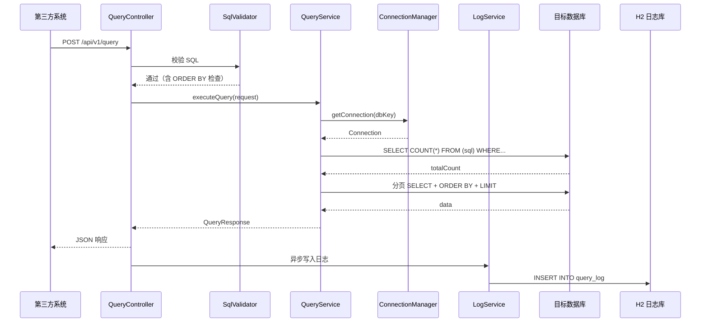
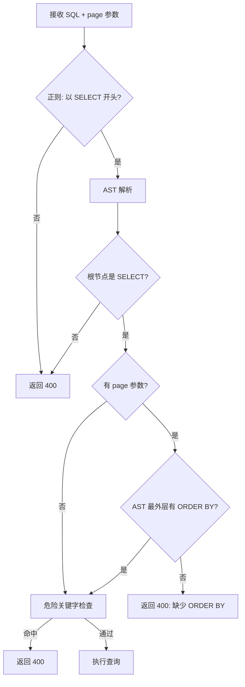
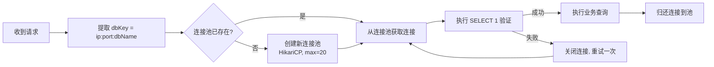

# 数据库查询 JSON 接口工具 — 技术设计方案

**文档编号**: 0001-design  
**版本**: v1.5  
**创建日期**: 2026-05-20  
**关联 PRD**: docs/0001-view-to-api-prd.md (v2.1)  

---

## 1. 总体架构

### 1.1 架构分层

```mermaid
graph TB
    subgraph "Spring Boot 应用（同一 JAR）"
        subgraph "前端 (React SPA, 内置于 static/)"
            LQ[日志查询页 /logs]
            EQ[错误查询页 /errors]
            DH[概览页 /]
        end

        subgraph "后端接口层"
            QAPI[/api/v1/query]
            ALOGS[/api/v1/admin/logs]
            AERR[/api/v1/admin/errors]
            ASTATS[/api/v1/admin/stats]
        end

        subgraph "业务层"
            QS[QueryService]
            SS[SqlValidator]
            LS[LogService]
            PS[PageService]
            CS[ConnectionManager]
        end

        subgraph "数据层"
            H2[(H2 日志库)]
        end
    end

    subgraph "目标数据库"
        T_MySQL[(MySQL)]
        T_SQLServer[(SQL Server)]
        T_Oracle[(Oracle)]
    end

    LQ --> ALOGS & AERR
    DH --> ASTATS
    QAPI --> QS
    QS --> SS & PS & CS
    QS --> LS
    LS --> H2
    CS --> T_MySQL & T_SQLServer & T_Oracle
```

### 1.2 模块职责

| 模块 | 职责 | 关键类 |
|------|------|--------|
| controller | REST 接口入口，参数校验 | `QueryController`, `AdminController` |
| service | 核心业务逻辑 | `QueryService`, `LogService`, `PageService` |
| security | SQL 安全校验 | `SqlValidator`, `SqlParserWrapper` |
| connection | 数据库连接管理 | `ConnectionPoolManager`, `DatabaseConnector` |
| model | 实体与 DTO | `QueryRequest`, `QueryResponse`, `QueryLog` |
| repository | 日志持久化 | `QueryLogRepository` |
| config | 全局配置 | `AppConfig`, `CorsConfig`, `HikariCpConfig` |

---

## 2. 后端设计

### 2.1 包结构

```
com.etyy.querytool
├── config
│   ├── AppConfig.java              -- 应用全局配置
│   ├── CorsConfig.java             -- CORS 跨域配置
│   └── HikariCpConfig.java         -- HikariCP 连接池配置
├── controller
│   ├── QueryController.java        -- /api/v1/query 查询接口
│   └── AdminController.java        -- /api/v1/admin/* 管理接口
├── service
│   ├── QueryService.java           -- 查询执行主逻辑
│   ├── LogService.java             -- 日志异步写入与查询
│   ├── PageService.java            -- 分页 SQL 构建
│   └── ConnectionManager.java      -- 动态连接池管理
├── security
│   ├── SqlValidator.java           -- SQL 校验器
│   └── SqlParserWrapper.java       -- JSqlParser 封装
├── model
│   ├── dto
│   │   ├── QueryRequest.java       -- 查询请求 DTO
│   │   ├── QueryResponse.java      -- 查询响应 DTO
│   │   ├── PageParam.java          -- 分页参数 VO
│   │   ├── LogQueryRequest.java    -- 日志查询参数 DTO
│   │   └── StatsResponse.java      -- 统计响应 DTO
│   └── entity
│       └── QueryLog.java           -- 日志实体
├── repository
│   └── QueryLogRepository.java     -- H2 日志 DAO（JdbcTemplate）
├── runner
│   └── DataInitializer.java        -- 启动时建表
├── static                           -- 前端构建产物（React SPA）
│   ├── index.html
│   ├── assets/                      -- JS/CSS 打包文件
│   └── ...
└── QueryToolApplication.java       -- Spring Boot 入口
```

### 2.2 核心接口定义

#### 2.2.1 QueryController

```java
@RestController
@RequestMapping("/api/v1")
public class QueryController {

    @PostMapping("/query")
    public ResponseEntity<QueryResponse> query(@RequestBody @Valid QueryRequest request) {
        // 1. SQL 安全校验（含分页 ORDER BY 检查）
        // 2. 获取或创建连接池
        // 3. 执行 COUNT 查询（剥离 ORDER BY）
        // 4. 执行分页查询
        // 5. 异步写入日志
        // 6. 组装响应
    }
}
```

#### 2.2.2 AdminController

```java
@RestController
@RequestMapping("/api/v1/admin")
public class AdminController {

    @GetMapping("/logs")         // 日志列表
    public ResponseEntity<ApiResponse<PageResult<QueryLog>>> listLogs(LogQueryRequest request) { }

    @GetMapping("/errors")       // 错误列表（status=fail）
    public ResponseEntity<ApiResponse<PageResult<QueryLog>>> listErrors(LogQueryRequest request) { }

    @GetMapping("/logs/{id}")    // 日志详情（含完整 SQL）
    public ResponseEntity<ApiResponse<QueryLog>> getLogDetail(@PathVariable Long id) { }

    @GetMapping("/stats")        // 统计概览
    public ResponseEntity<ApiResponse<StatsResponse>> getStats() { }
}
```

### 2.3 查询流程时序



### 2.4 SQL 校验流程



**危险关键字定义**：

校验器在 AST 解析后对 SQL 进行关键字匹配，命中以下任一关键字则拒绝：

| 类别 | 关键字 |
|------|--------|
| DDL 语句 | `CREATE TABLE`、`ALTER TABLE`、`DROP TABLE`、`TRUNCATE TABLE`、`CREATE INDEX`、`DROP INDEX` |
| DML 写入语句 | `INSERT`、`UPDATE`、`DELETE`、`REPLACE`、`MERGE` |
| 存储过程与函数 | `EXEC`、`EXECUTE`、`CALL`、`CREATE PROCEDURE`、`CREATE FUNCTION` |
| 文件与系统操作 | `INTO OUTFILE`、`INTO DUMPFILE`、`LOAD DATA`、`LOAD FILE`、`xp_cmdshell`、`xp_exec`、`sys_exec`、`sp_configure`、`CREATE LINK` |
| 权限操作 | `GRANT`、`REVOKE`、`CREATE USER`、`ALTER USER` |

**匹配说明**：关键字匹配区分大小写（统一转大写后匹配），且只匹配完整单词（避免误杀 `"DELETE"` 出现在列名中的情况）。AST 解析器已经确保根节点为 SELECT，此处关键字检查作为兜底防线。

### 2.5 连接池管理策略



**连接池资源管控**：

为防止大量不同目标数据库导致系统资源耗尽，增加以下管控策略：

| 限制项 | 值 | 说明 |
|--------|-----|------|
| 单池最大连接数 | 20 | HikariCP maximumPoolSize，可配置 |
| 最大连接池数量 | 10 | 同时存在的连接池总数上限 |
| 全局最大总连接数 | 200 | 所有连接池连接数之和上限 |
| 空闲回收时间 | 10 分钟 | 连接池无任何请求后自动关闭释放 |
| 连接获取超时 | 10 秒 | connectionTimeout，超时抛出异常 |

**实现要点**：

- 使用 `ConcurrentHashMap<String, HikariDataSource>` 管理连接池，key 为 `ip:port:dbName`。
- 创建新池前检查总数是否达到上限，达到时返回 502 "目标数据库连接池已满"。
- 启动一个后台定时任务（ScheduledExecutorService，每 5 分钟执行），扫描所有连接池，关闭空闲超过 10 分钟且当前无活跃连接的池。

### 2.6 日志异步写入

```java
@Component
public class LogService {

    private static final int QUEUE_CAPACITY = 5000;
    private final ThreadPoolExecutor executor = new ThreadPoolExecutor(
        1, 5, 60L, TimeUnit.SECONDS,
        new LinkedBlockingQueue<>(QUEUE_CAPACITY),
        new ThreadPoolExecutor.CallerRunsPolicy()   // 队列满时由调用线程同步执行，保证不丢日志
    );

    public void writeLogAsync(QueryLog log) {
        // 队列使用率监控
        int queueSize = executor.getQueue().size();
        if (queueSize > QUEUE_CAPACITY * 0.8) {
            log.warn("日志写入队列使用率超过 80%: {}/{}", queueSize, QUEUE_CAPACITY);
        }
        executor.submit(() -> {
            // 使用独立 H2 连接写入
            jdbcTemplate.update("INSERT INTO query_log ...");
        });
    }
}
```

### 2.7 错误码枚举

```java
public enum ErrorCode {
    SUCCESS(200, "success", "操作成功"),
    PARAM_MISSING(400, "fail", "请求参数缺失"),
    JSON_PARSE_ERROR(400, "fail", "请求体不是合法的 JSON 格式"),
    UNSUPPORTED_DB_TYPE(400, "fail", "不支持的数据库类型"),
    NOT_SELECT_STATEMENT(400, "fail", "仅允许 SELECT 查询语句"),
    MISSING_ORDER_BY(400, "fail", "使用分页查询时 SQL 必须包含 ORDER BY 子句"),
    SQL_PARSE_ERROR(400, "fail", "SQL 语句无法解析"),
    DANGEROUS_SQL(400, "fail", "SQL 包含被禁止的操作"),
    CONNECTION_FAILED(502, "fail", "数据库连接失败"),
    QUERY_TIMEOUT(504, "fail", "查询执行超时"),
    RESULT_TOO_LARGE(422, "fail", "查询结果超过上限，请缩小查询范围"),
    LOG_NOT_FOUND(404, "fail", "日志记录不存在"),
    INVALID_PARAM(400, "fail", "参数格式错误");
}
```

---

## 3. 数据库设计

### 3.1 H2 日志表

```sql
CREATE TABLE query_log (
    id              BIGINT AUTO_INCREMENT PRIMARY KEY,
    request_time    TIMESTAMP   NOT NULL,
    client_ip       VARCHAR(45) NOT NULL,
    database_ip     VARCHAR(45) NOT NULL,
    database_port   INT         NOT NULL,
    database_type   VARCHAR(20) NOT NULL,
    database_name   VARCHAR(100) NOT NULL,
    sql_hash        VARCHAR(64) NOT NULL,
    sql_preview     VARCHAR(200),
    sql_full        TEXT,
    status          VARCHAR(10) NOT NULL,
    message         VARCHAR(500),
    duration_ms     INT NOT NULL DEFAULT 0,
    created_at      TIMESTAMP NOT NULL DEFAULT CURRENT_TIMESTAMP
);

CREATE INDEX idx_query_log_request_time ON query_log(request_time);
CREATE INDEX idx_query_log_client_ip ON query_log(client_ip);
CREATE INDEX idx_query_log_status ON query_log(status);
CREATE INDEX idx_query_log_database_type ON query_log(database_type);
```

### 3.2 自动清理策略

当日志表 `query_log` 的记录数超过 **400,000** 时，自动清理最旧的记录至 **300,000**。

> **注意**：清理 SQL 中的 `LIMIT` 子查询语法针对 H2 2.x 实现。若将来日志存储迁移至 MySQL，需适配 MySQL 的 `DELETE ... LIMIT` 语法。

```java
@Component
public class LogCleanupTask {

    @Value("${log.cleanup.threshold:400000}")
    private int threshold;

    @Value("${log.cleanup.target:300000}")
    private int targetCount;

    @Scheduled(fixedRate = 3600000)  // 每小时执行一次
    @Transactional(propagation = Propagation.REQUIRES_NEW)
    public void cleanOldLogs() {
        int currentCount = jdbcTemplate.queryForObject("SELECT COUNT(*) FROM query_log", Integer.class);
        if (currentCount > threshold) {
            int deleteCount = currentCount - targetCount;
            int deleted = jdbcTemplate.update(
                "DELETE FROM query_log WHERE id IN (" +
                "  SELECT id FROM query_log ORDER BY request_time ASC LIMIT ?" +
                ")", deleteCount);
            log.info("日志自动清理：删除 {} 条旧记录，当前剩余 {} 条", deleted, targetCount);
        }
    }
}
```

### 3.3 H2 配置

```yaml
spring:
  datasource:
    url: jdbc:h2:file:./data/query_log;DB_CLOSE_ON_EXIT=FALSE;MODE=MySQL
    driver-class-name: org.h2.Driver
    username: sa
    password:
  h2:
    console:
      enabled: false
```

---

## 4. 前端设计

### 4.0 视觉设计理念

| 维度 | 选择 |
|------|------|
| **审美方向** | **暗色工业精工风格（Dark Technical Refined）** |
| 灵感来源 | Linear + Sentry 融合，更深的暗色基底和梯度光效做差异化 |
| 记忆点 | 毛玻璃侧栏 + 表格行左侧渐变光晕装饰线 + 状态标签灯笼式辉光 |
| 色调 | 午夜深蓝基底（#0b0e14），冷色数据蓝（#3b82f6），琥珀警告（#f59e0b）|

### 4.1 设计令牌（CSS Variables）

```css
:root {
  --bg-page: #0b0e14;
  --bg-surface: #13161d;
  --bg-surface-hover: #1a1e28;
  --bg-sidebar: rgba(19, 22, 29, 0.85);
  --bg-input: #1a1e28;
  --border-subtle: rgba(255, 255, 255, 0.06);
  --border-default: rgba(255, 255, 255, 0.10);
  --border-accent: rgba(59, 130, 246, 0.25);
  --accent-blue: #3b82f6;
  --accent-blue-bright: #60a5fa;
  --accent-blue-subtle: rgba(59, 130, 246, 0.12);
  --accent-amber: #f59e0b;
  --success: #22c55e;
  --success-subtle: rgba(34, 197, 94, 0.12);
  --fail: #ef4444;
  --fail-subtle: rgba(239, 68, 68, 0.12);
  --text-primary: #e8edf5;
  --text-secondary: #8892a8;
  --text-tertiary: #525c72;
  --shadow-md: 0 4px 12px rgba(0, 0, 0, 0.4);
  --shadow-glow-blue: 0 0 20px rgba(59, 130, 246, 0.15);
  --radius-sm: 6px;
  --radius-md: 10px;
  --radius-lg: 14px;
}
```

### 4.2 字体体系

| 用途 | 字体 | 大小/行高 | 字重 | 字距 |
|------|------|-----------|------|------|
| 页面标题 | Plus Jakarta Sans | 24px / 32px | 700 | -0.02em |
| 区域标题 | Plus Jakarta Sans | 16px / 24px | 600 | -0.01em |
| 导航菜单 | Plus Jakarta Sans | 14px / 20px | 500 | normal |
| 表头文字 | DM Sans | 12px / 16px | 600 | 0.04em（大写）|
| 表体文字 | DM Sans | 13px / 20px | 400 | normal |
| 代码/SQL | JetBrains Mono | 12px / 18px | 400 | normal |
| 统计数字 | Plus Jakarta Sans | 28px / 36px | 700 | -0.03em |

字体栈：`"Plus Jakarta Sans", "DM Sans", "JetBrains Mono", sans-serif`

**字体加载方案**：

以上字体均非操作系统默认字体，需在构建时引入。推荐通过 npm 安装 Fontsource 包（体积小、支持子集化）：

```bash
npm install @fontsource/plus-jakarta-sans @fontsource/dm-sans @fontsource/jetbrains-mono
```

在 `main.tsx` 或 `App.tsx` 中全局引入：

```tsx
import "@fontsource/plus-jakarta-sans/400.css";
import "@fontsource/plus-jakarta-sans/500.css";
import "@fontsource/plus-jakarta-sans/600.css";
import "@fontsource/plus-jakarta-sans/700.css";
import "@fontsource/dm-sans/400.css";
import "@fontsource/dm-sans/600.css";
import "@fontsource/jetbrains-mono/400.css";
```

备选方案：在 `index.html` 中通过 Google Fonts CDN 引入（注意添加 `&display=swap` 避免 FOIT）。

### 4.3 项目文件结构（前后端一体化）

```
query-tool/
├── pom.xml
├── src/main/java/               -- Java 后端
│   └── com/etyy/querytool/
│       ├── controller/           -- QueryController, AdminController
│       ├── service/              -- QueryService, LogService, etc.
│       ├── security/             -- SqlValidator
│       ├── model/                -- DTO 和实体
│       ├── repository/           -- H2 DAO
│       ├── config/               -- CORS, HikariCP 配置
│       ├── runner/               -- DataInitializer
│       └── QueryToolApplication.java
├── src/main/resources/
│   ├── application.yml
│   ├── schema.sql                -- H2 DDL
│   └── static/                   -- React 构建产物（自动生成）
│       ├── index.html
│       └── assets/
├── src/main/frontend/            -- React 前端源码
│   ├── src/
│   │   ├── App.tsx               -- 路由配置
│   │   ├── pages/
│   │   │   ├── OverviewPage.tsx
│   │   │   ├── LogQueryPage.tsx
│   │   │   └── ErrorQueryPage.tsx
│   │   ├── components/
│   │   │   ├── SearchBar.tsx
│   │   │   ├── LogTable.tsx
│   │   │   └── LogDetailModal.tsx
│   │   ├── api/
│   │   │   └── admin.ts
│   │   └── types/
│   │       └── index.ts
│   ├── vite.config.ts            -- outDir: ../resources/static
│   ├── package.json
│   └── index.html
└── QueryToolApplication.java

<!-- 以下为替换后的完整第4节内容 -->

### 4.4 日志查询页布局（精确）

```
┌──────────────────────────────────────────────────────────────────┐
│  ▢ Qry              │  概览  日志查询  错误查询                  │
│                      │                                           │
│   ● 概览             │  日志查询                                 │
│   ● 日志查询         │  ┌─ 筛选卡片（毛玻璃） ────────────────┐  │
│   ● 错误查询         │  │ 时间 [近3天 ▼] [━━ 05-17 ~ 05-20 ━] │  │
│                      │  │ IP [━━━━━━━━] 状态[全部▼] 库[全部▼] │  │
│   ─────              │  │                    [🔍 查询]          │  │
│   v1.0               │  └──────────────────────────────────────┘  │
│                      │                                           │
│   侧栏 240px          │  共 156 条                                │
│   ─────────           │  ┌─────────────────────────────────────┐  │
│   毛玻璃表面           │  │ 执行状态 │ 执行时间    │ 耗时 │ 操作│ ←fixed│
│                      │  ├─────────────────────────────────────┤  │
│                      │  │ ✅ 成功  │ 05-20 14:30│ 100  │ ⋯   │  │
│                      │  │ ✅ 成功  │ 05-20 14:29│ 85   │ ⋯   │←scroll│
│                      │  │ ❌ 失败  │ 05-20 14:28│5000⚠ │ ⋯   │  │
│                      │  └─────────────────────────────────────┘  │
│                      │  ◀ 1  2  3 ... 8 ▶                        │
└──────────────────────────────────────────────────────────────────┘
```

### 4.5 表格视觉设计

#### 4.5.1 列定义与渲染

| 列标题 | 对齐 | 宽度 | 渲染说明 |
|--------|------|------|---------|
| 执行状态 | 居中 | 100px | 灯笼式辉光圆点 + 文字标签（绿底/红底，box-shadow 光晕）|
| 执行时间 | 居左 | 180px | `MM-DD HH:mm` 紧凑格式，hover Tooltip 显示完整时间 |
| 执行消息 | 居左 | 1fr | 单行截断省略号，hover Tooltip 全文 |
| 执行耗时 | 居右 | 100px | ≥1000ms 琥珀色 + ⚠ 图标加粗 |
| 查询结果 | 居中 | 100px | 蓝底圆角徽章 "42 条" |
| 其他元数据 | 居左 | 180px | "总 42 · 页 1/5" |
| 操作 | 居中 | 60px | `⋯` 更多按钮 → 弹出查看详情 |

#### 4.5.2 表格核心样式（暗色主题）

```css
/* 表头：全大写、半透明毛玻璃、sticky固定 */
.query-table thead th {
  font-family: 'DM Sans', sans-serif;
  font-size: 11px;
  font-weight: 600;
  text-transform: uppercase;
  letter-spacing: 0.06em;
  color: var(--text-secondary);
  background: rgba(19, 22, 29, 0.6);
  backdrop-filter: blur(4px);
  padding: 12px 16px;
  position: sticky;
  top: 0;
  z-index: 2;
  border-bottom: 1px solid var(--border-default);
}

/* 行：深色基底 + 左侧渐变光晕装饰线 */
.query-table tbody tr {
  background: var(--bg-surface);
  transition: background 0.15s ease;
}
.query-table tbody tr:hover {
  background: var(--bg-surface-hover);
}
.query-table tbody tr td:first-child {
  border-left: 2px solid transparent;
  background: linear-gradient(to right, rgba(59,130,246,0.06), transparent);
}
.query-table tbody tr:hover td:first-child {
  border-left-color: var(--accent-blue);
}

/* 状态标签灯笼式辉光 */
.status-dot--success {
  color: var(--success);
  background: var(--success-subtle);
  box-shadow: 0 0 8px rgba(34, 197, 94, 0.2);
}
.status-dot--fail {
  color: var(--fail);
  background: var(--fail-subtle);
  box-shadow: 0 0 8px rgba(239, 68, 68, 0.2);
}

/* 慢查询高亮 */
.duration-slow {
  color: var(--accent-amber);
  font-weight: 600;
}
.duration-slow::after { content: ' ⚠'; font-size: 11px; }
```

#### 4.5.3 固定表头 + 暗色主题

```tsx
<ConfigProvider theme={{
  algorithm: theme.darkAlgorithm,
  token: {
    colorPrimary: '#3b82f6',
    colorBgContainer: '#13161d',
    colorBorder: 'rgba(255,255,255,0.08)',
    colorText: '#e8edf5',
    colorTextSecondary: '#8892a8',
    borderRadius: 8,
  },
}}>
  <Table
    columns={columns}
    dataSource={data}
    scroll={{ y: 480 }}
    sticky={{ offsetHeader: 0 }}
    pagination={{ style: { marginTop: 16 } }}
  />
</ConfigProvider>
```

#### 4.5.4 空状态与加载态

| 状态 | 显示 |
|------|------|
| 空数据 | 居中 "暂无数据" + 灰色图标 |
| 加载中 | Spin 旋转动画覆盖表格区域 |
| 加载失败 | "数据加载失败，请重试" + 重试按钮 |
| 搜索无结果 | "未找到匹配的记录，请调整筛选条件" |

### 4.6 筛选栏

毛玻璃卡片容器，`backdrop-filter: blur(12px)` + 微弱蓝色辉光阴影。

控件：时间范围选择器（RangePicker，默认近3天，5个快捷选项）+ IP输入 + 状态Select + 库类型Select + 主色查询按钮。全部 `size="large"`。

### 4.7 统计卡片

4 列网格，每张卡片：

- 左上角 3px 渐变装饰线
- 灰色标签 + 28px/700 统计数字
- 底部渐变进度条
- hover 时边框发光 + 上移 1px
- 进入视口时数字从 0 动画到目标值

### 4.8 详情弹窗

700px 宽居中弹窗，毛玻璃遮罩（`backdrop-filter: blur(8px)`）。

- 信息网格：2 列布局，灰色标签 + 白色值
- 完整 SQL：深底代码块（JetBrains Mono, 12px, 可滚动）
- 查询结果：蓝色强调文字

### 4.9 动效设计

| 场景 | 效果 | 实现 |
|------|------|------|
| 页面加载 | 内容间隔 50ms 依次从下往上淡入 | CSS animation + animation-delay |
| 行 hover | 左侧边框蓝光 + 背景提亮 | CSS transition |
| 状态标记 | 呼吸式辉光脉冲 | @keyframes pulse + box-shadow |
| 统计数字 | 从 0 计数到目标值 | requestAnimationFrame |
| 弹窗 | 毛玻璃遮罩 fadeIn + content scale | CSS animation |
| 侧栏导航 | 选中项蓝色竖线 + 光晕 | CSS transition |

### 4.10 页面路由

```tsx
const routes = [
  { path: '/', element: <OverviewPage /> },
  { path: '/logs', element: <LogQueryPage /> },
  { path: '/errors', element: <ErrorQueryPage /> },
];
```

---

## 5. 前后端通信

### 5.1 Axios 实例

```ts
// 前后端同域（同一 JAR），baseURL 使用相对路径
const apiClient = axios.create({
  baseURL: '/api/v1',
  timeout: 30000,
  headers: { 'Content-Type': 'application/json' }
});

apiClient.interceptors.response.use(
  response => response.data,
  error => {
    message.error(error.response?.data?.message || '请求失败');
    return Promise.reject(error);
  }
);
```

### 5.2 管理端 API 封装

```ts
export const adminApi = {
  getLogs(params): Promise<PageResult<QueryLog>> {
    return apiClient.get('/admin/logs', { params });
  },
  getErrors(params): Promise<PageResult<QueryLog>> {
    return apiClient.get('/admin/errors', { params });
  },
  getLogDetail(id): Promise<QueryLog> {
    return apiClient.get(`/admin/logs/${id}`);
  },
  getStats(): Promise<StatsResponse> {
    return apiClient.get('/admin/stats');
  }
};
```

### 5.3 参数映射

| 前端字段 | API 参数 | 说明 |
|---------|---------|------|
| 查询时间起始 | start_time | yyyy-MM-dd HH:mm:ss |
| 查询时间结束 | end_time | yyyy-MM-dd HH:mm:ss |
| 请求 IP | client_ip | 模糊匹配 |
| 状态 | status | success/fail/空 |
| 数据库类型 | database_type | mysql/sqlserver/oracle/空 |
| 页码 | page_number | 默认 1 |
| 每页数量 | page_size | 默认 20 |

---

## 6. 测试策略

### 6.1 单元测试

| 测试目标 | 框架 | 覆盖范围 |
|---------|------|---------|
| SqlValidator | JUnit 5 + Mockito | SQL 校验全路径：合法 SELECT、非 SELECT 拒绝、ORDER BY 缺失检测、危险关键字命中、注释绕过、多语句检测 |
| PageService | JUnit 5 | 三库分页 SQL 构建正确性、COUNT 剥离 ORDER BY、OFFSET 计算 |
| LogService | JUnit 5 + Mockito | 异步写入、队列满饱和策略、异常处理 |
| ConnectionManager | JUnit 5 | 连接池创建/复用/回收、池数量上限、空闲关闭 |

**目标覆盖率**：核心 service 层 ≥ 90%，整体项目 ≥ 75%。

### 6.2 集成测试

| 测试目标 | 框架 | 说明 |
|---------|------|------|
| QueryController | Spring Boot Test + MockMvc | 模拟完整 HTTP 请求，验证 JSON 输入输出格式 |
| AdminController | Spring Boot Test + MockMvc | 日志查询、错误查询、统计接口的正确性 |
| H2 日志持久化 | Spring Boot Test + @DataJpaTest | 日志表写入与查询的 SQL 正确性 |

使用 H2 内嵌模式模拟日志数据库，避免依赖外部环境。

### 6.3 安全测试

使用 JUnit 参数化测试覆盖 SQL 注入场景：

```java
@ParameterizedTest
@CsvSource({
    "'SELECT * FROM users; DROP TABLE users',                      '多语句注入'",
    "'SELECT/*!*/**/ * FROM users',                                 'MySQL 注释绕过'",
    "'SELECT * FROM users WHERE id = 1 OR 1=1',                     'SQL 恒真注入'",
    "'SELECT * FROM users UNION SELECT * FROM admin',               'UNION 注入'",
    "'SELECT * FROM users INTO OUTFILE ''/tmp/evil''',              '文件写入注入'",
    "'SELECT * FROM sys.xp_cmdshell(''whoami'')',                   '系统命令注入'",
    "'select * from account  ',                                     '合法 SELECT'",
    "'  SELECT * FROM account ORDER BY id',                         '带 ORDER BY 的合法 SELECT'",
})
void testSqlInjectionScenarios(String sql, String scenario) {
    // 预期：危险 SQL 抛出 ValidationException，合法 SQL 通过
}
```

### 6.4 性能测试

| 场景 | 工具 | 目标 |
|------|------|------|
| 50 并发查询同一数据库 | JMeter / k6 | P99 响应 ≤ 2000ms，无超时错误 |

> **10MB 响应体上限实现**：可在 Spring Boot Filter 中通过 `ContentCachingResponseWrapper` 拦截响应体大小，超过 10MB 时抛出异常并返回 422 错误。或通过 `OncePerRequestFilter` 在写入前预估结果集大小。
| 持续写入日志（1000 QPS）| 自研压测 | 日志无丢失，队列积压稳定 |
| 管理端日志查询 | JMeter | 20 并发查询，P99 ≤ 500ms |

---

## 7. 修订历史

| 版本 | 日期 | 修订内容 | 作者 |
|------|------|---------|------|
| v1.0 | 2026-05-20 | 初稿：完整技术方案，含包结构、核心类、前端布局与设计规范 | AI |
| v1.1 | 2026-05-20 | 审查修订：413→422 错误码；补充危险关键字列表；添加连接池资源管控；优化日志线程池饱和策略；新增测试策略章节 | AI |
| v1.2 | 2026-05-20 | 新增日志自动清理策略：超过 50 万条时删除最旧记录至 40 万条 | AI |
| v1.3 | 2026-05-20 | 前端设计重写：暗色工业精工风格（Dark Technical），设计令牌体系、Plus Jakarta Sans + DM Sans + JetBrains Mono 字体栈、毛玻璃侧栏/筛选卡、表格左侧渐变光晕线、状态灯笼式辉光、动效系统 | AI |
| v1.4 | 2026-05-20 | 前后端一体化：React 前端内置于 Spring Boot 的 `src/main/frontend/`，构建产物输出到 `static/`，单 JAR 部署，无跨域问题 | AI |
| v1.5 | 2026-05-20 | 审查修订：AdminController 统一使用 ApiResponse 包装响应类型；补充字体加载方案；清理 SQL 增加 H2 兼容性注释；10MB 响应上限补充实现说明 | AI |
