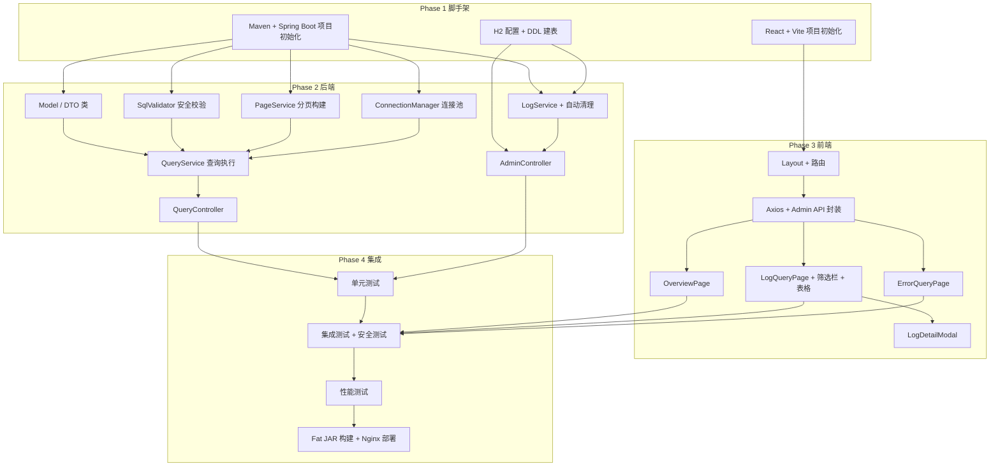

# 数据库查询 JSON 接口工具 — 实现计划

**文档编号**: 0001-plan  
**版本**: v1.3  
**创建日期**: 2026-05-20  
**关联文档**: 
- PRD: docs/0001-view-to-api-prd.md (v2.1)
- Design: docs/0001-view-to-api-design.md (v1.5)

---

## 1. 概述

### 1.1 项目范围

实现一个通用数据库查询 JSON 接口工具，包含：

- **第三方查询接口** `POST /api/v1/query` — 支持 MySQL/SQL Server/Oracle，含 SQL 安全校验和分页
- **管理端 API** `GET /api/v1/admin/*` — 日志查询、错误查询、统计概览
- **前端管理页面** React SPA — 概览页、日志查询页、错误查询页
- **日志存储** H2 内嵌数据库，超过 40 万条自动清理至 30 万条

### 1.2 技术栈

| 层 | 技术 | 版本约束 |
|---|------|---------|
| 后端 | Java 8 + Spring Boot 2.7.18 + Maven | JDK 8 兼容 |
| 前端 | React 18.2 + Ant Design 5.12 + Vite 5.x | 版本锁定避免构建偏差 |
| 日志库 | H2 2.1.x | JDK 8 兼容 |
| 连接池 | HikariCP 4.x | JDK 8 兼容 |
| SQL 解析 | JSqlParser 4.9 | JDK 8 兼容 |

### 1.3 工作量估算

| 阶段 | 预估工时 | 产出 |
|------|---------|------|
| Phase 1: 项目脚手架 | 0.5 天 | 可编译的空项目 |
| Phase 2: 后端核心 | 2 天 | 完整后端 API |
| Phase 3: 前端页面 | 2.5 天 | 三个管理页面 + 暗色主题配置 + 字体加载 + 动效实现 |
| Phase 4: 集成与测试 | 1 天 | 通过所有测试 |

**总预估**: 6 天（单人）

---

## 2. 总体依赖关系



---

## 3. Phase 1 — 项目脚手架（0.5 天）

### 3.1 Maven 后端项目

**任务 ID**: P1A  
**预估**: 0.3 天  
**产出**: `query-tool/` 目录，可 `mvn clean compile`

步骤：

1. 使用 Maven 手动创建项目结构，或使用 Spring Initializr 生成后调整
2. 配置 `pom.xml`，Spring Boot 2.7.18 + JDK 1.8
3. 添加关键依赖：`spring-boot-starter-web`、`spring-boot-starter-validation`、`mysql-connector-java:8.0.33`、`mssql-jdbc:9.4.1.jre8`、`ojdbc8:19.21.0.0`、`h2:2.1.214`、`jsqlparser:4.9`、`lombok`
4. 配置 `application.yml`：H2 数据源、Tomcat 端口 8080
5. 创建包目录：`com.etyy.querytool.{config,controller,service,security,model,repository,runner}`
6. 创建 `QueryToolApplication.java` 入口
7. 验证：`mvn clean compile` 通过

### 3.2 前端项目（内置于 Spring Boot）

**任务 ID**: P1B  
**预估**: 0.2 天  
**产出**: 前端源码目录，可 `npm run dev` + `npm run build` 构建到 `static/`

前端源码放在 Spring Boot 项目内的 `src/main/frontend/` 目录下，构建产物输出到 `src/main/resources/static/`，打包进同一 JAR。

步骤：

1. 在项目根目录下执行 `npm create vite@latest src/main/frontend -- --template react-ts`
2. 安装依赖：`antd`、`axios`、`react-router-dom`、`dayjs`
3. 配置 Vite（`vite.config.ts`）：
   - 开发代理：`/api` → `http://localhost:8080`
   - 构建输出目录：`../resources/static`（`build.outDir`）
   - 清空目录：`build.emptyOutDir = true`
4. 在 `package.json` 中添加 scripts：`"build": "vite build"`
5. 创建目录：`src/{pages,components,api,types}`
6. 验证：开发环境 `npm run dev` 启动成功，生产构建 `npm run build` 输出到 `resources/static/`

### 3.3 H2 日志表初始化

**任务 ID**: P1C  
**预估**: 0.1 天  
**产出**: 启动时自动建表

步骤：

1. 在 `src/main/resources/schema.sql` 中定义 `query_log` 表 DDL
2. 配置 `spring.sql.init.mode=always`
3. 或使用 `DataInitializer`（CommandLineRunner）以 Java 方式建表
4. 验证：应用启动后 `./data/query_log.mv.db` 文件生成

---

## 4. Phase 2 — 后端核心实现（2 天）

### 4.1 Model / DTO 类

**任务 ID**: P2A  
**预估**: 0.2 天  
**依赖**: P1A  
**产出**: `com.etyy.querytool.model` 包下所有类

实现列表：

| 类 | 说明 |
|---|------|
| `QueryRequest` | 查询请求 DTO：database_ip, port, type, username, password, name, sql, page |
| `QueryResponse` | 查询响应 DTO：status, execution_time, message, duration_ms, data[], metadata |
| `PageParam` | 分页 VO：page_number, page_size |
| `PageResult<T>` | 通用分页结果包装 |
| `LogQueryRequest` | 日志查询参数 DTO |
| `QueryLog` | 日志实体 |
| `StatsResponse` | 统计响应 DTO |
| `ErrorCode` | 错误码枚举 |
| `ApiResponse<T>` | 统一响应包装器 |

校验规则（`javax.validation`）：

- `database_ip` — `@NotBlank`
- `database_port` — `@Min(1) @Max(65535)`
- `database_type` — `@Pattern(regexp = "mysql|sqlserver|oracle")`
- `sql` — `@NotBlank`
- `page_size` — `@Min(1) @Max(5000)`

---

### 4.2 SQL 安全校验

**任务 ID**: P2B  
**预估**: 0.5 天  
**依赖**: P1A  
**产出**: `SqlValidator.java` + `SqlParserWrapper.java`

实现逻辑：

1. **正则预检查**：`sql.trim().toUpperCase().startsWith("SELECT")`
2. **AST 解析**：使用 JSqlParser 解析，确认根节点为 `Select`
3. **ORDER BY 检查**：分页时检查 `PlainSelect.getOrderByElements()` 非空
4. **危险关键字**：DDL/DML/文件操作/系统命令四类关键字全量检查

测试用例（≥ 20 个，覆盖全注入变种）：

| 输入 | page | 期望 | 说明 |
|------|------|------|------|
| `SELECT * FROM users ORDER BY id` | `{page:1,size:10}` | 通过 | 正常分页 |
| `SELECT * FROM users` | null | 通过 | 正常无分页 |
| `SELECT * FROM users` | `{page:1,size:10}` | 拒绝 | 缺 ORDER BY |
| `DROP TABLE users` | null | 拒绝 | DDL |
| `DELETE FROM users` | null | 拒绝 | DML 写入 |
| `INSERT INTO users VALUES(1)` | null | 拒绝 | INSERT |
| `SELECT * FROM users INTO OUTFILE '/tmp/x'` | null | 拒绝 | 文件写入 |
| `SELECT * FROM users UNION SELECT * FROM admin` | null | 拒绝 | UNION |
| `SELECT/**/*/FROM users ORDER BY id` | `{page:1,size:10}` | 通过 |  注释 |
| `SELECT * FROM users -- comment` | null | 通过 | 行注释 |
| `SELECT * FROM users#comment` | null | 通过 | #注释 |
| `  SELECT * FROM account` | null | 通过 | 前导空格 |
| `select * from account order by id` | `{page:1,size:10}` | 通过 | 小写 |
| `SELECT * FROM users; DROP TABLE users` | null | 拒绝 | 多语句 |
| `EXEC xp_cmdshell('whoami')` | null | 拒绝 | 系统命令 |
| `GRANT ALL ON *.* TO 'h'` | null | 拒绝 | 权限操作 |
| `SELECT * FROM sys.xp_cmdshell('dir')` | null | 拒绝 | 系统函数 |
| `SELECT pg_sleep(10)` | `{page:1,size:10}` | 拒绝 | 函数（黑名单扩展）|

使用 JUnit 5 `@ParameterizedTest` + `@CsvSource` 实现参数化测试。

---

### 4.3 分页服务

**任务 ID**: P2C  
**预估**: 0.3 天  
**依赖**: P1A  
**产出**: `PageService.java`

方法：

- `buildPageSql(sql, pageNumber, pageSize, dbType)` — 适配三库分页语法
- `buildCountSql(sql)` — 剥离最外层 ORDER BY 后包装 COUNT
- `stripOuterOrderBy(sql)` — 使用 JSqlParser AST 操作移除 ORDER BY

---

### 4.4 连接池管理

**任务 ID**: P2D  
**预估**: 0.4 天  
**依赖**: P1A  
**产出**: `ConnectionManager.java`

管控策略：

| 限制项 | 值 |
|--------|-----|
| 单池最大连接 | 20 |
| 最大连接池数量 | 10 |
| 全局最大总连接 | 200 |
| 空闲回收时间 | 10 分钟 |
| 连接获取超时 | 10 秒 |

后台定时任务每 5 分钟扫描空闲连接池并关闭。

---

### 4.5 查询执行服务

**任务 ID**: P2E  
**预估**: 0.3 天  
**依赖**: P2A, P2B, P2C, P2D  
**产出**: `QueryService.java`

流程：校验 SQL → 获取连接 → 执行 COUNT（分页时）→ 执行主查询 → 组装响应 → 关闭连接。

---

### 4.6 日志服务 + 自动清理

**任务 ID**: P2F  
**预估**: 0.3 天  
**依赖**: P1C  
**产出**: `LogService.java` + `LogCleanupTask.java`

日志写入：异步线程池（core=1, max=5, queue=5000, CallerRunsPolicy），独立 H2 连接。

自动清理：`@Scheduled(fixedRate=3600000)` 每小时检查，超过 40 万条时触发清理。

**渐进式清理**（避免大批量删除锁表）：

```java
int current = jdbcTemplate.queryForObject("SELECT COUNT(*) FROM query_log", Integer.class);
while (current > 400000) {
    int deleted = jdbcTemplate.update(
        "DELETE FROM query_log WHERE id IN (" +
        "  SELECT id FROM query_log ORDER BY request_time ASC LIMIT 5000" +
        ")");
    current -= deleted;
    Thread.sleep(1000);  // 每次删除间隔 1 秒
}
```

独立事务，每批 5000 条提交一次。

---

### 4.7 QueryController

**任务 ID**: P2G  
**预估**: 0.2 天  
**依赖**: P2E, P2F  
**产出**: `QueryController.java`

`@PostMapping("/query")` → 调用 QueryService → 异步写入日志 → 返回 JSON 响应。

全局 `@ControllerAdvice` 处理异常。

---

### 4.8 AdminController

**任务 ID**: P2H  
**预估**: 0.3 天  
**依赖**: P2F  
**产出**: `AdminController.java`

| 端点 | 说明 |
|------|------|
| `GET /admin/logs` | 日志列表（分页+时间/IP/状态/库类型筛选）|
| `GET /admin/errors` | 错误列表（status=fail）|
| `GET /admin/logs/{id}` | 日志详情（含完整 SQL）|
| `GET /admin/stats` | 统计概览 |

使用 JdbcTemplate 动态拼接 WHERE 条件。

---

## 5. Phase 3 — 前端页面实现（1.5 天）

### 5.1 Layout + 路由

**任务 ID**: P3A  
**预估**: 0.2 天  
**依赖**: P1B  
**产出**: `Layout.tsx` + 路由配置

Ant Design `Layout` + `Sider` 导航 + `Content` 路由。

路由：`/` → OverviewPage, `/logs` → LogQueryPage, `/errors` → ErrorQueryPage。

### 5.1.5 主题配置

**任务 ID**: P3A.5  
**预估**: 0.2 天  
**依赖**: P1B  
**产出**: `src/theme/index.ts` + 字体加载配置

步骤：

1. 创建 `src/theme/index.ts`，定义 30+ CSS 自定义属性（设计令牌）：
   - 背景色系：`--bg-page`, `--bg-surface`, `--bg-sidebar`, `--bg-input`
   - 文字色系：`--text-primary`, `--text-secondary`, `--text-tertiary`
   - 边框色系：`--border-subtle`, `--border-default`, `--border-accent`
   - 功能色：`--accent-blue`, `--accent-amber`, `--success`, `--fail`
   - 阴影：`--shadow-md`, `--shadow-glow-blue`
   - 圆角：`--radius-sm`, `--radius-md`, `--radius-lg`
2. 配置 Ant Design ConfigProvider `theme`：启用 `algorithm: theme.darkAlgorithm`，覆盖对应 token
3. 导入字体：通过 `@fontsource/plus-jakarta-sans` 等包加载非系统字体
4. 在 `App.tsx` 中包裹 ConfigProvider

### 5.2 Axios + API 封装

**任务 ID**: P3B  
**预估**: 0.2 天  
**依赖**: P3A  
**产出**: `src/api/`

封装 `adminApi.getLogs()`、`getErrors()`、`getLogDetail()`、`getStats()`。

类型定义：`LogItem`、`PageResult<T>`、`StatsData`、`LogQueryParams`。

### 5.3 概览页

**任务 ID**: P3C  
**预估**: 0.2 天  
**依赖**: P3B  
**产出**: `OverviewPage.tsx`

四张统计卡片 + 最近 10 条请求表格。

### 5.4 日志查询页

**任务 ID**: P3D  
**预估**: 0.5 天  
**依赖**: P3B  
**产出**: `LogQueryPage.tsx`

组件拆分：

```
LogQueryPage
├── SearchBar: 时间范围Picker / IP输入 / 状态选择 / 库类型选择 / 查询按钮
├── LogTable: Table + scroll.y=480 + sticky + 6列
├── Pagination
└── LogDetailModal: 720px Modal + Descriptions + SQL代码块
```

关键逻辑：

- 时间范围默认近 3 天（`dayjs().subtract(3, 'day')` 到 `dayjs()`）
- 筛选变更时重置页码为 1
- 表格列（与设计文档 v1.4 对齐）：执行状态（居中 100px，灯笼式辉光圆点 + 文字标签）、执行时间（居左 180px，`MM-DD HH:mm` 紧凑格式）、执行消息（居左 1fr，单行截断省略号+hover Tooltip）、执行耗时（居右 100px，>=1000ms 琥珀色+警告图标）、查询结果（居中 100px，蓝底圆角徽章）、其他元数据（居左 180px，格式"总 X · 页 Y/Z"）、操作（居中 60px，更多按钮 → 详情弹窗）

### 5.5 错误查询页

**任务 ID**: P3E  
**预估**: 0.2 天  
**依赖**: P3B  
**产出**: `ErrorQueryPage.tsx`

复用 SearchBar 和 LogTable，默认 `status='fail'`，错误消息红色突出。

### 5.6 日志详情弹窗

**任务 ID**: P3F  
**预估**: 0.2 天  
**依赖**: P3D  
**产出**: `LogDetailModal.tsx`

Modal + Descriptions（基本信息）+ 分割线 + 完整 SQL 代码块。

---

## 6. Phase 4 — 集成与测试（1 天）

### 6.1 单元测试

**任务 ID**: P4A  
**预估**: 0.4 天  
**依赖**: P2B, P2C, P2D, P2F  
**产出**: 测试类

**测试框架**：

| 工具 | 版本 | 用途 |
|------|------|------|
| JUnit | 5 (Jupiter) | 单元测试框架 |
| Mockito | 5.x（随 spring-boot-starter-test） | 依赖模拟 |
| JaCoCo | 0.8.x | 覆盖率报告 |
| Spring Boot Test | 2.7.18 | 集成测试 |

**Maven 依赖**：

```xml
<dependency>
    <groupId>org.springframework.boot</groupId>
    <artifactId>spring-boot-starter-test</artifactId>
    <scope>test</scope>
</dependency>
<!-- 2.7.x 内置 JUnit 5 + Mockito 4/5 -->
```

**测试覆盖**：

| 测试类 | 用例数 |
|-------|-------|
| `SqlValidatorTest` | ≥ 20（参数化 SQL 注入全场景）|
| `PageServiceTest` | ≥ 10 |
| `ConnectionManagerTest` | ≥ 5 |
| `LogServiceTest` | ≥ 5 |

覆盖率目标：核心 service 层 ≥ 90%，整体 ≥ 75%。使用 JaCoCo 生成覆盖率报告。

### 6.2 集成测试

**任务 ID**: P4B  
**预估**: 0.3 天  
**依赖**: P2G, P2H  
**产出**: 集成测试类

- `QueryControllerTest`：MockMvc 验证请求/响应 JSON
- `AdminControllerTest`：日志列表分页、筛选、详情
- 完整链路：发起查询 → 日志写入 → 日志查询

### 6.3 性能测试

**任务 ID**: P4C  
**预估**: 0.2 天  
**依赖**: P4B  
**产出**: JMeter / k6 脚本

| 场景 | 并发 | 目标 |
|------|------|------|
| 50 并发查询同一数据库 | 50 | P99 ≤ 2000ms |
| 20 并发日志查询 | 20 | P99 ≤ 500ms |

### 6.4 构建与部署

**任务 ID**: P4D  
**预估**: 0.2 天  
**依赖**: P4B  
**产出**: Fat JAR（含前端）

**前后端一体化构建流程**：

```bash
# 1. 构建前端
cd src/main/frontend
npm install
npm run build           # 产物输出到 ../resources/static/

# 2. 构建后端（含前端静态资源）
cd ../../../..
mvn clean package       # 前端已打包进 JAR

# 3. 启动
java -Xms512m -Xmx1024m -jar target/query-tool.jar
```

启动后访问 `http://localhost:8080` 即可使用前端管理页面，`/api/v1/query` 和 `/api/v1/admin/*` 在同域下，**无跨域问题**。

**一体化优势**：

- 前后端同源，无需 CORS 配置
- 单 JAR 部署，运维简单：一个进程、一个端口
- 前端资源随应用版本发布，不会版本失配

**可选的 Nginx 反向代理**（仅用于 API 安全管控，非必需）：

```nginx
server {
    listen 443 ssl;
    server_name query-tool.example.com;

    location / {
        proxy_pass http://127.0.0.1:8080;
    }

    # 管理端 API 仅允许内网
    location /api/v1/admin/ {
        allow 10.0.0.0/8;
        allow 172.16.0.0/12;
        allow 192.168.0.0/16;
        deny all;
        proxy_pass http://127.0.0.1:8080;
    }
}
```

---

## 7. 交付物清单

| 类别 | 交付物 | 验收标准 |
|------|--------|---------|
| 后端 | `query-tool.jar` | `java -jar` 启动成功，`curl POST /api/v1/query` 返回正确 JSON |
| 后端 | H2 日志库 | 每次查询自动写入日志，管理端 API 可查询 |
| 后端 | SQL 校验 | 非 SELECT / 缺 ORDER BY / 危险关键字均被拒绝 |
| 后端 | 自动清理 | 日志超过 40 万条时自动删除至 30 万条 |
| 前端 | 概览页 | 统计卡片显示正确数据 |
| 前端 | 日志查询页 | 时间范围/IP/状态/库类型筛选 + 表格分页 |
| 前端 | 错误查询页 | 默认筛选失败记录 |
| 前端 | 表格滚动 | 表头固定，仅表体滚动 |
| 测试 | 单元测试 | 核心类覆盖率 ≥ 75% |
| 测试 | 安全测试 | SQL 注入全场景覆盖无遗漏 |

---

## 8. 风险与应对

| 风险 | 概率 | 影响 | 应对 |
|------|------|------|------|
| Oracle JDBC 驱动获取不到 | 中 | 高 | 提前准备手动安装脚本；开发阶段先验证 MySQL，Oracle 延后集成 |
| H2 并发写入锁竞争 | 低 | 中 | 异步写入 + 独立读写连接已纳入设计 |
| 50 并发时目标库连接数不够 | 中 | 高 | 连接池可配置；部署时根据目标库限额调整 |
| JDK 8 依赖不兼容 | 低 | 高 | 所有版本在 PRD 中已逐个确认 |

---

## 9. 修订历史

| 版本 | 日期 | 修订内容 | 作者 |
|------|------|---------|------|
| v1.0 | 2026-05-20 | 初稿：完整实现计划，含 4 个 Phase、任务依赖图、交付物清单 | AI |
| v1.1 | 2026-05-20 | 审查修订：锁定前端版本 React 18.2/AntD 5.12；SQL 校验测试扩至 20 个用例；日志清理改为渐进式删除（每批 5000 条）；明确测试框架版本；补充管理端 API 内网 IP 白名单配置 | AI |
| v1.2 | 2026-05-20 | 前后端一体化：React 前端置于 `src/main/frontend/`，构建到 `resources/static/`，单 JAR 部署，移除 CORS 和 Nginx 前端托管方案 | AI |
| v1.3 | 2026-05-20 | 审查修订：Design 引用更新至 v1.5；Phase 3 新增主题配置子任务（P3A.5）；前端工期从 1.5 天调整为 2.5 天（反映暗色主题实现工作量）；总工期调整为 6 天；表格列定义与设计文档对齐 | AI |
