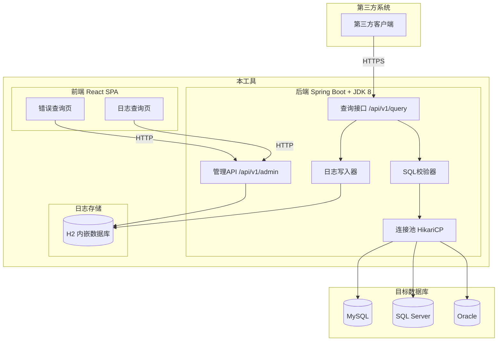
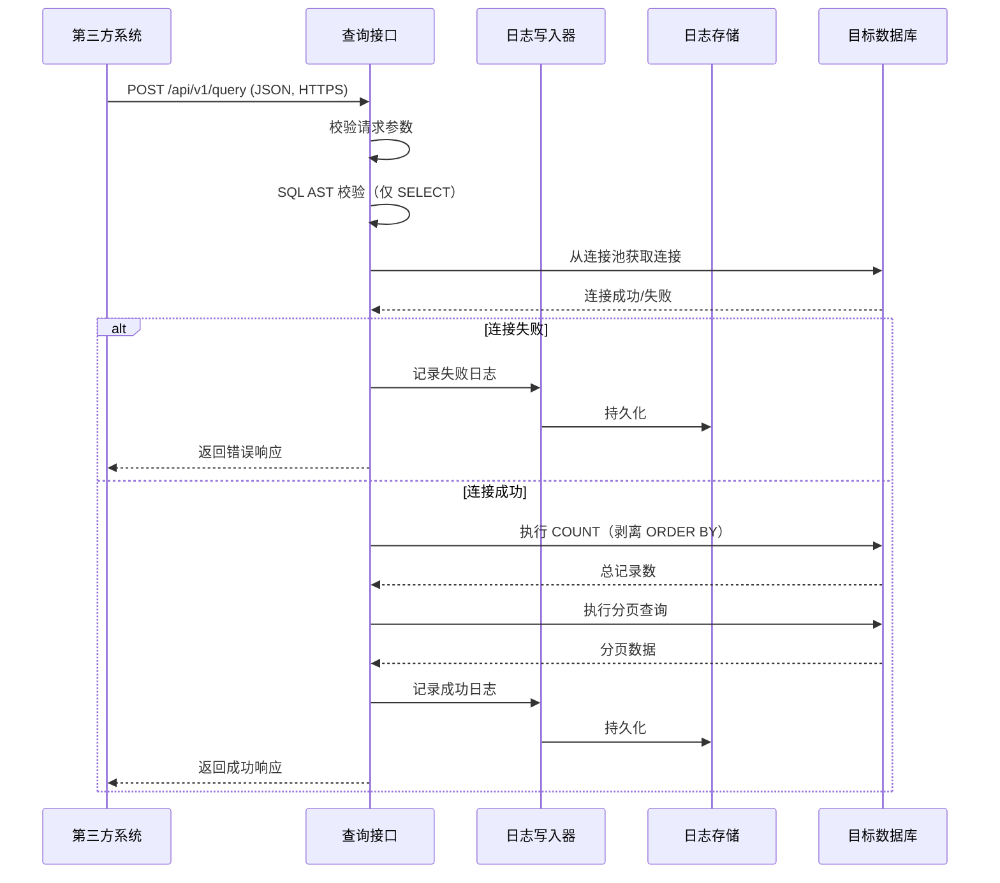
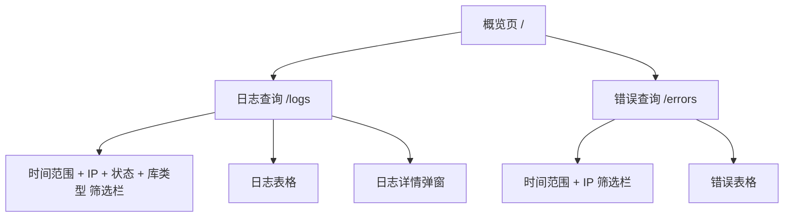
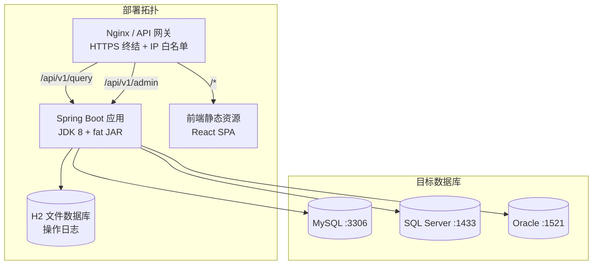

# 数据库查询 JSON 接口工具 — 产品需求文档

**文档编号**: 0001  
**版本**: v2.2  
**创建日期**: 2026-05-20  
**状态**: 已审查修订  
**审查参考**: docs/0001-view-to-api-review.md  

---

## 1. 项目背景

企业内部多个异构系统之间存在数据查询需求：一个系统需要读取另一个系统所依赖的数据库中的数据，但两者之间没有直连通道或适配的 API。当前做法是通过临时脚本或人工导出，效率低、可追溯性差。

同时，运维人员需要对这些查询请求进行监控和审计：查看哪些 IP 调用了接口、执行了哪些查询、是否有失败的请求、在什么时间段内。

本工具旨在提供一个**通用、轻量、安全的数据库查询接口**，并附带一个**管理端前端页面**，用于查询请求日志与错误信息。

---

## 2. 目标与范围

### 2.1 目标

- 提供一个 HTTP API，接收 JSON 格式的查询请求，返回 JSON 格式的查询结果。
- 支持 MySQL、SQL Server、Oracle 三种数据库。
- 支持分页查询，减少单次查询的数据量。
- 统一返回值格式，便于第三方系统解析。
- 提供 React 前端管理页面，支持日志查询、错误查询、按时间范围和请求 IP 筛选。
- **后端使用 Java 语言、JDK 8 编译运行**，所有技术依赖必须与 JDK 8 兼容。

### 2.2 不在范围内

- 不支持数据写入（INSERT / UPDATE / DELETE）。
- 不提供持久化的数据缓存。
- 不处理 DDL 语句（CREATE / ALTER / DROP 等）。
- 不处理存储过程调用。
- 不提供第三方 API 的身份认证与授权管理（由调用方自行控制访问权限）。
- 不提供管理端登录认证（管理页面为内网运维工具，可结合网关统一认证）。

### 2.3 未来规划

考虑在后续版本中增加的支持：

- PostgreSQL 数据库支持。
- 预注册数据源 Token 机制（替代每次传递明文密码）。
- 管理端用户登录与 RBAC 权限控制。
- 实时查询监控 WebSocket 推送。

---

## 3. 技术选型

### 3.1 技术栈总览

| 层级 | 技术 | 版本 | JDK 8 兼容性 |
|------|------|------|-------------|
| 后端语言 | Java | 8 (JDK 1.8) | ✅ |
| 后端框架 | Spring Boot | 2.3.x / 2.7.x | ✅（Spring Boot 3.x 要求 JDK 17+） |
| 构建工具 | Maven | 3.6+ | ✅ |
| 连接池 | HikariCP | 4.x | ✅（5.x 要求 JDK 11+） |
| SQL 解析器 | JSqlParser | 4.x | ✅ |
| JSON 处理 | Jackson | 随 Spring Boot 管理 | ✅ |
| 工具库 | Lombok | 1.18.x | ✅ |
| 日志门面 | SLF4J + Logback | 随 Spring Boot 管理 | ✅ |

### 3.2 数据库驱动兼容性

| 数据库 | JDBC 驱动 | JDK 8 兼容版本 | Maven 坐标 |
|--------|----------|---------------|-----------|
| MySQL | MySQL Connector/J | 8.0.x（9.0+ 要求 JDK 17） | `mysql:mysql-connector-java:8.0.33` |
| SQL Server | Microsoft JDBC Driver | 9.x jre8 版（11.x+ 要求 JDK 11+） | `com.microsoft.sqlserver:mssql-jdbc:9.4.1.jre8` |
| Oracle | Oracle JDBC Thin | **ojdbc8**（ojdbc10/11 要求 JDK 11+） | `com.oracle.database.jdbc:ojdbc8:19.x` |

### 3.3 前端技术栈

| 层级 | 技术 | 说明 |
|------|------|------|
| 框架 | React 17 / 18 | 单页应用 |
| 构建工具 | Vite 4.x 或 react-scripts | 开发与打包 |
| UI 组件库 | Ant Design 4.x / 5.x | 表格、表单、日期选择器等 |
| HTTP 客户端 | Axios | 与后端 API 通信 |
| 路由 | React Router 6.x | 页面导航 |
| 状态管理 | React Context | 轻量级状态管理 |

---

## 4. 系统架构



---

## 5. 第三方查询接口

### 5.1 请求方式

- **协议**: HTTPS（强制）
- **方法**: POST
- **Content-Type**: `application/json`
- **路径**: `/api/v1/query`

### 5.2 请求参数

| 参数名 | 类型 | 必填 | 说明 |
|--------|------|------|------|
| database_ip | string | 是 | 数据库服务器 IP 地址或域名 |
| database_port | integer | 是 | 数据库服务端口号 |
| database_type | string | 是 | 可选值：`mysql`、`sqlserver`、`oracle` |
| database_username | string | 是 | 数据库登录用户名 |
| database_password | string | 是 | 数据库登录密码（HTTPS 加密传输，日志严格脱敏）|
| database_name | string | 是 | 数据库名 / Schema 名 |
| sql | string | 是 | 待执行的 SELECT 查询语句 |
| page | object | 否 | 分页配置 |

**page 对象**：

| 字段名 | 类型 | 必填 | 说明 |
|--------|------|------|------|
| page_number | integer | 是 | 当前页码，从 1 开始 |
| page_size | integer | 是 | 每页记录数，取值范围 [1, 5000] |

**请求示例**：

```json
{
    "database_ip": "172.19.61.11",
    "database_port": 3306,
    "database_type": "mysql",
    "database_username": "etyy_hrp",
    "database_password": "Lk9m48kq!",
    "database_name": "tender",
    "sql": "select * from account",
    "page": {
        "page_number": 1,
        "page_size": 10
    }
}
```

### 5.3 响应格式

| 字段名 | 类型 | 说明 |
|--------|------|------|
| status | string | `"success"` 或 `"fail"` |
| execution_time | string | 服务端完成查询的时间，格式 `yyyy-MM-dd HH:mm:ss`（服务端本地时区）|
| message | string | 状态描述信息 |
| duration_ms | integer | 执行耗时，单位毫秒 |
| data | array | 查询到的记录列表，失败时为空数组 |
| metadata | object | 分页信息，失败时返回空对象 |

**metadata 对象**：

| 字段名 | 类型 | 说明 |
|--------|------|------|
| total_count | integer | 满足查询条件的总记录数 |
| page_number | integer | 当前返回的页码 |
| page_size | integer | 每页记录数 |

**成功响应示例**：

```json
{
    "status": "success",
    "execution_time": "2026-05-20 14:30:00",
    "message": "操作成功",
    "duration_ms": 100,
    "data": [
        {"field1": "value1", "field2": "value2"},
        {"field1": "value3", "field2": "value4"}
    ],
    "metadata": {
        "total_count": 42,
        "page_number": 1,
        "page_size": 10
    }
}
```

**失败响应示例**：

```json
{
    "status": "fail",
    "execution_time": "2026-05-20 14:30:01",
    "message": "数据库连接失败：无法连接到 172.19.61.11:3306，超时",
    "duration_ms": 5000,
    "data": [],
    "metadata": {}
}
```

---

## 6. 业务逻辑

### 6.1 查询流程



### 6.2 分页实现策略

| 数据库类型 | 分页方式 |
|-----------|---------|
| MySQL | `LIMIT page_size OFFSET (page_number-1) * page_size` |
| SQL Server | `OFFSET @offset ROWS FETCH NEXT @limit ROWS ONLY` |
| Oracle | `OFFSET @offset ROWS FETCH NEXT @limit ROWS ONLY`（12c+） |

- offset = (page_number - 1) × page_size
- 未传入 page 参数时：直接执行原始 SQL，上限 10000 条。**注意**：无分页查询可能传输大量数据，建议第三方调用时始终携带分页参数，无分页仅用于小数据量确认场景。
- 页码超出范围：返回空 data，total_count 保持实际值。
- 响应体超 10MB：返回错误，提示缩小范围。

**重要 — 分页查询必须带 ORDER BY**：

分页查询要求结果集具有**确定的排序**，否则同一行数据可能在不同页之间重复出现或被遗漏。因此：

- **强制要求**：当请求携带 `page` 分页参数时，`sql` 字段中**必须包含 `ORDER BY` 子句**。
- **校验时机**：在 SQL 安全性校验环节（见 6.4 节），使用 AST 解析器检查 SELECT 语句的最外层是否包含 ORDER BY 子句。若不包含，直接返回校验失败。
- **剥离说明**：COUNT 查询前会剥离最外层 ORDER BY 以节省性能；此剥离**仅影响 COUNT 子查询**，主查询的原始 ORDER BY 保持不变。

### 6.3 总记录数获取

- 将原始 SQL 包装为 `SELECT COUNT(*) FROM (原始SQL) AS cnt`。
- 执行 COUNT 前剥离最外层 ORDER BY，避免无意义排序。
- COUNT 与主查询使用同一数据库连接。

### 6.4 SQL 安全性校验

**三重防御 + ORDER BY 强制校验**：

1. **正则预检查**：拒绝非 SELECT 开头的 SQL。
2. **AST 解析校验**：使用 JSqlParser 4.x（JDK 8 兼容）做语法树解析，仅允许 SELECT 语句。
3. **ORDER BY 强制校验**：若请求携带了 `page` 分页参数，AST 解析时检查 SELECT 最外层是否包含 ORDER BY 子句。不含则直接拒绝。
4. **危险关键字检查**：`INTO OUTFILE`、`xp_cmdshell` 等。

**架构级**：目标数据库使用只读账户，从根源杜绝写入。

### 6.5 连接管理

- HikariCP 4.x（JDK 8 兼容），按 database_ip + database_port + database_name 三元组隔离连接池。
- **默认每池上限 20 连接**（可配置），空闲超时 5 分钟，连接超时 10 秒（`connectionTimeout=10000ms`）。
- 连接池容量建议公式：`池大小 ≈ 预期并发数 × 平均查询耗时(秒)`。例如 50 并发 × 0.5 秒平均耗时 ≈ 25 连接，取 20 为保守值。
- 获取连接时执行 `SELECT 1` 验证有效性。

---

## 7. 日志存储

### 7.1 存储方案

| 项目 | 说明 |
|------|------|
| 数据库 | H2 Database Engine 2.1.x（JDK 8 兼容） |
| 运行模式 | 嵌入模式（Embedded），使用 MVCC 模式减少读写锁冲突 |
| 持久化 | 文件存储到 `./data/` 目录 |
| 管理控制台 | 可选开启（仅开发环境） |

**并发处理**：

- 日志写入采用**异步线程池**（corePoolSize=1, maxPoolSize=5），主查询线程将日志提交到队列后立即返回，不阻塞查询响应。
- 管理端查询（读）与日志写入（写）使用**独立的 H2 连接**，避免读写锁竞争。

**数据量说明**：

- H2 嵌入模式建议适用于 ≤ 50 万条日志记录的场景。
- 日志表按 `request_time` 按月分区或定期归档超过 90 天的数据，防止单表过大。
- 当日志量超过 50 万条或并发日志查询性能不满足 ≤ 200ms 要求时，可考虑将日志存储迁移至独立 MySQL 实例。

**自动清理策略**：

- 系统启动一个后台定时任务（ScheduledExecutorService，每 1 小时执行一次），检查 `query_log` 表的总记录数。
- 当总记录数超过 **400,000** 时，删除最旧的记录，直到剩余记录数回到 **300,000**。
- 删除逻辑：`DELETE FROM query_log ORDER BY request_time ASC LIMIT (当前总数 - 300000)`。
- 清理操作使用独立的事务，避免阻塞正在进行的日志写入。
- 清理日志：每次清理完成后记录一条 INFO 日志（"日志自动清理：删除 X 条旧记录，当前剩余 Y 条"）。

### 7.2 日志表结构

```sql
CREATE TABLE query_log (
    id              BIGINT AUTO_INCREMENT PRIMARY KEY,
    request_time    TIMESTAMP   NOT NULL,
    client_ip       VARCHAR(45) NOT NULL,
    database_ip     VARCHAR(45) NOT NULL,
    database_port   INT         NOT NULL,
    database_type   VARCHAR(20) NOT NULL,
    database_name   VARCHAR(100) NOT NULL,
    sql_hash        VARCHAR(64) NOT NULL,
    sql_preview     VARCHAR(200),
    sql_full        TEXT,
    status          VARCHAR(10) NOT NULL,
    message         VARCHAR(500),
    duration_ms     INT NOT NULL DEFAULT 0,
    created_at      TIMESTAMP NOT NULL DEFAULT CURRENT_TIMESTAMP
);

CREATE INDEX idx_log_request_time ON query_log(request_time);
CREATE INDEX idx_log_client_ip ON query_log(client_ip);
CREATE INDEX idx_log_status ON query_log(status);
CREATE INDEX idx_log_type ON query_log(database_type);
```

---

## 8. 管理端 API

### 8.1 概述

前端页面通过管理端 API 获取日志与统计数据。路径统一为 `/api/v1/admin/`。**这些接口不对外公开，仅前端管理页面使用。**

### 8.2 日志查询

**路径**: `GET /api/v1/admin/logs`

| 参数 | 类型 | 必填 | 说明 |
|------|------|------|------|
| start_time | string | 否 | 起始时间 `yyyy-MM-dd HH:mm:ss` |
| end_time | string | 否 | 结束时间 |
| client_ip | string | 否 | 调用方 IP（模糊匹配） |
| status | string | 否 | 筛选 `success` / `fail` |
| database_type | string | 否 | 筛选数据库类型 |
| page_number | integer | 否 | 默认 1 |
| page_size | integer | 否 | 默认 20，最大 200 |

**响应**：

```json
{
    "status": "success",
    "data": [
        {
            "id": 1,
            "request_time": "2026-05-20 14:30:00",
            "client_ip": "192.168.1.100",
            "database_ip": "172.19.61.11",
            "database_port": 3306,
            "database_type": "mysql",
            "database_name": "tender",
            "sql_hash": "a1b2c3d4e5f6...",
            "sql_preview": "select * from account ...",
            "status": "success",
            "duration_ms": 100
        }
    ],
    "metadata": {
        "total_count": 156,
        "page_number": 1,
        "page_size": 20
    }
}
```

### 8.3 错误查询

**路径**: `GET /api/v1/admin/errors`

参数同日志查询，默认筛选 `status=fail`。便于运维快速定位失败请求。

### 8.4 日志详情

**路径**: `GET /api/v1/admin/logs/{id}`

返回包含 `sql_full`（完整 SQL）的单条日志详情。仅管理端可查看。

### 8.5 统计概览

**路径**: `GET /api/v1/admin/stats`

```json
{
    "total_requests": 1024,
    "success_count": 1000,
    "fail_count": 24,
    "today_requests": 56,
    "avg_duration_ms": 85
}
```

---

## 9. 前端页面

### 9.1 页面结构



### 9.2 概览页 `/`

统计卡片展示：

- 今日请求总数
- 成功 / 失败数
- 平均响应耗时
- 最近 10 条请求

### 9.3 日志查询页 `/logs`

**筛选栏**：

| 组件 | 说明 |
|------|------|
| 时间范围 | Ant Design RangePicker（精度到秒）|
| 请求 IP | Input 输入框，支持模糊匹配 |
| 状态 | Select：全部 / 成功 / 失败 |
| 数据库类型 | Select：全部 / MySQL / SQL Server / Oracle |
| 查询按钮 | 触发查询 |

**表格列**：请求时间、客户端 IP、目标数据库（IP:端口/类型）、SQL 摘要、执行耗时、状态、操作（详情按钮）。

**详情弹窗**：展示单条日志完整信息，含完整 SQL。

### 9.4 错误查询页 `/errors`

与日志查询页布局相同，默认筛选 `status=fail`，错误消息列突出显示。

### 9.5 非功能性要求（前端）

- 筛选查询 ≤ 2 秒响应。
- 表格支持分页，筛选变更时重置页码为 1。
- 刷新浏览器后通过 URL Query String 保留筛选条件。

---

## 10. 错误码

### 10.1 第三方查询接口

| 场景 | status | HTTP |
|------|--------|------|
| 成功 | success | 200 |
| 参数缺失 | fail | 400 |
| JSON 解析失败 | fail | 400 |
| 不支持的数据库类型 | fail | 400 |
| 非 SELECT 语句 | fail | 400 |
| 分页查询缺少 ORDER BY | fail | 400 |
| SQL 解析失败 | fail | 400 |
| 命中危险关键字 | fail | 400 |
| 数据库连接失败 | fail | 502 |
| 查询超时 | fail | 504 |
| 查询结果过大 | fail | 422 |

### 10.2 管理端接口

| 场景 | status | HTTP |
|------|--------|------|
| 成功 | success | 200 |
| 日志 ID 不存在 | fail | 404 |
| 参数格式错误 | fail | 400 |

---

## 11. 非功能性需求

### 11.1 性能

- 第三方查询接口 ≤ 500ms（同机房，不含慢 SQL）。
- 并发支持 ≥ 50 并发。
- 未分页默认取前 10000 条；响应体上限 10MB。
- 管理端接口 ≤ 200ms（日志量 ≤ 100 万条）。

### 11.2 安全性

- 强制 HTTPS。
- AST + 正则 + 只读账户三层 SQL 防御。
- 密码字段全日志点脱敏为 `******`。
- 运行日志不记完整 SQL；完整 SQL 仅在审计日志中。
- IP 白名单部署于网关层。

### 11.3 JDK 8 兼容性专项

1. 所有 Maven 依赖确认有 jre8 版本或明确声明支持 JDK 1.8。
2. `maven.compiler.source` / `maven.compiler.target` = `1.8`。
3. 不使用 Java 9+ API（`List.of()`、`var`、`java.lang.Module` 等）。
4. Spring Boot 锁定在 2.7.x（3.x 要求 JDK 17+）。
5. 使用 `javax.*` 而非 `jakarta.*` 命名空间。

### 11.4 日志与审计

- 运行日志（INFO 级别）：脱敏摘要，含 SQL 前 200 字符。
- 审计日志（需显式开启）：完整 SQL，访问受限。
- 日志保留 ≥ 90 天。

---

## 12. 部署建议

### 12.1 后端部署

- **JDK**: OpenJDK 8 / Oracle JDK 8u202+
- **JVM**: `-Xms512m -Xmx1024m`
- **构建**: `mvn clean package` → fat JAR
- **启动**: `java -jar query-tool.jar`
- **日志存储**: H2 文件 `./data/query_log`

### 12.2 前端构建与部署

- **构建**: `npm run build` → `dist/` 目录
- **部署方式一**：打包到 Spring Boot `static/` 目录，单 JAR 部署。
- **部署方式二**：Nginx 托管前端静态文件，反向代理 `/api/` 到后端。
- **Node 版本**: Node.js 14+（仅构建时需要）。

**CORS 配置**：

- 方式一部署时无跨域问题（前端资源与 API 同源）。
- 方式二部署时需在 Nginx 中配置统一域名反向代理，或将 `/api/` 路径代理到后端，消除跨域。
- 开发环境下 Spring Boot 需配置 CORS，允许 `http://localhost:3000` 等开发服务器来源。

### 12.3 Maven 依赖（关键版本）

```xml
<parent>
    <groupId>org.springframework.boot</groupId>
    <artifactId>spring-boot-starter-parent</artifactId>
    <version>2.7.18</version>
</parent>

<dependencies>
    <!-- MySQL -->
    <dependency>
        <groupId>mysql</groupId>
        <artifactId>mysql-connector-java</artifactId>
        <version>8.0.33</version>
    </dependency>

    <!-- SQL Server -->
    <dependency>
        <groupId>com.microsoft.sqlserver</groupId>
        <artifactId>mssql-jdbc</artifactId>
        <version>9.4.1.jre8</version>
    </dependency>

    <!-- Oracle （需配置 Oracle Maven 仓库或手动安装）-->
    <!-- 方式一：在 pom.xml 中添加 Oracle Maven 仓库
         <repositories>
             <repository>
                 <id>oracle-maven</id>
                 <url>https://maven.oracle.com</url>
             </repository>
         </repositories>
    -->
    <!-- 方式二：手动安装到本地仓库
         mvn install:install-file -Dfile=ojdbc8.jar \
           -DgroupId=com.oracle.database.jdbc \
           -DartifactId=ojdbc8 -Dversion=19.21.0.0 -Dpackaging=jar
    -->
    <dependency>
        <groupId>com.oracle.database.jdbc</groupId>
        <artifactId>ojdbc8</artifactId>
        <version>19.21.0.0</version>
    </dependency>

    <!-- SQL Parser -->
    <dependency>
        <groupId>com.github.jsqlparser</groupId>
        <artifactId>jsqlparser</artifactId>
        <version>4.9</version>
    </dependency>

    <!-- H2 -->
    <dependency>
        <groupId>com.h2database</groupId>
        <artifactId>h2</artifactId>
        <version>2.1.214</version>
    </dependency>
</dependencies>
```

### 12.4 管理端 API 访问控制

由于本工具**不提供管理端登录认证**（符合 2.2 节范围定义），管理端 API 必须通过部署层访问控制进行保护：

- **方式一（推荐）**：在 Nginx 反向代理中对 `/api/v1/admin/*` 路径配置内网 IP 白名单。
- **方式二**：在 Spring Boot 后端通过 `WebMvcConfigurer` 添加 `HandlerInterceptor` 实现 IP 过滤。
- **方式三**：通过 Kubernetes NetworkPolicy 或防火墙规则限制端口访问来源。

示例 Nginx 配置：

```nginx
location /api/v1/admin {
    allow 10.0.0.0/8;
    allow 172.16.0.0/12;
    allow 192.168.0.0/16;
    deny all;
    proxy_pass http://127.0.0.1:8080;
}
```

**注意**：`/api/v1/query`（第三方查询接口）不应受 IP 白名单限制，由 HTTPS + SQL 校验 + 只读账户保障安全。

### 12.5 架构拓扑



---

## 13. 附录

### 13.1 术语表

| 术语 | 说明 |
|------|------|
| JDK | Java Development Kit |
| JDBC | Java Database Connectivity |
| HikariCP | 高性能 JDBC 连接池 |
| JSqlParser | Java SQL 解析器 |
| H2 | 内嵌式关系型数据库 |
| SPA | 单页应用 |
| AST | 抽象语法树 |

### 13.2 修订历史

| 版本 | 日期 | 修订内容 | 作者 |
|------|------|---------|------|
| v1.0 | 2026-05-20 | 初稿 | AI |
| v1.1 | 2026-05-20 | 第一轮审查修订：字段名、HTTPS、AST、连接池、分页边界 | AI |
| v2.0 | 2026-05-20 | 强制 JDK 8 + 兼容依赖版本；新增 React 前端与管理端 API；新增 H2 日志存储 | AI |
| v2.1 | 2026-05-20 | 第二轮审查修订：补充分页 ORDER BY 说明、连接池默认值从 5 调至 20、H2 异步写入与数据量说明、CORS 配置、Oracle 仓库获取方式 | AI |
| v2.2 | 2026-05-20 | 第三轮审查修订：错误码 413→422（与设计文档一致）；响应时间字段补充时区说明；非分页查询补充性能提示；新增管理端 API 访问控制部署章节 | AI |
