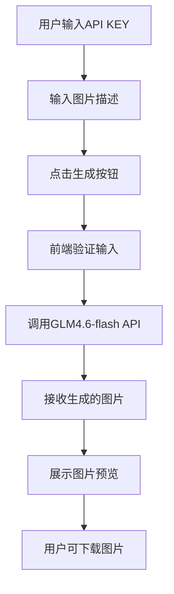
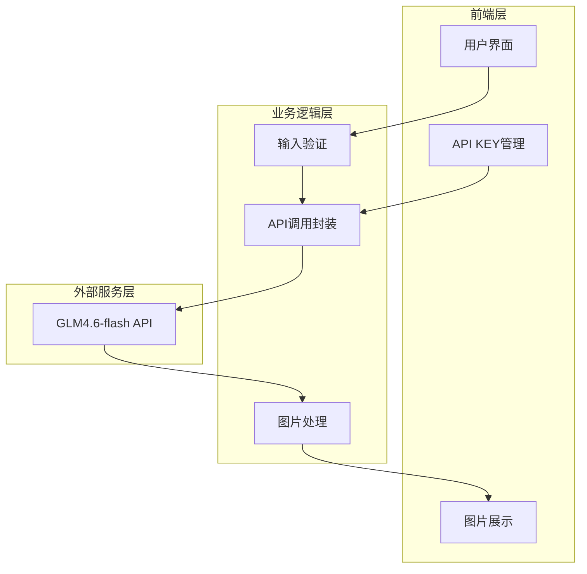

# 图片生成工具需求规格说明书

## 1. 项目概述

### 1.1 项目背景
本项目旨在开发一个简单易用的图片生成工具，用户可通过输入文本描述，基于GLM4.6-flash模型生成指定尺寸和格式的图片。

### 1.2 项目目标
- 提供直观的用户界面，支持文本描述输入
- 集成GLM4.6-flash模型API，实现AI图片生成
- 生成512x512像素的PNG格式图片
- 支持API KEY前端配置，方便用户使用

## 2. 功能需求

### 2.1 用户界面功能

| 功能模块 | 功能描述 | 优先级 |
|---------|---------|-------|
| 文本输入 | 提供文本框，支持用户输入图片描述 | 高 |
| API KEY配置 | 提供输入框，支持用户设置和保存API KEY | 高 |
| 生成按钮 | 触发图片生成操作 | 高 |
| 图片预览 | 展示生成的图片 | 高 |
| 图片下载 | 支持将生成的图片保存到本地 | 高 |
| 历史记录 | 可选，展示用户生成的历史图片 | 中 |
| 加载状态 | 显示图片生成进度/加载状态 | 高 |

### 2.2 核心功能流程



## 3. 非功能需求

| 需求类型 | 需求描述 |
|---------|---------|
| 性能需求 | 图片生成响应时间 < 30秒 |
| 兼容性 | 支持主流浏览器（Chrome、Firefox、Safari、Edge）最新版本 |
| 可用性 | 界面简洁直观，用户无需培训即可使用 |
| 安全性 | API KEY仅存储在本地，不上传至服务器 |
| 可扩展性 | 支持后续添加更多模型选择、尺寸选择功能 |

## 4. 接口需求

### 4.1 GLM4.6-flash API接口

- **模型名称**: GLM4.6-flash
- **输入**: 文本描述（prompt）
- **输出**: 512x512 PNG格式图片
- **认证方式**: API KEY

### 4.2 前端-后端交互（如需要后端）

如采用前端直接调用第三方API方案，则无需后端接口。如需后端代理，接口规范如下：

| 接口 | 方法 | 描述 |
|-----|------|------|
| /api/generate | POST | 接收prompt和API KEY，返回生成的图片 |

## 5. 架构设计

### 5.1 系统架构



### 5.2 技术选型建议

- **前端框架**: React + TypeScript 或 Vue 3 + TypeScript
- **构建工具**: Vite
- **HTTP客户端**: Axios
- **状态管理**: 本地存储（localStorage）存储API KEY
- **UI组件库**: Ant Design / Element Plus / 自定义

### 5.3 目录结构

```
image-generator/
├── src/
│   ├── components/       # UI组件
│   ├── services/         # API调用服务
│   ├── utils/            # 工具函数
│   ├── types/            # TypeScript类型定义
│   ├── App.tsx           # 主应用组件
│   └── main.tsx          # 入口文件
├── public/
├── package.json
└── tsconfig.json
```

## 6. 数据需求

### 6.1 本地存储数据

| 数据项 | 存储位置 | 描述 |
|-------|---------|------|
| API KEY | localStorage | 用户配置的API密钥 |
| 生成历史 | localStorage（可选） | 历史生成记录 |

### 6.2 图片规格

- **尺寸**: 512 x 512 像素
- **格式**: PNG
- **色彩模式**: RGB

## 7. 用户交互流程

### 7.1 主流程

1. 用户首次访问，输入API KEY并保存
2. 在文本框中输入图片描述
3. 点击"生成图片"按钮
4. 系统显示加载状态
5. 图片生成完成后展示预览
6. 用户可点击下载按钮保存图片

### 7.2 异常处理

- API KEY无效：显示错误提示，引导用户重新配置
- 网络错误：显示网络异常提示，提供重试选项
- 生成超时：提示用户稍后重试

## 8. 验收标准

1. 用户能够成功配置API KEY并保存
2. 输入有效描述后能够生成512x512 PNG图片
3. 图片能够正常预览和下载
4. 在主流浏览器中运行稳定
5. 加载状态和错误提示清晰明确

---

**文档版本**: v1.0
**创建日期**: 2026-05-08
**创建人**: 高级需求分析师
