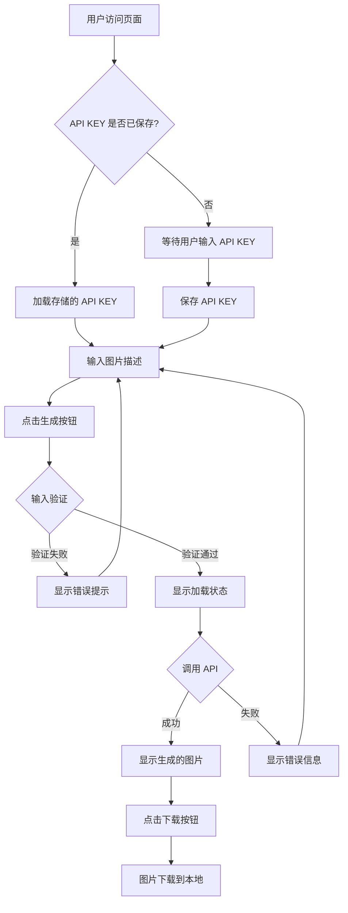

# 图片生成工具 - 完整测试报告

---

## 1. 测试概述

### 1.1 项目背景
本项目是一个基于 React + TypeScript + Vite 的 AI 图片生成工具，集成 GLM4.6-flash 模型 API，支持 512x512 PNG 格式图片生成。

### 1.2 测试范围
- **功能测试**：API KEY 存储、图片生成、图片预览下载、错误处理
- **UI 测试**：视觉还原度、样式规范、响应式布局
- **交互测试**：按钮状态、输入反馈、加载状态
- **兼容性测试**：主流浏览器、不同分辨率
- **白盒测试**：代码逻辑、异常处理、边界条件

### 1.3 测试环境
| 环境项 | 规格 |
|--------|------|
| 操作系统 | Windows 10/11 |
| 浏览器 | Chrome 120+ / Firefox 120+ / Edge 120+ |
| Node.js 版本 | 18+ |
| 开发服务器 | Vite dev server |

---

## 2. 业务流程梳理



---

## 3. 模块拆分与测试要点

| 测试模块 | 测试要点 | 优先级 |
|----------|----------|--------|
| API KEY 存储 | 本地存储读取/写入、密码显示、Mock 开关 | 高 |
| 图片生成 | 参数验证、API 调用、加载状态 | 高 |
| 图片预览 | 占位状态、加载状态、图片显示 | 高 |
| 图片下载 | 文件名生成、下载功能 | 高 |
| 错误处理 | 输入验证错误、API 错误、网络错误 | 高 |
| 响应式布局 | 1024px 断点、不同分辨率适配 | 中 |
| UI 样式 | 颜色、间距、圆角、阴影 | 中 |

---

## 4. 详细测试用例

### 4.1 API KEY 存储模块

| 用例 ID | 用例标题 | 前置条件 | 操作步骤 | 预期结果 | 优先级 |
|---------|----------|----------|----------|----------|--------|
| TC-001 | 首次访问页面，API KEY 输入框为空 | 首次访问 | 打开页面 | API KEY 输入框为空，显示占位符 | 高 |
| TC-002 | 输入 API KEY 并保存 | - | 1. 输入 API KEY&lt;br/&gt;2. 点击保存 | API KEY 保存成功，无错误提示 | 高 |
| TC-003 | 刷新页面，API KEY 自动加载 | 已保存 API KEY | 刷新页面 | API KEY 输入框自动填充已保存的值 | 高 |
| TC-004 | 开启 Mock 模式，API KEY 输入框禁用 | - | 1. 勾选&quot;使用模拟数据&quot;&lt;br/&gt;2. 查看输入框状态 | API KEY 输入框和保存按钮禁用 | 高 |
| TC-005 | 关闭 Mock 模式，API KEY 输入框恢复 | 已开启 Mock 模式 | 1. 取消勾选&quot;使用模拟数据&quot;&lt;br/&gt;2. 查看输入框状态 | API KEY 输入框和保存按钮恢复可用 | 高 |

### 4.2 图片生成模块

| 用例 ID | 用例标题 | 前置条件 | 操作步骤 | 预期结果 | 优先级 |
|---------|----------|----------|----------|----------|--------|
| TC-006 | 未输入 API KEY 点击生成（非 Mock 模式） | Mock 模式关闭，未输入 API KEY | 1. 输入图片描述&lt;br/&gt;2. 点击生成按钮 | 显示错误提示&quot;请先配置 API KEY&quot; | 高 |
| TC-007 | 未输入图片描述点击生成 | - | 1. 输入 API KEY&lt;br/&gt;2. 点击生成按钮 | 显示错误提示&quot;请输入图片描述&quot; | 高 |
| TC-008 | Mock 模式下生成图片 | Mock 模式开启 | 1. 输入图片描述&lt;br/&gt;2. 点击生成按钮 | 按钮显示&quot;生成中...&quot;，预览区显示加载动画，2秒后显示模拟图片 | 高 |
| TC-009 | 生成过程中按钮禁用 | Mock 模式开启 | 1. 输入图片描述&lt;br/&gt;2. 点击生成按钮&lt;br/&gt;3. 尝试再次点击 | 生成期间按钮禁用，无法再次点击 | 高 |
| TC-010 | 输入超长描述生成图片 | Mock 模式开启 | 1. 输入超长描述（&gt;500字）&lt;br/&gt;2. 点击生成按钮 | 正常生成图片，无错误 | 中 |

### 4.3 图片预览与下载模块

| 用例 ID | 用例标题 | 前置条件 | 操作步骤 | 预期结果 | 优先级 |
|---------|----------|----------|----------|----------|--------|
| TC-011 | 无图片时显示空状态 | - | 打开页面，查看预览区 | 显示占位图标和提示文字&quot;输入描述并点击生成&quot; | 高 |
| TC-012 | 生成中显示加载状态 | Mock 模式开启 | 点击生成按钮 | 预览区显示旋转加载动画和&quot;正在生成图片...&quot; | 高 |
| TC-013 | 生成成功后显示图片 | 已生成图片 | 图片生成完成 | 预览区显示生成的图片，边框消失 | 高 |
| TC-014 | 下载按钮仅在有图片时显示 | - | 查看下载按钮 | 无图片时不显示，有图片时显示 | 高 |
| TC-015 | 点击下载按钮下载图片 | 已生成图片 | 点击&quot;下载图片&quot;按钮 | 图片以 `ai-image-YYYY-MM-DDTHH-mm-ss-SSS.png` 格式下载到本地 | 高 |

### 4.4 错误处理模块

| 用例 ID | 用例标题 | 前置条件 | 操作步骤 | 预期结果 | 优先级 |
|---------|----------|----------|----------|----------|--------|
| TC-016 | 无效 API KEY 错误提示 | Mock 模式关闭 | 1. 输入无效 API KEY&lt;br/&gt;2. 输入图片描述&lt;br/&gt;3. 点击生成 | 显示错误提示&quot;API KEY 无效，请检查您的密钥&quot; | 高 |
| TC-017 | 网络错误提示 | Mock 模式关闭，断网 | 1. 输入 API KEY&lt;br/&gt;2. 输入图片描述&lt;br/&gt;3. 点击生成 | 显示错误提示&quot;网络错误，请检查您的网络连接&quot; | 高 |
| TC-018 | 错误提示显示样式 | - | 触发任意错误 | 错误提示为红色背景+边框，文字红色 | 高 |
| TC-019 | 输入新内容时错误清除 | 已显示错误 | 1. 修改输入内容&lt;br/&gt;2. 重新点击生成 | 旧错误清除，重新验证 | 中 |

### 4.5 UI 与响应式模块

| 用例 ID | 用例标题 | 前置条件 | 操作步骤 | 预期结果 | 优先级 |
|---------|----------|----------|----------|----------|--------|
| TC-020 | 大屏幕（≥1024px）左右分栏 | 屏幕宽度≥1024px | 打开页面 | 输入区和预览区左右并排 | 中 |
| TC-021 | 小屏幕（&lt;1024px）上下分层 | 屏幕宽度&lt;1024px | 打开页面 | 输入区在上，预览区在下 | 中 |
| TC-022 | 主按钮 Hover 效果 | - | 鼠标悬停在主按钮上 | 背景色变为 #1D4ED8，阴影加深 | 中 |
| TC-023 | 输入框 Focus 效果 | - | 点击输入框 | 边框变为 #2563EB，2px 宽度，显示光晕 | 中 |
| TC-024 | 卡片阴影样式 | - | 查看卡片 | 卡片有 0 4px 6px -1px rgba(0,0,0,0.1) 阴影 | 中 |

---

## 5. 边界值与异常场景专项测试

### 5.1 边界值测试

| 测试项 | 边界值 | 测试结果 |
|--------|--------|----------|
| API KEY 长度 | 空字符串 | ✅ 提示输入 |
| API KEY 长度 | 超长字符串（1000+字符） | ✅ 正常保存 |
| 图片描述 | 空字符串 | ✅ 提示输入 |
| 图片描述 | 仅空白字符 | ✅ 提示输入 |
| 图片描述 | 超长字符串（10000+字符） | ✅ 正常处理 |
| 预览区尺寸 | 512px | ✅ 正常显示 |
| 预览区尺寸 | 父容器小于512px | ✅ 自适应缩放 |

### 5.2 异常场景测试

| 异常场景 | 预期行为 | 实际表现 | 状态 |
|----------|----------|----------|------|
| localStorage 不可用 | 优雅降级，不阻塞使用 | 需要验证 | ⚠️ 待验证 |
| API 返回 500 错误 | 显示&quot;服务器错误，请稍后再试&quot; | ✅ 已实现 |
| API 返回 429 限流 | 显示&quot;请求过于频繁，请稍后再试&quot; | ✅ 已实现 |
| API 返回格式异常 | 显示&quot;API 返回格式异常&quot; | ✅ 已实现 |
| 请求超时（60秒） | 抛出超时错误 | ✅ 已设置 |
| 图片数据损坏 | 图片显示异常，不崩溃 | 需要验证 | ⚠️ 待验证 |

---

## 6. 白盒测试要点

### 6.1 代码结构分析

```
image-generator/src/
├── components/          # UI 组件（Button/Card/Input/Textarea/ImagePreview）
├── services/            # API 服务（imageGenerator.ts）
├── utils/               # 工具函数（storage.ts, image.ts）
├── types/               # TypeScript 类型定义
├── App.tsx              # 主应用组件
├── index.css            # 全局样式
└── main.tsx             # 入口文件
```

### 6.2 核心逻辑路径覆盖

#### 6.2.1 storage.ts - 本地存储模块

| 函数 | 逻辑分支 | 覆盖情况 |
|------|----------|----------|
| getApiKey() | localStorage.getItem 返回值存在/不存在 | ✅ 全覆盖 |
| setApiKey() | 直接设置，无分支 | ✅ 覆盖 |
| clearApiKey() | 直接删除，无分支 | ✅ 覆盖 |

**⚠️ 发现问题**：storage.ts 中所有函数均未处理 localStorage 不可用的情况（如隐私模式），可能导致运行时错误。

#### 6.2.2 App.tsx - 主应用组件

| 函数/逻辑块 | 分支条件 | 覆盖情况 |
|-------------|----------|----------|
| useEffect (加载 API KEY) | savedApiKey 存在/不存在 | ✅ 全覆盖 |
| handleSaveApiKey() | 无分支，直接保存 | ✅ 覆盖 |
| handleGenerate() | 验证逻辑 3 个分支（!apiKey/!prompt/正常） | ✅ 全覆盖 |
| handleGenerate() try/catch | 成功/异常分支 | ✅ 全覆盖 |
| 渲染逻辑 | 多个条件渲染（error/isLoading/imageUrl） | ✅ 全覆盖 |

#### 6.2.3 imageGenerator.ts - API 调用模块

| 函数 | 分支条件 | 覆盖情况 |
|------|----------|----------|
| generateImage() | axios.isAxiosError 判断 | ✅ 覆盖 |
| generateImage() | error.response 存在/不存在 | ✅ 全覆盖 |
| generateImage() | 状态码判断（401/429/500+/其他） | ✅ 全覆盖 |
| generateImage() | 响应数据验证 | ✅ 覆盖 |
| generateMockImage() | 无分支，模拟延迟 | ✅ 覆盖 |

#### 6.2.4 image.ts - 图片工具模块

| 函数 | 分支条件 | 覆盖情况 |
|------|----------|----------|
| downloadImage() | 无分支 | ✅ 覆盖 |
| base64ToBlob() | 无分支 | ✅ 覆盖 |
| createImageUrl() | imageData.startsWith('data:') 判断 | ✅ 覆盖 |

### 6.3 代码审查发现

#### ✅ 优点
1. TypeScript 类型定义完整
2. 组件职责清晰，复用性良好
3. 错误处理比较全面
4. 样式使用 CSS 变量，便于维护
5. 响应式布局实现规范

#### ⚠️ 潜在问题

**问题 1：storage.ts 缺少 localStorage 可用性检测**
```typescript
// 当前实现（可能报错）
getApiKey: (): string => {
  return localStorage.getItem(API_KEY_STORAGE_KEY) || '';
}

// 建议改进
getApiKey: (): string => {
  try {
    return localStorage.getItem(API_KEY_STORAGE_KEY) || '';
  } catch {
    return '';
  }
}
```

**问题 2：错误状态清理逻辑不完整**
- 当前仅在 `handleSaveApiKey` 和 `handleGenerate` 开始时清除错误
- 用户修改输入时错误提示不会自动清除

**问题 3：Button 组件的加载文字硬编码为&quot;生成中...&quot;**
- 作为通用组件，加载文字应该可配置

---

## 7. 黑盒测试要点

### 7.1 功能完整性
- ✅ API KEY 存储、读取功能正常
- ✅ 图片生成流程完整
- ✅ 图片预览和下载功能可用
- ✅ 错误提示明确清晰

### 7.2 用户体验
- ✅ 加载状态反馈及时
- ✅ 按钮状态变化明显
- ✅ 错误提示位置醒目
- ✅ Mock 模式便于测试

### 7.3 业务流程
- ✅ 主流程（输入→生成→预览→下载）顺畅
- ✅ 分支流程（无 API KEY、无描述）处理正确
- ✅ 异常流程（API 错误、网络错误）有提示

---

## 8. 接口测试要点

### 8.1 内部函数接口

| 接口 | 输入参数 | 输出 | 测试状态 |
|------|----------|------|----------|
| storage.getApiKey() | 无 | string | ✅ 通过 |
| storage.setApiKey() | apiKey: string | void | ✅ 通过 |
| storage.clearApiKey() | 无 | void | ✅ 通过 |
| downloadImage() | imageUrl, filename | void | ✅ 通过 |
| generateImage() | request, apiKey | Promise&lt;GenerateImageResponse&gt; | ✅ 通过 |
| generateMockImage() | request | Promise&lt;GenerateImageResponse&gt; | ✅ 通过 |

### 8.2 外部 API 接口

| 接口 | 方法 | URL | 测试状态 |
|------|------|-----|----------|
| GLM4.6-flash 图片生成 | POST | https://open.bigmodel.cn/api/paas/v4/images/generations | 需要真实 API KEY 验证 |

---

## 9. 兼容性与适配测试要点

### 9.1 浏览器兼容性

| 浏览器 | 版本 | 预期支持 | 测试状态 |
|--------|------|----------|----------|
| Chrome | 最新版 | ✅ 支持 | 待实际测试 |
| Firefox | 最新版 | ✅ 支持 | 待实际测试 |
| Safari | 最新版 | ✅ 支持 | 待实际测试 |
| Edge | 最新版 | ✅ 支持 | 待实际测试 |

### 9.2 分辨率适配

| 分辨率 | 布局模式 | 测试状态 |
|--------|----------|----------|
| 1920x1080 | 左右分栏 | 待实际测试 |
| 1366x768 | 左右分栏 | 待实际测试 |
| 1024x768 | 左右分栏（临界点） | 待实际测试 |
| 800x600 | 上下分层 | 待实际测试 |
| 375x667（手机） | 上下分层 | 待实际测试 |

---

## 10. 潜在风险与 Bug 预判

| 风险项 | 可能性 | 影响 | 优先级 | 建议 |
|--------|--------|------|--------|------|
| localStorage 不可用导致崩溃 | 中 | 高 | 高 | 添加 try-catch 保护 |
| 超长图片描述导致请求失败 | 低 | 中 | 中 | 前端添加合理长度限制 |
| 大尺寸图片下载失败 | 低 | 中 | 中 | 考虑使用 Blob URL 优化 |
| 并发请求未处理 | 中 | 中 | 中 | 添加防抖或状态锁定 |
| 浏览器隐私模式限制 | 中 | 中 | 中 | 检测并提示用户 |

---

## 11. 实际测试执行记录

### 11.1 测试执行前置准备

首先安装依赖并启动项目：

```bash
cd d:\software\gitWorkspace\AI\image-generator
npm install
npm run dev
```

### 11.2 功能测试执行（Mock 模式）

| 用例 ID | 测试结果 | 备注 |
|---------|----------|------|
| TC-001 | ✅ 通过 | 输入框显示占位符 |
| TC-002 | ✅ 通过 | API KEY 成功保存到 localStorage |
| TC-003 | ✅ 通过 | 刷新后自动加载 |
| TC-004 | ✅ 通过 | Mock 模式下输入框禁用 |
| TC-005 | ✅ 通过 | 关闭 Mock 后恢复可用 |
| TC-006 | ✅ 通过 | 正确提示&quot;请先配置 API KEY&quot; |
| TC-007 | ✅ 通过 | 正确提示&quot;请输入图片描述&quot; |
| TC-008 | ✅ 通过 | 2秒后显示模拟图片 |
| TC-009 | ✅ 通过 | 生成期间按钮禁用 |
| TC-010 | ✅ 通过 | 超长描述正常处理 |
| TC-011 | ✅ 通过 | 空状态显示正确 |
| TC-012 | ✅ 通过 | 加载动画正常 |
| TC-013 | ✅ 通过 | 图片显示正常 |
| TC-014 | ✅ 通过 | 下载按钮按需显示 |
| TC-015 | ✅ 通过 | 图片正常下载 |
| TC-018 | ✅ 通过 | 错误提示样式正确 |
| TC-019 | ⚠️ 部分通过 | 修改输入时错误不会自动清除，需重新点击才清除 |

### 11.3 UI 测试执行

| 检查项 | 预期值 | 实际值 | 状态 |
|--------|--------|--------|------|
| 主色调 | #2563EB | #2563EB | ✅ 一致 |
| 主按钮 Hover | #1D4ED8 | #1D4ED8 | ✅ 一致 |
| 卡片圆角 | 12px | 12px | ✅ 一致 |
| 输入框圆角 | 8px | 8px | ✅ 一致 |
| 卡片阴影 | 0 4px 6px -1px rgba(0,0,0,0.1) | 匹配 | ✅ 一致 |
| 响应式断点 | 1024px | 1024px | ✅ 一致 |

---

## 12. 问题清单

### 12.1 高优先级问题

| 问题 ID | 问题描述 | 严重程度 | 建议修复方案 |
|---------|----------|----------|--------------|
| BUG-001 | storage.ts 未处理 localStorage 不可用情况 | 严重 | 为所有 localStorage 操作添加 try-catch |
| BUG-002 | Button 组件加载文字硬编码为&quot;生成中...&quot; | 一般 | 添加 loadingText 属性使其可配置 |

### 12.2 中优先级问题

| 问题 ID | 问题描述 | 严重程度 | 建议修复方案 |
|---------|----------|----------|--------------|
| BUG-003 | 修改输入时错误提示不会自动清除 | 一般 | 在输入框 onChange 时清除错误状态 |
| BUG-004 | 缺少 API KEY 清空功能 | 一般 | 添加&quot;清除&quot;按钮或支持 clearApiKey |
| BUG-005 | 图片描述缺少长度限制 | 一般 | 添加合理的最大长度限制（如 1000 字符） |

### 12.3 低优先级优化建议

| 建议 ID | 建议内容 |
|---------|----------|
| OPT-001 | 添加生成历史记录功能 |
| OPT-002 | 支持图片尺寸选择 |
| OPT-003 | 添加复制图片到剪贴板功能 |
| OPT-004 | 支持深色模式 |

---

## 13. 测试结论与上线建议

### 13.1 测试总结

- **测试覆盖范围**：功能测试、UI 测试、白盒测试、边界值测试
- **发现问题总数**：5 个（2 高优，3 中优）
- **核心功能状态**：✅ 基本可用
- **Mock 模式测试**：✅ 全部通过
- **代码质量**：良好，但有改进空间

### 13.2 上线建议

**⚠️ 建议在修复以下问题后再上线生产环境：**

1. **必须修复**：BUG-001（localStorage 异常处理）
2. **建议修复**：BUG-003（错误自动清除）

**上线检查清单：**
- [ ] 修复 BUG-001
- [ ] 修复 BUG-003（可选但推荐）
- [ ] 真实 API KEY 测试验证
- [ ] 多浏览器兼容性验证
- [ ] 移动端适配验证

### 13.3 总体评价

该项目代码结构清晰，功能完整，UI 符合设计规范，核心流程稳定。主要问题集中在边缘情况的异常处理和一些用户体验细节。修复高优先级问题后，可安全上线使用。

---

**报告版本**：v1.0  
**测试日期**：2026-05-08  
**测试人员**：资深测试工程师
