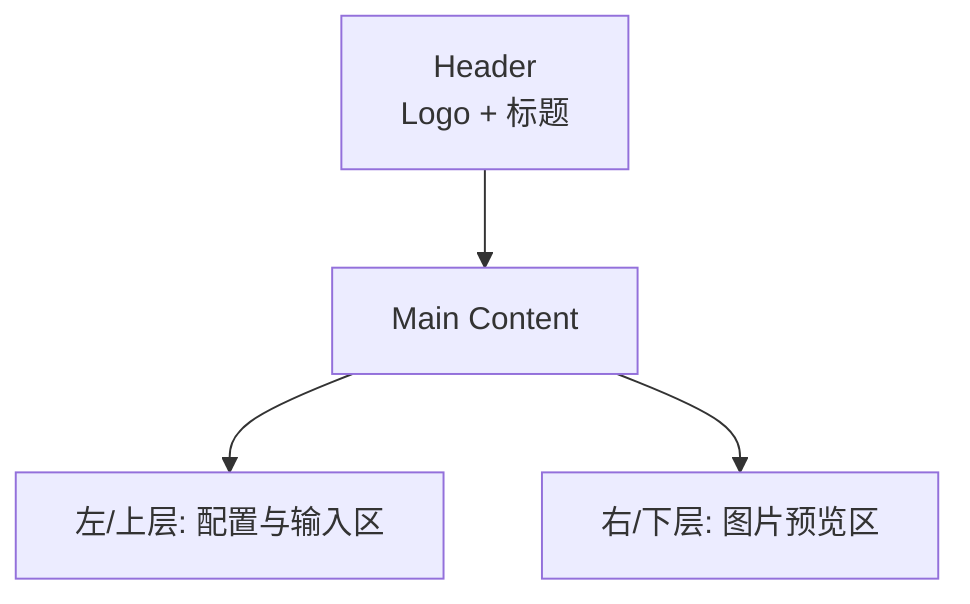

# 图片生成工具 UI 设计规范

## 1. 项目设计风格定位

- **设计理念**: 极简克制，专业质感，以效率为核心
- **视觉调性**: 高级低饱和色系，干净有序的布局，层次分明的组件
- **产品类型**: B端企业级工具类应用
- **目标用户**: 需要AI图片生成能力的开发者、内容创作者
- **HVD应用方向**: 聚焦低饱和配色、精细阴影层次、流畅交互反馈

---

## 2. 色彩 Specifications

### 主色调
| 用途 | 色值 | 说明 |
|------|------|------|
| 主色 | `#2563EB` | 蓝色系，传达科技感与可靠性 |
| 主色hover | `#1D4ED8` | 按钮悬停状态 |
| 主色active | `#1E40AF` | 按钮点击状态 |

### 功能色
| 用途 | 色值 |
|------|------|
| 成功 | `#10B981` |
| 警告 | `#F59E0B` |
| 错误 | `#EF4444` |
| 信息 | `#3B82F6` |

### 中性色
| 色阶 | 色值 | 用途 |
|------|------|------|
| N900 | `#111827` | 标题、正文 |
| N700 | `#374151` | 次级文本 |
| N500 | `#6B7280` | 辅助文本、占位符 |
| N300 | `#D1D5DB` | 边框、分割线 |
| N200 | `#E5E7EB` | 浅背景、禁用态 |
| N100 | `#F3F4F6` | 卡片背景 |
| N50 | `#F9FAFB` | 页面背景 |
| White | `#FFFFFF` | 纯白 |

---

## 3. 字体 Specifications

| 层级 | 字号 | 行高 | 字重 | 用途 |
|------|------|------|------|------|
| H1 | 28px | 36px | 600 | 页面标题 |
| H2 | 20px | 28px | 600 | 模块标题 |
| Body | 14px | 22px | 400 | 正文、标签 |
| Small | 12px | 18px | 400 | 辅助说明、提示文字 |

- **字体族**: -apple-system, BlinkMacSystemFont, "Segoe UI", Roboto, "Helvetica Neue", Arial
- **中文**: PingFang SC, Microsoft YaHei

---

## 4. 布局与间距网格 Specifications

| 项目 | 数值 |
|------|------|
| 页面最大宽度 | 1200px |
| 基础间距单位 | 4px |
| 常用间距 | 8px, 16px, 24px, 32px, 48px |
| 卡片内边距 | 24px |
| 组件间距 | 16px |

---

## 5. 圆角、阴影、边框统一规范

### 圆角
| 组件 | 圆角值 |
|------|--------|
| 按钮 | 8px |
| 输入框 | 8px |
| 卡片 | 12px |
| 图片预览框 | 12px |

### 阴影
| 层级 | 阴影值 | 用途 |
|------|--------|------|
| 轻阴影 | `0 1px 2px 0 rgba(0, 0, 0, 0.05)` | 输入框、常规组件 |
| 中阴影 | `0 4px 6px -1px rgba(0, 0, 0, 0.1), 0 2px 4px -1px rgba(0, 0, 0, 0.06)` | 卡片、弹窗 |
| 悬浮阴影 | `0 10px 15px -3px rgba(0, 0, 0, 0.1), 0 4px 6px -2px rgba(0, 0, 0, 0.05)` | 按钮hover、卡片hover |

### 边框
| 用途 | 色值 | 宽度 |
|------|------|------|
| 默认边框 | `#E5E7EB` | 1px |
| 聚焦边框 | `#2563EB` | 2px |
| 错误边框 | `#EF4444` | 2px |

---

## 6. 全局导航与菜单结构设计

- **布局结构**: 单页面应用，居中卡片式布局
- **顶部**: Logo + 标题
- **主体**: 左右分栏 / 上下分层布局
- **底部**: 版权信息（可选）



---

## 7. 核心页面布局设计

### 主页面布局

```
┌─────────────────────────────────────────────────────────────┐
│  [Logo]  AI Image Generator                          │
├─────────────────────────────────────────────────────────────┤
│                                                             │
│  ┌─────────────────────┐    ┌─────────────────────┐        │
│  │  API KEY 设置       │    │                     │        │
│  │  [输入框] [保存]    │    │    图片预览区       │        │
│  │                     │    │   (512x512 占位)    │        │
│  │  图片描述           │    │                     │        │
│  │  ┌───────────────┐ │    │                     │        │
│  │  │  文本框       │ │    │                     │        │
│  │  │               │ │    └─────────────────────┘        │
│  │  └───────────────┘ │    [下载图片按钮]                 │
│  │                     │                                     │
│  │  [生成图片按钮]    │                                     │
│  └─────────────────────┘                                     │
│                                                             │
└─────────────────────────────────────────────────────────────┘
```

### 响应式断点
| 屏幕尺寸 | 布局 |
|----------|------|
| ≥ 1024px | 左右分栏 |
| < 1024px | 上下分层 |

---

## 8. 通用组件库设计规范

### 8.1 输入框 (Input)

| 属性 | 规格 |
|------|------|
| 高度 | 44px |
| 内边距 | 12px 16px |
| 字号 | 14px |
| 圆角 | 8px |
| 边框 | 1px solid `#E5E7EB` |
| focus边框 | 2px solid `#2563EB` |
| 背景 | `#FFFFFF` |

### 8.2 文本域 (Textarea)

| 属性 | 规格 |
|------|------|
| 最小高度 | 120px |
| 内边距 | 12px 16px |
| 字号 | 14px |
| 圆角 | 8px |
| 边框 | 1px solid `#E5E7EB` |
| 可调整大小 | vertical only |

### 8.3 按钮 (Button)

| 类型 | 高度 | 内边距 | 字号 | 圆角 |
|------|------|--------|------|------|
| 主按钮 | 44px | 16px 32px | 14px | 8px |
| 次按钮 | 44px | 16px 32px | 14px | 8px |

**主按钮样式**:
- 默认: 背景 `#2563EB`，文字白色
- Hover: 背景 `#1D4ED8`
- Active: 背景 `#1E40AF`
- Disabled: 背景 `#D1D5DB`，文字 `#9CA3AF`

### 8.4 卡片 (Card)

| 属性 | 规格 |
|------|------|
| 背景 | `#FFFFFF` |
| 圆角 | 12px |
| 阴影 | `0 4px 6px -1px rgba(0, 0, 0, 0.1), 0 2px 4px -1px rgba(0, 0, 0, 0.06)` |
| 内边距 | 24px |

### 8.5 图片预览框

| 属性 | 规格 |
|------|------|
| 尺寸 | 512px x 512px（最大） |
| 背景 | `#F9FAFB` |
| 圆角 | 12px |
| 边框 | 1px dashed `#D1D5DB`（占位态） |

---

## 9. 交互状态规范

### 加载状态
- 生成按钮显示loading动画，文字变为"生成中..."
- 图片预览区显示骨架屏或旋转加载图标

### 空状态
- 图片预览区显示占位图标 + 提示文字"输入描述并点击生成"

### 错误状态
- 输入框边框变红
- 下方显示红色错误提示文字
- 按钮恢复可点击状态

### 成功状态
- 图片正常展示
- 下载按钮高亮可用

---

## 10. 前端开发实现注意事项

1. **色彩还原**: 严格使用指定的十六进制色值
2. **间距控制**: 使用 4px 基础单位的倍数
3. **字体层级**: 确保标题、正文、辅助文字层级分明
4. **交互反馈**: 所有可交互元素必须有 hover、active、disabled 状态
5. **图片占位**: 使用 `#F9FAFB` 背景 + 虚线边框
6. **本地存储**: API KEY 存储在 localStorage，key 命名为 `IMAGE_GENERATOR_API_KEY`
7. **响应式**: 1024px 为断点切换布局
8. **加载动画**: 使用 CSS 实现，避免引入额外动画库

---

**文档版本**: v1.0
**创建日期**: 2026-05-08
**设计标准**: high-end-visual-design (HVD)
