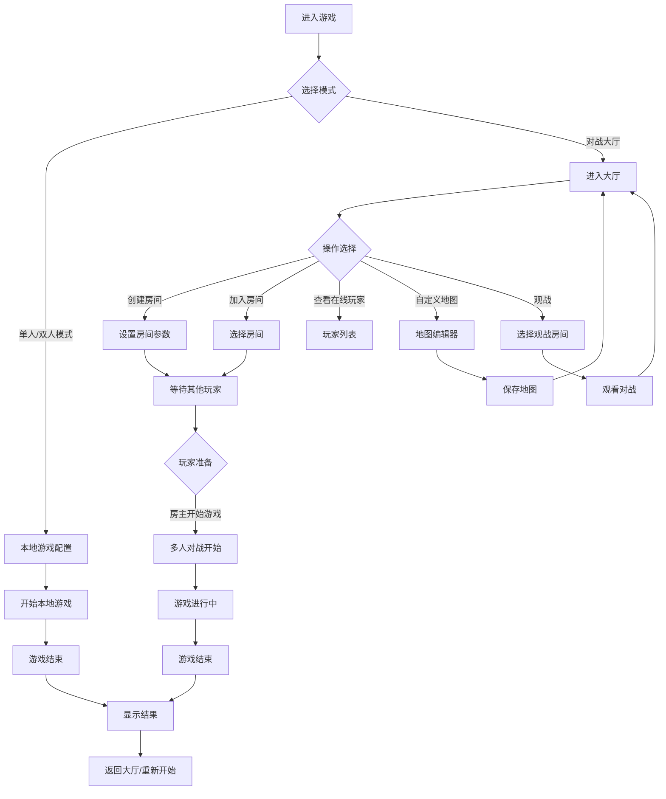
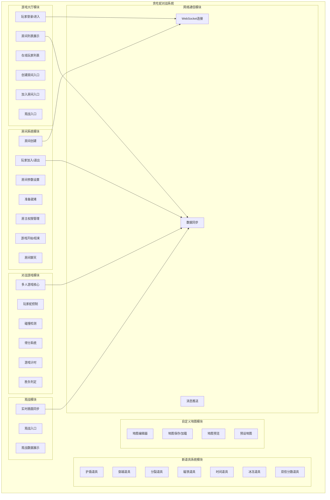
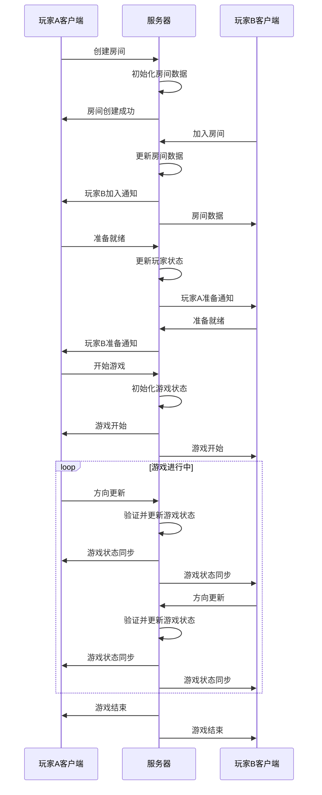

# 贪吃蛇游戏玩家对战大厅功能需求与系统设计文档

## 1 项目概述

### 1.1 项目背景
贪吃蛇是一款经典的休闲游戏，深受各年龄段玩家喜爱。本项目在现有贪吃蛇游戏的基础上，新增玩家对战大厅功能，支持多人在线对战、房间系统、多样化的新道具以及自定义地图功能，为玩家提供更丰富、更有趣的社交对战体验。

### 1.2 建设目标
- 实现游戏大厅功能，支持查看在线玩家、发起对战、观战
- 构建完整的房间系统，支持创建房间、加入房间、房主权限管理、准备就绪
- 新增7种新食物道具系统：护盾、穿越、分裂、磁铁、时间、冰冻、双倍分数
- 实现自定义地图功能，支持玩家设计和导入地图
- 保留并优化现有单人/双人游戏模式
- 确保多人对战的实时性和稳定性
- 提供流畅的用户交互体验

### 1.3 适用范围
本游戏适用于Web浏览器环境，支持PC端，支持在线多人对战模式，通过键盘操作。

### 1.4 读者对象
- 产品经理
- UI/UX设计师
- 前端开发工程师
- 后端开发工程师
- 测试工程师
- 项目管理人员

## 2 业务需求概述

### 2.1 业务场景

#### 场景1：游戏大厅
玩家进入游戏大厅，查看在线玩家列表，选择对战模式，发起对战邀请或加入现有房间。

#### 场景2：房间系统
玩家创建房间或加入房间，房主设置房间参数，玩家准备就绪后开始游戏。

#### 场景3：多人对战
2-4名玩家在同一游戏区域进行对战，收集食物道具，避免碰撞，比拼得分。

#### 场景4：观战模式
玩家进入房间观战，实时观看房间内的对战情况。

#### 场景5：新道具使用
玩家在游戏中收集各类新道具，利用道具获得战术优势。

#### 场景6：自定义地图
玩家设计自定义地图并保存，在对战中使用自定义地图进行游戏。

#### 场景7：单人/双人模式
玩家仍可选择传统的单人或双人本地模式进行游戏。

### 2.2 用户角色与职责

| 角色 | 职责 |
|------|------|
| 普通玩家 | 进入大厅、创建/加入房间、准备游戏、进行对战、使用道具、设计地图 |
| 房主 | 创建房间、设置房间参数、管理房间成员、开始/结束游戏、踢出玩家 |
| 观战者 | 进入房间观战、查看对战情况 |
| 系统 | 匹配玩家、管理房间状态、同步游戏数据、处理道具效果 |

### 2.3 业务核心痛点
- 现有游戏仅支持本地单人/双人模式，缺乏在线对战功能
- 缺少社交互动元素，无法与其他玩家竞技
- 道具类型有限，玩法不够丰富
- 地图固定，缺乏自定义和多样性
- 房间管理功能缺失

### 2.4 整体业务流程



## 3 功能需求

### 3.1 整体功能模块架构



### 3.2 各模块详细功能清单

#### 3.2.1 游戏大厅模块

| 功能编号 | 功能名称 | 功能描述 |
|----------|----------|----------|
| H1.1 | 玩家进入大厅 | 玩家登录或匿名进入游戏大厅 |
| H1.2 | 在线玩家列表 | 显示当前在线的所有玩家信息 |
| H1.3 | 房间列表 | 显示所有可加入的房间信息 |
| H1.4 | 创建房间 | 玩家创建新的游戏房间 |
| H1.5 | 快速匹配 | 系统自动匹配玩家进入房间 |
| H1.6 | 观战大厅 | 显示可观战的房间列表 |
| H1.7 | 游戏模式切换 | 在大厅/本地模式间切换 |

#### 3.2.2 房间系统模块

| 功能编号 | 功能名称 | 功能描述 |
|----------|----------|----------|
| R2.1 | 房间创建 | 玩家创建房间并设置参数 |
| R2.2 | 房间参数设置 | 设置游戏模式、地图、时间限制等 |
| R2.3 | 玩家加入/退出 | 其他玩家加入或退出房间 |
| R2.4 | 准备就绪 | 玩家标记自己准备就绪 |
| R2.5 | 房主权限 | 房主可开始游戏、踢人、修改设置 |
| R2.6 | 房间信息展示 | 显示房间成员、准备状态、设置等 |
| R2.7 | 房间聊天 | 房间内玩家实时聊天 |
| R2.8 | 游戏开始 | 所有玩家准备后房主开始游戏 |
| R2.9 | 房间解散 | 游戏结束或房主解散房间 |

#### 3.2.3 对战游戏模块

| 功能编号 | 功能名称 | 功能描述 |
|----------|----------|----------|
| G3.1 | 多人游戏初始化 | 初始化多人对战环境 |
| G3.2 | 玩家蛇控制 | 各玩家独立控制自己的蛇 |
| G3.3 | 实时数据同步 | 同步所有玩家的游戏状态 |
| G3.4 | 碰撞检测 | 检测撞墙、撞自己、撞其他玩家 |
| G3.5 | 食物生成 | 在游戏区域生成各类食物 |
| G3.6 | 得分系统 | 计算和显示各玩家得分 |
| G3.7 | 游戏计时 | 统计游戏时间 |
| G3.8 | 胜负判定 | 判定游戏胜负并显示结果 |
| G3.9 | 游戏暂停/继续 | 支持游戏暂停和继续 |

#### 3.2.4 新道具系统模块

| 功能编号 | 功能名称 | 功能描述 |
|----------|----------|----------|
| I4.1 | 护盾道具 | 提供护盾，可抵挡一次碰撞 |
| I4.2 | 穿越道具 | 可穿越墙壁一次 |
| I4.3 | 分裂道具 | 蛇身分裂成两条 |
| I4.4 | 磁铁道具 | 吸引附近食物 |
| I4.5 | 时间道具 | 增加游戏时间 |
| I4.6 | 冰冻道具 | 冰冻其他玩家 |
| I4.7 | 双倍分数道具 | 得分翻倍 |

#### 3.2.5 自定义地图模块

| 功能编号 | 功能名称 | 功能描述 |
|----------|----------|----------|
| M5.1 | 地图编辑器 | 可视化编辑自定义地图 |
| M5.2 | 墙壁绘制 | 在地图上绘制墙壁 |
| M5.3 | 预设地图 | 提供多种预设地图选择 |
| M5.4 | 地图保存 | 保存自定义地图到本地 |
| M5.5 | 地图加载 | 加载已保存的地图 |
| M5.6 | 地图预览 | 预览地图效果 |
| M5.7 | 地图分享 | 分享自定义地图给其他玩家 |

#### 3.2.6 观战模块

| 功能编号 | 功能名称 | 功能描述 |
|----------|----------|----------|
| W6.1 | 观战入口 | 从大厅进入观战模式 |
| W6.2 | 实时画面同步 | 实时同步游戏画面给观战者 |
| W6.3 | 观战数据展示 | 显示对战双方的得分、状态等 |
| W6.4 | 切换视角 | 观战者可切换观看不同玩家的视角 |

#### 3.2.7 网络通信模块

| 功能编号 | 功能名称 | 功能描述 |
|----------|----------|----------|
| N7.1 | WebSocket连接 | 建立和维护与服务器的连接 |
| N7.2 | 状态同步 | 实时同步游戏状态 |
| N7.3 | 消息推送 | 接收服务器推送的消息 |
| N7.4 | 断线重连 | 网络断线后自动重连 |
| N7.5 | 延迟补偿 | 处理网络延迟问题 |

### 3.3 单个功能详细描述、输入、输出、业务规则

#### H1.1 玩家进入大厅

**功能描述**：玩家进入游戏大厅，系统分配唯一标识。

**输入**：
- 可选：玩家昵称输入
- 网络连接

**输出**：
- 进入大厅界面
- 显示在线玩家和房间列表

**业务规则**：
- 支持匿名进入，系统自动分配昵称
- 支持自定义昵称，长度限制2-20字符
- 进入大厅后显示为在线状态
- 断线后显示离线状态

#### H1.2 在线玩家列表

**功能描述**：显示当前在线的所有玩家信息。

**输入**：无

**输出**：
- 玩家列表：昵称、状态（空闲/游戏中）、加入时间

**业务规则**：
- 按进入时间排序或字母排序
- 实时更新玩家状态
- 显示在线人数统计

#### H1.3 房间列表

**功能描述**：显示所有可加入的房间信息。

**输入**：无

**输出**：
- 房间列表：房间名、房主、人数/上限、地图、状态

**业务规则**：
- 只显示等待中的房间
- 已满房间显示为灰色不可加入
- 可按人数、地图类型筛选

#### H1.4 创建房间

**功能描述**：玩家创建新的游戏房间。

**输入**：
- 房间名称（可选，默认使用玩家昵称的房间）
- 最大玩家数（2-4人）
- 游戏地图选择
- 游戏时间限制
- 是否开启道具
- 是否允许观战

**输出**：
- 创建成功，进入房间界面
- 房间显示在大厅列表中

**业务规则**：
- 创建者自动成为房主
- 房间名称最长30字符
- 默认最大玩家数为2人
- 默认地图为经典地图
- 默认时间限制为5分钟

#### R2.1 房间创建

**功能描述**：玩家创建新的游戏房间，成为房主。

**输入**：
- 房间配置参数（见H1.4）

**输出**：
- 房间创建成功
- 房主权限授予

**业务规则**：
- 一个玩家同时只能创建或加入一个房间
- 房间创建后立即在大厅可见
- 房主可随时解散房间

#### R2.2 房间参数设置

**功能描述**：房主设置房间的游戏参数。

**输入**：
- 最大玩家数（2-4人）
- 地图选择（经典/自定义）
- 游戏时间（3/5/10分钟）
- 道具开关
- 观战开关
- 胜利条件（时间到/存活到最后）

**输出**：
- 房间参数更新
- 房间内所有玩家可见

**业务规则**：
- 只有房主可修改参数
- 游戏开始后不能修改参数
- 参数修改实时同步给所有房间成员

#### R2.3 玩家加入/退出

**功能描述**：其他玩家加入或退出房间。

**输入**：
- 点击加入房间
- 点击退出房间

**输出**：
- 加入/退出成功
- 房间成员列表更新

**业务规则**：
- 房间满员后不能加入
- 游戏进行中不能加入
- 退出后准备状态重置
- 房主退出后房间解散或转让房主

#### R2.4 准备就绪

**功能描述**：玩家标记自己准备就绪。

**输入**：
- 点击准备按钮

**输出**：
- 准备状态切换
- 其他玩家可见准备状态

**业务规则**：
- 可随时切换准备/未准备状态
- 游戏开始后准备状态失效
- 所有非房主玩家准备后房主可开始游戏

#### R2.5 房主权限

**功能描述**：房主拥有房间管理权限。

**输入**：
- 点击开始游戏
- 点击踢出玩家
- 点击修改设置
- 点击解散房间
- 点击转让房主

**输出**：
- 相应操作执行

**业务规则**：
- 只有房主可开始游戏
- 房主可踢出未准备的玩家
- 房主可转让房主给其他玩家
- 房主解散房间后所有人返回大厅

#### R2.6 房间信息展示

**功能描述**：显示房间的详细信息。

**输入**：无

**输出**：
- 房间基本信息（名称、地图、时间）
- 成员列表（昵称、准备状态、角色）
- 聊天窗口
- 操作按钮

**业务规则**：
- 房主显示特殊标识
- 准备状态用不同颜色标识
- 实时更新信息

#### R2.7 房间聊天

**功能描述**：房间内玩家进行实时聊天。

**输入**：
- 输入聊天内容
- 按回车发送

**输出**：
- 消息显示在聊天窗口
- 所有房间成员可见

**业务规则**：
- 消息长度限制100字符
- 支持简单表情
- 显示发送者昵称和时间
- 游戏进行中仍可聊天

#### I4.1 护盾道具

**功能描述**：提供护盾，可抵挡一次致命碰撞。

**输入**：
- 蛇头吃到护盾道具

**输出**：
- 护盾状态激活
- 护盾图标显示

**业务规则**：
- 护盾最多可叠加3层
- 每次碰撞消耗一层护盾
- 护盾持续30秒，超时失效
- 有护盾时蛇身有特殊视觉效果

#### I4.2 穿越道具

**功能描述**：可穿越墙壁一次，从另一边出来。

**输入**：
- 蛇头吃到穿越道具
- 蛇头撞墙

**输出**：
- 穿越状态激活
- 撞墙时从对面出现

**业务规则**：
- 穿越次数最多叠加2次
- 每次穿越墙壁消耗一次
- 穿越效果持续20秒
- 只能穿越边界墙，不能穿越内部墙壁

#### I4.3 分裂道具

**功能描述**：蛇身分裂成两条独立控制的蛇。

**输入**：
- 蛇头吃到分裂道具

**输出**：
- 蛇分裂成两条
- 两条蛇同时移动

**业务规则**：
- 分裂后两条蛇共用控制方向
- 两条蛇的得分合并计算
- 任意一条蛇死亡，玩家游戏结束
- 分裂效果持续15秒
- 最多分裂一次

#### I4.4 磁铁道具

**功能描述**：吸引附近的食物自动向蛇靠近。

**输入**：
- 蛇头吃到磁铁道具

**输出**：
- 磁铁效果激活
- 附近食物向蛇移动

**业务规则**：
- 吸引范围为5格半径
- 磁铁效果持续10秒
- 只吸引食物，不吸引其他蛇
- 食物移动速度较慢

#### I4.5 时间道具

**功能描述**：增加游戏剩余时间。

**输入**：
- 蛇头吃到时间道具

**输出**：
- 游戏时间增加
- 时间显示更新

**业务规则**：
- 每个时间道具增加30秒
- 时间道具在有时间限制的模式下才生效
- 无时间限制模式下该道具不出现

#### I4.6 冰冻道具

**功能描述**：冰冻其他玩家的蛇，使其暂时无法移动。

**输入**：
- 蛇头吃到冰冻道具

**输出**：
- 冰冻效果激活
- 随机选择一名其他玩家冰冻

**业务规则**：
- 冰冻持续3秒
- 冰冻期间蛇身变色
- 2人模式下冰冻对方
- 多人模式下随机冰冻一人
- 不能连续冰冻同一玩家

#### I4.7 双倍分数道具

**功能描述**：一段时间内得分翻倍。

**输入**：
- 蛇头吃到双倍分数道具

**输出**：
- 双倍分数效果激活
- 得分计算翻倍

**业务规则**：
- 效果持续15秒
- 所有食物得分翻倍
- 效果可叠加（最多4倍）
- 有视觉特效提示

#### M5.1 地图编辑器

**功能描述**：可视化编辑自定义游戏地图。

**输入**：
- 点击墙壁工具
- 在网格上点击/拖拽绘制
- 橡皮擦工具擦除
- 保存按钮

**输出**：
- 地图实时预览
- 地图数据保存

**业务规则**：
- 地图尺寸与游戏区域一致
- 墙壁不能完全封闭
- 至少保留一条通路
- 可保存多个地图

#### M5.2 墙壁绘制

**功能描述**：在地图网格上绘制墙壁。

**输入**：
- 选择墙壁工具
- 鼠标点击/拖拽

**输出**：
- 墙壁绘制在地图上

**业务规则**：
- 墙壁为不可穿越障碍
- 墙壁占一个网格
- 可使用橡皮擦工具擦除

#### M5.3 预设地图

**功能描述**：提供多种预设地图供选择。

**输入**：
- 选择预设地图

**输出**：
- 加载选中的预设地图

**业务规则**：
- 至少提供5种预设地图
- 预设地图包括：经典、迷宫、环形、障碍场、开放式
- 可预览预设地图

#### M5.4 地图保存

**功能描述**：保存自定义地图到本地。

**输入**：
- 地图名称
- 点击保存

**输出**：
- 地图保存成功

**业务规则**：
- 地图名称最长20字符
- 最多保存10张自定义地图
- 保存格式为JSON
- 保存到localStorage

#### W6.1 观战入口

**功能描述**：从大厅进入观战模式。

**输入**：
- 点击观战房间

**输出**：
- 进入观战界面

**业务规则**：
- 观战不影响游戏进行
- 观战者无数量限制
- 房间需开启观战权限

#### W6.2 实时画面同步

**功能描述**：实时同步游戏画面给观战者。

**输入**：无

**输出**：
- 游戏画面实时显示
- 所有玩家的蛇和食物显示

**业务规则**：
- 画面延迟不超过200ms
- 显示所有玩家信息
- 观战者不能操作

#### W6.3 观战数据展示

**功能描述**：显示对战的详细数据。

**输入**：无

**输出**：
- 各玩家得分
- 游戏时间
- 玩家状态

**业务规则**：
- 实时更新数据
- 清晰易读

### 3.4 页面/交互简要说明

#### 3.4.1 主菜单页面
- 标题：贪吃蛇对战版
- 按钮：单人模式、双人模式、对战大厅、自定义地图
- 设置：音量、音效开关

#### 3.4.2 游戏大厅页面
- 顶部：在线人数、刷新按钮
- 左侧：在线玩家列表
- 中间：房间列表（房间名、房主、人数、状态）
- 右侧：操作区（创建房间、快速匹配）
- 底部：观战大厅入口

#### 3.4.3 房间页面
- 顶部：房间信息（名称、地图、时间）
- 左侧：成员列表（头像、昵称、准备状态）
- 中间：游戏预览区（等待时显示）
- 右侧：聊天窗口
- 底部：操作按钮（准备、退出、房主专属按钮）

#### 3.4.4 多人对战页面
- 游戏画布：显示所有玩家的蛇、食物、墙壁
- 顶部信息栏：各玩家得分、游戏时间、道具状态
- 右侧：聊天窗口、道具栏
- 暂停/继续按钮

#### 3.4.5 地图编辑器页面
- 左侧：工具栏（墙壁、橡皮擦、清空、保存）
- 中间：编辑画布
- 右侧：预设地图选择、已保存地图列表
- 底部：操作按钮（保存、加载、返回）

#### 3.4.6 观战页面
- 游戏画布：实时显示对战画面
- 顶部：观战房间信息
- 底部：切换视角按钮（各玩家视角）

## 4 非功能需求

### 4.1 性能需求
- 游戏帧率不低于60FPS
- 网络延迟不超过100ms
- 房间状态同步延迟不超过50ms
- 页面加载时间不超过3s
- 支持同时至少50个在线房间
- 每个房间最多支持4名玩家+不限观战者
- 断线重连时间不超过3s

### 4.2 安全需求
- 防止XSS攻击
- 输入验证（昵称、房间名、聊天内容）
- 游戏逻辑服务器端验证，防止作弊
- WebSocket连接加密
- 防止恶意刷屏（聊天消息频率限制）
- 用户数据本地存储加密

### 4.3 兼容性需求
- 支持Chrome、Firefox、Safari、Edge主流浏览器最新版
- 支持Windows、MacOS、Linux操作系统
- 响应式设计，适配不同屏幕尺寸
- 支持键盘操作，无需鼠标

### 4.4 可扩展与可维护性
- 前后端分离架构
- 代码模块化设计
- 注释清晰完整
- 易于添加新道具类型
- 易于添加新地图
- 易于扩展游戏模式

### 4.5 部署与运维需求
- 后端使用Node.js + WebSocket
- 前端使用React + Vite
- 支持Docker部署
- 日志记录完整
- 监控在线人数、房间数等指标

## 5 数据与数据库设计

### 5.1 核心数据实体

#### 玩家实体
- 用户ID
- 昵称
- 在线状态
- 当前房间ID
- 准备状态
- 角色（房主/普通玩家）

#### 房间实体
- 房间ID
- 房间名称
- 房主ID
- 最大玩家数
- 当前玩家数
- 地图
- 游戏时间
- 道具开关
- 观战开关
- 房间状态（等待/游戏中）
- 创建时间

#### 蛇实体
- 玩家ID
- 位置坐标数组
- 移动方向
- 当前速度
- 颜色
- 长度
- 护盾层数
- 穿越次数
- 是否冰冻
- 双倍分数状态
- 是否存活

#### 食物实体
- 位置坐标
- 类型
- 颜色
- 生成时间

#### 地图实体
- 地图ID
- 地图名称
- 墙壁数据
- 创建时间
- 是否预设

#### 游戏状态实体
- 房间ID
- 游戏状态
- 剩余时间
- 玩家数据数组
- 食物数据数组
- 当前回合

### 5.2 主要数据结构设计

#### 玩家数据结构
```typescript
interface Player {
  id: string;
  nickname: string;
  online: boolean;
  roomId?: string;
  ready: boolean;
  isOwner: boolean;
  joinedAt: number;
}
```

#### 房间数据结构
```typescript
interface Room {
  id: string;
  name: string;
  ownerId: string;
  maxPlayers: number;
  currentPlayers: number;
  map: string;
  gameTime: number;
  itemsEnabled: boolean;
  spectateEnabled: boolean;
  status: 'waiting' | 'playing';
  createdAt: number;
  players: string[];
}
```

#### 多人游戏蛇数据结构
```typescript
interface MultiplayerSnake {
  playerId: string;
  positions: Position[];
  direction: Direction;
  speed: number;
  color: string;
  length: number;
  shieldCount: number;
  phaseCount: number;
  frozen: boolean;
  frozenTime: number;
  doubleScore: boolean;
  doubleScoreTime: number;
  isAlive: boolean;
  score: number;
}
```

#### 食物数据结构（扩展）
```typescript
interface Food {
  x: number;
  y: number;
  type: FoodType;
  value: any;
  color: string;
  createdAt: number;
}
```

#### 地图数据结构
```typescript
interface MapData {
  id: string;
  name: string;
  width: number;
  height: number;
  walls: Position[];
  isPreset: boolean;
  createdAt: number;
}
```

#### 游戏状态数据结构
```typescript
interface GameState {
  roomId: string;
  status: 'waiting' | 'playing' | 'paused' | 'ended';
  remainingTime: number;
  snakes: MultiplayerSnake[];
  foods: Food[];
  map: MapData;
  startedAt?: number;
}
```

#### 聊天消息数据结构
```typescript
interface ChatMessage {
  id: string;
  roomId: string;
  playerId: string;
  playerName: string;
  content: string;
  timestamp: number;
}
```

### 5.3 数据流转关系



## 6 接口设计

### 6.1 WebSocket事件定义

#### 客户端发送事件

| 事件名 | 描述 | 数据格式 |
|--------|------|----------|
| join_lobby | 进入大厅 | { nickname: string } |
| create_room | 创建房间 | { name?: string, maxPlayers: number, map: string, gameTime: number, itemsEnabled: boolean, spectateEnabled: boolean } |
| join_room | 加入房间 | { roomId: string } |
| leave_room | 离开房间 | {} |
| ready | 准备就绪 | { ready: boolean } |
| start_game | 开始游戏 | {} |
| update_direction | 更新方向 | { direction: Direction } |
| send_chat | 发送聊天 | { content: string } |
| spectate | 开始观战 | { roomId: string } |
| stop_spectate | 停止观战 | {} |

#### 服务器推送事件

| 事件名 | 描述 | 数据格式 |
|--------|------|----------|
| lobby_update | 大厅更新 | { players: Player[], rooms: Room[] } |
| room_joined | 加入房间成功 | { room: Room, players: Player[] } |
| room_update | 房间更新 | { room: Room, players: Player[] } |
| player_joined | 玩家加入 | { player: Player } |
| player_left | 玩家离开 | { playerId: string } |
| chat_message | 聊天消息 | { message: ChatMessage } |
| game_start | 游戏开始 | { gameState: GameState } |
| game_state | 游戏状态同步 | { gameState: GameState } |
| game_end | 游戏结束 | { winner?: string, scores: Record&lt;string, number&gt; } |
| error | 错误通知 | { code: string, message: string } |

### 6.2 RESTful API（可选，用于历史记录等）

| 方法 | 路径 | 描述 |
|------|------|------|
| GET | /api/leaderboard | 获取排行榜 |
| GET | /api/maps/presets | 获取预设地图列表 |
| POST | /api/maps | 上传自定义地图 |
| GET | /api/maps/:id | 获取地图详情 |

## 7 约束与边界说明

### 7.1 技术约束
- 前端使用React + TypeScript + Vite
- 后端使用Node.js + ws（WebSocket库）
- 游戏画布使用Canvas实现
- 本地存储使用localStorage
- 支持Docker容器化部署

### 7.2 边界条件
- 最多4名玩家同时对战
- 房间最多等待10分钟自动解散
- 聊天消息频率限制：每秒最多1条
- 昵称长度2-20字符
- 房间名称最长30字符
- 蛇最大长度200节
- 同时显示的食物最多8个

### 7.3 性能边界
- 单服务器支持至少200同时在线玩家
- 单房间支持4玩家+不限观战者
- 游戏状态同步频率：每秒20次
- 消息处理延迟&lt;50ms

## 8 待确认问题与后续迭代规划

### 8.1 待确认问题
- 是否需要用户注册登录系统，还是支持匿名游玩？
- 是否需要排行榜和成就系统？
- 自定义地图是否支持分享和导入导出？
- 是否需要回放功能？
- 服务器的部署环境和规模要求？

### 8.2 后续迭代规划
- V2.1：添加排行榜和成就系统
- V2.2：添加游戏回放功能
- V2.3：添加更多道具类型
- V2.4：添加赛季和排位系统
- V2.5：添加战队和公会系统
