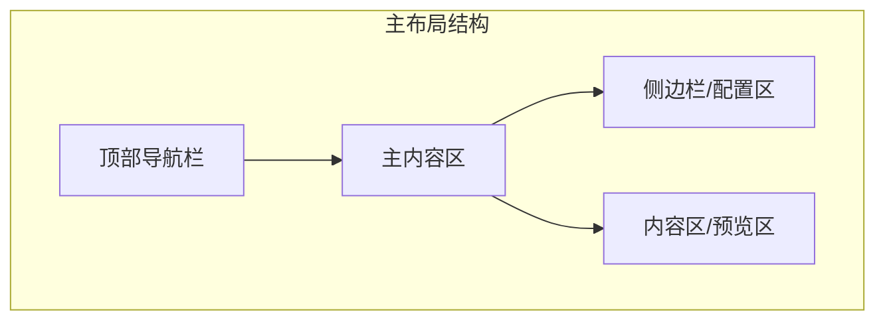
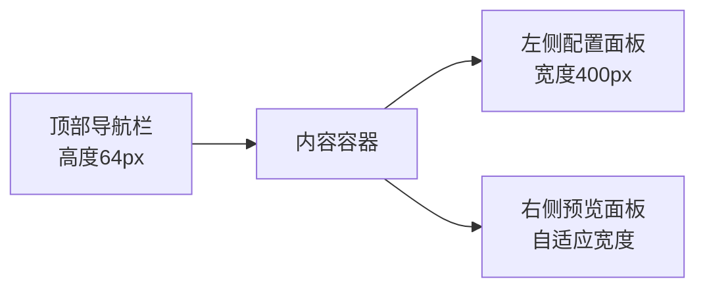
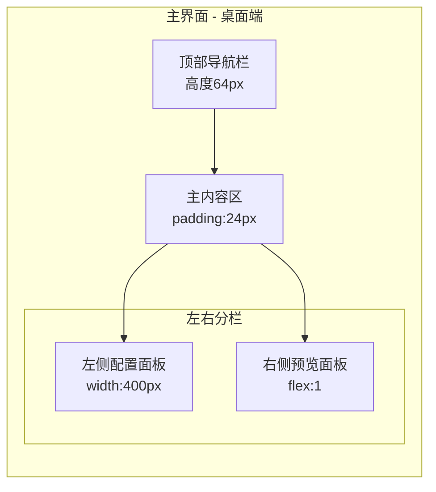
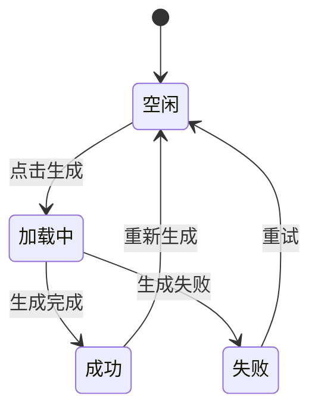
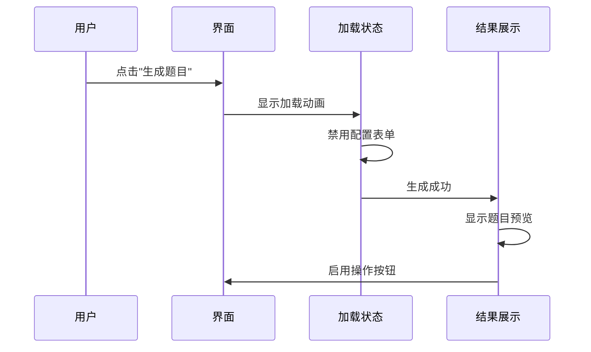

# 题目生成工具 - 高端企业级UI设计规范

**文档版本**: v1.0
**创建日期**: 2026-05-08
**设计标准**: high-end-visual-design (HVD)

---

## 1. 项目设计风格定位

### 1.1 HVD技能应用方向
本项目采用 **high-end-visual-design (简称HVD)** 高端视觉设计标准，以"专业质感、极简克制、高级适配"为核心设计理念，为教师、家长、学生用户提供简洁、高效、专业的题目生成工具界面。

### 1.2 设计关键词
- **极简克制** - 去除冗余装饰，保留核心功能
- **专业质感** - 低饱和度色彩搭配，精细的视觉层次
- **高效实用** - 清晰的信息层级，流畅的操作流程
- **现代商务** - 符合B端企业级产品的视觉标准

### 1.3 目标用户
- 教师群体 - 专业、高效、易用
- 家长群体 - 直观、友好、简洁
- 学生群体 - 现代、清晰、美观

---

## 2. 色彩规范

### 2.1 主色调
| 色彩 | Hex值 | RGB值 | 用途 |
|------|-------|-------|------|
| 主品牌色 | `#2563EB` | 37, 99, 235 | 主按钮、关键操作、强调元素 |
| 主品牌色(深) | `#1D4ED8` | 29, 78, 216 | 按钮hover、链接hover |
| 主品牌色(浅) | `#DBEAFE` | 219, 234, 254 | 选中态背景、轻量强调 |

### 2.2 辅助色
| 色彩 | Hex值 | RGB值 | 用途 |
|------|-------|-------|------|
| 成功色 | `#10B981` | 16, 185, 129 | 成功提示、完成状态 |
| 警告色 | `#F59E0B` | 245, 158, 11 | 警告提示、注意事项 |
| 错误色 | `#EF4444` | 239, 68, 68 | 错误提示、危险操作 |
| 信息色 | `#6366F1` | 99, 102, 241 | 信息提示、链接 |

### 2.3 中性色
| 色彩 | Hex值 | RGB值 | 用途 |
|------|-------|-------|------|
| 灰900 | `#111827` | 17, 24, 39 | 标题、正文、主要文字 |
| 灰700 | `#374151` | 55, 65, 81 | 次级标题、重要文字 |
| 灰500 | `#6B7280` | 107, 114, 128 | 辅助文字、说明文字 |
| 灰300 | `#D1D5DB` | 209, 213, 219 | 边框、分割线 |
| 灰200 | `#E5E7EB` | 229, 231, 235 | 输入框边框、禁用态 |
| 灰100 | `#F3F4F6` | 243, 244, 246 | 次要背景、卡片悬停 |
| 灰50 | `#F9FAFB` | 249, 250, 251 | 主背景、卡片背景 |
| 纯白 | `#FFFFFF` | 255, 255, 255 | 卡片背景、模态框背景 |

### 2.4 色彩使用原则
- 主色使用不超过页面元素的15%
- 中性色为主，彩色为辅
- 错误/成功状态色彩占比控制在5%以内
- 保持色彩一致性，避免随意新增颜色

---

## 3. 字体规范

### 3.1 字体家族
- **中文**: `PingFang SC`, `Microsoft YaHei`, `Noto Sans SC`, sans-serif
- **英文/数字**: `Inter`, `Roboto`, `Helvetica Neue`, Arial, sans-serif

### 3.2 字体大小与行高
| 层级 | 字体大小 | 行高 | 字重 | 用途 |
|------|----------|------|------|------|
| H1 | 32px | 40px | 600 | 页面标题 |
| H2 | 24px | 32px | 600 | 区块标题 |
| H3 | 20px | 28px | 600 | 卡片标题 |
| Body 1 | 16px | 24px | 400 | 正文、表单标签 |
| Body 2 | 14px | 20px | 400 | 辅助文字、说明 |
| Caption | 12px | 16px | 400 | 提示文字、标注 |

### 3.3 字重规范
| 字重 | 数值 | 用途 |
|------|------|------|
| Regular | 400 | 正文、辅助文字 |
| Medium | 500 | 按钮文字、标签 |
| Semibold | 600 | 标题、强调文字 |

---

## 4. 布局与间距网格规范

### 4.1 全局布局
- **最大宽度**: 1440px
- **最小宽度**: 320px
- **页面边距**: 24px (桌面端), 16px (平板/移动端)

### 4.2 栅格系统
采用 12 列响应式栅格系统：
| 断点 | 断点值 | 容器宽度 | 列间距 |
|------|--------|----------|--------|
| 桌面端 | ≥1200px | 1200px | 24px |
| 平板端 | 768px - 1199px | 720px | 20px |
| 移动端 | <768px | 100% | 16px |

### 4.3 间距原子值
| 间距值 | 说明 | 用途 |
|--------|------|------|
| 4px | XS | 元素内微调、图标间距 |
| 8px | S | 紧凑组件间距 |
| 12px | M | 表单元素间距 |
| 16px | L | 常规组件间距 |
| 24px | XL | 区块间距 |
| 32px | 2XL | 大区块间距 |
| 48px | 3XL | 页面区块间距 |

### 4.4 布局结构


---

## 5. 圆角、阴影、边框统一规范

### 5.1 圆角规范
| 圆角值 | 用途 |
|--------|------|
| 0px | 直角元素 |
| 4px | 按钮、输入框、卡片 |
| 8px | 弹窗、下拉菜单 |
| 12px | 大卡片、容器 |

### 5.2 阴影规范
| 层级 | 阴影值 | 用途 |
|------|--------|------|
| 阴影1 | `0 1px 2px rgba(0, 0, 0, 0.05)` | 卡片默认 |
| 阴影2 | `0 4px 6px -1px rgba(0, 0, 0, 0.1), 0 2px 4px -1px rgba(0, 0, 0, 0.06)` | 按钮悬停、卡片悬停 |
| 阴影3 | `0 10px 15px -3px rgba(0, 0, 0, 0.1), 0 4px 6px -2px rgba(0, 0, 0, 0.05)` | 弹窗、下拉菜单 |
| 阴影4 | `0 20px 25px -5px rgba(0, 0, 0, 0.1), 0 10px 10px -5px rgba(0, 0, 0, 0.04)` | 模态框 |

### 5.3 边框规范
| 边框 | 值 | 用途 |
|------|-----|------|
| 默认边框 | `1px solid #E5E7EB` | 输入框、卡片边框 |
| 聚焦边框 | `2px solid #2563EB` | 输入框聚焦 |
| 分割线 | `1px solid #F3F4F6` | 区块分割 |

---

## 6. 全局导航与菜单结构设计

### 6.1 顶部导航栏
- **高度**: 64px
- **背景**: #FFFFFF
- **下边框**: 1px solid #E5E7EB
- **左侧**: Logo + 产品名称
- **右侧**: 历史记录、帮助

### 6.2 页面结构


### 6.3 配置区结构
- LLM配置区域 - 可折叠
- 题目配置区域 - 始终显示
- 描述输入区域 - 始终显示
- 操作按钮区域 - 始终固定在底部

---

## 7. 核心页面逐页布局设计

### 7.1 主界面布局

#### 7.1.1 整体布局图


#### 7.1.2 左侧配置面板布局
| 区域 | 高度 | 说明 |
|------|------|------|
| LLM配置区 | 可折叠 | 模型、API KEY、API地址 |
| 题目配置区 | 约280px | 科目、题型、难度、年级 |
| 描述输入区 | 约160px | 文本输入框 |
| 生成按钮区 | 固定底部 | 生成题目按钮 |

#### 7.1.3 右侧预览面板布局
| 区域 | 说明 |
|------|------|
| 操作栏 | 重新生成、导出PDF、打印 |
| 题目预览区 | A4比例卡片展示题目 |
| PDF预览区 | PDF文档预览 |

### 7.2 响应式布局

#### 平板端 (768px - 1199px)
- 左右分栏改为上下布局
- 左侧配置面板宽度改为100%
- 右侧预览面板宽度改为100%

#### 移动端 (<768px)
- 单栏布局
- 配置表单垂直排列
- 预览区适配屏幕宽度

---

## 8. 通用组件库设计规范

### 8.1 配置表单组件

#### 8.1.1 输入框 (Input)
| 属性 | 值 |
|------|-----|
| 高度 | 40px |
| 圆角 | 4px |
| 边框 | 1px solid #E5E7EB |
| 内边距 | 0 12px |
| 字体 | 14px, 行高20px |
| placeholder颜色 | #9CA3AF |

**交互状态**：
| 状态 | 边框色 | 背景色 |
|------|--------|--------|
| 默认 | #E5E7EB | #FFFFFF |
| 悬停 | #D1D5DB | #FFFFFF |
| 聚焦 | #2563EB | #FFFFFF |
| 错误 | #EF4444 | #FEF2F2 |
| 禁用 | #E5E7EB | #F9FAFB |

#### 8.1.2 选择器 (Select)
| 属性 | 值 |
|------|-----|
| 高度 | 40px |
| 圆角 | 4px |
| 边框 | 1px solid #E5E7EB |
| 内边距 | 0 12px |
| 下拉菜单阴影 | 阴影2 |

#### 8.1.3 文本域 (Textarea)
| 属性 | 值 |
|------|-----|
| 最小高度 | 120px |
| 圆角 | 4px |
| 边框 | 1px solid #E5E7EB |
| 内边距 | 12px |
| 字体 | 14px, 行高20px |
| 可调整大小 | 垂直方向 |

### 8.2 按钮组件

#### 8.2.1 主按钮 (Primary Button)
| 属性 | 值 |
|------|-----|
| 高度 | 40px |
| 圆角 | 4px |
| 背景色 | #2563EB |
| 文字颜色 | #FFFFFF |
| 内边距 | 0 24px |
| 字体 | 14px, 字重500 |

**交互状态**：
| 状态 | 背景色 |
|------|--------|
| 默认 | #2563EB |
| 悬停 | #1D4ED8 |
| 点击 | #1E40AF |
| 加载 | #93C5FD |
| 禁用 | #93C5FD |

#### 8.2.2 次要按钮 (Secondary Button)
| 属性 | 值 |
|------|-----|
| 高度 | 40px |
| 圆角 | 4px |
| 背景色 | #FFFFFF |
| 边框 | 1px solid #E5E7EB |
| 文字颜色 | #374151 |
| 内边距 | 0 24px |
| 字体 | 14px, 字重500 |

#### 8.2.3 危险按钮 (Danger Button)
| 属性 | 值 |
|------|-----|
| 高度 | 40px |
| 圆角 | 4px |
| 背景色 | #EF4444 |
| 文字颜色 | #FFFFFF |

### 8.3 题目预览区组件

#### 8.3.1 预览卡片
| 属性 | 值 |
|------|-----|
| 背景 | #FFFFFF |
| 圆角 | 8px |
| 边框 | 1px solid #E5E7EB |
| 阴影 | 阴影1 |
| 内边距 | 32px |
| A4比例 | width: 210mm, height: 297mm (按比例缩放) |

#### 8.3.2 题目内容样式
| 元素 | 样式 |
|------|------|
| 题目序号 | 16px, 字重600, 颜色#111827 |
| 题目文本 | 15px, 行高24px, 颜色#374151 |
| 选项 | 14px, 行高22px, 颜色#374151 |
| 填空下划线 | 底部边框1px solid #374151, 宽度根据内容 |
| 答题空白 | 行高36px, 留出足够填写空间 |

### 8.4 PDF预览区组件

#### 8.4.1 PDF预览容器
| 属性 | 值 |
|------|-----|
| 背景 | #F3F4F6 |
| 圆角 | 8px |
| 内边距 | 24px |
| 页面卡片 | A4比例, 白色背景, 阴影1 |

---

## 9. 交互状态规范

### 9.1 加载状态


### 9.2 交互反馈

#### 9.2.1 按钮交互
| 状态 | 视觉反馈 |
|------|----------|
| 悬停 | 背景色变化 + 阴影2 |
| 点击 | 缩放0.98倍 |
| 加载 | 显示加载图标, 禁用交互 |

#### 9.2.2 表单交互
| 状态 | 视觉反馈 |
|------|----------|
| 输入聚焦 | 边框变为品牌色 + 内阴影 |
| 验证错误 | 边框红色 + 错误提示文字 |
| 验证成功 | 边框绿色 + 成功图标 |

#### 9.2.3 题目生成流程


### 9.3 空状态与错误状态

#### 9.3.1 空状态
- **图标**: 使用柔和的灰色图标
- **文字**: 14px, 颜色#6B7280
- **布局**: 垂直居中

#### 9.3.2 错误状态
- **图标**: 错误色图标
- **错误信息**: 14px, 颜色#EF4444
- **重试按钮**: 次要按钮

### 9.4 PDF导出交互
1. 点击"导出PDF"按钮
2. 显示加载状态
3. PDF生成完成后自动下载
4. 显示成功提示

### 9.5 打印交互
1. 点击"打印"按钮
2. 调用浏览器打印API
3. 显示打印预览对话框
4. 用户确认后打印

---

## 10. 前端开发实现注意事项

### 10.1 技术实现要点

#### 10.1.1 响应式实现
```css
/* 断点定义 */
:root {
  --breakpoint-sm: 640px;
  --breakpoint-md: 768px;
  --breakpoint-lg: 1024px;
  --breakpoint-xl: 1280px;
}

/* 移动端优先 */
.container {
  width: 100%;
  padding: 16px;
}

@media (min-width: 768px) {
  .container {
    padding: 24px;
  }
}
```

#### 10.1.2 组件实现规范
- 使用 TypeScript 定义完整类型
- 组件 props 使用 interface 定义
- 遵循单一职责原则
- 使用 CSS Modules 或 styled-components 管理样式

#### 10.1.3 A4预览实现
```css
/* A4比例预览卡片 */
.a4-preview {
  width: 100%;
  max-width: 794px;
  aspect-ratio: 210 / 297;
  background: #ffffff;
  box-shadow: 0 4px 6px -1px rgba(0, 0, 0, 0.1);
  border-radius: 8px;
  padding: 32px;
}

/* 打印样式 */
@media print {
  .no-print {
    display: none !important;
  }
  .a4-preview {
    max-width: 100%;
    box-shadow: none;
  }
}
```

### 10.2 性能优化要点
- 使用 React.memo 优化列表渲染
- 图片懒加载
- PDF生成使用 Web Worker
- 防抖处理输入事件

### 10.3 可访问性 (A11y)
- 所有交互元素有正确的 ARIA 属性
- 键盘导航支持
- 适当的颜色对比度
- 屏幕阅读器支持

### 10.4 动画规范
- 过渡时长: 150ms - 300ms
- 缓动函数: `cubic-bezier(0.4, 0, 0.2, 1)`
- 避免过度动画，保持专业感

### 10.5 开发规范检查清单
- [ ] 所有颜色使用 CSS 变量定义
- [ ] 响应式断点统一
- [ ] 组件状态完整（默认、悬停、聚焦、禁用、加载）
- [ ] 表单验证规则完整
- [ ] 加载状态、空状态、错误状态齐全
- [ ] 打印样式适配
- [ ] TypeScript 类型定义完整
- [ ] 代码注释清晰

---

**附录**: 设计资源
- Figma 设计稿 (待提供)
- 组件库代码示例
- 图标资源

---

**文档结束**
