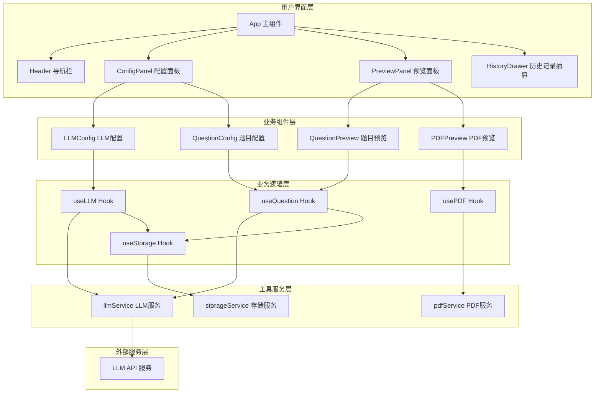

# 题目生成工具 - 技术方案设计文档

**文档版本**: v1.0
**创建日期**: 2026-05-08
**设计人**: 资深全栈架构师

---

## 1. 技术架构设计

### 1.1 整体技术栈选型

| 技术类别 | 选型 | 版本 | 说明 |
|---------|------|------|------|
| 前端框架 | React | ^18.3.0 | UI 组件化开发框架 |
| 编程语言 | TypeScript | ^5.4.0 | 类型安全的 JavaScript 超集 |
| 构建工具 | Vite | ^5.2.0 | 新一代前端构建工具 |
| UI 组件库 | Ant Design | ^5.16.0 | 企业级 React UI 组件库 |
| HTTP 客户端 | Axios | ^1.7.0 | 基于 Promise 的 HTTP 客户端 |
| PDF 生成 | html2pdf.js | ^0.10.1 | 将 HTML 转换为 PDF 的库 |
| 状态管理 | React Hooks + localStorage | - | 轻量级状态管理 |
| 代码规范 | ESLint + Prettier | - | 代码质量工具 |

### 1.2 系统架构图



### 1.3 目录结构设计

```
gendersj/
├── public/                      # 静态资源目录
│   └── favicon.ico
├── src/
│   ├── components/             # UI 组件
│   │   ├── Header.tsx         # 顶部导航栏
│   │   ├── ConfigPanel.tsx    # 配置面板
│   │   ├── PreviewPanel.tsx   # 预览面板
│   │   ├── LLMConfig.tsx      # LLM配置组件
│   │   ├── QuestionConfig.tsx # 题目配置组件
│   │   ├── QuestionPreview.tsx# 题目预览组件
│   │   └── HistoryDrawer.tsx  # 历史记录抽屉
│   ├── services/              # API 服务
│   │   ├── llmService.ts      # LLM API 调用
│   │   └── pdfService.ts      # PDF 生成服务
│   ├── utils/                 # 工具函数
│   │   ├── storage.ts         # localStorage 封装
│   │   ├── constants.ts       # 常量定义
│   │   └── format.ts          # 格式化工具
│   ├── types/                 # TypeScript 类型定义
│   │   └── index.ts
│   ├── hooks/                 # 自定义 Hooks
│   │   ├── useLLM.ts
│   │   ├── useQuestion.ts
│   │   ├── usePDF.ts
│   │   └── useStorage.ts
│   ├── styles/                # 样式文件
│   │   ├── index.css          # 全局样式
│   │   └── print.css          # 打印样式
│   ├── App.tsx                # 主应用组件
│   └── main.tsx               # 入口文件
├── package.json
├── tsconfig.json
├── vite.config.ts
└── README.md
```

---

## 2. 数据结构设计

### 2.1 核心类型定义

```typescript
// src/types/index.ts

// LLM配置类型
export interface LLMConfig {
  modelName: string;
  apiKey: string;
  apiUrl: string;
}

// 题目配置类型
export interface QuestionConfig {
  subject: string;
  type: string;
  difficulty: string;
  grade: string;
  description: string;
}

// 生成记录类型
export interface QuestionRecord {
  id: string;
  timestamp: number;
  subject: string;
  type: string;
  difficulty: string;
  grade: string;
  description: string;
  content: string;
}

// 题目生成状态
export interface GenerationState {
  isLoading: boolean;
  error: string | null;
  content: string | null;
}
```

### 2.2 常量定义

```typescript
// src/utils/constants.ts

export const SUBJECTS = [
  '数学', '英语', '物理', '化学', '生物', '历史', '地理', '政治'
];

export const QUESTION_TYPES = [
  '选择题', '判断题', '填空题', '简答题', '多选题', '单选题', '计算题', '应用题'
];

export const DIFFICULTIES = ['简单', '中等', '困难'];

export const GRADES = [
  '小学1年级', '小学2年级', '小学3年级', '小学4年级', '小学5年级', '小学6年级',
  '初中1年级', '初中2年级', '初中3年级',
  '高中1年级', '高中2年级', '高中3年级',
  '大学'
];

export const DEFAULT_LLM_CONFIG: LLMConfig = {
  modelName: 'gpt-3.5-turbo',
  apiKey: '',
  apiUrl: 'https://api.openai.com/v1/chat/completions'
};

export const STORAGE_KEYS = {
  LLM_CONFIG: 'llm_config',
  QUESTION_RECORDS: 'question_records'
};
```

---

## 3. 核心模块设计

### 3.1 LLM 服务模块

```typescript
// src/services/llmService.ts

import axios from 'axios';
import { LLMConfig, QuestionConfig } from '../types';

export class LLMService {
  private config: LLMConfig;

  constructor(config: LLMConfig) {
    this.config = config;
  }

  // 构建提示词
  private buildPrompt(config: QuestionConfig): string {
    const formatRequirements = this.getFormatRequirements(config.type);
    return `请根据以下要求生成题目：
- 科目：${config.subject}
- 题型：${config.type}
- 难度：${config.difficulty}
- 年级：${config.grade}
- 描述：${config.description}

格式要求：
${formatRequirements}

请直接输出题目内容，不需要其他说明文字。`;
  }

  // 获取格式要求
  private getFormatRequirements(type: string): string {
    const requirements = {
      '选择题': '每个题目提供A、B、C、D四个选项',
      '多选题': '每个题目提供A、B、C、D四个选项，标注为多选题',
      '单选题': '每个题目提供A、B、C、D四个选项，标注为单选题',
      '判断题': '每个题目后留出空白填写"对"或"错"',
      '填空题': '每个题目使用_____表示填空位置',
      '简答题': '每个题目后留出足够空白供书写答案',
      '计算题': '每个题目后留出足够空白供计算过程',
      '应用题': '每个题目后留出足够空白供解答过程'
    };
    return requirements[type as keyof typeof requirements] || '题目后留出适当空白';
  }

  // 生成题目
  async generateQuestions(config: QuestionConfig): Promise<string> {
    const prompt = this.buildPrompt(config);

    const response = await axios.post(
      this.config.apiUrl,
      {
        model: this.config.modelName,
        messages: [
          { role: 'system', content: '你是一个专业的题目生成助手，擅长生成各种科目的练习题。' },
          { role: 'user', content: prompt }
        ],
        temperature: 0.7
      },
      {
        headers: {
          'Content-Type': 'application/json',
          'Authorization': `Bearer ${this.config.apiKey}`
        },
        timeout: 30000
      }
    );

    return response.data.choices[0].message.content;
  }
}
```

### 3.2 PDF 服务模块

```typescript
// src/services/pdfService.ts

import html2pdf from 'html2pdf.js';
import { QuestionConfig } from '../types';

export class PDFService {
  // 生成 PDF
  static async generatePDF(
    content: string,
    config: QuestionConfig,
    elementId: string = 'pdf-content'
  ): Promise<void> {
    const element = document.getElementById(elementId);
    if (!element) return;

    const opt = {
      margin: [20, 20, 20, 20], // 上下左右边距
      filename: `${config.subject}_${config.grade}_题目.pdf`,
      image: { type: 'jpeg', quality: 0.98 },
      html2canvas: { scale: 2, useCORS: true },
      jsPDF: { unit: 'mm', format: 'a4', orientation: 'portrait' },
      pagebreak: { mode: 'avoid-all' }
    };

    await html2pdf().set(opt).from(element).save();
  }

  // 打印功能
  static print(): void {
    window.print();
  }
}
```

### 3.3 存储服务模块

```typescript
// src/utils/storage.ts

import { LLMConfig, QuestionRecord } from '../types';
import { STORAGE_KEYS, DEFAULT_LLM_CONFIG } from './constants';

export class StorageService {
  // 获取 LLM 配置
  static getLLMConfig(): LLMConfig {
    try {
      const data = localStorage.getItem(STORAGE_KEYS.LLM_CONFIG);
      return data ? JSON.parse(data) : DEFAULT_LLM_CONFIG;
    } catch {
      return DEFAULT_LLM_CONFIG;
    }
  }

  // 保存 LLM 配置
  static saveLLMConfig(config: LLMConfig): void {
    localStorage.setItem(STORAGE_KEYS.LLM_CONFIG, JSON.stringify(config));
  }

  // 获取历史记录
  static getHistory(): QuestionRecord[] {
    try {
      const data = localStorage.getItem(STORAGE_KEYS.QUESTION_RECORDS);
      return data ? JSON.parse(data) : [];
    } catch {
      return [];
    }
  }

  // 保存历史记录
  static saveHistory(record: QuestionRecord): void {
    const history = this.getHistory();
    history.unshift(record);
    // 只保留最近50条
    const limited = history.slice(0, 50);
    localStorage.setItem(STORAGE_KEYS.QUESTION_RECORDS, JSON.stringify(limited));
  }

  // 删除历史记录
  static deleteHistory(id: string): void {
    const history = this.getHistory();
    const filtered = history.filter(item => item.id !== id);
    localStorage.setItem(STORAGE_KEYS.QUESTION_RECORDS, JSON.stringify(filtered));
  }

  // 清空历史记录
  static clearHistory(): void {
    localStorage.removeItem(STORAGE_KEYS.QUESTION_RECORDS);
  }
}
```

---

## 4. 自定义 Hooks 设计

### 4.1 useLLM Hook

```typescript
// src/hooks/useLLM.ts

import { useState, useCallback } from 'react';
import { LLMConfig, QuestionConfig, GenerationState } from '../types';
import { LLMService } from '../services/llmService';

export function useLLM(config: LLMConfig) {
  const [state, setState] = useState<GenerationState>({
    isLoading: false,
    error: null,
    content: null
  });

  const generate = useCallback(async (questionConfig: QuestionConfig) => {
    if (!config.apiKey) {
      setState({
        isLoading: false,
        error: '请先配置 API KEY',
        content: null
      });
      return;
    }

    setState({
      isLoading: true,
      error: null,
      content: null
    });

    try {
      const service = new LLMService(config);
      const content = await service.generateQuestions(questionConfig);
      setState({
        isLoading: false,
        error: null,
        content
      });
    } catch (error: any) {
      setState({
        isLoading: false,
        error: error.message || '生成题目失败',
        content: null
      });
    }
  }, [config]);

  const clearContent = useCallback(() => {
    setState(prev => ({ ...prev, content: null, error: null }));
  }, []);

  return {
    ...state,
    generate,
    clearContent
  };
}
```

### 4.2 useStorage Hook

```typescript
// src/hooks/useStorage.ts

import { useState, useEffect, useCallback } from 'react';
import { LLMConfig, QuestionRecord } from '../types';
import { StorageService } from '../utils/storage';

export function useStorage() {
  const [llmConfig, setLLMConfig] = useState<LLMConfig>(StorageService.getLLMConfig);
  const [history, setHistory] = useState<QuestionRecord[]>(StorageService.getHistory);

  const saveLLMConfig = useCallback((config: LLMConfig) => {
    setLLMConfig(config);
    StorageService.saveLLMConfig(config);
  }, []);

  const saveToHistory = useCallback((record: QuestionRecord) => {
    StorageService.saveHistory(record);
    setHistory(StorageService.getHistory());
  }, []);

  const deleteFromHistory = useCallback((id: string) => {
    StorageService.deleteHistory(id);
    setHistory(StorageService.getHistory());
  }, []);

  const clearHistory = useCallback(() => {
    StorageService.clearHistory();
    setHistory([]);
  }, []);

  return {
    llmConfig,
    history,
    saveLLMConfig,
    saveToHistory,
    deleteFromHistory,
    clearHistory
  };
}
```

---

## 5. 关键组件实现方案

### 5.1 主应用组件 (App.tsx)

```typescript
// src/App.tsx

import { useState } from 'react';
import { Layout } from 'antd';
import Header from './components/Header';
import ConfigPanel from './components/ConfigPanel';
import PreviewPanel from './components/PreviewPanel';
import HistoryDrawer from './components/HistoryDrawer';
import { useStorage } from './hooks/useStorage';
import { useLLM } from './hooks/useLLM';
import { QuestionConfig } from './types';
import './styles/index.css';

const { Content } = Layout;

function App() {
  const { llmConfig, history, saveLLMConfig, saveToHistory, deleteFromHistory, clearHistory } = useStorage();
  const { isLoading, error, content, generate, clearContent } = useLLM(llmConfig);
  const [questionConfig, setQuestionConfig] = useState<QuestionConfig>({
    subject: '数学',
    type: '选择题',
    difficulty: '简单',
    grade: '小学1年级',
    description: ''
  });
  const [showHistory, setShowHistory] = useState(false);

  const handleGenerate = async () => {
    await generate(questionConfig);
  };

  const handleRegenerate = () => {
    handleGenerate();
  };

  const handleSaveToHistory = (content: string) => {
    const record = {
      id: Date.now().toString(),
      timestamp: Date.now(),
      ...questionConfig,
      content
    };
    saveToHistory(record);
  };

  const handleLoadHistory = (record: any) => {
    setQuestionConfig({
      subject: record.subject,
      type: record.type,
      difficulty: record.difficulty,
      grade: record.grade,
      description: record.description
    });
    // 这里可以直接设置 content
  };

  return (
    <Layout className="app-layout">
      <Header 
        onOpenHistory={() => setShowHistory(true)} 
      />
      <Content className="app-content">
        <div className="main-container">
          <ConfigPanel
            llmConfig={llmConfig}
            questionConfig={questionConfig}
            onLLMConfigChange={saveLLMConfig}
            onQuestionConfigChange={setQuestionConfig}
            onGenerate={handleGenerate}
            isLoading={isLoading}
          />
          <PreviewPanel
            content={content}
            error={error}
            isLoading={isLoading}
            questionConfig={questionConfig}
            onRegenerate={handleRegenerate}
            onSaveToHistory={handleSaveToHistory}
          />
        </div>
      </Content>
      <HistoryDrawer
        visible={showHistory}
        onClose={() => setShowHistory(false)}
        history={history}
        onLoad={handleLoadHistory}
        onDelete={deleteFromHistory}
        onClear={clearHistory}
      />
    </Layout>
  );
}

export default App;
```

---

## 6. 样式设计方案

### 6.1 CSS 变量定义

```css
/* src/styles/index.css */

:root {
  /* 主色调 */
  --primary-color: #2563EB;
  --primary-color-dark: #1D4ED8;
  --primary-color-light: #DBEAFE;
  
  /* 辅助色 */
  --success-color: #10B981;
  --warning-color: #F59E0B;
  --error-color: #EF4444;
  --info-color: #6366F1;
  
  /* 中性色 */
  --gray-900: #111827;
  --gray-700: #374151;
  --gray-500: #6B7280;
  --gray-300: #D1D5DB;
  --gray-200: #E5E7EB;
  --gray-100: #F3F4F6;
  --gray-50: #F9FAFB;
  --white: #FFFFFF;
  
  /* 间距 */
  --spacing-xs: 4px;
  --spacing-s: 8px;
  --spacing-m: 12px;
  --spacing-l: 16px;
  --spacing-xl: 24px;
  --spacing-2xl: 32px;
  --spacing-3xl: 48px;
  
  /* 圆角 */
  --radius-sm: 4px;
  --radius-md: 8px;
  --radius-lg: 12px;
  
  /* 阴影 */
  --shadow-1: 0 1px 2px rgba(0, 0, 0, 0.05);
  --shadow-2: 0 4px 6px -1px rgba(0, 0, 0, 0.1), 0 2px 4px -1px rgba(0, 0, 0, 0.06);
  --shadow-3: 0 10px 15px -3px rgba(0, 0, 0, 0.1), 0 4px 6px -2px rgba(0, 0, 0, 0.05);
  --shadow-4: 0 20px 25px -5px rgba(0, 0, 0, 0.1), 0 10px 10px -5px rgba(0, 0, 0, 0.04);
}

* {
  margin: 0;
  padding: 0;
  box-sizing: border-box;
}

body {
  font-family: 'PingFang SC', 'Microsoft YaHei', 'Noto Sans SC', sans-serif;
  background-color: var(--gray-50);
  color: var(--gray-900);
}

.app-layout {
  min-height: 100vh;
}

.app-content {
  padding: var(--spacing-xl);
}

.main-container {
  max-width: 1440px;
  margin: 0 auto;
  display: flex;
  gap: var(--spacing-xl);
  height: calc(100vh - 112px);
}

@media (max-width: 1024px) {
  .main-container {
    flex-direction: column;
    height: auto;
  }
}
```

---

## 7. 部署方案

### 7.1 构建配置

```typescript
// vite.config.ts

import { defineConfig } from 'vite';
import react from '@vitejs/plugin-react';
import path from 'path';

export default defineConfig({
  plugins: [react()],
  resolve: {
    alias: {
      '@': path.resolve(__dirname, './src')
    }
  },
  server: {
    port: 3000,
    open: true
  },
  build: {
    outDir: 'dist',
    sourcemap: false,
    minify: 'terser',
    terserOptions: {
      compress: {
        drop_console: true,
        drop_debugger: true
      }
    }
  }
});
```

### 7.2 构建命令

```json
{
  "scripts": {
    "dev": "vite",
    "build": "tsc && vite build",
    "preview": "vite preview",
    "lint": "eslint src --ext ts,tsx --report-unused-disable-directives --max-warnings 0"
  }
}
```

---

## 8. 安全与性能优化

### 8.1 安全措施

1. **API KEY 安全**
   - 仅存储在 localStorage，不上传服务器
   - 支持清除配置功能
   - 输入框使用 password 类型隐藏显示

2. **XSS 防护**
   - 使用 DOMPurify 处理用户生成内容
   - 避免 innerHTML，使用 textContent

### 8.2 性能优化

1. **React 优化**
   - 使用 React.memo 优化组件渲染
   - 使用 useCallback 和 useMemo 避免不必要重渲染
   - 代码分割和懒加载

2. **PDF 生成优化**
   - 使用 Web Worker 处理 PDF 生成
   - 大文件分批处理

---

## 9. 测试策略

### 9.1 单元测试
- 测试工具函数
- 测试 Hooks 逻辑
- 测试服务模块

### 9.2 集成测试
- 测试组件交互
- 测试完整流程

### 9.3 E2E 测试
- 测试用户完整操作流程

---

**文档结束**
