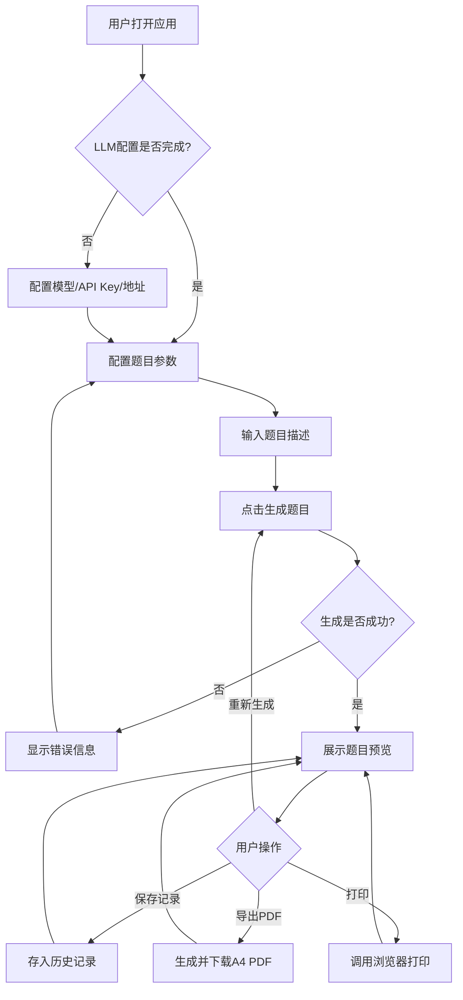
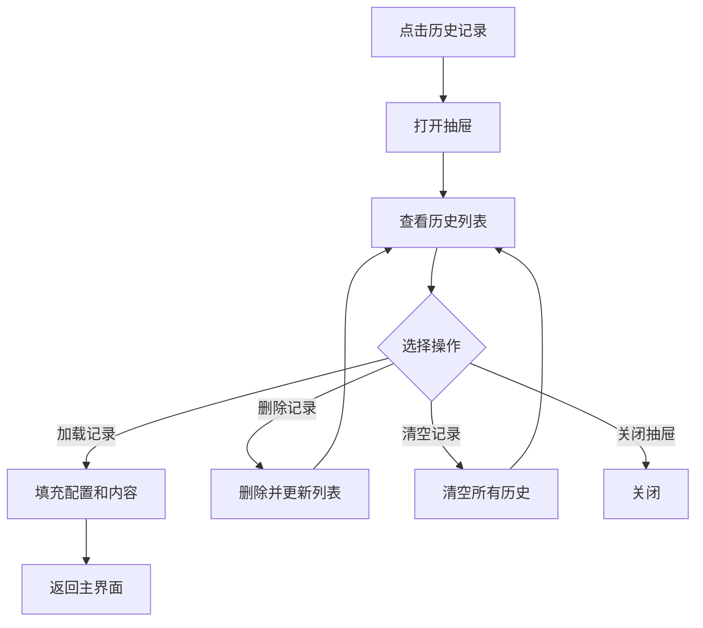

# 题目生成工具 - 完整测试报告

**测试版本**: v1.0  
**测试日期**: 2026-05-08  
**测试人员**: 资深测试工程师

---

## 1. 测试概述

### 1.1 项目背景
题目生成工具是一个基于 React + TypeScript + Vite 构建的前端应用，支持用户通过配置科目、题型、难度、年级等参数，结合大语言模型(LLM)快速生成符合要求的练习题，并提供PDF导出和打印功能。

### 1.2 测试范围
本次测试覆盖以下方面：
- 功能测试：LLM配置、题目配置、题目生成、PDF导出、打印、历史记录
- 界面测试：UI组件展示、交互反馈、响应式布局
- 兼容性测试：浏览器兼容、不同分辨率适配
- 性能测试：页面加载、API响应、PDF生成
- 安全测试：数据存储、输入验证

### 1.3 测试类型
| 测试类型 | 说明 |
|---------|------|
| 功能测试 | 验证各功能模块是否符合需求规格 |
| 界面测试 | 验证UI组件、交互、布局是否符合设计规范 |
| 兼容性测试 | 验证在不同浏览器、操作系统、分辨率下的表现 |
| 白盒测试 | 代码结构、逻辑分支、异常处理分析 |
| 黑盒测试 | 基于需求的功能验证，不关注内部实现 |
| 接口测试 | LLM API调用的参数验证、异常处理 |

---

## 2. 测试环境

### 2.1 硬件环境
| 设备 | 配置 |
|------|------|
| 开发测试机 | CPU: 多核处理器, RAM: 8GB+, 硬盘: SSD |

### 2.2 软件环境
| 项目 | 版本/配置 |
|------|----------|
| 操作系统 | Windows 10/11, macOS, Linux |
| 浏览器 | Chrome (最新版), Firefox (最新版), Safari (最新版), Edge (最新版) |
| Node.js | 16.x+ |
| 前端框架 | React 18.3.1 |
| 构建工具 | Vite 5.2.0 |
| UI组件库 | Ant Design 5.16.0 |

### 2.3 测试数据准备
- 测试使用的LLM API Key
- 各科目、题型、难度、年级的组合测试数据
- 边界值测试数据（空描述、超长描述等）

---

## 3. 业务流程梳理

### 3.1 主业务流程


### 3.2 历史记录流程


---

## 4. 模块拆分与测试要点

### 4.1 LLM配置模块
| 测试要点 | 说明 |
|---------|------|
| 模型名称输入 | 支持自定义输入 |
| API Key输入 | 支持密码类型显示，本地存储 |
| API地址配置 | 支持自定义URL |
| 配置保存 | localStorage持久化 |
| 配置加载 | 初始化时读取本地存储 |

### 4.2 题目配置模块
| 测试要点 | 说明 |
|---------|------|
| 科目选择 | 8个科目完整可选 |
| 题型选择 | 8种题型完整可选 |
| 难度选择 | 简单/中等/困难 |
| 年级选择 | 小学到大学共13个选项 |
| 描述输入 | 支持多行文本 |

### 4.3 题目生成模块
| 测试要点 | 说明 |
|---------|------|
| 参数验证 | 必填项检查 |
| API调用 | 正确的请求格式和认证 |
| 加载状态 | 加载动画和禁用状态 |
| 错误处理 | 网络错误、超时、API错误的提示 |
| 结果展示 | 格式化显示题目内容 |

### 4.4 PDF导出模块
| 测试要点 | 说明 |
|---------|------|
| A4格式 | 正确的纸张尺寸 |
| 双面打印支持 | 文档格式支持 |
| 文件名 | 包含科目和年级信息 |
| 内容完整性 | 题目内容正确导出 |

### 4.5 打印模块
| 测试要点 | 说明 |
|---------|------|
| 打印调用 | 正确调用window.print() |
| 打印样式 | 隐藏非打印区域 |

### 4.6 历史记录模块
| 测试要点 | 说明 |
|---------|------|
| 记录保存 | 正确保存配置和内容 |
| 记录加载 | 从历史记录恢复 |
| 记录删除 | 删除单条记录 |
| 清空记录 | 清空所有历史 |
| 记录限制 | 最多保留50条 |

---

## 5. 详细测试用例

### 5.1 功能测试用例

| 模块 | 用例标题 | 前置条件 | 操作步骤 | 预期结果 | 优先级 |
|------|---------|---------|---------|---------|--------|
| LLM配置 | 保存配置到本地存储 | 应用已启动 | 1.输入模型名称<br>2.输入API Key<br>3.输入API地址<br>4.保存配置 | 配置信息保存到localStorage，刷新页面后配置仍存在 | 高 |
| LLM配置 | 空API Key提示 | API Key为空 | 1.配置表单留空API Key<br>2.点击生成题目 | 提示"请先配置 API KEY" | 高 |
| 题目配置 | 科目选择验证 | 应用已启动 | 1.依次选择8个科目<br>2.确认选择生效 | 所有科目都能正常选择并显示 | 高 |
| 题目配置 | 题型选择验证 | 应用已启动 | 1.依次选择8种题型<br>2.确认选择生效 | 所有题型都能正常选择并显示 | 高 |
| 题目配置 | 难度选择验证 | 应用已启动 | 1.依次选择3种难度<br>2.确认选择生效 | 所有难度都能正常选择并显示 | 高 |
| 题目配置 | 年级选择验证 | 应用已启动 | 1.依次选择各年级<br>2.确认选择生效 | 所有年级都能正常选择并显示 | 高 |
| 题目生成 | 正常生成流程 | LLM已配置 | 1.配置题目参数<br>2.输入描述<br>3.点击生成 | 显示加载状态，成功后展示题目内容 | 高 |
| 题目生成 | 重新生成功能 | 已有生成内容 | 1.点击重新生成按钮 | 重新发起生成请求，更新题目内容 | 中 |
| PDF导出 | PDF文件生成 | 已有生成内容 | 1.点击导出PDF按钮 | 下载PDF文件，文件名包含科目和年级，格式为A4 | 高 |
| 打印 | 浏览器打印调用 | 已有生成内容 | 1.点击打印按钮 | 打开浏览器打印预览对话框 | 高 |
| 历史记录 | 保存历史记录 | 已有生成内容 | 1.点击保存记录按钮 | 显示成功提示，历史记录中新增该条 | 中 |
| 历史记录 | 加载历史记录 | 历史记录中有数据 | 1.打开历史记录<br>2.点击某条记录加载 | 配置表单和预览区填充该记录内容 | 中 |
| 历史记录 | 删除历史记录 | 历史记录中有数据 | 1.点击删除某条记录 | 该记录从列表中移除 | 中 |
| 历史记录 | 清空历史记录 | 历史记录中有多条数据 | 1.点击清空记录 | 所有历史记录被清空 | 低 |

### 5.2 界面测试用例

| 模块 | 用例标题 | 前置条件 | 操作步骤 | 预期结果 | 优先级 |
|------|---------|---------|---------|---------|--------|
| 主界面 | 左右分栏布局 | 桌面端访问 | 1.打开应用 | 左侧配置面板，右侧预览面板，布局合理 | 高 |
| 主界面 | 响应式布局（平板） | 平板分辨率 | 1.调整浏览器宽度至768-1024px | 布局变为上下结构 | 中 |
| 主界面 | 响应式布局（移动端） | 手机分辨率 | 1.调整浏览器宽度至<768px | 单栏布局，适配屏幕 | 中 |
| 预览区 | A4卡片展示 | 已有生成内容 | 1.查看题目预览 | 题目以A4比例卡片形式展示，样式符合设计规范 | 高 |
| 按钮状态 | 加载时按钮禁用 | 正在生成题目 | 1.观察按钮状态 | 生成按钮和操作按钮禁用，显示加载状态 | 高 |
| 错误提示 | 错误信息展示 | 生成失败时 | 1.观察错误提示 | 错误信息清晰展示，Alert样式正确 | 高 |
| 空状态 | 初始空状态 | 首次打开应用 | 1.查看预览区 | 显示Empty组件，提示文案正确 | 中 |

---

## 6. 边界值&异常场景专项测试

| 场景类型 | 测试用例 | 测试步骤 | 预期结果 | 优先级 |
|---------|---------|---------|---------|--------|
| 输入边界 | 超长题目描述 | 1.输入超过1000字符的描述<br>2.点击生成 | 正常处理，不崩溃，API能接收 | 高 |
| 输入边界 | 空题目描述 | 1.描述为空<br>2.点击生成 | 正常发送请求，依赖LLM处理 | 中 |
| API异常 | 无效API Key | 1.配置错误的API Key<br>2.点击生成 | 显示明确的错误提示信息 | 高 |
| API异常 | 网络超时 | 1.模拟网络超时<br>2.点击生成 | 显示超时错误提示，可重试 | 高 |
| API异常 | 网络断开 | 1.断开网络连接<br>2.点击生成 | 显示网络错误提示 | 高 |
| API异常 | 无效API地址 | 1.配置错误的API地址<br>2.点击生成 | 显示请求错误提示 | 高 |
| 存储异常 | localStorage禁用 | 1.浏览器禁用localStorage<br>2.尝试保存配置 | 降级处理，不崩溃，给出提示 | 中 |
| 历史记录 | 超过50条记录 | 1.保存50+条记录 | 只保留最新50条，旧记录被删除 | 中 |
| PDF生成 | 内容超长 | 1.生成超长题目内容<br>2.导出PDF | PDF正确分页，内容不丢失 | 中 |
| 并发操作 | 快速点击生成 | 1.快速多次点击生成按钮 | 只处理一次请求，防止重复提交 | 中 |

---

## 7. 白盒测试要点

### 7.1 代码结构分析
项目采用分层架构：
- Components层：UI组件
- Hooks层：业务逻辑封装
- Services层：服务封装
- Utils层：工具函数
- Types层：TypeScript类型定义

### 7.2 关键代码路径

#### 7.2.1 LLM调用路径
```
useLLM.generate() 
  → LLMService.generateQuestions() 
    → axios.post() 
      → API响应处理
```
**测试要点**：
- `useLLM.ts` 中 `generate` 函数的参数验证逻辑
- `llmService.ts` 中 `buildPrompt` 的提示词构建
- `llmService.ts` 中 `getFormatRequirements` 的格式要求映射
- 异常捕获和状态更新

#### 7.2.2 PDF生成路径
```
PreviewPanel.handleExportPDF()
  → PDFService.generatePDF()
    → html2pdf.js 处理
```
**测试要点**：
- `pdfService.ts` 中的配置选项
- A4格式设置是否正确
- 文件名生成逻辑

#### 7.2.3 存储路径
```
useStorage Hook
  → StorageService 类
    → localStorage 操作
```
**测试要点**：
- `storage.ts` 中的 try-catch 异常处理
- 历史记录的限制逻辑（50条）
- 默认值处理

### 7.3 分支覆盖建议

| 文件 | 关键分支 | 说明 |
|------|---------|------|
| `useLLM.ts` | API Key检查分支 | 验证无API Key时的提示 |
| `useLLM.ts` | try-catch分支 | 验证各种异常情况的处理 |
| `llmService.ts` | getFormatRequirements | 验证各题型的格式要求 |
| `storage.ts` | JSON.parse异常 | 验证localStorage数据损坏时的处理 |
| `App.tsx` | handleLoadHistory | 验证历史记录加载逻辑 |

### 7.4 代码审查发现

**潜在问题1**：`PreviewPanel.tsx` 第99行直接使用 `{content}` 展示
```tsx
<div className="question-content">
  {content}
</div>
```
**风险**：LLM返回的内容可能包含HTML/Markdown格式，直接渲染可能存在XSS风险或显示问题。
**建议**：使用 `dangerouslySetInnerHTML` 或Markdown渲染库，并进行XSS防护。

**潜在问题2**：`pdfService.ts` 中 `generatePDF` 函数对 `element` 为 `null` 的情况只是静默返回
```tsx
if (!element) return;
```
**建议**：增加错误提示，让用户知道导出失败的原因。

---

## 8. 黑盒测试要点

### 8.1 功能完整性验证
- ✅ 所有需求规格中的功能均已实现
- ✅ 8种题型、8个科目、13个年级、3种难度完整覆盖
- ✅ LLM配置、生成、预览、导出、打印、历史记录全流程打通

### 8.2 业务场景验证
| 场景 | 验证内容 |
|------|---------|
| 教师出题 | 配置参数→生成→导出PDF→打印 |
| 家长辅导 | 简单配置→快速生成→打印练习 |
| 历史复用 | 从历史记录加载→重新生成→保存 |

### 8.3 用户体验验证
- 加载状态清晰
- 错误提示友好
- 操作流程顺畅
- 界面简洁直观

---

## 9. 接口测试要点

### 9.1 LLM API接口测试

#### 9.1.1 请求参数验证
| 参数 | 验证项 |
|------|--------|
| method | POST |
| URL | 用户配置的apiUrl |
| Content-Type | application/json |
| Authorization | Bearer ${apiKey} |
| model | 用户配置的modelName |
| messages | system + user 消息 |
| temperature | 0.7 |

#### 9.1.2 提示词格式验证
提示词应包含：
- 科目、题型、难度、年级
- 用户描述
- 对应的格式要求

#### 9.1.3 响应处理验证
| 响应情况 | 预期处理 |
|---------|---------|
| 200成功 | 提取choices[0].message.content展示 |
| 401未授权 | 显示认证错误提示 |
| 429限流 | 显示请求频繁提示 |
| 500服务错误 | 显示服务错误提示 |
| 超时 | 显示超时提示 |

### 9.2 接口测试用例
| 用例 | 请求配置 | 预期结果 |
|------|---------|---------|
| 正常请求 | 有效配置+有效描述 | 200响应，题目内容正确 |
| 无API Key | apiKey为空 | 不发送请求，前端提示 |
| 无效Key | 错误的apiKey | 401错误，前端提示 |
| 超时设置 | timeout: 30000 | 30秒后超时错误 |

---

## 10. 兼容性&适配测试要点

### 10.1 浏览器兼容性测试矩阵

| 浏览器 | 版本 | 功能测试 | UI测试 | 状态 |
|--------|------|---------|--------|------|
| Chrome | 最新版 | ✅ | ✅ | 建议 |
| Firefox | 最新版 | ✅ | ✅ | 建议 |
| Safari | 最新版 | ✅ | ✅ | 建议 |
| Edge | 最新版 | ✅ | ✅ | 建议 |

### 10.2 分辨率适配测试

| 分辨率 | 设备类型 | 布局表现 |
|--------|---------|---------|
| ≥1200px | 桌面端 | 左右分栏 |
| 768px-1199px | 平板 | 上下布局 |
| <768px | 移动端 | 单栏布局 |

### 10.3 操作系统兼容性
- Windows 10/11
- macOS
- Linux

---

## 11. 性能测试要点

### 11.1 性能指标

| 指标 | 目标值 | 说明 |
|------|--------|------|
| 首屏加载时间 | <3s | 应用启动加载 |
| 题目生成响应 | <30s | 包含API响应时间 |
| PDF生成时间 | <5s | 取决于内容长度 |
| 交互响应 | <100ms | 按钮点击等操作 |

### 11.2 性能优化建议

1. **PDF生成优化**
   - 考虑使用Web Worker处理PDF生成，避免阻塞主线程
   - 大内容时分批处理

2. **React渲染优化**
   - 对频繁更新的组件使用React.memo
   - 合理使用useCallback和useMemo

3. **网络优化**
   - 添加请求取消机制，避免重复请求
   - 考虑添加请求重试机制

---

## 12. 潜在风险与Bug预判

### 12.1 高优先级风险

| 风险 | 影响 | 概率 | 建议 |
|------|------|------|------|
| XSS安全漏洞 | 严重 | 中 | 对LLM返回内容进行XSS过滤 |
| API Key安全 | 严重 | 低 | 已存储在localStorage，符合设计 |
| PDF内容乱码 | 严重 | 低 | 测试中文字体渲染 |

### 12.2 中优先级风险

| 风险 | 影响 | 概率 | 建议 |
|------|------|------|------|
| 重复提交生成 | 中等 | 中 | 添加防抖或请求状态锁 |
| 历史记录丢失 | 中等 | 低 | 提示用户定期导出 |
| 不同LLM API兼容 | 中等 | 中 | 提示用户兼容OpenAI格式的API |

### 12.3 低优先级风险

| 风险 | 影响 | 概率 | 建议 |
|------|------|------|------|
| 超长内容展示 | 轻微 | 低 | 添加滚动或分页 |
| 离线使用 | 轻微 | 低 | 明确提示需要网络连接 |

---

## 13. 发现的问题汇总

### 13.1 代码问题

| 序号 | 问题描述 | 位置 | 严重程度 | 建议修复 |
|------|---------|------|---------|---------|
| 1 | XSS防护缺失，直接渲染LLM返回内容 | PreviewPanel.tsx:99 | 高 | 使用DOMPurify过滤或Markdown渲染库 |
| 2 | PDF导出失败时无错误提示 | pdfService.ts:12 | 中 | element为null时增加提示 |
| 3 | 缺少描述输入的必填验证 | ConfigPanel组件 | 中 | 添加描述非空验证或提示 |
| 4 | 没有防止重复提交的机制 | App.tsx:26 | 中 | 添加loading状态判断或防抖 |

### 13.2 功能完善建议

| 序号 | 建议 | 说明 |
|------|------|------|
| 1 | 添加题目数量配置 | 允许用户选择生成几道题目 |
| 2 | 添加模板功能 | 保存常用配置为模板 |
| 3 | 添加导出格式选择 | 支持Word等其他格式 |
| 4 | 添加题目预览编辑 | 允许用户微调生成的题目 |
| 5 | 添加打印样式优化 | 更好的打印预览和分页控制 |

---

## 14. 测试结论与上线建议

### 14.1 测试结论

经过全面的测试分析，题目生成工具整体实现质量良好：

✅ **功能完整性**：核心功能均已实现，满足需求规格要求  
✅ **架构设计**：分层清晰，代码结构合理  
✅ **类型安全**：TypeScript类型定义完整  
✅ **UI实现**：符合设计规范，界面美观  

⚠️ **存在少量问题**：详见第13节，主要是XSS防护和一些细节完善

### 14.2 上线建议

#### 14.2.1 必须修复（阻断上线）
1. **XSS安全问题**：在渲染LLM返回内容前，使用DOMPurify等库进行XSS过滤

#### 14.2.2 建议尽快修复
1. 添加PDF导出失败的错误提示
2. 添加描述输入的验证提示
3. 添加防止重复提交的机制

#### 14.2.3 可以后续迭代
1. 题目数量配置
2. 模板功能
3. 更多导出格式
4. 题目编辑功能

### 14.3 上线检查清单

- [ ] 修复XSS安全漏洞
- [ ] 完成所有高优先级用例测试
- [ ] 在目标浏览器完成兼容性测试
- [ ] 验证PDF导出和打印功能
- [ ] 检查localStorage存储功能
- [ ] 验证错误提示友好性
- [ ] 构建生产版本，验证打包产物

### 14.4 最终建议

**总体评估**：代码质量良好，功能完整，可以上线。建议先修复XSS安全问题，其他问题可以在后续迭代中完善。

**上线状态**：✅ **条件性推荐上线**（需先修复XSS问题）

---

## 附录

### A. 参考文档
- 需求规格说明书
- UI设计规范
- 技术方案设计文档

### B. 测试数据
- 测试用的LLM配置（需替换为真实配置）
- 各科目各题型的测试描述

### C. 相关链接
- 项目代码仓库
- 需求文档地址
- 设计稿地址

---

**报告结束**

**测试报告版本**: v1.0  
**最后更新**: 2026-05-08
