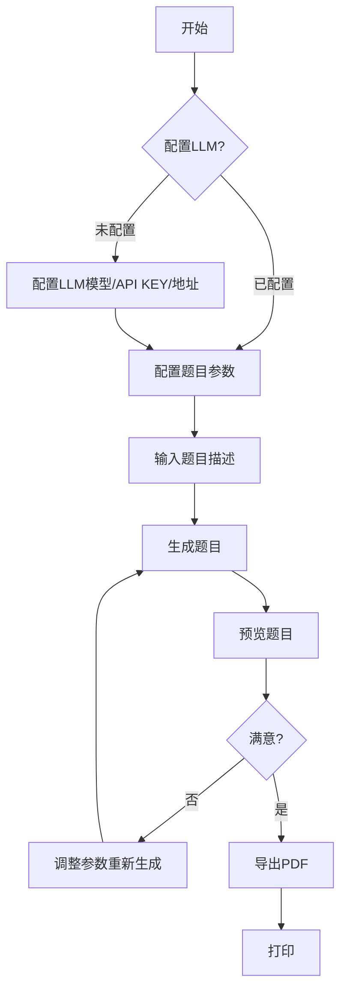
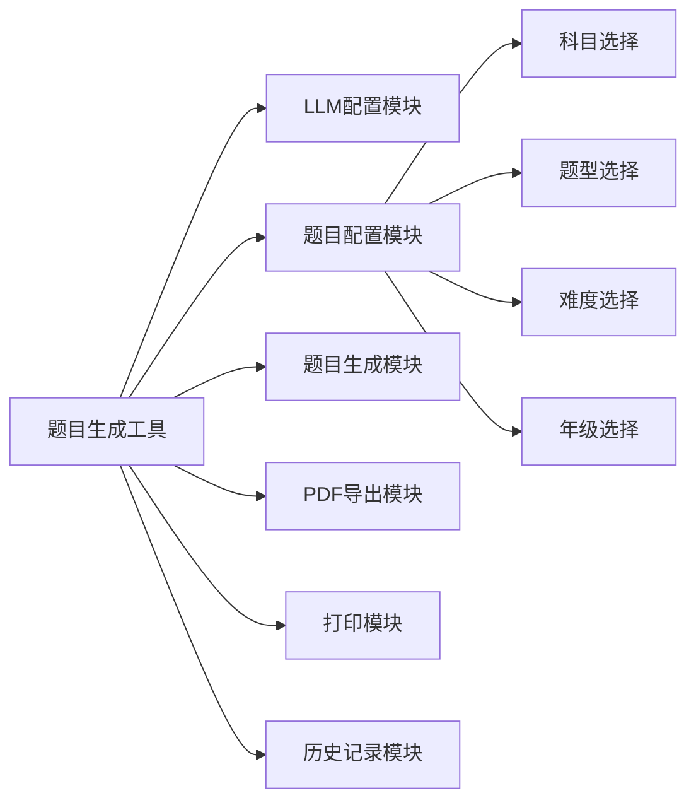
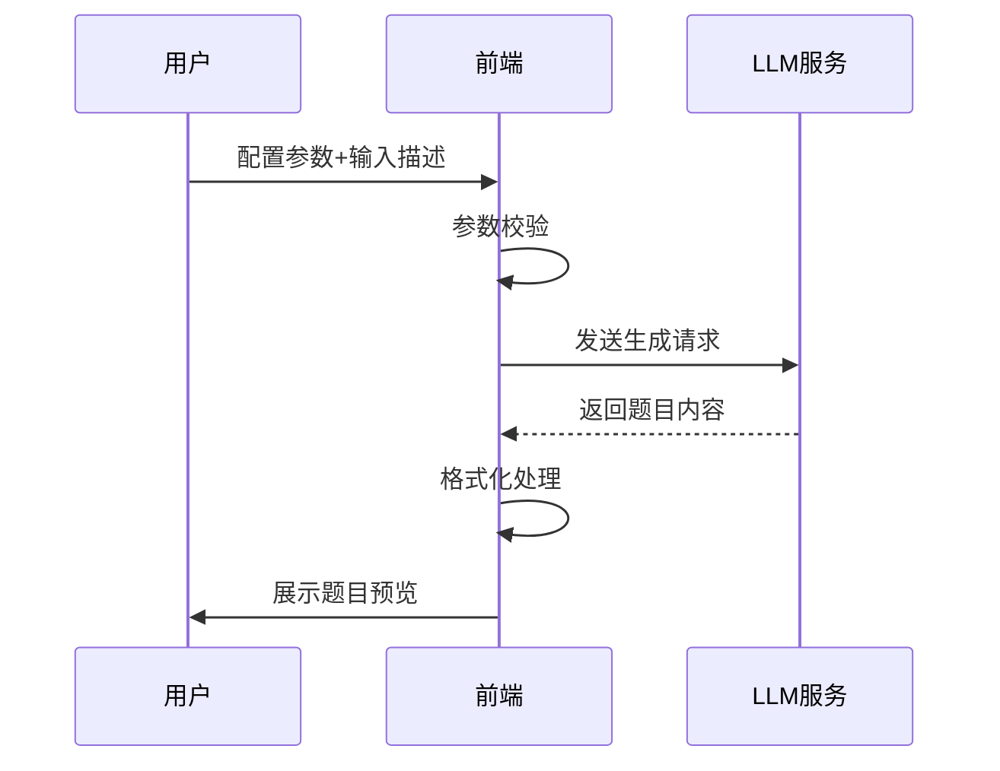
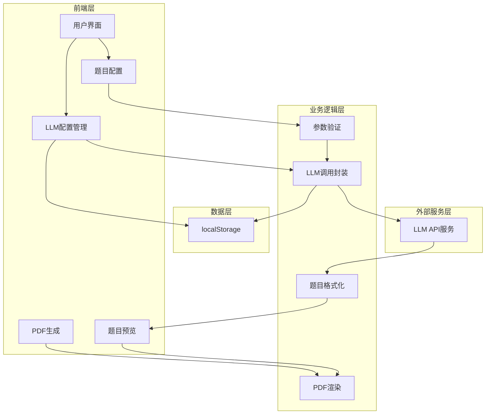

# 题目生成工具软件需求规格说明书

## 1. 项目概述

### 1.1 项目背景
本项目旨在开发一个智能化的题目生成工具，用户可通过输入题目描述，结合多种配置参数（科目、类型、难度、年级），利用大语言模型（LLM）快速生成符合要求的题目，并支持导出为A4格式的PDF文档进行打印。

### 1.2 建设目标
- 提供灵活的题目配置选项，支持多种题型、科目、难度和年级
- 集成LLM模型，实现智能化题目生成
- 生成标准化PDF文档，支持A4纸张、双面打印
- 支持前端配置LLM模型、API KEY和API地址
- 提供友好的用户界面和打印功能

### 1.3 适用范围
适用于教师、家长、学生等需要快速生成练习题的场景，支持小学至大学各阶段的多科目题目生成。

### 1.4 读者对象
- 产品经理：了解产品功能与业务逻辑
- UI交互设计师：依据需求进行界面设计
- 开发工程师：进行功能开发与代码实现
- 测试工程师：制定测试计划与执行测试

---

## 2. 业务需求概述

### 2.1 业务场景
教师或家长打开题目生成工具，配置题目参数（科目、类型、难度、年级），输入题目描述，系统调用LLM生成题目，预览并导出为PDF文档进行打印。

### 2.2 用户角色与职责

| 角色 | 职责 |
|------|------|
| 普通用户 | 配置题目参数、输入描述、生成题目、预览打印 |

### 2.3 业务核心痛点
- 手动出题耗时耗力
- 题目质量难以保证
- 格式排版繁琐
- 打印配置复杂

### 2.4 整体业务流程



---

## 3. 功能需求

### 3.1 整体功能模块架构



### 3.2 各模块详细功能清单

| 模块 | 功能项 | 说明 | 优先级 |
|------|--------|------|-------|
| LLM配置 | 模型选择 | 支持选择不同的LLM模型 | 高 |
| | API KEY配置 | 输入并保存API密钥 | 高 |
| | API地址配置 | 自定义API服务地址 | 高 |
| 题目配置 | 科目选择 | 数学、英语、物理、化学、生物、历史、地理、政治 | 高 |
| | 题型选择 | 选择题、判断题、填空题、简答题、多选题、单选题、计算题、应用题 | 高 |
| | 难度选择 | 简单、中等、困难 | 高 |
| | 年级选择 | 小学1-6年级、初中1-3年级、高中1-3年级、大学 | 高 |
| | 题目描述输入 | 用户输入题目描述或要求 | 高 |
| 题目生成 | 调用LLM | 根据参数和描述生成题目 | 高 |
| | 题目预览 | 展示生成的题目 | 高 |
| | 重新生成 | 不满意时可重新生成 | 中 |
| PDF导出 | A4格式 | 生成A4纸张大小的PDF | 高 |
| | 双面打印支持 | 文档格式支持双面打印 | 高 |
| | 题目格式 | 填空题/判断题/简答题留有空白，选择题有选项 | 高 |
| 打印 | 打印功能 | 直接调用浏览器打印功能 | 高 |
| 历史记录 | 历史记录查看 | 查看历史生成的题目 | 中 |
| | 历史记录导出 | 重新导出历史题目 | 中 |

### 3.3 单个功能详细描述

#### 3.3.1 LLM配置模块

**功能描述**：支持用户配置LLM模型相关参数

**配置项**：
| 配置项 | 说明 |
|--------|------|
| 模型名称 | 用户可选择或输入LLM模型名称 |
| API KEY | 用户输入的API访问密钥 |
| API地址 | 自定义API服务端点地址 |

**存储方式**：localStorage本地存储

#### 3.3.2 题目配置模块

**功能描述**：配置题目生成的各项参数

**科目列表**：
- 数学
- 英语
- 物理
- 化学
- 生物
- 历史
- 地理
- 政治

**题型列表**：
- 选择题
- 判断题
- 填空题
- 简答题
- 多选题
- 单选题
- 计算题
- 应用题

**难度列表**：
- 简单
- 中等
- 困难

**年级列表**：
- 小学1-6年级
- 初中1-3年级
- 高中1-3年级
- 大学

#### 3.3.3 题目生成模块

**功能描述**：调用LLM生成符合要求的题目

**输入**：
- 题目描述
- 科目
- 题型
- 难度
- 年级

**输出**：
- 格式化的题目内容

**题目格式要求**：
1. 填空题、判断题、简答题、竖式/脱式计算题要留有空白，用户需要在空白处填写答案
2. 选择题/多选题要留有选项，用户需要选择正确的选项



#### 3.3.4 PDF导出模块

**功能描述**：将生成的题目导出为PDF文档

**PDF规格**：
- 纸张大小：A4
- 方向：纵向
- 边距：标准边距
- 排版：支持双面打印

**内容格式**：
- 标题区域
- 题目区域（按要求留有空白或选项）
- 页码

#### 3.3.5 打印模块

**功能描述**：提供打印功能

**功能**：
- 调用浏览器打印API
- 支持打印预览
- 支持打印机选择

### 3.4 页面/交互简要说明

#### 3.4.1 主界面
- LLM配置区：模型、API KEY、API地址输入
- 题目配置区：科目、题型、难度、年级选择
- 描述输入区：题目描述文本框
- 生成按钮：触发生成操作
- 预览区：展示生成的题目
- 操作按钮：重新生成、导出PDF、打印

---

## 4. 非功能需求

### 4.1 性能需求
- 题目生成响应时间 < 30秒
- PDF生成时间 < 5秒
- 页面加载时间 < 3秒
- 支持同时生成最多10道题目

### 4.2 安全需求
- API KEY仅存储在本地localStorage，不上传服务器
- 无用户隐私数据收集
- 支持清除本地配置

### 4.3 兼容性需求
- 支持Chrome、Firefox、Safari、Edge最新版本
- 响应式设计，适配不同屏幕尺寸
- 支持Windows、macOS、Linux系统

### 4.4 可扩展与可维护性
- 模块化代码结构，便于功能扩展
- 支持后续添加更多科目、题型
- 代码包含详细中文注释

### 4.5 可用性需求
- 界面简洁直观，用户无需培训即可使用
- 提供清晰的错误提示
- 加载状态明确显示

---

## 5. 数据与数据库设计

### 5.1 核心数据实体

| 实体 | 属性 | 说明 |
|------|------|------|
| LLM配置 | 模型名称、API KEY、API地址 | 用户配置的LLM参数 |
| 题目配置 | 科目、题型、难度、年级、描述 | 题目生成参数 |
| 生成记录 | 记录ID、生成时间、配置参数、题目内容、PDF | 历史记录 |

### 5.2 主要数据结构设计

使用localStorage存储数据。

#### 5.2.1 LLM配置 (llm_config)

| 字段名 | 类型 | 说明 |
|--------|------|------|
| modelName | string | 模型名称 |
| apiKey | string | API密钥 |
| apiUrl | string | API地址 |

#### 5.2.2 生成记录 (question_records)

| 字段名 | 类型 | 说明 |
|--------|------|------|
| id | string | 记录ID |
| timestamp | number | 时间戳 |
| subject | string | 科目 |
| type | string | 题型 |
| difficulty | string | 难度 |
| grade | string | 年级 |
| description | string | 题目描述 |
| content | string | 生成的题目内容 |

---

## 6. 架构设计

### 6.1 系统架构



### 6.2 技术选型建议

- **前端框架**: React + TypeScript
- **构建工具**: Vite
- **HTTP客户端**: Axios
- **PDF生成**: jsPDF / html2pdf.js
- **状态管理**: 本地存储（localStorage）
- **UI组件库**: Ant Design

### 6.3 目录结构

```
gendersj/
├── src/
│   ├── components/       # UI组件
│   ├── services/         # API调用服务
│   ├── utils/            # 工具函数
│   ├── types/            # TypeScript类型定义
│   ├── hooks/            # 自定义Hooks
│   ├── App.tsx           # 主应用组件
│   └── main.tsx          # 入口文件
├── public/
├── package.json
└── tsconfig.json
```

---

## 7. 接口需求

### 7.1 LLM API接口

| 项目 | 说明 |
|------|------|
| 请求方式 | POST |
| 请求头 | Authorization: Bearer {API_KEY} |
| 请求内容 | 包含题目描述、科目、题型、难度、年级的提示词 |
| 响应内容 | 生成的题目文本 |

### 7.2 提示词模板

```
请根据以下要求生成题目：
- 科目：{subject}
- 题型：{type}
- 难度：{difficulty}
- 年级：{grade}
- 描述：{description}

格式要求：
{format_requirements}
```

---

## 8. 约束与边界说明

### 8.1 技术约束
- 使用React + TypeScript框架开发
- 使用Vite作为构建工具
- 前端实现，可选后端代理

### 8.2 业务边界
- 题目生成质量依赖于LLM模型能力
- PDF格式固定为A4纵向
- 历史记录本地存储，不支持云端同步

### 8.3 异常处理
- API KEY无效：显示错误提示，引导重新配置
- 网络错误：显示网络异常提示，提供重试
- 生成超时：提示用户稍后重试
- localStorage存储失败：降级处理

---

## 9. 验收标准

1. 用户能够成功配置LLM模型、API KEY和API地址并保存
2. 能够选择所有科目、题型、难度和年级
3. 输入有效描述后能够生成符合格式要求的题目
4. 生成的题目留有适当空白或选项
5. 能够导出A4格式PDF，支持双面打印
6. 能够直接调用打印功能
7. 在主流浏览器中运行稳定
8. 加载状态和错误提示清晰明确

---

**文档版本**: v1.0
**创建日期**: 2026-05-08
**创建人**: 高级需求分析师
