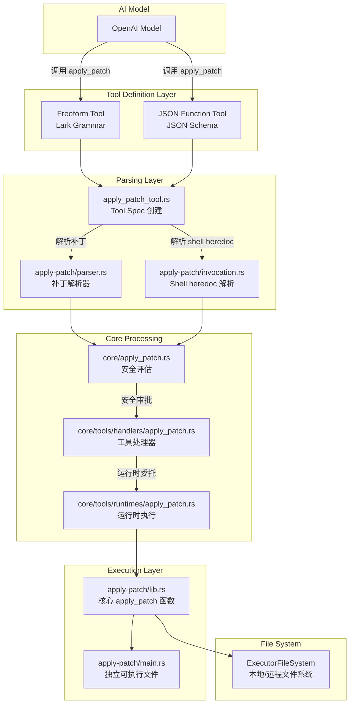
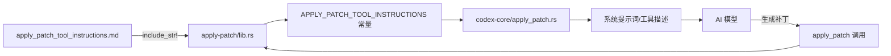
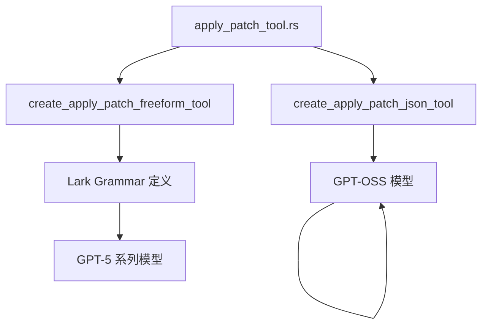
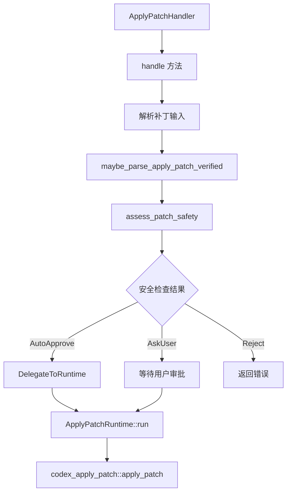
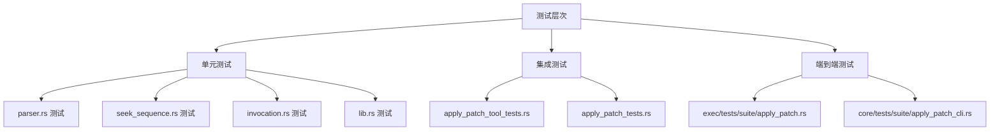
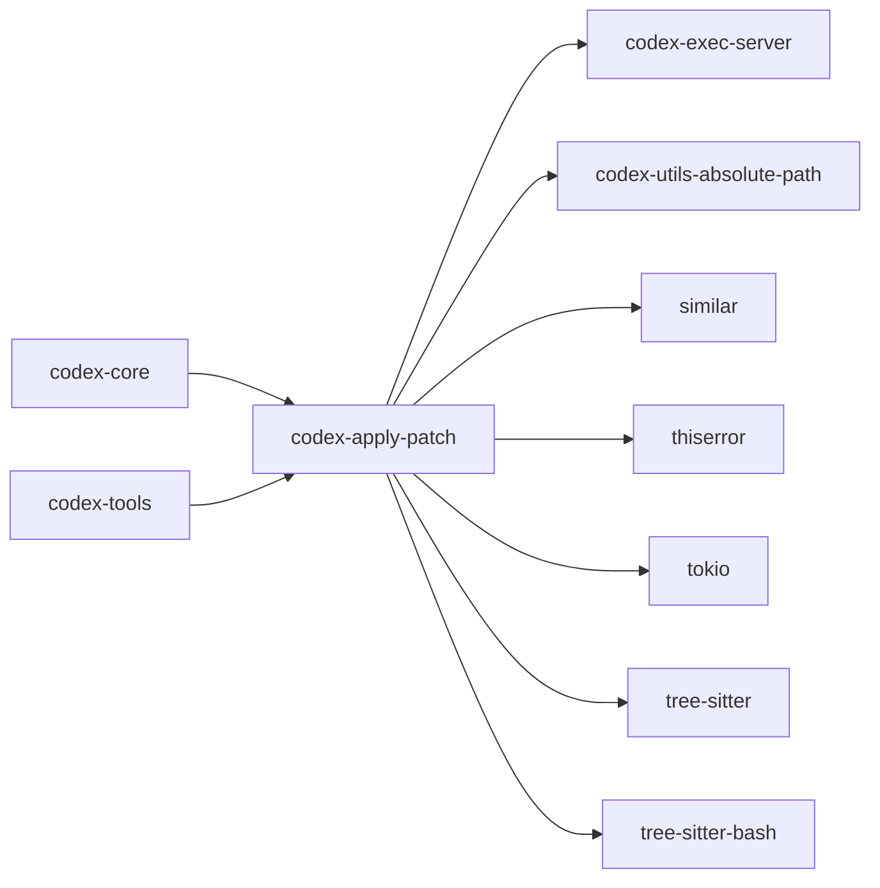

# Codex apply_patch 工具深度解析

## 一、概述

`apply_patch` 是 OpenAI Codex 的核心文件编辑工具，允许 AI 模型通过一种自定义的补丁语言（patch language）来创建、修改和删除文件。它不是传统的 shell 命令，而是一个专门设计的、可解析的、安全的文件操作接口。

### 核心特性

- **自定义补丁语法**：基于类 diff 的行级操作语言
- **三种文件操作**：Add File、Delete File、Update File
- **安全沙箱**：支持沙箱执行和权限审批
- **多种调用方式**：直接调用、shell heredoc、Freeform Tool、JSON Tool
- **流式解析**：支持流式补丁解析和进度更新

---

## 二、整体架构



---

## 三、补丁语言规范

### 3.1 基本语法

补丁语言是一种简化的、面向文件的 diff 格式，遵循以下语法规则：

```
Patch := Begin { FileOp } End
Begin := "*** Begin Patch" NEWLINE
End   := "*** End Patch" NEWLINE
FileOp := AddFile | DeleteFile | UpdateFile
```

### 3.2 文件操作类型

| 操作 | 语法 | 说明 |
|------|------|------|
| 添加文件 | `*** Add File: <path>` | 创建新文件，后续每行以 `+` 开头 |
| 删除文件 | `*** Delete File: <path>` | 删除现有文件，无后续内容 |
| 更新文件 | `*** Update File: <path>` | 修改现有文件，后跟 hunk 块 |

### 3.3 更新文件 Hunk 格式

```
UpdateFile := "*** Update File: " path NEWLINE [ MoveTo ] { Hunk }
MoveTo     := "*** Move to: " newPath NEWLINE
Hunk       := "@@" [ header ] NEWLINE { HunkLine } [ "*** End of File" NEWLINE ]
HunkLine   := (" " | "-" | "+") text NEWLINE
```

### 3.4 完整示例

```patch
*** Begin Patch
*** Add File: hello.txt
+Hello world
*** Update File: src/app.py
*** Move to: src/main.py
@@ def greet():
-print("Hi")
+print("Hello, world!")
*** Delete File: obsolete.txt
*** End Patch
```

### 3.5 上下文标记 `@@`

`@@` 标记用于定位代码块位置，支持多级定位：

```patch
@@ class BaseClass
[3 行上文上下文]
- [旧代码]
+ [新代码]
[3 行下文上下文]

@@ class BaseClass
@@    def method():
[3 行上文上下文]
- [旧代码]
+ [新代码]
[3 行下文上下文]
```

---

## 四、代码实现详解

### 4.1 核心 Crate 结构

```
codex-rs/apply-patch/
├── src/
│   ├── lib.rs              # 核心库：apply_patch 函数、补丁应用逻辑
│   ├── main.rs             # 独立可执行文件入口
│   ├── parser.rs           # 补丁解析器：解析 patch 文本为 Hunk 结构
│   ├── invocation.rs       # Shell 调用解析：heredoc 提取、AST 分析
│   ├── seek_sequence.rs    # 行序列查找：模糊匹配算法
│   └── streaming_parser.rs # 流式解析器
├── apply_patch_tool_instructions.md  # AI 模型使用指南
├── Cargo.toml
└── tests/
    └── all.rs              # 集成测试入口
```

### 4.2 补丁解析器 (parser.rs)

解析器将 patch 文本转换为结构化的 `Hunk` 枚举：

```rust
pub enum Hunk {
    AddFile {
        path: PathBuf,
        contents: String,
    },
    DeleteFile {
        path: PathBuf,
    },
    UpdateFile {
        path: PathBuf,
        move_path: Option<PathBuf>,
        chunks: Vec<UpdateFileChunk>,
    },
}
```

解析流程：

1. **边界检查**：验证 `*** Begin Patch` 和 `*** End Patch` 标记
2. **宽松模式**：支持 shell heredoc 格式（`<<EOF` ... `EOF`）
3. **Hunk 解析**：逐个解析文件操作块
4. **上下文处理**：处理 `@@` 上下文标记

### 4.3 行序列查找 (seek_sequence.rs)

使用四级模糊匹配算法定位代码块：

1. **精确匹配**：完全相同的行序列
2. **去尾空格匹配**：忽略行尾空白
3. **全_trim_匹配**：忽略首尾空白
4. **Unicode 规范化匹配**：将 Unicode 标点（如各种破折号、引号）规范化为 ASCII 等效字符

```rust
fn normalise(s: &str) -> String {
    s.trim()
        .chars()
        .map(|c| match c {
            // 各种破折号/连字符 → ASCII '-'
            '\u{2010}' | '\u{2011}' | '\u{2012}' | '\u{2013}' | '\u{2014}' | '\u{2015}'
            | '\u{2212}' => '-',
            // 花哨单引号 → '\''
            '\u{2018}' | '\u{2019}' | '\u{201A}' | '\u{201B}' => '\'',
            // 花哨双引号 → '"'
            '\u{201C}' | '\u{201D}' | '\u{201E}' | '\u{201F}' => '"',
            // 非断空格等 → 普通空格
            '\u{00A0}' | '\u{2002}' | '\u{2003}' | /* ... */ => ' ',
            other => other,
        })
        .collect::<String>()
}
```

### 4.4 Shell Heredoc 解析 (invocation.rs)

支持多种 shell 格式的 heredoc 调用：

```bash
# 直接调用
apply_patch <<'EOF'
*** Begin Patch
*** Add File: hello.txt
+Hello
*** End Patch
EOF

# 带 cd 前缀
cd src && apply_patch <<'EOF'
*** Begin Patch
*** Update File: app.py
@@
-old
+new
*** End Patch
EOF
```

使用 **Tree-sitter Bash** 解析器进行 AST 级别的语法分析，确保安全性和准确性。

支持的 shell 类型：
- Unix Shell (bash, zsh, sh)
- PowerShell (powershell.exe, pwsh)
- CMD (cmd.exe)

### 4.5 核心 apply_patch 函数 (lib.rs)

```rust
pub async fn apply_patch(
    patch: &str,
    cwd: &AbsolutePathBuf,
    stdout: &mut impl std::io::Write,
    stderr: &mut impl std::io::Write,
    fs: &dyn ExecutorFileSystem,
    sandbox: Option<&FileSystemSandboxContext>,
) -> Result<(), ApplyPatchError>
```

执行流程：

1. **解析补丁** → `parse_patch(patch)`
2. **应用 Hunks** → `apply_hunks_to_files()`
3. **文件操作**：
   - `AddFile`: 写入新文件（自动创建父目录）
   - `DeleteFile`: 删除文件
   - `UpdateFile`: 计算新内容并写入
4. **输出摘要** → `print_summary()`

### 4.6 替换计算 (compute_replacements)

对于 UpdateFile 操作，需要计算行替换：

```rust
fn compute_replacements(
    original_lines: &[String],
    path: &Path,
    chunks: &[UpdateFileChunk],
) -> Result<Vec<(usize, usize, Vec<String>)>, ApplyPatchError>
```

关键逻辑：
- 使用 `change_context` 定位代码块
- 使用 `seek_sequence` 查找匹配行
- 按降序应用替换（避免位置偏移问题）

---

## 五、apply_patch_tool_instructions.md 文件解析

### 5.1 文件作用

`apply_patch_tool_instructions.md` 是 **专门给 AI 模型（如 GPT-4.1）使用的操作指南**，包含：

1. **补丁语言规范**：完整的语法定义
2. **使用示例**：各种文件操作的示例
3. **调用方式**：如何通过 shell 命令调用
4. **注意事项**：关键规则和限制

### 5.2 与 apply-patch crate 的关系



具体流程：

1. **编译时嵌入**：通过 `include_str!("../apply_patch_tool_instructions.md")` 嵌入到 `apply-patch/lib.rs`
2. **常量导出**：作为 `APPLY_PATCH_TOOL_INSTRUCTIONS` 公共常量导出
3. **传递给模型**：在系统提示词或工具描述中包含此指南
4. **模型遵循**：AI 模型根据指南生成正确的补丁格式

### 5.3 文件内容核心要点

| 部分 | 内容 |
|------|------|
| 语法规范 | 完整的 BNF 语法定义 |
| 操作类型 | Add/Delete/Update 三种操作 |
| 上下文规则 | `@@` 标记的使用方法和上下文行数要求 |
| 示例 | 完整的混合操作示例 |
| 调用示例 | `shell {"command":["apply_patch","..."]}` 格式 |

---

## 六、与 Codex 其他部分的集成

### 6.1 工具定义层



**Freeform Tool**（适用于 GPT-5）：
- 使用 Lark 语法定义
- 允许非 JSON 格式的补丁输入
- 更灵活的参数传递

**JSON Tool**（适用于 GPT-OSS）：
- 使用 JSON Schema 定义
- 严格的参数结构：`{ "input": "<patch>" }`
- 适合需要结构化输入的场景

### 6.2 工具处理层



处理流程：

1. **输入解析**：从 Function 或 Custom payload 提取补丁
2. **验证检查**：`maybe_parse_apply_patch_verified` 验证补丁有效性
3. **安全评估**：`assess_patch_safety` 评估补丁安全性
4. **审批流程**：自动审批或用户审批
5. **运行时执行**：`ApplyPatchRuntime::run` 执行补丁

### 6.3 安全评估

```rust
pub(crate) async fn apply_patch(
    turn_context: &TurnContext,
    file_system_sandbox_policy: &FileSystemSandboxPolicy,
    action: ApplyPatchAction,
) -> InternalApplyPatchInvocation
```

安全评估结果：

| 结果 | 行为 |
|------|------|
| `SafetyCheck::AutoApprove` | 自动执行（低风险操作） |
| `SafetyCheck::AskUser` | 请求用户审批 |
| `SafetyCheck::Reject` | 拒绝执行并返回原因 |

### 6.4 运行时执行

```rust
impl ToolRuntime<ApplyPatchRequest, ExecToolCallOutput> for ApplyPatchRuntime {
    async fn run(
        &mut self,
        req: &ApplyPatchRequest,
        attempt: &SandboxAttempt<'_>,
        ctx: &ToolCtx,
    ) -> Result<ExecToolCallOutput, ToolError>
}
```

执行环境：
- 使用 `turn_environment` 的文件系统
- 支持沙箱上下文（`FileSystemSandboxContext`）
- 返回标准的 `ExecToolCallOutput` 格式

### 6.5 流式更新

支持补丁应用的实时进度更新：

```rust
impl ToolArgumentDiffConsumer for ApplyPatchArgumentDiffConsumer {
    fn consume_diff(
        &mut self,
        turn: &TurnContext,
        call_id: String,
        diff: &str,
    ) -> Option<EventMsg>
}
```

特性：
- 使用 `StreamingPatchParser` 解析补丁增量
- 500ms 缓冲间隔发送更新事件
- 发送 `PatchApplyUpdatedEvent` 事件

---

## 七、测试策略

### 7.1 测试层次



### 7.2 关键测试场景

| 测试场景 | 测试文件 | 说明 |
|----------|----------|------|
| Add File | lib.rs | 验证文件创建和内容写入 |
| Delete File | lib.rs | 验证文件删除 |
| Update File | lib.rs | 验证文件修改 |
| Move File | lib.rs | 验证文件重命名和移动 |
| 多 Hunk 更新 | lib.rs | 验证同一文件多处修改 |
| 相对/绝对路径 | lib.rs | 验证路径解析 |
| Unicode 匹配 | lib.rs | 验证 Unicode 破折号规范化 |
| 写权限错误 | lib.rs | 验证错误处理 |
| Shell heredoc | invocation.rs | 验证各种 shell 格式 |
| 隐式补丁拒绝 | invocation.rs | 验证安全拦截 |
| Freeform Tool | apply_patch_tool_tests.rs | 验证工具规格 |
| JSON Tool | apply_patch_tool_tests.rs | 验证 JSON 工具规格 |

### 7.3 运行测试

```bash
# 运行 apply-patch crate 测试
cargo test -p codex-apply-patch

# 运行 tools crate 测试
cargo test -p codex-tools

# 运行 core crate 测试
cargo test -p codex-core
```

---

## 八、使用方式

### 8.1 直接调用

```bash
apply_patch '*** Begin Patch
*** Add File: hello.txt
+Hello world
*** End Patch'
```

### 8.2 通过 stdin 输入

```bash
echo '*** Begin Patch
*** Add File: hello.txt
+Hello world
*** End Patch' | apply_patch
```

### 8.3 Shell heredoc 调用

```bash
bash -lc 'apply_patch <<'\''EOF'\''
*** Begin Patch
*** Update File: src/app.py
@@ def main():
-    pass
+    print("Hello")
*** End Patch
EOF'
```

### 8.4 AI 模型调用

通过 OpenAI Responses API 的 tool call 格式：

```json
{
  "type": "function_call",
  "name": "apply_patch",
  "arguments": {
    "input": "*** Begin Patch\n*** Add File: hello.txt\n+Hello world\n*** End Patch"
  }
}
```

或 Freeform 格式：

```
shell {"command":["apply_patch","*** Begin Patch\n*** Add File: hello.txt\n+Hello world\n*** End Patch\n"]}
```

---

## 九、依赖关系



| 依赖 | 用途 |
|------|------|
| `codex-exec-server` | 文件系统抽象（`ExecutorFileSystem`） |
| `codex-utils-absolute-path` | 绝对路径处理 |
| `similar` | 统一 diff 生成 |
| `thiserror` | 错误类型定义 |
| `tokio` | 异步运行时 |
| `tree-sitter` + `tree-sitter-bash` | Shell heredoc AST 解析 |

---

## 十、关键设计决策

### 10.1 为什么不使用 `git apply`？

| 考虑因素 | `apply_patch` | `git apply` |
|----------|---------------|-------------|
| 解析控制 | 完全控制解析逻辑 | 依赖 git 内部实现 |
| 错误处理 | 自定义错误类型和消息 | 标准 git 错误 |
| 安全评估 | 集成 Codex 安全沙箱 | 无内置安全机制 |
| 模糊匹配 | 四级模糊匹配算法 | 严格的字节匹配 |
| 流式支持 | 支持流式解析和进度更新 | 不支持 |

### 10.2 为什么需要宽松解析模式？

GPT-4.1 模型倾向于生成 shell heredoc 格式的补丁：

```json
["apply_patch", "<<'EOF'\n*** Begin Patch\n...\n*** End Patch\nEOF\n"]
```

宽松模式自动剥离 heredoc 包装，避免模型需要调整输出格式。

### 10.3 为什么使用 Tree-sitter 解析 heredoc？

- **安全性**：AST 级别验证，避免字符串匹配漏洞
- **准确性**：确保只匹配合法的 heredoc 结构
- **扩展性**：支持未来添加更多 shell 语法变体

---

## 十一、常见问题

### Q1: 补丁应用失败怎么办？

检查以下方面：
1. **上下文匹配**：`@@` 后的上下文行是否在文件中唯一
2. **文件存在性**：Update/Delete 操作的目标文件是否存在
3. **权限问题**：是否有写入权限
4. **编码问题**：文件编码是否为 UTF-8

### Q2: 如何处理大文件修改？

- 使用多个 `@@` 上下文标记定位
- 保持上下文行足够（建议 3 行）
- 对于重复代码块，使用多级 `@@` 标记

### Q3: 安全性如何保证？

- **沙箱执行**：可选的文件系统沙箱
- **权限审批**：自动审批或用户审批机制
- **路径验证**：所有路径必须相对于工作目录
- **操作审计**：记录所有文件变更

---

## 十二、总结

`apply_patch` 是 Codex 的核心文件编辑工具，具有以下特点：

1. **自定义补丁语言**：简化的 diff 格式，易于 AI 模型生成
2. **多层解析架构**：从 AI 输出到文件系统操作的完整链路
3. **安全沙箱**：集成权限管理和沙箱执行
4. **模糊匹配**：四级匹配算法，适应各种代码风格
5. **流式支持**：实时进度更新和流式解析

整个实现体现了 **安全、可靠、易用** 的设计理念，是 AI 代码编辑工具的典范实现。
