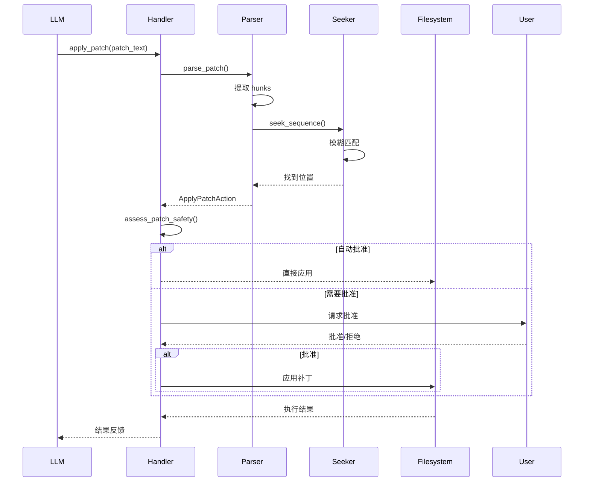
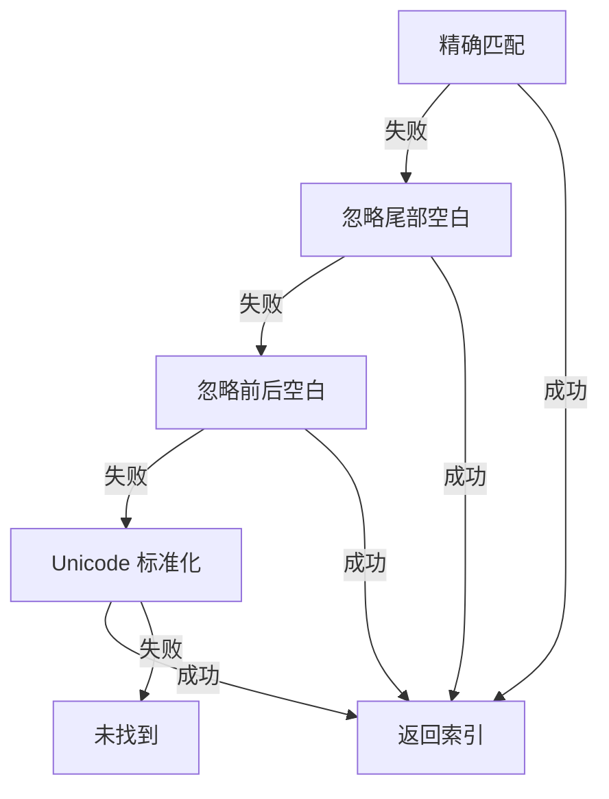
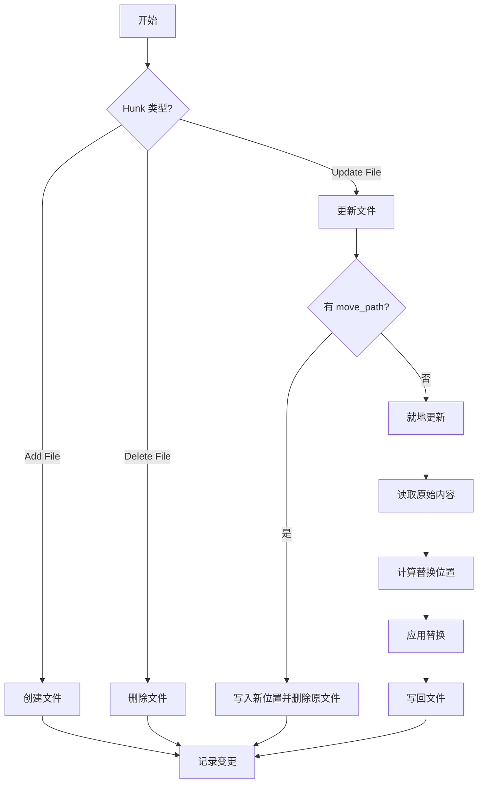
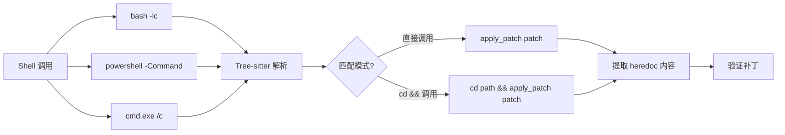
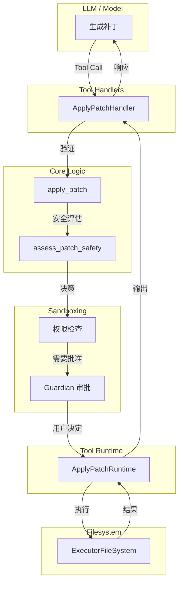
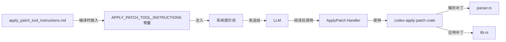

# Apply Patch 工具详细分析

## 目录

1. [概述](#概述)
2. [patch 语言格式](#patch-语言格式)
3. [核心实现原理](#核心实现原理)
4. [如何使用](#如何使用)
5. [与 Codex 的集成](#与-codex-的集成)
6. [测试策略](#测试策略)
7. [指令文件的作用](#指令文件的作用)

## 概述

`apply_patch` 是 Codex 系统中用于安全、可靠地应用代码补丁的工具。它使用自定义的补丁语言格式，使得 LLM 可以以结构化的方式编辑文件。

### 设计目标

- **安全性**: 在应用前验证补丁的正确性
- **可靠性**: 支持模糊匹配，容忍小的格式差异
- **易用性**: 简单的补丁格式，便于 LLM 生成
- **可控性**: 完整的权限审批流程

### 项目结构

```
codex-rs/apply-patch/
├── src/
│   ├── lib.rs                    # 主要库代码，包含核心应用逻辑
│   ├── parser.rs                 # 补丁解析器
│   ├── seek_sequence.rs           # 模糊序列搜索
│   ├── streaming_parser.rs        # 流式解析器
│   ├── invocation.rs             # 命令行/Shell 调用解析
│   ├── standalone_executable.rs  # 独立可执行文件入口
│   └── main.rs                  # 二进制入口
├── apply_patch_tool_instructions.md  # LLM 指令文档
├── Cargo.toml
└── tests/                        # 测试套件
```

## Patch 语言格式

### 语法结构

```mermaid
graph LR
    A[Begin Patch] --> B[File Operations]
    B --> C[End Patch]
    C --> D[End]

    B --> E[Add File]
    B --> F[Delete File]
    B --> G[Update File]

    G --> H[Optional: Move to]
    H --> I[Hunks]
    I --> J[@@ Context Marker]
    J --> K[Diff Lines]
    K --> L[End of File]
```

### 完整语法规范

```
Patch := Begin { FileOp } End
Begin := "*** Begin Patch" NEWLINE
End := "*** End Patch" NEWLINE?
FileOp := AddFile | DeleteFile | UpdateFile
AddFile := "*** Add File: " path NEWLINE { "+" line NEWLINE }
DeleteFile := "*** Delete File: " path NEWLINE
UpdateFile := "*** Update File: " path NEWLINE [ MoveTo ] { Hunk }
MoveTo := "*** Move to: " newPath NEWLINE
Hunk := "@@" [ header ] NEWLINE { HunkLine } [ "*** End of File" NEWLINE ]
HunkLine := (" " | "-" | "+") text NEWLINE
```

### 示例补丁

```diff
*** Begin Patch
*** Add File: hello.txt
+Hello world
*** Update File: src/app.py
*** Move to: src/main.py
@@ def greet():
-print("Hi")
+print("Hello, world!")
*** Delete File: obsolete.txt
*** End Patch
```

### 上下文匹配规则

默认显示 3 行上下文：

```diff
*** Update File: example.py
@@ def process():
    def helper():
        return calculate()
-    x = old_value()
+    x = new_value()
```

当 3 行上下文不足以唯一标识时，使用 `@@` 指定类/函数：

```diff
*** Update File: large.py
@@ class BaseClass
@@     def method():
        # 3 lines of pre-context
        -old_code
        +new_code
        # 3 lines of post-context
```

对于重复代码块，使用多个 `@@` 语句：

```diff
*** Update File: nested.py
@@ class OuterClass
@@     def inner_method():
        # 3 lines of pre-context
        -old_code
        +new_code
```

## 核心实现原理

### 架构流程



### 关键模块

#### 1. 解析器 (parser.rs)

解析补丁文本为结构化的 `Hunk` 对象：

```rust
pub enum Hunk {
    AddFile {
        path: PathBuf,
        contents: String,
    },
    DeleteFile {
        path: PathBuf,
    },
    UpdateFile {
        path: PathBuf,
        move_path: Option<PathBuf>,
        chunks: Vec<UpdateFileChunk>,
    },
}

pub struct UpdateFileChunk {
    pub change_context: Option<String>,  // 上下文锚点
    pub old_lines: Vec<String>,         // 要删除的行
    pub new_lines: Vec<String>,         // 要添加的行
    pub is_end_of_file: bool,         // 是否在文件末尾
}
```

**关键特性**：

- **严格模式 vs 宽松模式**: 宽松模式处理 GPT-4.1 的 heredoc 问题
- **空白容错**: 允许补丁标记周围的空白字符

#### 2. 序列搜索 (seek\_sequence.rs)

在文件中定位要修改的代码块，支持多级模糊匹配：

```rust
pub(crate) fn seek_sequence(
    lines: &[String],
    pattern: &[String],
    start: usize,
    eof: bool,
) -> Option<usize>
```

**匹配级别**（从严格到宽松）：



**Unicode 标准化**处理常见标点差异：

| 原始字符                           | 标准化后            |
| ------------------------------ | --------------- |
| \u{2010}-\u{2015}, \u{2212}    | `-` (ASCII 连字符) |
| \u{2018}-\u{201B}              | `'` (ASCII 单引号) |
| \u{201C}-\u{201F}              | `"` (ASCII 双引号) |
| \u{00A0}, \u{2002}-\u{200A}, 等 | ` `   (空格)      |

#### 3. 补丁应用 (lib.rs)

核心应用逻辑：



**关键实现细节**：

1. **替换计算** (`compute_replacements`)：
   - 使用 `change_context` 快速定位到修改区域
   - 对每个 chunk 中的 `old_lines` 进行序列搜索
   - 处理文件末尾的特殊情况（尾随换行符）
2. **替换应用** (`apply_replacements`)：
   - 从后向前应用替换，避免索引偏移
   - 先删除旧行，再插入新行
3. **路径解析**：
   - 相对路径解析为基于 `cwd` 的绝对路径
   - 支持跨目录操作（通过 `*** Move to`）

### 命令调用解析 (invocation.rs)

支持多种调用方式：



**支持的调用形式**：

```bash
# 直接调用
apply_patch "*** Begin Patch\n*** Add File: foo\n+bar\n*** End Patch"

# Bash heredoc
bash -lc 'apply_patch <<'"'"'EOF'"'"'
*** Begin Patch
*** Add File: foo
+bar
*** End Patch
EOF'

# 带 cd 的 heredoc
bash -lc 'cd subdir && apply_patch <<'"'"'EOF'"'"'
*** Begin Patch
*** Update File: file.txt
@@
-old
+new
*** End Patch
EOF'
```

使用 Tree-sitter Bash 查询来严格验证脚本结构，只允许安全的形式。

## 如何使用

### 作为独立工具

```bash
# 创建新文件
apply_patch "*** Begin Patch
*** Add File: test.txt
+Hello, world!
*** End Patch"

# 更新文件
apply_patch "*** Begin Patch
*** Update File: test.txt
@@
-Hello
+Goodbye
*** End Patch"

# 删除文件
apply_patch "*** Begin Patch
*** Delete File: test.txt
*** End Patch"
```

### 作为库使用

```rust
use codex_apply_patch::{apply_patch, parse_patch};
use codex_exec_server::LOCAL_FS;
use codex_utils_absolute_path::AbsolutePathBuf;

let patch = "*** Begin Patch
*** Add File: hello.txt
+Hello
*** End Patch";

let cwd = AbsolutePathBuf::current_dir()?;
let mut stdout = Vec::new();
let mut stderr = Vec::new();

apply_patch(
    &patch,
    &cwd,
    &mut stdout,
    &mut stderr,
    LOCAL_FS.as_ref(),
    None,
).await?;
```

### 验证补丁（不应用）

```rust
use codex_apply_patch::{maybe_parse_apply_patch_verified, unified_diff_from_chunks};

// 解析并验证
let command = vec!["apply_patch".to_string(), patch_text];
let result = maybe_parse_apply_patch_verified(
    &command,
    &cwd,
    fs.as_ref(),
    None,
).await?;

// 获取 unified diff
match result {
    codex_apply_patch::MaybeApplyPatchVerified::Body(action) => {
        for (path, change) in action.changes() {
            if let ApplyPatchFileChange::Update { chunks, .. } = change {
                let diff = unified_diff_from_chunks(&path, chunks, fs, None).await?;
                println!("{}", diff.unified_diff);
            }
        }
    }
    _ => {}
}
```

## 与 Codex 的集成

### 完整集成架构



### 关键集成点

#### 1. 工具处理器 (tools/handlers/apply\_patch.rs)

```rust
pub struct ApplyPatchHandler;

impl ToolHandler for ApplyPatchHandler {
    async fn handle(&self, invocation: ToolInvocation)
        -> Result<Self::Output, FunctionCallError>
    {
        // 1. 解析输入
        let patch_input = extract_patch_input(&invocation.payload)?;

        // 2. 验证补丁
        let changes = maybe_parse_apply_patch_verified(
            &command,
            &cwd,
            fs,
            sandbox,
        ).await?;

        // 3. 评估安全性
        let (file_paths, permissions, sandbox_policy) =
            effective_patch_permissions(session, turn, &changes).await;

        // 4. 应用或委托
        match apply_patch::apply_patch(turn, &sandbox_policy, changes).await {
            InternalApplyPatchInvocation::Output(result) => {
                Ok(ApplyPatchToolOutput::from_text(result?))
            }
            InternalApplyPatchInvocation::DelegateToRuntime(req) => {
                // 通过 orchestrator 执行，包含审批流程
                orchestrator.run(&mut runtime, &req, &ctx).await
            }
        }
    }
}
```

#### 2. 安全评估

```rust
// 在 core/src/apply_patch.rs 中
pub async fn apply_patch(
    turn_context: &TurnContext,
    file_system_sandbox_policy: &FileSystemSandboxPolicy,
    action: ApplyPatchAction,
) -> InternalApplyPatchInvocation {
    match assess_patch_safety(
        &action,
        turn_context.approval_policy.value(),
        &turn_context.permission_profile(),
        file_system_sandbox_policy,
        &turn_context.cwd,
        turn_context.windows_sandbox_level,
    ) {
        SafetyCheck::AutoApprove { user_explicitly_approved, .. } => {
            InternalApplyPatchInvocation::DelegateToRuntime(...)
        }
        SafetyCheck::AskUser => {
            InternalApplyPatchInvocation::DelegateToRuntime(
                ApplyPatchRuntimeInvocation {
                    action,
                    auto_approved: false,
                    exec_approval_requirement: ExecApprovalRequirement::NeedsApproval {
                        reason: None,
                        proposed_execpolicy_amendment: None,
                    }
                }
            )
        }
        SafetyCheck::Reject { reason } => {
            InternalApplyPatchInvocation::Output(Err(...))
        }
    }
}
```

#### 3. 运行时执行 (tools/runtimes/apply\_patch.rs)

```rust
impl ToolRuntime<ApplyPatchRequest, ExecToolCallOutput> for ApplyPatchRuntime {
    async fn run(
        &mut self,
        req: &ApplyPatchRequest,
        attempt: &SandboxAttempt<'_>,
        ctx: &ToolCtx,
    ) -> Result<ExecToolCallOutput, ToolError>
    {
        let fs = ctx.turn.environments.primary()?.environment.get_filesystem();
        let sandbox = file_system_sandbox_context_for_attempt(req, attempt);
        let mut stdout = Vec::new();
        let mut stderr = Vec::new();

        let result = codex_apply_patch::apply_patch(
            &req.action.patch,
            &req.action.cwd,
            &mut stdout,
            &mut stderr,
            fs.as_ref(),
            sandbox.as_ref(),
        ).await;

        Ok(ExecToolCallOutput {
            exit_code: result.is_ok() as i32,
            stdout: StreamOutput::new(String::from_utf8_lossy(&stdout)),
            stderr: StreamOutput::new(String::from_utf8_lossy(&stderr)),
            // ...
        })
    }
}
```

#### 4. 流式事件支持

Handler 支持增量解析补丁并发送事件：

```rust
struct ApplyPatchArgumentDiffConsumer {
    parser: StreamingPatchParser,
    last_sent_at: Option<Instant>,
    pending: Option<PatchApplyUpdatedEvent>,
}

impl ToolArgumentDiffConsumer for ApplyPatchArgumentDiffConsumer {
    fn consume_diff(
        &mut self,
        turn: &TurnContext,
        call_id: String,
        diff: &str,
    ) -> Option<EventMsg> {
        let hunks = self.parser.push_delta(diff).ok()?;
        if hunks.is_empty() {
            return None;
        }
        // 每 500ms 发送一次事件
        Some(EventMsg::PatchApplyUpdated(PatchApplyUpdatedEvent {
            call_id,
            changes: convert_apply_patch_hunks_to_protocol(&hunks),
        }))
    }
}
```

### Shell 命令拦截

Codex 可以拦截通过 `exec_command` 或 `local_shell` 调用的 `apply_patch`，并将其路由到专用处理器：

```rust
pub async fn intercept_apply_patch(
    command: &[String],
    cwd: &AbsolutePathBuf,
    fs: &dyn ExecutorFileSystem,
    // ... other params
) -> Result<Option<FunctionToolOutput>, FunctionCallError> {
    match maybe_parse_apply_patch_verified(command, cwd, fs, None).await {
        MaybeApplyPatchVerified::Body(changes) => {
            // 警告模型应该使用 apply_patch 工具
            session.record_model_warning(
                "apply_patch was requested via exec_command. \
                Use the apply_patch tool instead."
            ).await;

            // 重新路由到正确的处理流程
            // ... (与正常工具调用相同的逻辑)
        }
        _ => Ok(None), // 不是 apply_patch 调用
    }
}
```

## 测试策略

### 测试组织结构

```
tests/
├── fixtures/
│   └── scenarios/
│       ├── 001_add_file/
│       ├── 002_multiple_operations/
│       ├── 003_multiple_chunks/
│       ├── ... (22 个场景)
│       └── README.md
└── suite/
    ├── mod.rs
    ├── cli.rs      # CLI 测试
    ├── scenarios.rs # 场景测试
    └── tool.rs     # 工具集成测试
```

### 测试场景分类

| 场景 ID | 描述                  | 验证点                  |
| ----- | ------------------- | -------------------- |
| 001   | 添加新文件               | 文件创建、内容正确            |
| 002   | 多个操作                | Add、Delete、Update 组合 |
| 003   | 多个 chunk            | 同一文件多处修改             |
| 004   | 移动到新目录              | Move 操作、目录创建         |
| 005   | 空补丁拒绝               | 错误处理                 |
| 006   | 缺失上下文               | 模糊匹配失败               |
| 007   | 缺失文件删除              | 错误处理                 |
| 008   | 空 update chunk      | 错误处理                 |
| 009   | 需要现有文件              | 错误处理                 |
| 010   | 移动覆盖现有文件            | 覆盖行为                 |
| 011   | Add 覆盖现有文件          | 覆盖行为                 |
| 012   | 删除目录失败              | 错误处理                 |
| 013   | 无效 hunk header      | 错误处理                 |
| 014   | 追加尾随换行              | 换行符处理                |
| 015   | 部分成功后失败             | 事务性                  |
| 016   | 纯添加 update chunk    | 末尾添加                 |
| 017   | 空白填充 hunk header    | 空白容错                 |
| 018   | 空白填充 patch markers  | 空白容错                 |
| 019   | Unicode 支持          | Unicode 处理           |
| 020   | 删除文件成功              | 删除操作                 |
| 020   | 空白填充 patch marker 行 | 空白容错                 |
| 021   | 仅删除 update chunk    | 删除操作                 |
| 022   | 文件末尾标记              | EOF 处理               |

### 测试示例

#### 单元测试

```rust
#[tokio::test]
async fn test_add_file_hunk_creates_file_with_contents() {
    let dir = tempdir().unwrap();
    let path = dir.path().join("add.txt");
    let patch = wrap_patch(&format!(
        r#"*** Add File: {}
+ab
+cd"#,
        path.display()
    ));
    let mut stdout = Vec::new();
    let mut stderr = Vec::new();
    apply_patch(
        &patch,
        &AbsolutePathBuf::from_absolute_path(dir.path()).unwrap(),
        &mut stdout,
        &mut stderr,
        LOCAL_FS.as_ref(),
        None,
    )
    .await
    .unwrap();

    assert_eq!(String::from_utf8(stdout).unwrap(),
        format!("Success. Updated following files:\nA {}\n", path.display()));
    assert_eq!(String::from_utf8(stderr).unwrap(), "");
    assert_eq!(fs::read_to_string(path).unwrap(), "ab\ncd\n");
}
```

#### 集成测试

```rust
#[tokio::test]
async fn test_apply_patch_hunks_accept_relative_and_absolute_paths() {
    let dir = tempdir().unwrap();
    let cwd = dir.path().abs();
    // 准备测试文件
    fs::write(&dir.path().join("relative-update.txt"), "relative old\n").unwrap();
    fs::write(&dir.path().join("absolute-update.txt"), "absolute old\n").unwrap();

    let patch = wrap_patch(&format!(
        r#"*** Update File: relative-update.txt
@@
-relative old
+relative new
*** Update File: {}
@@
-absolute old
+absolute new"#,
        dir.path().join("absolute-update.txt").display(),
    ));

    let mut stdout = Vec::new();
    apply_patch(&patch, &cwd, &mut stdout, &mut stderr, LOCAL_FS.as_ref(), None).await
        .unwrap();

    // 验证两个文件都被正确修改
    assert_eq!(fs::read_to_string(&dir.path().join("relative-update.txt")).unwrap(),
               "relative new\n");
    assert_eq!(fs::read_to_string(&dir.path().join("absolute-update.txt")).unwrap(),
               "absolute new\n");
}
```

### 测试运行

```bash
# 运行所有测试
cargo test -p codex-apply-patch

# 运行特定测试
cargo test -p codex-apply-patch test_add_file_hunk

# 运行场景测试
cargo test -p codex-apply-patch --test scenarios

# 运行 CLI 测试
cargo test -p codex-apply-patch --test cli
```

## 指令文件的作用

### 文件位置

```
codex-rs/apply-patch/apply_patch_tool_instructions.md
```

### 主要用途

这个文件包含给 LLM（如 GPT-4、GPT-5）的详细使用说明，告诉它们如何正确使用 `apply_patch` 工具。

### 文件内容

1. **工具介绍**: 解释 `apply_patch` 是什么
2. **语法说明**: 完整的 patch 语言语法
3. **使用示例**: 展示如何构造补丁
4. **注意事项**: 重要限制和最佳实践

### 如何使用

#### 1. 作为常量嵌入

```rust
// 在 lib.rs 中
pub const APPLY_PATCH_TOOL_INSTRUCTIONS: &str =
    include_str!("../apply_patch_tool_instructions.md");
```

#### 2. 注入到系统提示词

在 Codex 的提示词模板中，这个指令会被嵌入，让 LLM 了解如何使用工具：

```markdown
## Available Tools

You have access to the `apply_patch` tool to edit files:

{apply_patch_tool_instructions}

Example usage:
```

#### 3. 关键指令片段

```markdown
Use the `apply_patch` shell command to edit files.
Your patch language is a stripped‑down, file‑oriented diff format
designed to be easy to parse and safe to apply.

*** Begin Patch
[ one or more file sections ]
*** End Patch

Within that envelope, you get a sequence of file operations.
You MUST include a header to specify the action you are taking.
Each operation starts with one of three headers:

*** Add File: <path> - create a new file.
*** Delete File: <path> - remove an existing file.
*** Update File: <path> - patch an existing file in place.

Important:
- You must include a header with your intended action (Add/Delete/Update)
- You must prefix new lines with `+` even when creating a new file
- File references can only be relative, NEVER ABSOLUTE.
```

### 与 ApplyPatch Crate 的关系



**关键点**：

- 指令文件是 LLM 生成补丁的**规范**
- `codex-apply-patch` crate 是补丁解析和应用的**实现**
- 两者必须保持一致：指令描述的行为必须与实际实现匹配

### 更新指令的流程

1. 修改 `apply_patch_tool_instructions.md`
2. 重新编译（`cargo build`）
3. 常量自动更新（`include_str!` 宏在编译时读取文件）
4. 新的提示词会包含更新后的指令
5. LLM 在下次生成时使用新指令

## 总结

`apply_patch` 工具是 Codex 系统中文件编辑的核心组件，具有以下特点：

### 核心优势

- **安全**: 完整的验证和审批流程
- **可靠**: 模糊匹配处理常见差异
- **可观测**: 详细的执行日志和事件
- **可测试**: 丰富的测试场景覆盖

### 设计权衡

- **简单 vs 功能**: 补丁语言相对简单，牺牲了一些功能换取可靠性
- **严格 vs 宽松**: 宽松模式支持更多 LLM 生成格式
- **原子性**: 部分成功会保留已应用的变更（非事务性）

### 使用建议

1. 使用 `@@` 上下文标记提高匹配可靠性
2. 提供足够的上下文行（默认 3 行）
3. 避免在补丁中使用绝对路径
4. 先验证补丁再应用（使用 `maybe_parse_apply_patch_verified`）

