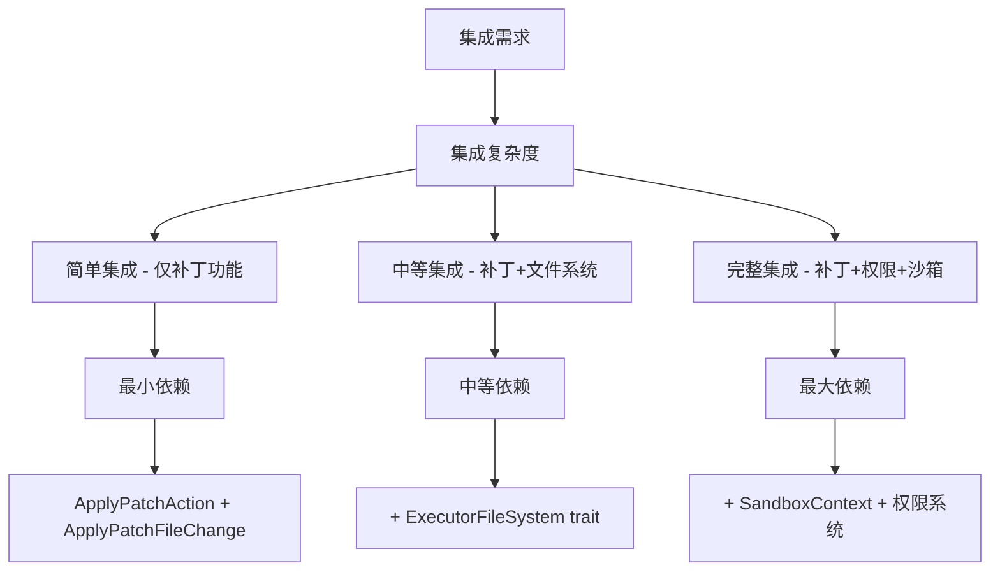
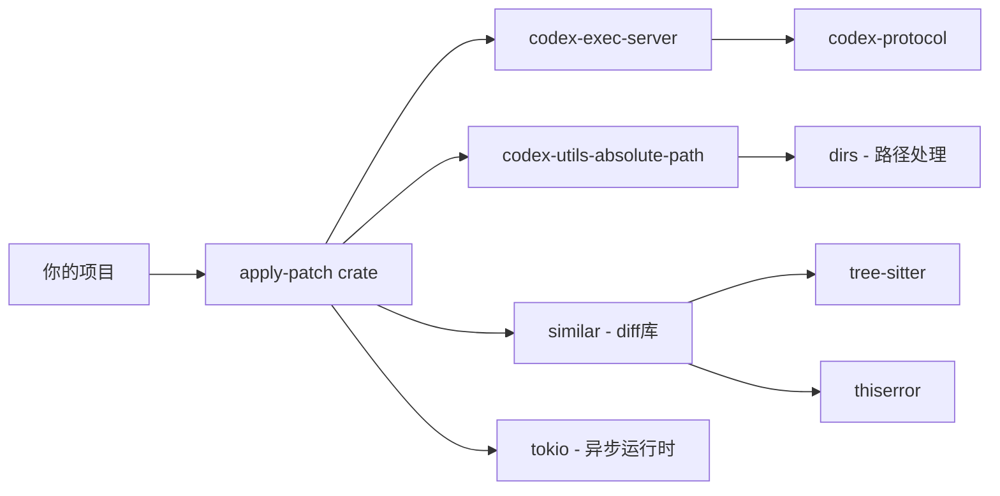
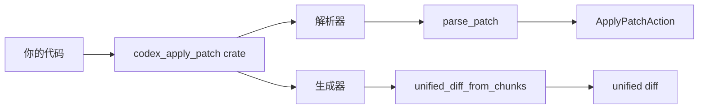
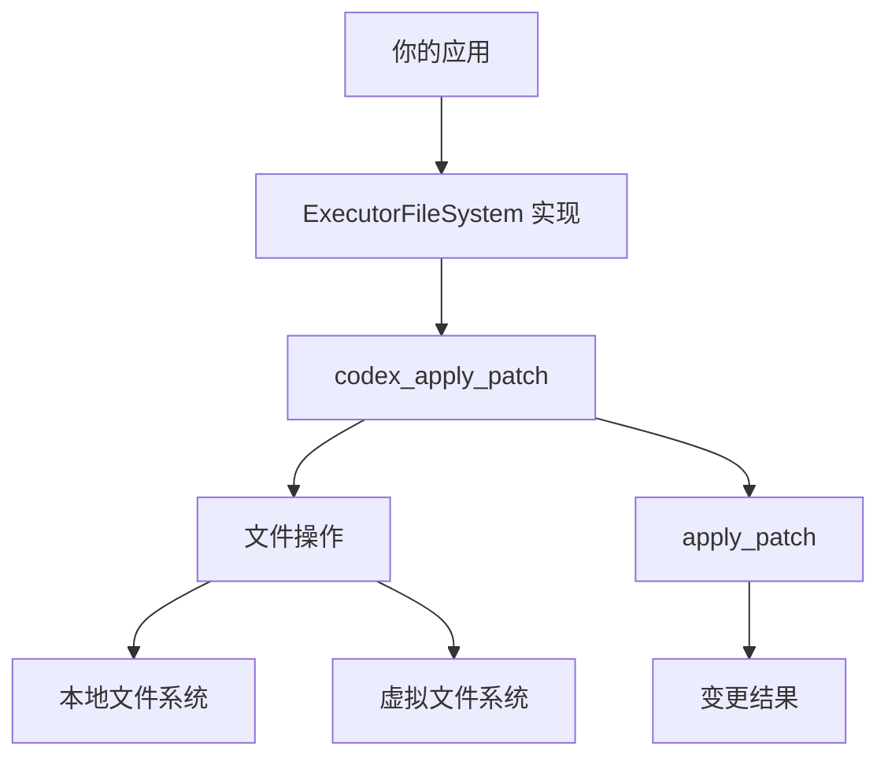
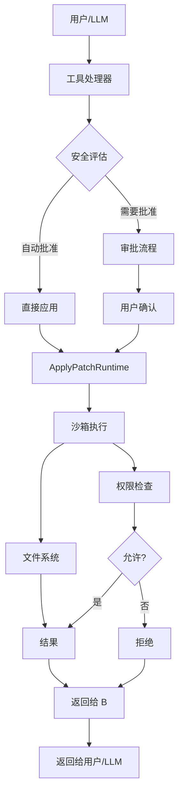

# Apply Patch 工具集成指南

## 目录
1. [概述](#概述)
2. [依赖分析](#依赖分析)
3. [集成方案](#集成方案)
4. [实现步骤](#实现步骤)
5. [完整示例](#完整示例)

## 概述

将 `apply_patch` 工具集成到自己的项目中，可以让你利用其强大的补丁解析和应用能力。本指南提供了从简单到高级的不同集成方案。

### 集成层次



## 依赖分析

### 核心依赖层次



### 依赖详情

| 依赖 | 版本 | 用途 | 是否必需 |
|-----|------|------|---------|
| `codex-exec-server` | workspace | 提供文件系统抽象 | 是 |
| `codex-utils-absolute-path` | workspace | 绝对路径处理 | 是 |
| `similar` | workspace | 生成 unified diff | 是 |
| `tokio` | workspace | 异步运行时 | 是 |
| `thiserror` | workspace | 错误处理 | 是 |
| `tree-sitter` | workspace | 解析 shell 命令 | 可选 |
| `tree-sitter-bash` | workspace | Bash 语法解析 | 可选 |

### Cargo.toml 配置

```toml
[dependencies]
codex-apply-patch = { path = "path/to/codex/codex-rs/apply-patch" }
# 或者使用 git 依赖
# codex-apply-patch = { git = "https://github.com/carbon-dev/codex", tag = "vX.Y.Z" }
```

**注意**: `codex-apply-patch` 本身依赖于 workspace 内的 crate，你可能需要：

1. Fork Codex 仓库
2. 提取 `apply-patch` crate 及其依赖
3. 或者直接依赖整个 Codex workspace

## 集成方案

### 方案一：独立补丁库（推荐用于简单需求）

适用于只需要补丁解析和生成功能，不需要实际文件操作的场景。



#### 能力范围

- ✅ 解析补丁文本
- ✅ 验证补丁语法
- ✅ 生成 unified diff
- ✅ 提取变更信息（文件增删改）
- ❌ 实际文件系统操作
- ❌ 沙箱权限控制

#### 示例代码

```rust
use codex_apply_patch::{
    parse_patch, ApplyPatchAction, ApplyPatchFileChange, Hunk, UpdateFileChunk,
};

/// 解析补丁并提取变更信息
fn analyze_patch(patch_text: &str) -> Result<Vec<FileInfo>, String> {
    let parsed = parse_patch(patch_text)
        .map_err(|e| format!("解析失败: {}", e))?;

    let mut files = Vec::new();
    for hunk in &parsed.hunks {
        match hunk {
            Hunk::AddFile { path, contents } => {
                files.push(FileInfo {
                    path: path.clone(),
                    action: PatchAction::Add,
                    size: contents.len(),
                });
            }
            Hunk::DeleteFile { path } => {
                files.push(FileInfo {
                    path: path.clone(),
                    action: PatchAction::Delete,
                    size: 0,
                });
            }
            Hunk::UpdateFile { path, chunks, .. } => {
                files.push(FileInfo {
                    path: path.clone(),
                    action: PatchAction::Update,
                    size: estimate_change_size(chunks),
                });
            }
        }
    }
    Ok(files)
}

/// 生成 unified diff 用于预览
fn preview_changes(patch_text: &str, file_content: &str) -> Result<String, String> {
    // 这需要实现一个简单的内存文件系统或使用现有的
    // 参考完整示例部分
    Ok("preview here".to_string())
}
```

### 方案二：补丁 + 文件系统（推荐用于本地工具）

需要实际应用补丁到文件系统，但不需要权限控制。



#### 能力范围

- ✅ 所有方案一的功能
- ✅ 实际文件操作
- ✅ 支持本地和远程文件系统
- ❌ 沙箱权限控制
- ❌ 用户审批流程

#### 示例代码

```rust
use codex_apply_patch::apply_patch;
use codex_utils_absolute_path::AbsolutePathBuf;
use tokio::io::AsyncWriteExt;

/// 应用补丁到本地文件系统
async fn apply_patch_local(
    patch_text: &str,
    work_dir: &Path,
) -> Result<String, String> {
    // 实现一个简单的 ExecutorFileSystem
    struct LocalFs;

    #[async_trait::async_trait]
    impl ExecutorFileSystem for LocalFs {
        async fn read_file(
            &self,
            path: &AbsolutePathBuf,
            _sandbox: Option<_>,
        ) -> io::Result<Vec<u8>> {
            tokio::fs::read(path.as_ref()).await
        }

        async fn write_file(
            &self,
            path: &AbsolutePathBuf,
            contents: Vec<u8>,
            _sandbox: Option<_>,
        ) -> io::Result<()> {
            // 创建父目录
            if let Some(parent) = path.parent() {
                tokio::fs::create_dir_all(parent).await.ok();
            }
            tokio::fs::write(path.as_ref(), contents).await
        }

        async fn create_directory(
            &self,
            path: &AbsolutePathBuf,
            _opts: codex_exec_server::CreateDirectoryOptions,
            _sandbox: Option<_>,
        ) -> io::Result<()> {
            tokio::fs::create_dir_all(path.as_ref()).await
        }

        async fn get_metadata(
            &self,
            path: &AbsolutePathBuf,
            _sandbox: Option<_>,
        ) -> io::Result<codex_exec_server::FileMetadata> {
            let meta = tokio::fs::metadata(path.as_ref()).await?;
            Ok(codex_exec_server::FileMetadata {
                is_directory: meta.is_dir(),
                is_file: meta.is_file(),
                is_symlink: meta.is_symlink(),
                created_at_ms: meta
                    .created()
                    .and_then(|t| t.duration_since(UNIX_EPOCH).ok())
                    .map(|d| d.as_millis())
                    .unwrap_or(0),
                modified_at_ms: meta
                    .modified()
                    .and_then(|t| t.duration_since(UNIX_EPOCH).ok())
                    .map(|d| d.as_millis())
                    .unwrap_or(0),
            })
        }

        async fn read_directory(
            &self,
            path: &AbsolutePathBuf,
            _sandbox: Option<_>,
        ) -> io::Result<Vec<codex_exec_server::ReadDirectoryEntry>> {
            let mut entries = Vec::new();
            let mut dir = tokio::fs::read_dir(path.as_ref()).await?;
            while let Some(entry) = dir.next_entry().await? {
                let meta = entry.metadata().await?;
                entries.push(codex_exec_server::ReadDirectoryEntry {
                    file_name: entry.file_name().to_string_lossy().to_string(),
                    is_directory: meta.is_dir(),
                    is_file: meta.is_file(),
                });
            }
            Ok(entries)
        }

        async fn remove(
            &self,
            path: &AbsolutePathBuf,
            _opts: codex_exec_server::RemoveOptions,
            _sandbox: Option<_>,
        ) -> io::Result<()> {
            tokio::fs::remove_file(path.as_ref()).await
        }

        async fn copy(
            &self,
            src: &AbsolutePathBuf,
            dst: &AbsolutePathBuf,
            _opts: codex_exec_server::CopyOptions,
            _sandbox: Option<_>,
        ) -> io::Result<()> {
            tokio::fs::copy(src.as_ref(), dst.as_ref()).await?;
            Ok(())
        }
    }

    let cwd = AbsolutePathBuf::from_absolute_path(work_dir)
        .map_err(|e| format!("工作目录无效: {}", e))?;

    let mut stdout = Vec::new();
    let mut stderr = Vec::new();

    apply_patch(
        patch_text,
        &cwd,
        &mut stdout,
        &mut stderr,
        &LocalFs,
        None, // 无沙箱
    )
    .await
    .map_err(|e| format!("应用补丁失败: {}", e))?;

    Ok(String::from_utf8_lossy(&stdout).to_string())
}
```

### 方案三：完整集成（推荐用于生产系统）

包含完整的沙箱、权限控制和用户审批流程。



#### 能力范围

- ✅ 所有方案二的功能
- ✅ 沙箱隔离
- ✅ 权限控制
- ✅ 用户审批流程
- ✅ 审计日志

## 实现步骤

### 步骤一：准备项目结构

```bash
# 创建项目目录结构
my-project/
├── Cargo.toml
├── src/
│   ├── main.rs
│   ├── lib.rs
│   └── apply_patch_integration.rs
└── tests/
    └── apply_patch_test.rs
```

### 步骤二：配置依赖

```toml
[package]
name = "my-project"
version = "0.1.0"
edition = "2021"

[dependencies]
# apply-patch 核心库
codex-apply-patch = { path = "../codex/codex-rs/apply-patch" }

# 或者使用 git
# codex-apply-patch = { git = "https://github.com/your-fork/codex", branch = "main" }

# 必要的间接依赖（如果无法通过 workspace 解析）
codex-exec-server = { path = "../codex/codex-rs/exec-server" }
codex-utils-absolute-path = { path = "../codex/codex-rs/utils/absolute-path" }
codex-protocol = { path = "../codex/codex-rs/protocol" }

# 其他必要依赖
tokio = { version = "1", features = ["full"] }
async-trait = "0.1"
thiserror = "1"
anyhow = "1"
serde = { version = "1", features = ["derive"] }
serde_json = "1"

[dev-dependencies]
tempfile = "3"
pretty_assertions = "1"
```

### 步骤三：实现 ExecutorFileSystem

```rust
// src/filesystem.rs
use async_trait::async_trait;
use codex_exec_server::{
    CreateDirectoryOptions, ExecutorFileSystem, FileMetadata, FileSystemResult,
    ReadDirectoryEntry, RemoveOptions, CopyOptions, FileSystemSandboxContext,
};
use codex_utils_absolute_path::AbsolutePathBuf;
use std::io;

pub struct MyFileSystem {
    root: AbsolutePathBuf,
}

impl MyFileSystem {
    pub fn new(root: impl AsRef<std::path::Path>) -> io::Result<Self> {
        let root = AbsolutePathBuf::from_absolute_path(root.as_ref())?;
        Ok(Self { root })
    }

    fn resolve_path(&self, path: &AbsolutePathBuf) -> io::Result<AbsolutePathBuf> {
        self.root.join(path.as_ref())
            .try_into()
            .map_err(|e| io::Error::new(io::ErrorKind::InvalidInput, e))
    }
}

#[async_trait]
impl ExecutorFileSystem for MyFileSystem {
    async fn read_file(
        &self,
        path: &AbsolutePathBuf,
        sandbox: Option<&FileSystemSandboxContext>,
    ) -> FileSystemResult<Vec<u8>> {
        let resolved = self.resolve_path(path)?;
        // TODO: 检查沙箱权限
        tokio::fs::read(resolved.as_ref()).await
            .map_err(|e| io::Error::new(e.kind(), format!("{}", e)))
    }

    async fn read_file_text(
        &self,
        path: &AbsolutePathBuf,
        sandbox: Option<&FileSystemSandboxContext>,
    ) -> FileSystemResult<String> {
        let bytes = self.read_file(path, sandbox).await?;
        String::from_utf8(bytes)
            .map_err(|e| io::Error::new(io::ErrorKind::InvalidData, e))
    }

    async fn write_file(
        &self,
        path: &AbsolutePathBuf,
        contents: Vec<u8>,
        sandbox: Option<&FileSystemSandboxContext>,
    ) -> FileSystemResult<()> {
        let resolved = self.resolve_path(path)?;
        // TODO: 检查沙箱权限
        if let Some(parent) = resolved.parent() {
            tokio::fs::create_dir_all(parent).await.ok();
        }
        tokio::fs::write(resolved.as_ref(), contents).await
            .map_err(|e| io::Error::new(e.kind(), format!("{}", e)))
    }

    async fn create_directory(
        &self,
        path: &AbsolutePathBuf,
        _opts: CreateDirectoryOptions,
        _sandbox: Option<&FileSystemSandboxContext>,
    ) -> FileSystemResult<()> {
        let resolved = self.resolve_path(path)?;
        tokio::fs::create_dir_all(resolved.as_ref()).await
            .map_err(|e| io::Error::new(e.kind(), format!("{}", e)))
    }

    async fn get_metadata(
        &self,
        path: &AbsolutePathBuf,
        _sandbox: Option<&FileSystemSandboxContext>,
    ) -> FileSystemResult<FileMetadata> {
        let resolved = self.resolve_path(path)?;
        let meta = tokio::fs::metadata(resolved.as_ref()).await?;
        Ok(FileMetadata {
            is_directory: meta.is_dir(),
            is_file: meta.is_file(),
            is_symlink: meta.is_symlink(),
            created_at_ms: meta
                .created()
                .and_then(|t| t.duration_since(std::time::UNIX_EPOCH).ok())
                .map(|d| d.as_millis())
                .unwrap_or(0),
            modified_at_ms: meta
                .modified()
                .and_then(|t| t.duration_since(std::time::UNIX_EPOCH).ok())
                .map(|d| d.as_millis())
                .unwrap_or(0),
        })
    }

    async fn read_directory(
        &self,
        path: &AbsolutePathBuf,
        _sandbox: Option<&FileSystemSandboxContext>,
    ) -> FileSystemResult<Vec<ReadDirectoryEntry>> {
        let resolved = self.resolve_path(path)?;
        let mut entries = Vec::new();
        let mut dir = tokio::fs::read_dir(resolved.as_ref()).await?;
        while let Some(entry) = dir.next_entry().await {
            if let Ok(entry) = entry {
                let meta = entry.metadata().await;
                if let Ok(meta) = meta {
                    entries.push(ReadDirectoryEntry {
                        file_name: entry.file_name().to_string_lossy().to_string(),
                        is_directory: meta.is_dir(),
                        is_file: meta.is_file(),
                    });
                }
            }
        }
        Ok(entries)
    }

    async fn remove(
        &self,
        path: &AbsolutePathBuf,
        opts: RemoveOptions,
        _sandbox: Option<&FileSystemSandboxContext>,
    ) -> FileSystemResult<()> {
        let resolved = self.resolve_path(path)?;
        // TODO: 检查沙箱权限
        if opts.recursive {
            tokio::fs::remove_dir_all(resolved.as_ref()).await
        } else {
            tokio::fs::remove_file(resolved.as_ref()).await
        }
        .map_err(|e| io::Error::new(e.kind(), format!("{}", e)))
    }

    async fn copy(
        &self,
        source: &AbsolutePathBuf,
        destination: &AbsolutePathBuf,
        _opts: CopyOptions,
        _sandbox: Option<&FileSystemSandboxContext>,
    ) -> FileSystemResult<()> {
        let src = self.resolve_path(source)?;
        let dst = self.resolve_path(destination)?;
        // TODO: 检查沙箱权限
        tokio::fs::copy(src.as_ref(), dst.as_ref()).await
            .map_err(|e| io::Error::new(e.kind(), format!("{}", e)))?;
        Ok(())
    }
}
```

### 步骤四：创建补丁服务

```rust
// src/patch_service.rs
use codex_apply_patch::{
    apply_patch, parse_patch, maybe_parse_apply_patch_verified,
    unified_diff_from_chunks, Hunk,
};
use codex_exec_server::FileSystemSandboxContext;
use codex_utils_absolute_path::AbsolutePathBuf;

#[derive(Debug, Clone)]
pub enum PatchSafety {
    Safe,
    RequiresApproval { reason: String },
    Unsafe { reason: String },
}

#[derive(Debug)]
pub struct PatchPreview {
    pub affected_files: Vec<String>,
    pub unified_diff: String,
    pub estimated_changes: usize,
}

pub struct PatchService {
    cwd: AbsolutePathBuf,
}

impl PatchService {
    pub fn new(cwd: AbsolutePathBuf) -> Self {
        Self { cwd }
    }

    /// 解析并验证补丁，不应用
    pub fn parse_and_validate(&self, patch_text: &str) -> Result<PatchPreview, String> {
        let parsed = parse_patch(patch_text)
            .map_err(|e| format!("解析补丁失败: {}", e))?;

        let mut affected_files = Vec::new();
        for hunk in &parsed.hunks {
            match hunk {
                Hunk::AddFile { path, .. } => {
                    affected_files.push(format!("+ {}", path.display()));
                }
                Hunk::DeleteFile { path } => {
                    affected_files.push(format!("- {}", path.display()));
                }
                Hunk::UpdateFile { path, .. } => {
                    affected_files.push(format!("M {}", path.display()));
                }
            }
        }

        Ok(PatchPreview {
            affected_files,
            unified_diff: format!("已解析 {} 个文件操作", affected_files.len()),
            estimated_changes: parsed.hunks.len(),
        })
    }

    /// 评估补丁安全性
    pub fn assess_safety(&self, patch_text: &str) -> PatchSafety {
        // 简化的安全评估逻辑
        let parsed = match parse_patch(patch_text) {
            Ok(p) => p,
            Err(_) => return PatchSafety::Unsafe {
                reason: "补丁语法错误".to_string(),
            },
        };

        // 检查是否有可疑路径
        for hunk in &parsed.hunks {
            let path = match hunk {
                Hunk::AddFile { path, .. } | Hunk::DeleteFile { path } | Hunk::UpdateFile { path, .. } => path,
            };
            if path.is_absolute() {
                return PatchSafety::Unsafe {
                    reason: format!("补丁包含绝对路径: {}", path.display()),
                };
            }
        }

        // 检查是否有删除操作
        let has_deletes = parsed.hunks.iter().any(|h| matches!(h, Hunk::DeleteFile { .. }));
        if has_deletes {
            return PatchSafety::RequiresApproval {
                reason: "补丁包含文件删除操作".to_string(),
            };
        }

        PatchSafety::Safe
    }

    /// 应用补丁
    pub async fn apply(
        &self,
        patch_text: &str,
        fs: &dyn codex_exec_server::ExecutorFileSystem,
        sandbox: Option<&FileSystemSandboxContext>,
    ) -> Result<String, String> {
        let mut stdout = Vec::new();
        let mut stderr = Vec::new();

        apply_patch(
            patch_text,
            &self.cwd,
            &mut stdout,
            &mut stderr,
            fs,
            sandbox,
        )
        .await
        .map_err(|e| format!("应用补丁失败: {}", e))?;

        let output = String::from_utf8_lossy(&stdout).to_string();
        let errors = String::from_utf8_lossy(&stderr).to_string();

        if !errors.is_empty() {
            return Err(format!("补丁应用有错误: {}", errors));
        }

        Ok(output)
    }
}
```

### 步骤五：实现权限系统（可选）

```rust
// src/permissions.rs
use codex_protocol::models::FileSystemPermissions;
use codex_protocol::permissions::{FileSystemSandboxPolicy, FileSystemPath};
use codex_utils_absolute_path::AbsolutePathBuf;

#[derive(Debug, Clone)]
pub struct PermissionConfig {
    pub allow_read: bool,
    pub allowed_write_paths: Vec<String>,
    pub deny_paths: Vec<String>,
}

impl Default for PermissionConfig {
    fn default() -> Self {
        Self {
            allow_read: true,
            allowed_write_paths: vec![".".to_string()], // 只允许当前目录
            deny_paths: vec![
                "/etc".to_string(),
                "/usr".to_string(),
                "/var".to_string(),
            ],
        }
    }
}

impl PermissionConfig {
    pub fn to_sandbox_policy(&self) -> FileSystemSandboxPolicy {
        FileSystemSandboxPolicy {
            kind: codex_protocol::permissions::FileSystemSandboxKind::Restricted,
            entries: self
                .allowed_write_paths
                .iter()
                .map(|path| FileSystemPath::Path {
                    path: path.clone(),
                    read_only: false,
                })
                .collect(),
        }
    }

    pub fn check_path_allowed(&self, path: &AbsolutePathBuf) -> bool {
        let path_str = path.as_ref().to_string_lossy().to_string();

        // 检查拒绝列表
        for deny in &self.deny_paths {
            if path_str.starts_with(deny) {
                return false;
            }
        }

        // 检查允许列表
        if self.allowed_write_paths.is_empty() {
            return true;
        }

        for allow in &self.allowed_write_paths {
            if path_str.starts_with(allow) {
                return true;
            }
        }

        false
    }
}
```

### 步骤六：集成到应用

```rust
// src/main.rs
mod filesystem;
mod patch_service;
mod permissions;

use filesystem::MyFileSystem;
use patch_service::{PatchSafety, PatchService};
use permissions::PermissionConfig;
use codex_utils_absolute_path::AbsolutePathBuf;
use codex_exec_server::FileSystemSandboxContext;
use codex_protocol::models::PermissionProfile;

#[tokio::main]
async fn main() -> anyhow::Result<()> {
    // 初始化
    let cwd = AbsolutePathBuf::current_dir()?;
    let fs = MyFileSystem::new(cwd.as_ref())?;
    let patch_service = PatchService::new(cwd.clone());

    // 示例补丁
    let patch_text = r#"*** Begin Patch
*** Add File: example.txt
+Hello, apply_patch!
*** Update File: example.txt
@@
-Hello
+Hello, updated!
*** End Patch"#;

    // 步骤 1: 解析和验证
    println!("步骤 1: 解析补丁...");
    let preview = patch_service.parse_and_validate(patch_text)?;
    println!("受影响的文件:");
    for file in &preview.affected_files {
        println!("  {}", file);
    }

    // 步骤 2: 安全评估
    println!("\n步骤 2: 安全评估...");
    match patch_service.assess_safety(patch_text) {
        PatchSafety::Safe => println!("  补丁安全，可以应用"),
        PatchSafety::RequiresApproval { reason } => {
            println!("  补丁需要审批: {}", reason);
            // TODO: 请求用户批准
        }
        PatchSafety::Unsafe { reason } => {
            println!("  补丁不安全: {}", reason);
            return Err(anyhow::anyhow!("拒绝应用不安全的补丁"));
        }
    }

    // 步骤 3: 应用补丁
    println!("\n步骤 3: 应用补丁...");
    let permission_config = PermissionConfig::default();
    let sandbox_policy = permission_config.to_sandbox_policy();

    let sandbox = FileSystemSandboxContext {
        permissions: PermissionProfile {
            file_system: Some(FileSystemPermissions {
                read_roots: Some(vec![]),
                write_roots: Some(vec![]),
            }),
            ..Default::default()
        },
        cwd: Some(cwd.clone()),
        ..Default::default()
    };

    match patch_service
        .apply(patch_text, &fs, Some(&sandbox))
        .await
    {
        Ok(output) => {
            println!("  补丁应用成功!");
            println!("  输出: {}", output);
        }
        Err(e) => {
            println!("  补丁应用失败: {}", e);
            return Err(anyhow::anyhow!(e));
        }
    }

    Ok(())
}
```

## 完整示例

### 简化的 CLI 工具

```rust
// examples/patch-cli/src/main.rs
use anyhow::Result;
use clap::{Parser, Subcommand};
use codex_apply_patch::{parse_patch, apply_patch};
use codex_utils_absolute_path::AbsolutePathBuf;
use std::path::PathBuf;

#[derive(Parser)]
#[command(name = "patch-cli")]
struct Cli {
    #[command(subcommand)]
    command: Command,
}

#[derive(Subcommand)]
enum Command {
    /// Parse and validate a patch
    Parse {
        /// Patch file to parse
        patch_file: PathBuf,
    },
    /// Apply a patch
    Apply {
        /// Patch file to apply
        patch_file: PathBuf,
        /// Working directory
        #[arg(short, long, default_value = ".")]
        work_dir: PathBuf,
        /// Preview changes without applying
        #[arg(short, long)]
        dry_run: bool,
    },
}

#[tokio::main]
async fn main() -> Result<()> {
    let cli = Cli::parse();

    match cli.command {
        Command::Parse { patch_file } => {
            let patch_text = tokio::fs::read_to_string(&patch_file).await?;
            let parsed = parse_patch(&patch_text)?;

            println!("补丁解析成功:");
            println!("  Hunks: {}", parsed.hunks.len());

            for (i, hunk) in parsed.hunks.iter().enumerate() {
                match hunk {
                    codex_apply_patch::Hunk::AddFile { path, contents } => {
                        println!("  [{}] Add File: {} ({} bytes)", i + 1, path.display(), contents.len());
                    }
                    codex_apply_patch::Hunk::DeleteFile { path } => {
                        println!("  [{}] Delete File: {}", i + 1, path.display());
                    }
                    codex_apply_patch::Hunk::UpdateFile { path, move_path, chunks } => {
                        if let Some(dest) = move_path {
                            println!("  [{}] Update File: {} -> {}", i + 1, path.display(), dest.display());
                        } else {
                            println!("  [{}] Update File: {}", i + 1, path.display());
                        }
                        println!("     Chunks: {}", chunks.len());
                    }
                }
            }
        }
        Command::Apply { patch_file, work_dir, dry_run } => {
            let patch_text = tokio::fs::read_to_string(&patch_file).await?;
            let cwd = AbsolutePathBuf::from_absolute_path(&work_dir)?;

            if dry_run {
                println!("预览模式:");
                let parsed = parse_patch(&patch_text)?;
                for hunk in &parsed.hunks {
                    match hunk {
                        codex_apply_patch::Hunk::AddFile { path, contents } => {
                            println!("  + {} ({} bytes)", path.display(), contents.len());
                        }
                        codex_apply_patch::Hunk::DeleteFile { path } => {
                            println!("  - {}", path.display());
                        }
                        codex_apply_patch::Hunk::UpdateFile { path, .. } => {
                            println!("  M {}", path.display());
                        }
                    }
                }
                return Ok(());
            }

            let mut stdout = Vec::new();
            let mut stderr = Vec::new();

            apply_patch(
                &patch_text,
                &cwd,
                &mut stdout,
                &mut stderr,
                &codex_exec_server::LOCAL_FS,
                None,
            )
            .await?;

            println!("补丁应用成功!");
            print!("{}", String::from_utf8_lossy(&stdout));
        }
    }

    Ok(())
}
```

### 集成到 LLM 应用

```rust
// examples/llm-integration/src/lib.rs
use codex_apply_patch::{parse_patch, apply_patch, Hunk};
use serde::{Deserialize, Serialize};
use std::collections::HashMap;

/// LLM 工具定义
#[derive(Debug, Clone, Serialize, Deserialize)]
pub struct ApplyPatchTool {
    #[serde(skip)]
    cwd: AbsolutePathBuf,
}

impl ApplyPatchTool {
    pub fn new(cwd: AbsolutePathBuf) -> Self {
        Self { cwd }
    }

    pub fn description(&self) -> String {
        r#"
Apply a patch to modify files. The patch format is:

*** Begin Patch
[ one or more file operations ]
*** End Patch

File operations:
- *** Add File: <path> - create a new file
- *** Delete File: <path> - remove a file
- *** Update File: <path> - modify a file

Update file format:
*** Update File: <path>
[ *** Move to: <new_path> ]
@@ [context]
-old lines
+new lines

Example:
*** Begin Patch
*** Add File: hello.txt
+Hello world
*** Update File: src.py
@@ def main():
-    print("old")
+    print("new")
*** End Patch
"#
        .to_string()
    }

    pub async fn execute(&self, patch: String) -> Result<String, String> {
        // 解析补丁
        let parsed = parse_patch(&patch)
            .map_err(|e| format!("解析失败: {}", e))?;

        // 简单的安全检查
        for hunk in &parsed.hunks {
            if let Hunk::UpdateFile { path, move_path, .. } | Hunk::AddFile { path, .. } = hunk {
                if path.is_absolute() {
                    return Err("不支持绝对路径".to_string());
                }
                if let Some(dest) = move_path {
                    if dest.is_absolute() {
                        return Err("不支持绝对路径".to_string());
                    }
                }
            }
        }

        // 应用补丁
        let mut stdout = Vec::new();
        let mut stderr = Vec::new();

        apply_patch(
            &patch,
            &self.cwd,
            &mut stdout,
            &mut stderr,
            &codex_exec_server::LOCAL_FS,
            None,
        )
        .await
        .map_err(|e| format!("应用失败: {}", e))?;

        let output = String::from_utf8_lossy(&stdout).to_string();
        let errors = String::from_utf8_lossy(&stderr).to_string();

        if !errors.is_empty() {
            return Err(format!("应用时有错误: {}", errors));
        }

        Ok(output)
    }
}

/// LLM 工具注册器
pub struct ToolRegistry {
    tools: HashMap<String, Box<dyn LLMTool>>,
}

pub trait LLMTool: Send + Sync {
    fn name(&self) -> &str;
    fn description(&self) -> String;
    fn execute(&self, input: serde_json::Value) -> Result<String, String>;
}

impl LLMTool for ApplyPatchTool {
    fn name(&self) -> &str {
        "apply_patch"
    }

    fn description(&self) -> String {
        self.description()
    }

    fn execute(&self, input: serde_json::Value) -> Result<String, String> {
        let patch = input["input"]
            .as_str()
            .ok_or_else(|| "缺少 input 参数".to_string())?;

        // 注意: 这里需要 async runtime，实际实现需要调整
        // 这是一个简化示例
        Ok("需要在异步上下文中调用".to_string())
    }
}
```

## 测试策略

### 单元测试

```rust
// tests/patch_tests.rs
use codex_apply_patch::{parse_patch, Hunk};

#[test]
fn test_parse_add_file() {
    let patch = r#"*** Begin Patch
*** Add File: test.txt
+Hello
*** End Patch"#;

    let parsed = parse_patch(patch).unwrap();
    assert_eq!(parsed.hunks.len(), 1);

    match &parsed.hunks[0] {
        Hunk::AddFile { path, contents } => {
            assert_eq!(path, "test.txt");
            assert_eq!(contents, "Hello\n");
        }
        _ => panic!("Expected AddFile"),
    }
}

#[test]
fn test_parse_update_file() {
    let patch = r#"*** Begin Patch
*** Update File: test.txt
@@
-old
+new
*** End Patch"#;

    let parsed = parse_patch(patch).unwrap();
    assert_eq!(parsed.hunks.len(), 1);

    match &parsed.hunks[0] {
        Hunk::UpdateFile { path, chunks, move_path } => {
            assert_eq!(path, "test.txt");
            assert!(move_path.is_none());
            assert_eq!(chunks.len(), 1);
            assert_eq!(chunks[0].old_lines, vec!["old"]);
            assert_eq!(chunks[0].new_lines, vec!["new"]);
        }
        _ => panic!("Expected UpdateFile"),
    }
}

#[test]
fn test_invalid_patch() {
    let patch = "invalid patch";
    assert!(parse_patch(patch).is_err());
}
```

### 集成测试

```rust
// tests/integration_tests.rs
use codex_apply_patch::{apply_patch, parse_patch};
use codex_utils_absolute_path::AbsolutePathBuf;
use tempfile::tempdir;
use std::fs;

#[tokio::test]
async fn test_apply_patch_integration() {
    let dir = tempdir().unwrap();
    let cwd = AbsolutePathBuf::from_absolute_path(dir.path()).unwrap();

    // 创建测试文件
    let test_file = dir.path().join("test.txt");
    fs::write(&test_file, "old content").unwrap();

    // 创建补丁
    let patch = format!(
        r#"*** Begin Patch
*** Update File: test.txt
@@
-old content
+new content
*** End Patch"#
    );

    // 应用补丁
    let mut stdout = Vec::new();
    let mut stderr = Vec::new();
    apply_patch(
        &patch,
        &cwd,
        &mut stdout,
        &mut stderr,
        &codex_exec_server::LOCAL_FS,
        None,
    )
    .await
    .unwrap();

    // 验证结果
    let content = fs::read_to_string(&test_file).unwrap();
    assert_eq!(content, "new content\n");

    // 验证输出
    let output = String::from_utf8_lossy(&stdout);
    assert!(output.contains("M test.txt"));
}
```

## 故障排除

### 常见问题

| 问题 | 原因 | 解决方案 |
|-----|------|---------|
| 编译错误 "cannot find codex-apply-patch" | 路径配置错误 | 检查 Cargo.toml 中的 path 配置 |
| 运行时错误 "absolute path not allowed" | 补丁包含绝对路径 | 确保补丁使用相对路径 |
| 权限错误 "access denied" | 沙箱权限配置 | 检查 FileSystemSandboxContext 配置 |
| 解析错误 "invalid patch format" | 补丁格式错误 | 参考 patch 语言格式文档 |

### 调试技巧

```rust
// 启用详细日志
use tracing_subscriber::{EnvFilter, fmt};

fn init_logging() {
    tracing_subscriber::fmt()
        .with_env_filter("codex_apply_patch=debug")
        .init();
}

// 检查补丁预览
fn debug_patch(patch: &str) {
    if let Ok(parsed) = parse_patch(patch) {
        println!("解析成功:");
        for hunk in &parsed.hunks {
            println!("  {:?}", hunk);
        }
    } else {
        println!("解析失败: {:?}", parsed);
    }
}
```

## 最佳实践

1. **始终验证补丁**: 在应用前先解析和验证
2. **使用相对路径**: 避免绝对路径带来的安全风险
3. **提供上下文**: 使用 `@@` 标记提高匹配可靠性
4. **处理错误**: 妥善的错误处理和用户反馈
5. **编写测试**: 为每个集成场景编写测试
6. **日志记录**: 记录补丁应用的详细日志
7. **安全评估**: 实现适当的安全检查和审批流程
