# Codex 架构分析文档

> 基于对 OpenAI Codex CLI 项目代码的详细分析

## 目录

1. [项目概述](#项目概述)
2. [技术栈](#技术栈)
3. [架构概览](#架构概览)
4. [核心模块分析](#核心模块分析)
5. [数据流](#数据流)
6. [Agent 系统](#agent-系统)
7. [工具系统](#工具系统)
8. [沙箱与安全](#沙箱与安全)
9. [MCP 集成](#mcp-集成)
10. [状态管理与持久化](#状态管理与持久化)

---

## 项目概述

**Codex CLI** 是 OpenAI 提供的本地 AI 编程助手，采用 Rust 语言构建，支持交互式终端 UI (TUI) 和非交互式命令行模式。项目使用模块化架构，通过 Workspace 管理 100+ 个独立的 Rust crate。

### 主要特性

- **多模式运行**: 交互式 TUI、非交互式 exec、代码审查、App Server
- **多 Agent 协作**: 支持嵌套 Agent 执行复杂任务
- **沙箱隔离**: 提供跨平台的命令执行沙箱（macOS Seatbelt、Linux bubblewrap/Landlock、Windows restricted token）
- **插件系统**: 支持 MCP (Model Context Protocol) 服务器和技能扩展
- **远程连接**: 支持 App Server 模式，允许 IDE 等远程客户端连接

---

## 技术栈

### 核心技术

| 技术 | 用途 |
|------|--------|
| **Rust** | 主要实现语言，使用 2024 edition |
| **Tokio** | 异步运行时 |
| **Ratatui** | TUI 框架 |
| **Axum** | HTTP/WebSocket 服务器 |
| **SQLx** | SQLite 数据库访问 |
| **RMCP** | MCP 协议实现 |
| **Serde** | JSON/TOML 序列化 |
| **Clap** | CLI 参数解析 |

### 构建系统

- **Bazel**: 主要构建工具，用于 Rust 组件
- **pnpm**: JavaScript/TypeScript 部分包管理

---

## 架构概览

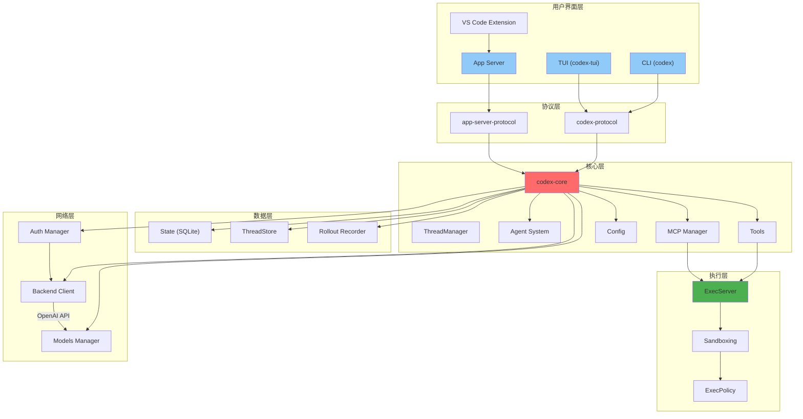

### 架构分层说明

1. **用户界面层**: 提供多种交互方式
   - `codex-cli`: 主入口，支持多种子命令
   - `codex-tui`: 交互式终端界面
   - `codex-app-server`: 远程 API 服务器

2. **协议层**: 定义通信规范
   - `codex-protocol`: 核心协议定义 (Op/Event, Thread/Session)
   - `app-server-protocol`: App Server 专用协议

3. **核心层**: 主要业务逻辑
   - `codex-core`: 核心逻辑实现

4. **执行层**: 命令执行与隔离
   - `codex-exec-server`: 执行服务
   - `codex-sandboxing`: 沙箱实现

5. **数据层**: 持久化存储
   - `codex-state`: SQLite 状态数据库
   - `codex-thread-store`: 线程存储

6. **网络层**: 外部服务连接
   - `codex-backend-client`: 后端 API 客户端
   - `codex-models-manager`: 模型管理

---

## 核心模块分析

### Workspace 结构

Codex 使用 Cargo Workspace 管理约 **111 个独立 crate**，主要分类如下：

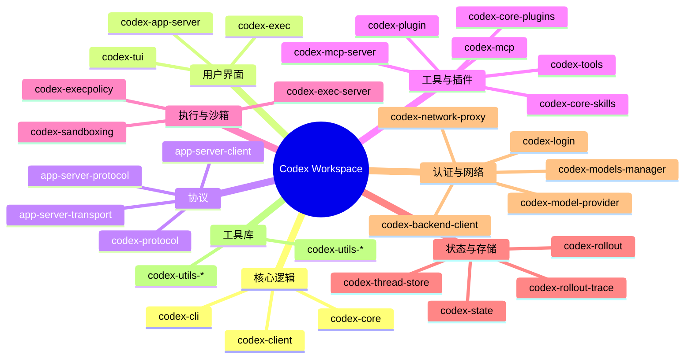

### codex-core

核心业务逻辑模块，包含以下主要子系统：

#### 核心组件

| 组件 | 文件位置 | 职责 |
|--------|-----------|--------|
| **CodexThread** | `codex_thread.rs` | 线程管理，处理用户与 Agent 的对话 |
| **ThreadManager** | `thread_manager.rs` | 线程生命周期管理，包括创建、恢复、分叉 |
| **Client** | `client.rs` | OpenAI API 客户端，处理模型请求 |
| **Agent** | `agent/` | Agent 系统，支持多 Agent 协作 |

#### Agent 系统

Agent 系统支持嵌套 Agent 执行，用于分解复杂任务：

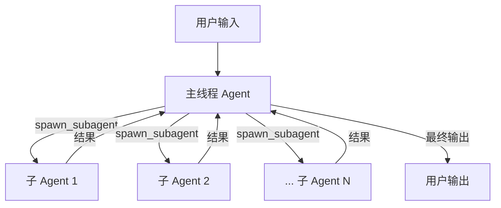

**Agent 核心组件**：

- `registry.rs`: Agent 注册表，管理可用 Agent
- `control.rs`: Agent 控制逻辑
- `mailbox.rs`: Agent 间通信机制
- `status.rs`: Agent 状态跟踪
- `role.rs`: Agent 角色配置

**Agent 状态机**：

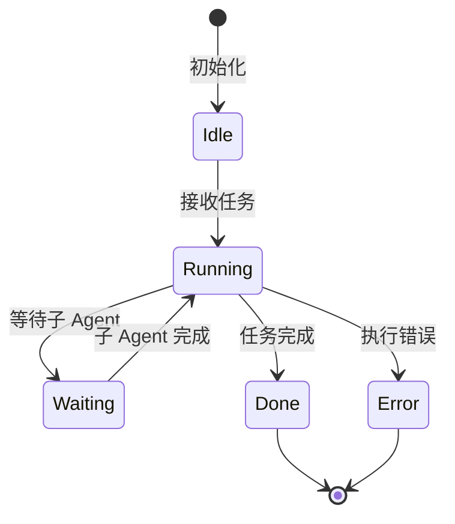

### 协议系统

#### SQ/EQ 模式

使用提交队列 (Submission Queue - SQ) 和事件队列 (Event Queue - EQ) 异步通信：

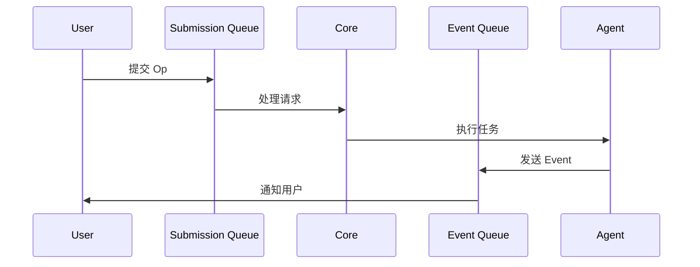

#### 核心协议类型

**Op (操作)** - 用户提交的请求：

| 类型 | 用途 |
|------|--------|
| `UserTurn` | 用户消息 |
| `AgentTurn` | Agent 响应 |
| `ApplyPatch` | 应用补丁 |
| `Reset` | 重置线程 |
| `Compact` | 压缩历史 |

**Event (事件)** - 系统响应：

| 类型 | 用途 |
|------|--------|
| `Message` | 消息更新 |
| `ExecCommand` | 命令执行 |
| `ToolCall` | 工具调用 |
| `RequestApproval` | 请求批准 |
| `RequestUserInput` | 请求用户输入 |

---

## 数据流

### 交互式会话流程

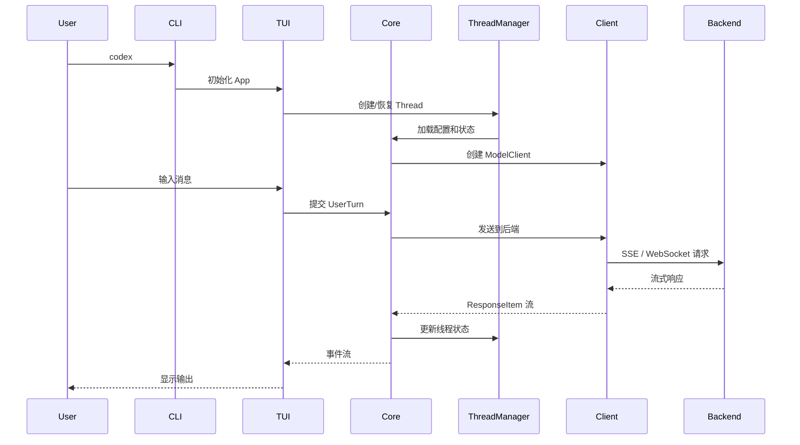

### 工具执行流程

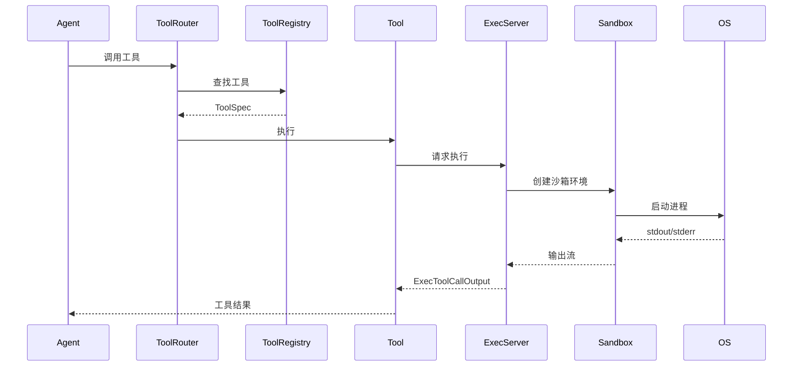

---

## Agent 系统

### Agent 注册与发现

Agent 系统支持通过配置文件或运行时注册自定义 Agent：

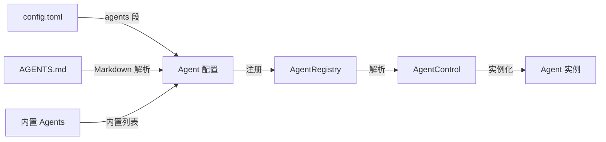

### Agent 通信

Agent 间通过 Mailbox 机制异步通信：

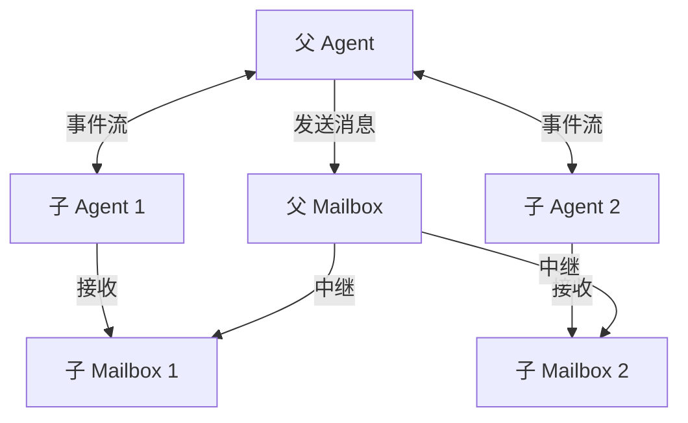

### Agent 状态管理

每个 Agent 维护独立状态，通过 `AgentStatus` 跟踪：

```rust
pub enum AgentStatus {
    Idle,           // 空闲
    Running,         // 运行中
    Waiting,         // 等待子 Agent
    Done,            // 完成
    Error(String),    // 错误
}
```

---

## 工具系统

### 工具类型

Codex 支持多种工具类型：

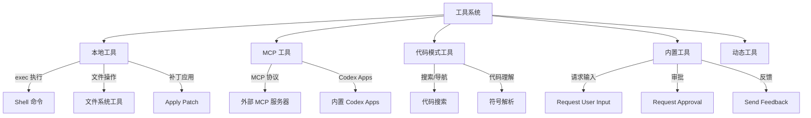

### 工具注册表

`ToolRegistry` 管理所有可用工具：

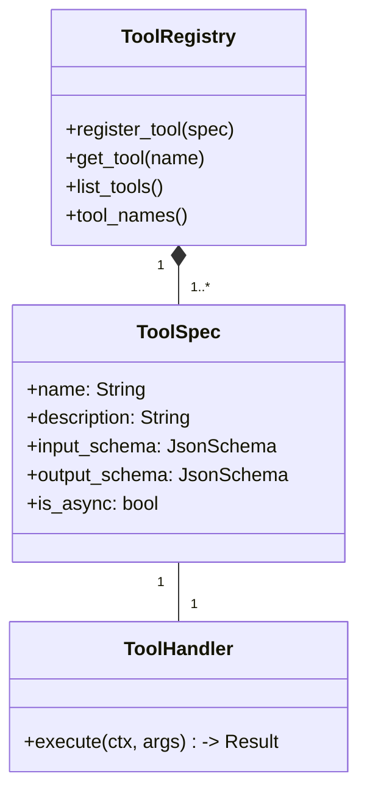

### 工具调用流程

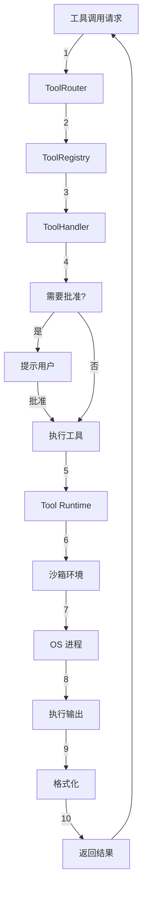

---

## 沙箱与安全

### 沙箱架构

Codex 提供跨平台的沙箱实现：

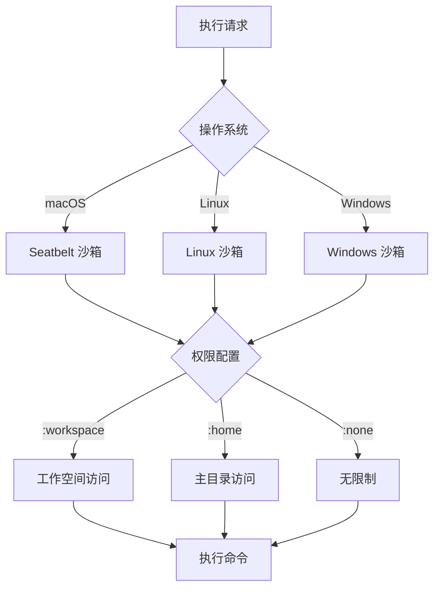

### 沙箱实现

#### macOS (Seatbelt)

```rust
// 使用 /usr/bin/sandbox-exec 创建受限环境
struct SeatbeltSandbox {
    profile: SandboxProfile,  // :workspace, :home, etc.
    network: NetworkPolicy,   // 允许/禁止网络
}
```

#### Linux (Landlock + bubblewrap)

```rust
// 使用 Landlock 细粒度文件系统控制
struct LandlockSandbox {
    read_only_paths: Vec<Path>,    // 只读路径
    writable_paths: Vec<Path>,     // 可写路径
    network_access: NetworkPolicy,  // 网络策略
}

// bubblewrap 用于创建隔离环境
struct BubblewrapConfig {
    bind_mounts: Vec<Mount>,   // 目录绑定
    namespace: bool,             // 启用命名空间
}
```

#### Windows (Restricted Token)

```rust
// 使用受限令牌减少进程权限
struct WindowsSandbox {
    level: WindowsSandboxLevel,  // Low, Medium, High, None
    read_grants: Vec<SecurityDescriptor>,  // 读取权限
}
```

### 执行策略 (ExecPolicy)

`ExecPolicy` 系统允许通过策略文件控制命令执行：

```toml
# exec-policy.toml 示例
[commands]
allow = ["git", "npm", "cargo", "make"]
deny = ["rm", "dd", ":mkfs"]

[paths]
allow = ["/src", "/tests", "/Cargo.toml"]
deny = ["/etc", "/usr", "/var"]

[environment]
allow = ["HOME", "PATH"]
deny = ["CODEX_API_KEY"]
```

### 安全模型

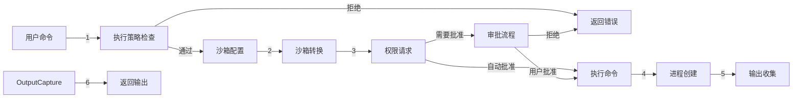

---

## MCP 集成

### MCP 架构

MCP (Model Context Protocol) 允许 Codex 集成外部工具和数据源：

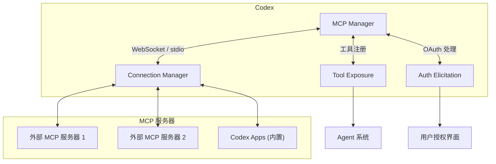

### MCP 工具暴露

MCP 工具通过标准接口暴露给 Agent：

```rust
// MCP 工具规范
pub struct McpTool {
    pub name: String,
    pub description: String,
    pub input_schema: JsonSchema,
}

// 转换为内部工具
pub fn expose_mcp_tool(mcp_tool: McpTool) -> ToolSpec {
    ToolSpec {
        name: mcp_tool.name,
        description: mcp_tool.description,
        input_schema: mcp_tool.input_schema,
        // MCP 工具特殊标记
        provenance: ToolProvenance::Mcp,
    }
}
```

### MCP 连接管理

`McpConnectionManager` 管理多个 MCP 服务器的生命周期：

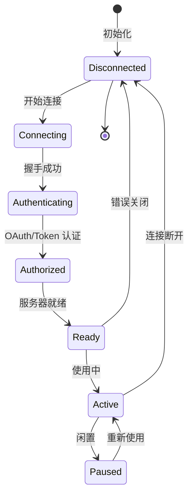

### Codex Apps

内置的 Codex Apps 提供常用功能：

| App | 功能 |
|-----|--------|
| `codex-git` | Git 操作工具 |
| `codex-codebase` | 代码库分析 |
| `codex-test` | 测试执行 |
| `codex-deploy` | 部署工具 |

---

## 状态管理与持久化

### 状态数据库架构

使用 SQLite 存储会话和线程数据：

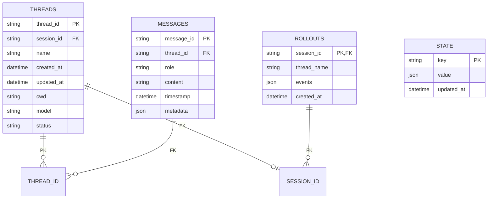

### 持久化策略

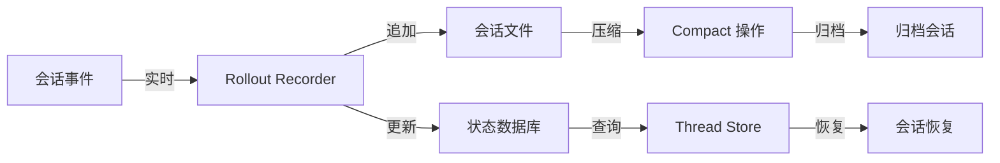

### 文件存储结构

```
~/.codex/
├── config.toml              # 主配置文件
├── exec-policy.toml         # 执行策略
├── state.db                 # SQLite 状态数据库
├── hooks/                   # 钩子脚本
│   ├── pre-turn
│   ├── post-turn
│   └── ...
├── sessions/                # 活动会话
│   ├── <session-id>/
│   │   ├── thread.json
│   │   └── rollout.jsonl
│   └── ...
├── archived-sessions/        # 归档会话
│   └── <session-id>/
├── memories/                # 记忆数据
│   └── <memory-id>/
├── skills/                 # 技能文件
│   └── <skill-name>.md
├── mcp/                    # MCP 配置
│   ├── servers.toml
│   └── auth/
└── plugins/                # 插件安装
    └── <plugin-id>/
```

---

## 关键设计模式

### 1. 提交队列 / 事件队列 (SQ/EQ)

异步通信的核心模式，解耦请求处理和事件分发：

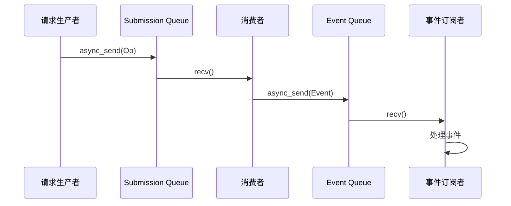

### 2. 工作空间 Crate 模式

使用 Cargo Workspace 管理模块依赖：

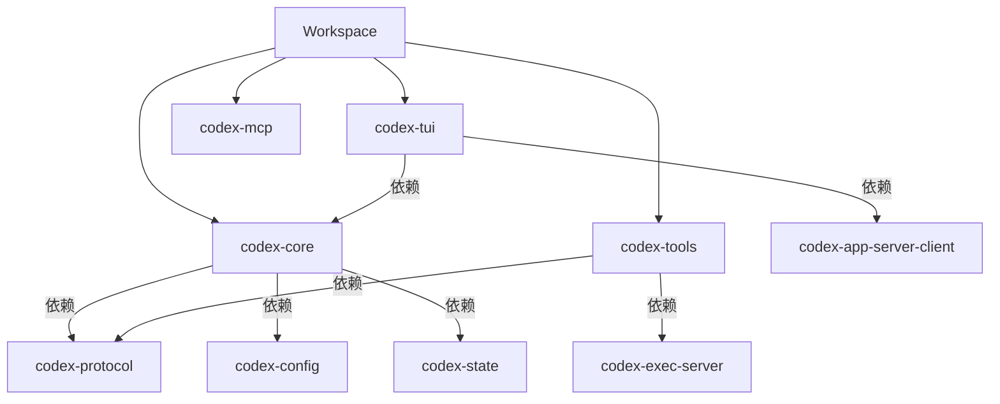

### 3. 策略模式

执行策略和沙箱策略使用策略模式实现可配置的安全控制：

```mermaid
classDiagram
    class Policy {
        <<interface>>
        +evaluate(ctx, op) -> Result
    }
    
    class ExecPolicyPolicy {
        +allow_commands: Vec
        +deny_commands: Vec
        +allow_paths: Vec
        +deny_paths: Vec
        +evaluate(ctx, cmd)
    }
    
    class SandboxPolicy {
        +profile: SandboxProfile
        +network_access: NetworkPolicy
        +transform(request)
    }
    
    Policy <|.. ExecPolicyPolicy
    Policy <|.. SandboxPolicy
```

### 4. 工厂模式

工具和 Agent 使用工厂模式创建实例：

```mermaid
classDiagram
    class Factory {
        <<interface>>
        +create(config) -> Agent
    }
    
    class AgentFactory {
        +create(registry, name, config) -> Agent
    }
    
    class ToolFactory {
        +create(spec, runtime) -> ToolHandler
    }
    
    Factory <|.. AgentFactory
    Factory <|.. ToolFactory
```

### 5. 观察者模式

文件监听和会话事件使用观察者模式：

```mermaid
classDiagram
    class Subject {
        <<interface>>
        +attach(observer)
        +detach(observer)
        +notify(event)
    }
    
    class FileWatcher {
        +registrations: Vec
        +emit(event)
    }
    
    class Observer {
        <<interface>>
        +on_event(event)
    }
    
    class SessionObserver {
        +on_event(event)
    }
    
    Subject <|.. FileWatcher
    Observer <|.. SessionObserver
    FileWatcher o-- Observer
```

---

## 性能与优化

### 1. 异步并发

- **Tokio Runtime**: 完全异步执行
- **任务并行**: 多 Agent 可并行执行
- **工具并发**: 支持并行工具调用

### 2. 输出截断

防止大输出消耗过多内存：

```rust
pub struct TruncationPolicy {
    pub max_bytes: usize,        // 最大字节数
    pub max_lines: usize,        // 最大行数
    pub preview_bytes: usize,    // 预览字节数
    pub preview_lines: usize,     // 预览行数
}

// 默认值
const DEFAULT_OUTPUT_BYTES_CAP: usize = 1_048_576;  // 1MB
const TELEMETRY_PREVIEW_MAX_BYTES: usize = 2_048;     // 2KB
```

### 3. 紧凑历史

支持历史压缩以节省 Token：

```rust
pub enum CompactMode {
    LastNTurns(usize),      // 保留最后 N 轮
    FullHistory,            // 完整历史
    SmartCompact,           // 智能压缩
}

pub struct CompactRequest {
    pub thread_id: ThreadId,
    pub mode: CompactMode,
}
```

---

## 总结

Codex 是一个设计精良的 AI 编程助手系统，具有以下特点：

1. **模块化架构**: 100+ 个独立 crate，职责清晰
2. **多模式支持**: CLI、TUI、App Server 灵活切换
3. **强大 Agent 系统**: 支持嵌套 Agent 分解复杂任务
4. **安全沙箱**: 跨平台隔离执行环境
5. **可扩展性**: MCP、技能、插件系统
6. **异步设计**: 完全基于 Tokio 的高效并发
7. **丰富的工具**: 内置 + MCP + 动态工具

该架构平衡了灵活性、安全性和可维护性，为 AI 编程助手提供了坚实的技术基础。

---

*文档版本: 1.0*
*分析日期: 2026-05-06*
*项目版本: codex-monorepo (基于 main 分支)*
