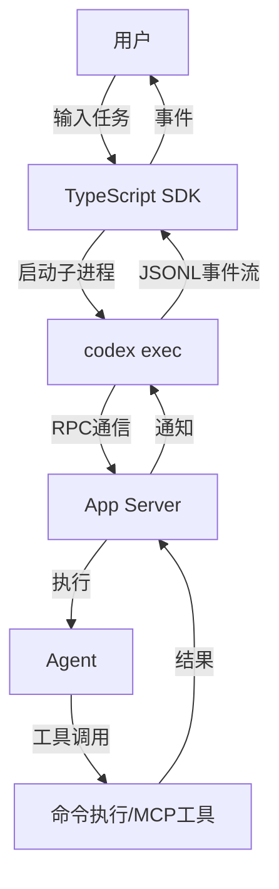
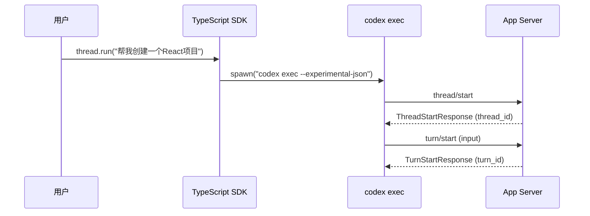
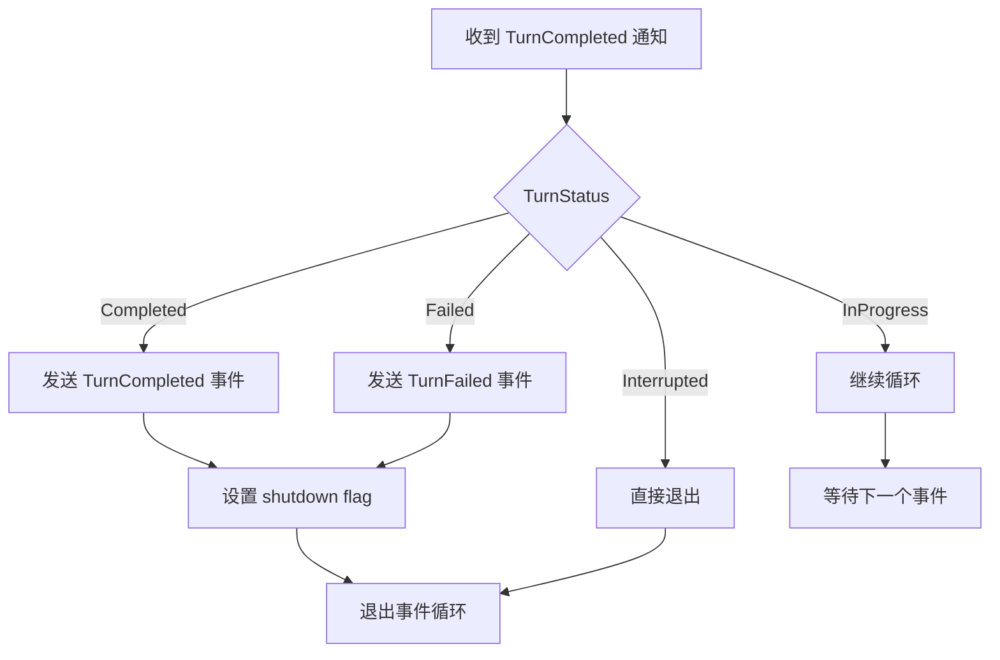
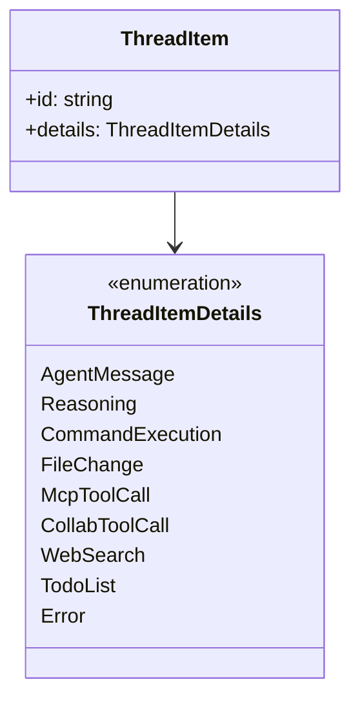
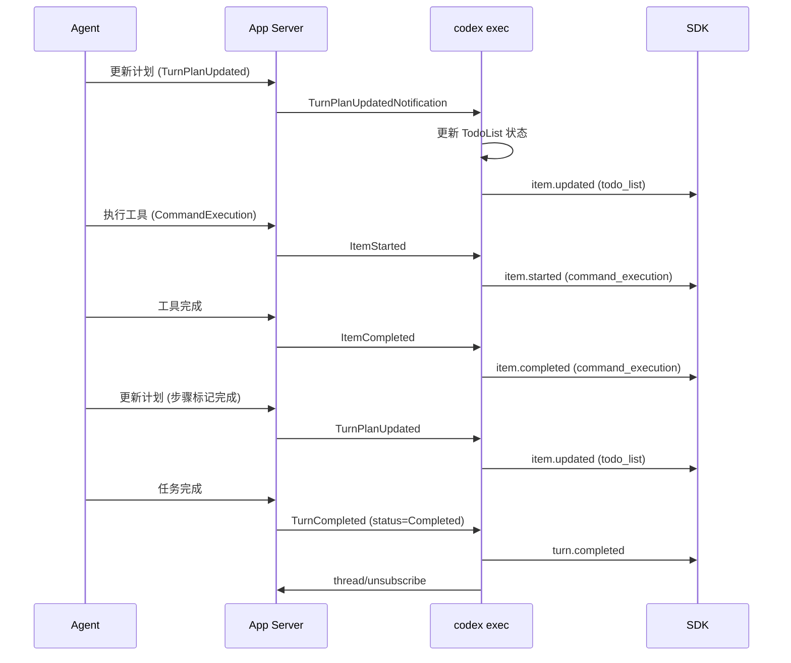
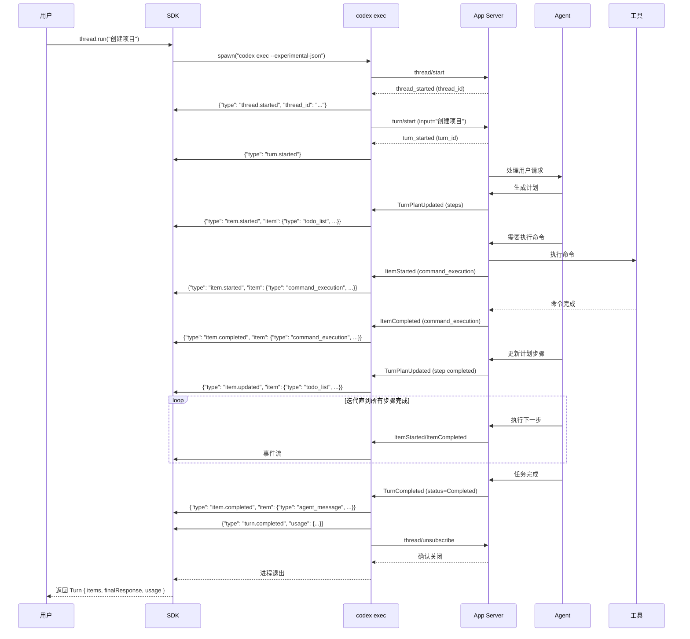

# Codex 事件循环机制深度解析

## 概述

Codex 通过**事件驱动的状态机**来处理用户任务。当用户发起一个任务后，整个处理流程涉及多层抽象和事件流转。本文将详细剖析从用户输入到任务完成的完整过程。

***

## 整体架构



***

## 核心组件层次

| 层次       | 组件             | 职责                | 技术栈        |
| -------- | -------------- | ----------------- | ---------- |
| **API层** | TypeScript SDK | 提供用户友好的编程接口       | TypeScript |
| **执行层**  | codex exec     | 进程管理、事件处理、输出格式化   | Rust       |
| **服务层**  | App Server     | 会话管理、任务调度、Agent协调 | Rust       |
| **代理层**  | Agent          | 任务分解、工具调用、决策制定    | Rust/AI    |

***

## 事件循环完整流程

### 阶段一：任务初始化



**关键代码位置** (`sdk/typescript/src/thread.ts:115-138`):

```typescript
async run(input: Input, turnOptions: TurnOptions = {}): Promise<Turn> {
const generator = this.runStreamedInternal(input, turnOptions);
const items: ThreadItem[] = [];
let finalResponse: string = "";
let usage: Usage | null = null;
let turnFailure: ThreadError | null = null;

for await (const event of generator) {
    if (event.type === "item.completed") {
    if (event.item.type === "agent_message") {
        finalResponse = event.item.text;0
    }
    items.push(event.item);
    } else if (event.type === "turn.completed") {
    usage = event.usage;
    } else if (event.type === "turn.failed") {
    turnFailure = event.error;
    break;
    }
}

if (turnFailure) {
    throw new Error(turnFailure.message);
}
return { items, finalResponse, usage };
}
```

***

### 阶段二：事件循环主循环

事件循环的核心在 `exec/src/lib.rs` 中，关键代码如下：

```rust
// 事件循环主循环 (lib.rs:830-921)
loop {
let server_event = tokio::select! {
    maybe_interrupt = interrupt_rx.recv(), if interrupt_channel_open => {
    // 处理用户中断
    if let Err(err) = send_request_with_response::<TurnInterruptResponse>(
        &client,
        ClientRequest::TurnInterrupt { ... },
        "turn/interrupt",
    ).await {
        warn!("turn/interrupt failed: {err}");
    }
    continue;
    }
    maybe_event = client.next_event() => maybe_event,
};

let Some(server_event) = server_event else {
    break;
};

match server_event {
    InProcessServerEvent::ServerRequest(request) => {
    handle_server_request(&client, request, &mut error_seen).await;
    }
    InProcessServerEvent::ServerNotification(notification) => {
    // 处理通知事件
    if should_process_notification(&notification, &thread_id, &task_id) {
        match event_processor.process_server_notification(notification) {
        CodexStatus::Running => {}
        CodexStatus::InitiateShutdown => {
            // 请求关闭
            request_shutdown(&client, &mut request_ids, &thread_id).await;
            break;
        }
        }
    }
    }
}
}
```

***

### 阶段三：事件处理与转换

`EventProcessorWithJsonOutput` 负责将 App Server 的通知转换为 JSONL 事件流：

```rust
// event_processor_with_jsonl_output.rs:411-587
pub fn collect_thread_events(
    &mut self,
    notification: ServerNotification,
) -> CollectedThreadEvents {
let mut events = Vec::new();
let status = match notification {
    ServerNotification::ItemStarted(notification) => {
    if let Some(item) = self.map_started_item(notification.item) {
        events.push(ThreadEvent::ItemStarted(ItemStartedEvent { item }));
    }
    CodexStatus::Running
    }
    ServerNotification::ItemCompleted(notification) => {
    if let Some(item) = self.map_completed_item_mut(notification.item) {
        if let ThreadItemDetails::AgentMessage(AgentMessageItem { text }) = &item.details {
        self.final_message = Some(text.clone());
        }
        events.push(ThreadEvent::ItemCompleted(ItemCompletedEvent { item }));
    }
    CodexStatus::Running
    }
    ServerNotification::TurnCompleted(notification) => {
    // ... 处理任务完成逻辑
    match notification.turn.status {
        TurnStatus::Completed => {
        events.push(ThreadEvent::TurnCompleted(TurnCompletedEvent {
            usage: self.usage_from_last_total(),
        }));
        CodexStatus::InitiateShutdown
        }
        TurnStatus::Failed => {
        events.push(ThreadEvent::TurnFailed(TurnFailedEvent { error }));
        CodexStatus::InitiateShutdown
        }
        TurnStatus::Interrupted => {
        CodexStatus::InitiateShutdown
        }
        TurnStatus::InProgress => CodexStatus::Running
    }
    }
    // ... 其他通知类型
};

CollectedThreadEvents { events, status }
}
```

***

### 阶段四：任务完成判定

任务完成的核心判定逻辑在 `TurnCompleted` 通知处理中：



**状态转换表**:

| TurnStatus    | 含义     | 行为                                 |
| ------------- | ------ | ---------------------------------- |
| `Completed`   | 任务成功完成 | 发送 `turn.completed` 事件，触发 shutdown |
| `Failed`      | 任务失败   | 发送 `turn.failed` 事件，触发 shutdown    |
| `Interrupted` | 用户中断   | 直接触发 shutdown                      |
| `InProgress`  | 任务进行中  | 继续事件循环                             |

***

## 事件类型体系

### 核心事件类型

| 事件类型             | 触发时机   | 携带数据                |
| ---------------- | ------ | ------------------- |
| `thread.started` | 新线程创建  | `thread_id`         |
| `turn.started`   | 新回合开始  | 无                   |
| `turn.completed` | 回合成功完成 | `usage` (token使用统计) |
| `turn.failed`    | 回合失败   | `error`             |
| `item.started`   | 线程项开始  | `item`              |
| `item.updated`   | 线程项更新  | `item`              |
| `item.completed` | 线程项完成  | `item`              |

### 线程项类型



***

## 任务分解与自我迭代机制

### Todo List 追踪

Codex 通过 `TodoListItem` 追踪任务分解和进度：

```rust
// event_processor_with_jsonl_output.rs:553-578
ServerNotification::TurnPlanUpdated(notification) => {
let items = Self::map_todo_items(&notification.plan);
if let Some(running) = self.running_todo_list.as_mut() {
    // 更新现有 todo list
    running.items = items.clone();
    events.push(ThreadEvent::ItemUpdated(ItemUpdatedEvent {
    item: ExecThreadItem {
        id: running.item_id.clone(),
        details: ThreadItemDetails::TodoList(TodoListItem { items }),
    },
    }));
} else {
    // 创建新的 todo list
    let item_id = self.next_item_id();
    self.running_todo_list = Some(RunningTodoList {
    item_id: item_id.clone(),
    items: items.clone(),
    });
    events.push(ThreadEvent::ItemStarted(ItemStartedEvent {
    item: ExecThreadItem {
        id: item_id,
        details: ThreadItemDetails::TodoList(TodoListItem { items }),
    },
    }));
}
CodexStatus::Running
}
```

### 迭代流程



***

## 关键设计模式

### 1. 事件溯源模式

每个事件都是不可变的状态快照，通过事件序列可以完整重建执行历史：

```typescript
// events.ts:74-82
export type ThreadEvent =
| ThreadStartedEvent
| TurnStartedEvent
| TurnCompletedEvent
| TurnFailedEvent
| ItemStartedEvent
| ItemUpdatedEvent
| ItemCompletedEvent
| ThreadErrorEvent;
```

### 2. 状态机模式

事件处理器维护有限状态机：

```rust
// event_processor.rs:8-11
pub enum CodexStatus {
    Running,           // 继续处理事件
    InitiateShutdown,  // 触发关闭流程
}
```

### 3. 观察者模式

多个处理器可以订阅同一事件流：

```rust
// event_processor.rs:13-29
pub(crate) trait EventProcessor {
    fn print_config_summary(...);
    fn process_server_notification(&mut self, notification: ServerNotification) -> CodexStatus;
    fn process_warning(&mut self, message: String) -> CodexStatus;
    fn print_final_output(&mut self) {}
}
```

***

## 完成判定机制详解

### 判定条件

任务完成的核心判定在 `TurnCompleted` 通知处理中：

```rust
// event_processor_with_jsonl_output.rs:498-551
ServerNotification::TurnCompleted(notification) => {
// 处理待完成的 todo list
if let Some(running) = self.running_todo_list.take() {
    events.push(ThreadEvent::ItemCompleted(ItemCompletedEvent {
    item: ExecThreadItem {
        id: running.item_id,
        details: ThreadItemDetails::TodoList(TodoListItem {
        items: running.items,
        }),
    },
    }));
}

// 调和未完成的已启动项
events.extend(self.reconcile_unfinished_started_items(&notification.turn.items));

match notification.turn.status {
    TurnStatus::Completed => {
    // 提取最终消息
    if let Some(final_message) = Self::final_message_from_turn_items(notification.turn.items.as_slice()) {
        self.final_message = Some(final_message);
    }
    self.emit_final_message_on_shutdown = true;
    events.push(ThreadEvent::TurnCompleted(TurnCompletedEvent {
        usage: self.usage_from_last_total(),
    }));
    CodexStatus::InitiateShutdown
    }
    TurnStatus::Failed => {
    self.final_message = None;
    self.emit_final_message_on_shutdown = false;
    let error = notification.turn.error.map(|error| ThreadErrorEvent {
        message: match error.additional_details {
        Some(details) if !details.is_empty() => format!("{} ({details})", error.message),
        _ => error.message,
        },
    }).or_else(|| self.last_critical_error.clone())
    .unwrap_or_else(|| ThreadErrorEvent {
        message: "turn failed".to_string(),
    });
    events.push(ThreadEvent::TurnFailed(TurnFailedEvent { error }));
    CodexStatus::InitiateShutdown
    }
    TurnStatus::Interrupted => {
    self.final_message = None;
    self.emit_final_message_on_shutdown = false;
    CodexStatus::InitiateShutdown
    }
    TurnStatus::InProgress => CodexStatus::Running,
}
}
```

### 未完成项调和机制

```rust
// event_processor_with_jsonl_output.rs:360-375
fn reconcile_unfinished_started_items(
    &mut self,
    turn_items: &[ThreadItem],
) -> Vec<ThreadEvent> {
turn_items
    .iter()
    .filter_map(|item| {
    let raw_id = item.id().to_string();
    // 查找已启动但未完成的项
    if !self.raw_to_exec_item_id.contains_key(&raw_id) {
        return None;
    }
    // 生成 ItemCompleted 事件
    self.map_completed_item_mut(item.clone())
        .map(|item| ThreadEvent::ItemCompleted(ItemCompletedEvent { item }))
    })
    .collect()
}
```

***

## 完整执行时序图



***

## 总结

Codex 的事件循环机制具有以下核心特点：

1. **分层架构**：SDK → exec → App Server → Agent 的四层架构，职责清晰分离
2. **事件驱动**：基于 JSONL 格式的事件流，实现异步、可观察的状态变化
3. **状态机控制**：通过 `CodexStatus` 状态机精确控制事件循环的生命周期
4. **任务追踪**：通过 `TodoListItem` 实时追踪任务分解和完成进度
5. **优雅关闭**：收到 `TurnCompleted` 通知后，先完成未完成项的调和，再退出循环
6. **可扩展性**：通过 `EventProcessor` trait 支持多种输出格式（JSONL/Human）

整个机制确保了任务执行的可追踪性、可靠性和可扩展性。
