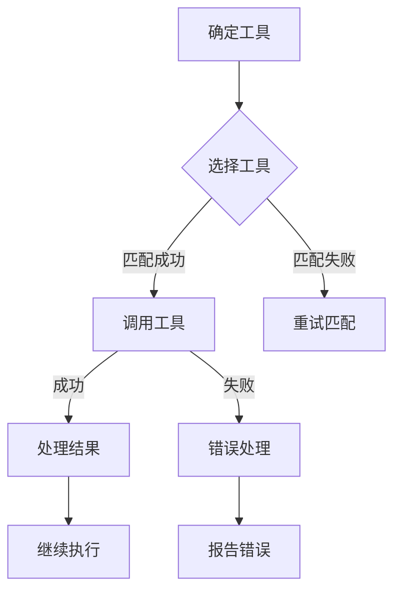

# Codex 工具调用流程

## 1. 确定可调用工具

Codex 内置了一组预定义的工具，每个工具都有明确的用途和功能。当需要调用某个工具时，Codex 会根据工具的描述和功能来决定哪些工具可以被调用。

## 2. 选择工具

根据任务的类型和需求，Codex 会从可调用工具中选取最合适的工具。选择工具的依据包括：

- 工具的功能是否与任务需求匹配
- 工具的复杂度是否适合任务复杂度
- 工具的效率是否满足需求

## 3. 调用工具

选择好工具后，Codex 会使用工具的接口来调用它。调用过程中，Codex 会传递必要的参数和上下文信息给工具，并等待工具返回结果。

## 4. 处理工具返回结果

工具返回结果后，Codex 会根据结果类型和内容进行处理。处理方式包括：

- 如果结果是成功的，Codex 会根据结果内容进行相应的操作，例如更新状态、记录日志等
- 如果结果是失败的，Codex 会根据错误类型和原因进行错误处理，例如重试、记录错误信息、通知用户等

## 5. 判断工具调用成功与否

Codex 会根据工具返回的结果来判断工具调用是否成功。如果工具返回的结果表明操作成功，Codex 会继续执行后续操作；如果工具返回的结果表明操作失败，Codex 会停止执行并报告错误。

## 6. 与外部工具交互

Codex 可以与外部工具进行交互，例如通过 HTTP 请求、命令行等方式。与外部工具交互的流程与内部工具调用类似，包括确定可调用工具、选择工具、调用工具、处理返回结果和判断调用成功与否等步骤。

## Mermaid 图

