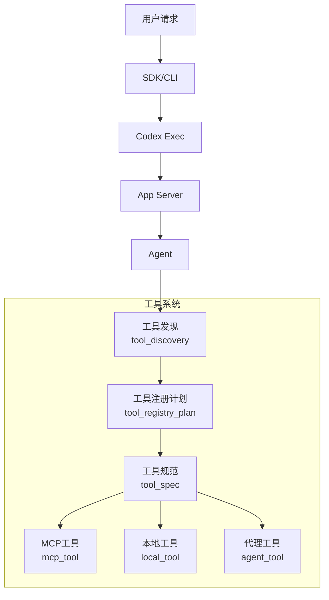
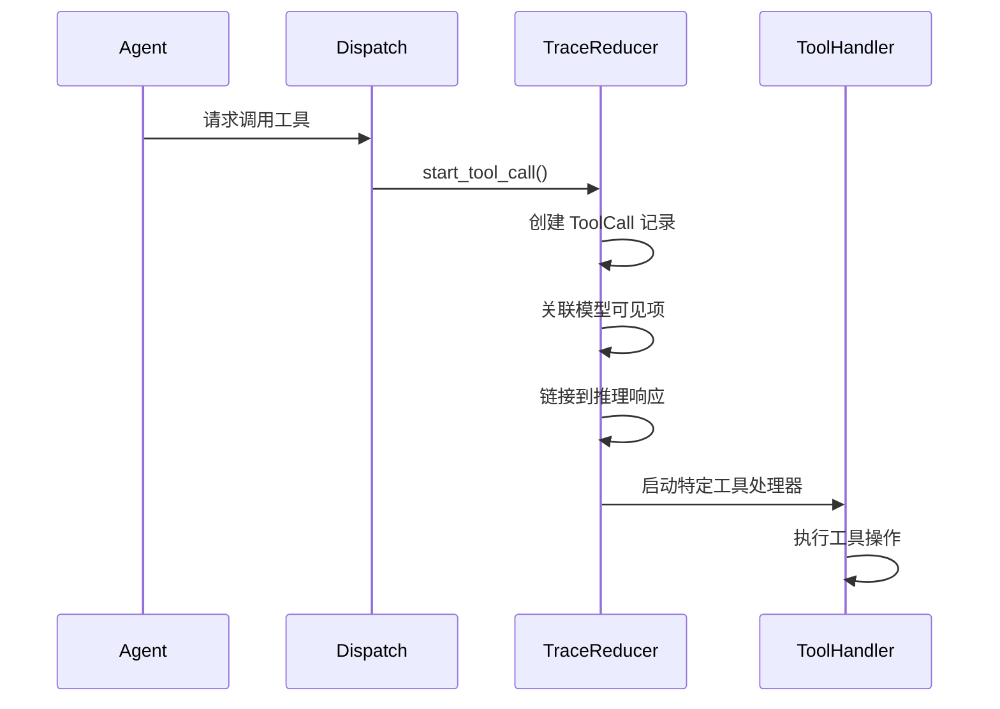
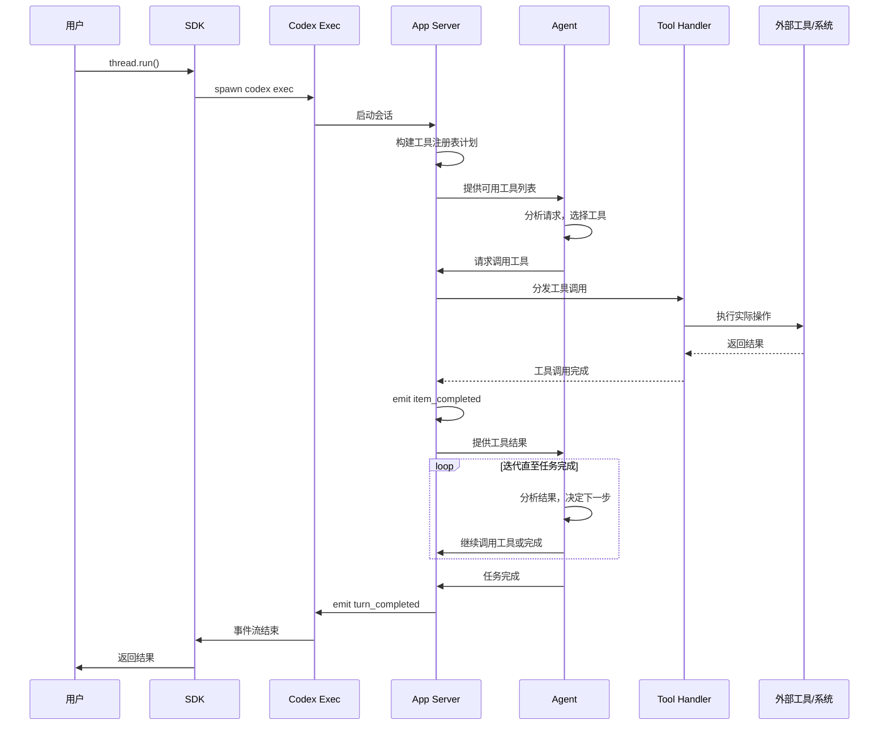

# Codex 工具调用机制深度解析

## 概述

Codex 通过一套完整的工具系统实现与外部环境的交互。这套系统包含工具发现、工具注册、工具选择、工具调用、结果处理等多个环节。本文将详细解析这一机制的工作原理。

## 核心架构



## 1. 工具发现机制

### 1.1 可发现工具类型

Codex 支持两种类型的可发现工具：

- **连接器（Connector）**：外部应用程序连接器
- **插件（Plugin）**：Codex 插件

```rust
#[derive(Clone, Copy, Debug, Deserialize, Serialize, PartialEq, Eq)]
#[serde(rename_all = "snake_case")]
pub enum DiscoverableToolType {
    Connector,
    Plugin,
}
```

### 1.2 工具搜索功能

Codex 提供了内置的工具搜索功能，通过 BM25 算法搜索延迟加载的工具元数据：

```rust
pub fn create_tool_search_tool(
    searchable_sources: &[ToolSearchSourceInfo],
    default_limit: usize,
) -> ToolSpec {
    // 创建 tool_search 工具
    // 支持 query 和 limit 参数
}
```

**关键特点**：
- 搜索来源包括连接器和 MCP 服务器
- 返回工具命名空间和描述
- 支持限制结果数量（默认 8 个）

### 1.3 请求插件/连接器安装

当用户明确请求安装某个特定插件或连接器时使用：

```rust
pub const REQUEST_PLUGIN_INSTALL_TOOL_NAME: &str = "request_plugin_install";

pub fn create_request_plugin_install_tool(
    discoverable_tools: &[RequestPluginInstallEntry],
) -> ToolSpec {
    // 参数包括：
    // - tool_type: "connector" 或 "plugin"
    // - action_type: "install"
    // - tool_id: 具体的工具 ID
    // - suggest_reason: 推荐安装原因
}
```

## 2. 工具注册计划

### 2.1 工具注册表计划构建

`build_tool_registry_plan` 是工具系统的核心函数，根据配置和参数构建完整的工具注册表计划：

```rust
pub fn build_tool_registry_plan(
    config: &ToolsConfig,
    params: ToolRegistryPlanParams<'_>,
) -> ToolRegistryPlan {
    let mut plan = ToolRegistryPlan::new();
    
    // 1. 代码模式工具
    // 2. 环境工具（Shell/命令执行）
    // 3. MCP 工具
    // 4. 计划工具
    // 5. 目标工具
    // 6. 用户输入工具
    // 7. 搜索工具
    // 8. 插件安装工具
    // 9. 补丁应用工具
    // 10. Web 搜索工具
    // 11. 图像生成工具
    // 12. 协作工具
    // 13. 代理任务工具
    // 14. 动态工具
    
    plan
}
```

### 2.2 工具处理器类型

```rust
pub enum ToolHandlerKind {
    Shell,
    ExecCommand,
    WriteStdin,
    ContainerExec,
    LocalShell,
    ShellCommand,
    ApplyPatch,
    Plan,
    GetGoal,
    CreateGoal,
    UpdateGoal,
    RequestUserInput,
    RequestPermissions,
    ViewImage,
    ListMcpResources,
    ListMcpResourceTemplates,
    ReadMcpResource,
    Mcp,
    SpawnAgentV1,
    SpawnAgentV2,
    SendInputV1,
    SendMessageV2,
    FollowupTaskV2,
    ResumeAgentV1,
    WaitAgentV1,
    WaitAgentV2,
    CloseAgentV1,
    CloseAgentV2,
    ListAgentsV2,
    ToolSearch,
    RequestPluginInstall,
    CodeModeExecute,
    CodeModeWait,
    TestSync,
    DynamicTool,
    SpawnAgentsOnCsv,
    ReportAgentJobResult,
}
```

### 2.3 工具注册表计划结构

```rust
pub struct ToolRegistryPlan {
    pub specs: Vec<ConfiguredToolSpec>,
    pub handlers: BTreeMap<ToolName, ToolHandlerKind>,
    pub deferred_mcp_tools: Vec<ToolRegistryPlanMcpTool>,
    pub deferred_dynamic_tools: Vec<ToolRegistryPlanDeferredTool>,
}
```

## 3. 工具规范系统

### 3.1 ToolSpec 类型

ToolSpec 是工具的核心定义，支持多种类型：

```rust
pub enum ToolSpec {
    Function(ResponsesApiTool),
    Namespace(ResponsesApiNamespace),
    ToolSearch {
        execution: String,
        description: String,
        parameters: JsonSchema,
    },
    LocalShell {},
    ImageGeneration {
        output_format: String,
    },
    WebSearch {
        external_web_access: Option<bool>,
        filters: Option<ResponsesApiWebSearchFilters>,
        user_location: Option<ResponsesApiWebSearchUserLocation>,
        search_context_size: Option<WebSearchContextSize>,
        search_content_types: Option<Vec<String>>,
    },
    Freeform(FreeformTool),
}
```

### 3.2 Responses API 工具

标准的 OpenAI Responses API 工具格式：

```rust
pub struct ResponsesApiTool {
    pub name: String,
    pub description: String,
    pub strict: bool,
    pub defer_loading: Option<bool>,
    pub parameters: JsonSchema,
    pub output_schema: Option<JsonSchema>,
}
```

### 3.3 工具命名空间

支持工具分组：

```rust
pub struct ResponsesApiNamespace {
    pub name: String,
    pub description: String,
    pub tools: Vec<ResponsesApiNamespaceTool>,
}

pub enum ResponsesApiNamespaceTool {
    Function(ResponsesApiTool),
}
```

## 4. 工具调用流程

### 4.1 工具调用开始



### 4.2 工具调用跟踪

TraceReducer 中的工具调用跟踪机制：

```rust
pub struct ToolCall {
    pub tool_call_id: ToolCallId,
    pub model_visible_call_id: Option<ModelVisibleCallId>,
    pub code_mode_runtime_tool_id: Option<CodeModeRuntimeToolId>,
    pub thread_id: String,
    pub started_by_codex_turn_id: Option<String>,
    pub execution: ExecutionWindow,
    pub requester: ToolCallRequester,
    pub kind: ToolCallKind,
    pub model_visible_call_item_ids: Vec<String>,
    pub model_visible_output_item_ids: Vec<String>,
    pub terminal_operation_id: Option<String>,
    pub summary: ToolCallSummary,
    pub raw_invocation_payload_id: Option<String>,
    pub raw_result_payload_id: Option<String>,
    pub raw_runtime_payload_ids: Vec<String>,
}
```

### 4.3 执行窗口

```rust
pub struct ExecutionWindow {
    pub started_at_unix_ms: i64,
    pub started_seq: RawEventSeq,
    pub ended_at_unix_ms: Option<i64>,
    pub ended_seq: Option<RawEventSeq>,
    pub status: ExecutionStatus,
}

pub enum ExecutionStatus {
    Running,
    Completed,
    Failed,
}
```

## 5. MCP 工具处理

### 5.1 MCP 工具解析

```rust
pub fn parse_mcp_tool(tool: &rmcp::model::Tool) -> Result<ToolDefinition, serde_json::Error> {
    // 1. 解析输入 schema（确保 properties 存在）
    // 2. 解析输出 schema
    // 3. 创建 ToolDefinition
}
```

**关键处理**：
- OpenAI 模型要求 schema 必须包含 "properties" 字段
- 某些 MCP 服务器可能省略该字段，需要自动插入空对象

### 5.2 MCP 工具调用结果输出 schema

```rust
pub fn mcp_call_tool_result_output_schema(structured_content_schema: JsonValue) -> JsonValue {
    json!({
        "type": "object",
        "properties": {
            "content": { "type": "array", "items": { "type": "object" } },
            "structuredContent": structured_content_schema,
            "isError": { "type": "boolean" },
            "_meta": { "type": "object" }
        },
        "required": ["content"],
        "additionalProperties": false
    })
}
```

## 6. 工具类型详解

### 6.1 本地工具

#### Shell 工具

```rust
pub fn create_shell_tool(options: ShellToolOptions) -> ToolSpec {
    // 执行 shell 命令
}
```

#### 命令执行工具

```rust
pub fn create_exec_command_tool(options: CommandToolOptions) -> ToolSpec {
    // 执行系统命令
}

pub fn create_write_stdin_tool() -> ToolSpec {
    // 向运行中的进程写入 stdin
}
```

#### 补丁应用工具

```rust
pub fn create_apply_patch_freeform_tool() -> ToolSpec {
    // 自由格式补丁
}

pub fn create_apply_patch_json_tool() -> ToolSpec {
    // JSON 格式补丁
}
```

### 6.2 MCP 资源工具

```rust
pub fn create_list_mcp_resources_tool() -> ToolSpec {
    // 列出可用的 MCP 资源
}

pub fn create_list_mcp_resource_templates_tool() -> ToolSpec {
    // 列出资源模板
}

pub fn create_read_mcp_resource_tool() -> ToolSpec {
    // 读取特定 MCP 资源
}
```

### 6.3 计划和目标工具

```rust
pub fn create_update_plan_tool() -> ToolSpec {
    // 更新执行计划
}

pub fn create_get_goal_tool() -> ToolSpec {
    // 获取当前目标
}

pub fn create_create_goal_tool() -> ToolSpec {
    // 创建新目标
}

pub fn create_update_goal_tool() -> ToolSpec {
    // 更新目标
}
```

### 6.4 代理协作工具

#### 多代理 V1

```rust
pub fn create_spawn_agent_tool_v1(options: SpawnAgentToolOptions) -> ToolSpec;
pub fn create_send_input_tool_v1() -> ToolSpec;
pub fn create_resume_agent_tool() -> ToolSpec;
pub fn create_wait_agent_tool_v1(timeouts: Option<WaitAgentTimeoutOptions>) -> ToolSpec;
pub fn create_close_agent_tool_v1() -> ToolSpec;
```

#### 多代理 V2（改进版）

```rust
pub fn create_spawn_agent_tool_v2(options: SpawnAgentToolOptions) -> ToolSpec;
pub fn create_send_message_tool() -> ToolSpec;
pub fn create_followup_task_tool() -> ToolSpec;
pub fn create_wait_agent_tool_v2(timeouts: Option<WaitAgentTimeoutOptions>) -> ToolSpec;
pub fn create_close_agent_tool_v2() -> ToolSpec;
pub fn create_list_agents_tool() -> ToolSpec;
```

### 6.5 代理任务工具

```rust
pub fn create_spawn_agents_on_csv_tool() -> ToolSpec {
    // 从 CSV 批量创建代理
}

pub fn create_report_agent_job_result_tool() -> ToolSpec {
    // 报告代理任务结果
}
```

### 6.6 其他实用工具

```rust
pub fn create_request_user_input_tool(description: String) -> ToolSpec;
pub fn create_request_permissions_tool(description: String) -> ToolSpec;
pub fn create_view_image_tool(options: ViewImageToolOptions) -> ToolSpec;
pub fn create_web_search_tool(options: WebSearchToolOptions) -> Option<ToolSpec>;
pub fn create_image_generation_tool(output_format: &str) -> ToolSpec;
pub fn create_test_sync_tool() -> ToolSpec;
```

## 7. 工具选择机制

### 7.1 并行工具调用支持

```rust
pub struct ConfiguredToolSpec {
    pub spec: ToolSpec,
    pub supports_parallel_tool_calls: bool,
}
```

### 7.2 代码模式集成

代码模式工具：
- `create_code_mode_tool()` - 代码模式执行器
- `create_wait_tool()` - 等待工具

## 8. 完整调用示例

### 8.1 工具调用时序图



### 8.2 错误处理

工具调用失败的处理流程：
1. 工具执行返回错误
2. 记录 `ExecutionStatus::Failed`
3. 发出 `item_completed` 事件（标记为失败）
4. Agent 分析错误，可能重试或调整策略

## 9. 工具结果处理

### 9.1 结果确认

```rust
pub(super) fn end_tool_call(
    &mut self,
    seq: RawEventSeq,
    wall_time_unix_ms: i64,
    tool_call_id: ToolCallId,
    status: ExecutionStatus,
    result_payload: Option<RawPayloadRef>,
) -> Result<()> {
    // 1. 更新 ToolCall 状态
    // 2. 如果是终端操作，结束终端操作
    // 3. 附加代理交互结果
}
```

### 9.2 运行时观察

支持工具执行过程中的运行时观察：

```rust
pub(super) fn start_tool_runtime_observation(
    &mut self,
    seq: RawEventSeq,
    wall_time_unix_ms: i64,
    tool_call_id: ToolCallId,
    runtime_payload: RawPayloadRef,
) -> Result<()>

pub(super) fn end_tool_runtime_observation(
    &mut self,
    seq: RawEventSeq,
    wall_time_unix_ms: i64,
    tool_call_id: ToolCallId,
    status: ExecutionStatus,
    runtime_payload: RawPayloadRef,
) -> Result<()>
```

## 10. 关键设计模式

### 10.1 策略模式

- 通过 `ToolHandlerKind` 分发不同工具的处理逻辑
- 每种工具类型有独立的处理器

### 10.2 工厂模式

- `build_tool_registry_plan()` 根据配置动态创建工具集合
- 各 `create_*_tool()` 函数创建具体工具实例

### 10.3 观察者模式

- TraceReducer 观察工具调用事件
- 通过事件序列构建完整的执行历史

### 10.4 命名空间模式

- 工具按命名空间分组
- 避免名称冲突，提供更好的组织

## 11. 配置选项

### 11.1 工具配置

```rust
pub struct ToolsConfig {
    pub code_mode_enabled: bool,
    pub code_mode_only_enabled: bool,
    pub environment_mode: ToolEnvironmentMode,
    pub shell_type: ConfigShellToolType,
    pub allow_login_shell: bool,
    pub exec_permission_approvals_enabled: bool,
    pub apply_patch_tool_type: Option<ApplyPatchToolType>,
    pub search_tool: bool,
    pub tool_suggest: bool,
    pub namespace_tools: bool,
    pub goal_tools: bool,
    pub web_search_mode: Option<WebSearchMode>,
    pub web_search_config: Option<WebSearchConfig>,
    pub web_search_tool_type: WebSearchToolType,
    pub image_gen_tool: bool,
    pub can_request_original_image_detail: bool,
    pub collab_tools: bool,
    pub multi_agent_v2: bool,
    pub hide_spawn_agent_metadata: bool,
    pub spawn_agent_usage_hint: bool,
    pub spawn_agent_usage_hint_text: Option<String>,
    pub max_concurrent_threads_per_session: Option<u32>,
    pub agent_jobs_tools: bool,
    pub agent_jobs_worker_tools: bool,
    pub request_user_input_available_modes: HashSet<RequestUserInputMode>,
    pub request_permissions_tool_enabled: bool,
    pub experimental_supported_tools: HashSet<String>,
    pub available_models: Vec<ModelAvailability>,
}
```

## 总结

Codex 的工具调用系统是一个完整的、可扩展的架构：

1. **工具发现**：支持 MCP 工具、动态工具、连接器、插件
2. **工具注册**：通过 `build_tool_registry_plan()` 构建工具生态
3. **工具规范**：统一的 `ToolSpec` 类型系统
4. **工具调用**：完整的调用跟踪和状态管理
5. **结果处理**：支持运行时观察和结果确认
6. **错误恢复**：Agent 可根据工具结果调整策略

这套系统使 Codex 能够灵活地与各种外部系统交互，同时保持完整的可观测性和可控性。
