# Codex 工具调用流程详解

## 目录

1. [概述](#概述)
2. [工具发现与注册](#工具发现与注册)
3. [工具选择](#工具选择)
4. [工具调用流程](#工具调用流程)
5. [审批机制](#审批机制)
6. [结果处理](#结果处理)
7. [与外部工具的交互](#与外部工具的交互)
8. [工具调用成功判定](#工具调用成功判定)

---

## 概述

Codex 的工具调用是一个复杂的多层次系统，涉及工具发现、选择、审批、执行和结果处理等多个环节。系统支持多种类型的工具：

- **内置工具**：如 `local_shell`（执行本地命令）、`apply_patch`（应用补丁）等
- **MCP 工具**：通过 Model Context Protocol 连接的外部服务器提供的工具
- **动态工具**：运行时动态加载的工具
- **插件工具**：由插件系统提供的工具

---

## 工具发现与注册

### 工具来源

Codex 通过多个来源发现工具：

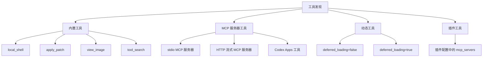

### ToolRegistry 核心结构

`ToolRegistry` 是工具调用的中心注册表，定义在 `core/src/tools/registry.rs`：

```rust
pub struct ToolRegistry {
    handlers: HashMap<ToolName, Arc<dyn AnyToolHandler>>,
}
```

`AnyToolHandler` trait 定义了工具处理器的接口：

```rust
trait AnyToolHandler: Send + Sync {
    fn matches_kind(&self, payload: &ToolPayload) -> bool;
    fn is_mutating(&self, invocation: &ToolInvocation) -> BoxFuture<'a, bool>;
    fn pre_tool_use_payload(&self, invocation: &ToolInvocation) -> Option<PreToolUsePayload>;
    fn post_tool_use_payload(&self, invocation: &ToolInvocation, result: &Self::Output) -> Option<PostToolUsePayload>;
    fn handle_any(&self, invocation: ToolInvocation) -> BoxFuture<'a, Result<AnyToolResult, FunctionCallError>>;
}
```

### 工具规格 (ToolSpec)

每个工具都有一个 `ToolSpec` 描述其输入输出、权限要求等：

```rust
pub enum ToolSpec {
    Function(FunctionToolSpec),
    Freeform(FreeformToolSpec),
    Namespace(NamespaceToolSpec),
    ToolSearch { },
    LocalShell {},
    ImageGeneration { model: String },
    WebSearch {},
}
```

### MCP 工具发现流程

MCP 工具通过以下方式发现：

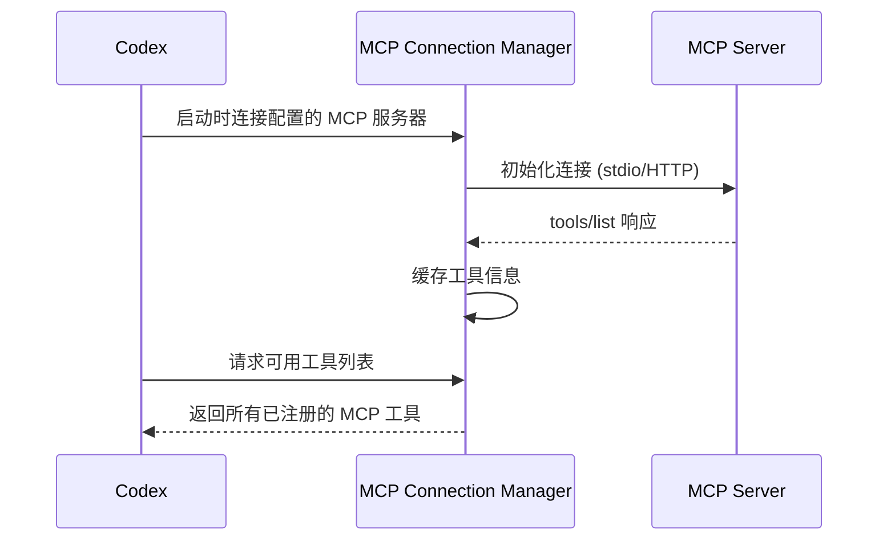

MCP 工具信息存储在 `McpToolApprovalMetadata` 中：

```rust
pub(crate) struct McpToolApprovalMetadata {
    annotations: Option<ToolAnnotations>,
    connector_id: Option<String>,
    connector_name: Option<String>,
    connector_description: Option<String>,
    tool_title: Option<String>,
    tool_description: Option<String>,
    mcp_app_resource_uri: Option<String>,
    codex_apps_meta: Option<serde_json::Map<String, serde_json::Value>>,
    openai_file_input_params: Option<Vec<String>>,
}
```

---

## 工具选择

### 模型发起工具调用

模型通过 `ResponseItem` 发起工具调用请求：

```rust
ResponseItem::FunctionCall {
    name: String,
    namespace: Option<String>,
    arguments: Option<serde_json::Value>,
    call_id: String,
}
```

### ToolRouter 构建工具调用

`ToolRouter` 负责将模型的调用请求转换为具体的 `ToolCall` 对象：

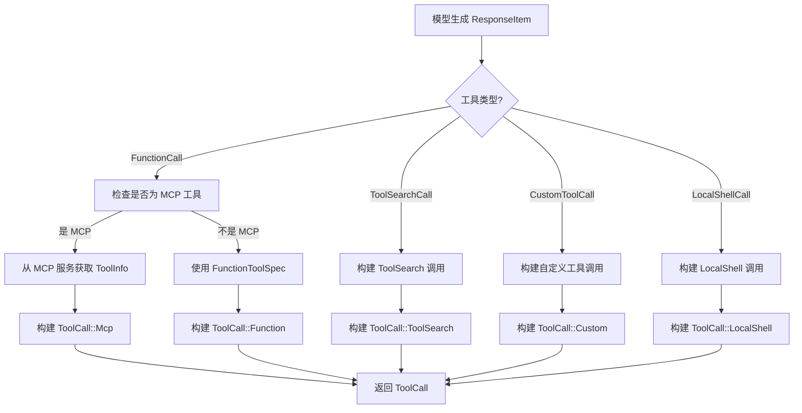

`ToolCall` 结构：

```rust
pub struct ToolCall {
    pub tool_name: ToolName,
    pub call_id: String,
    pub payload: ToolPayload,
}

pub enum ToolPayload {
    Function { arguments: Option<serde_json::Value> },
    Mcp { server: String, tool: String, raw_arguments: Option<serde_json::Value> },
    ToolSearch { arguments: SearchToolCallParams },
    Custom { input: Option<serde_json::Value> },
    LocalShell { params: ShellToolCallParams },
}
```

---

## 工具调用流程

### 完整的工具调用流程

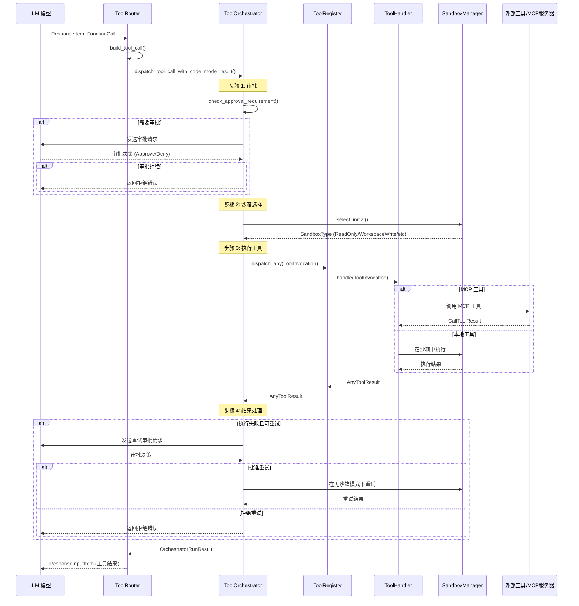

### ToolOrchestrator 执行逻辑

`ToolOrchestrator` 位于 `core/src/tools/orchestrator.rs`，是工具执行的核心编排器。它处理以下关键环节：

```rust
pub async fn run<Rq, Out, T>(
    &mut self,
    tool: &mut T,
    req: &Rq,
    tool_ctx: &ToolCtx,
    turn_ctx: &TurnContext,
    approval_policy: AskForApproval,
) -> Result<OrchestratorRunResult<Out>, ToolError>
where
    T: ToolRuntime<Rq, Out>,
```

---

## 审批机制

### 审批层级

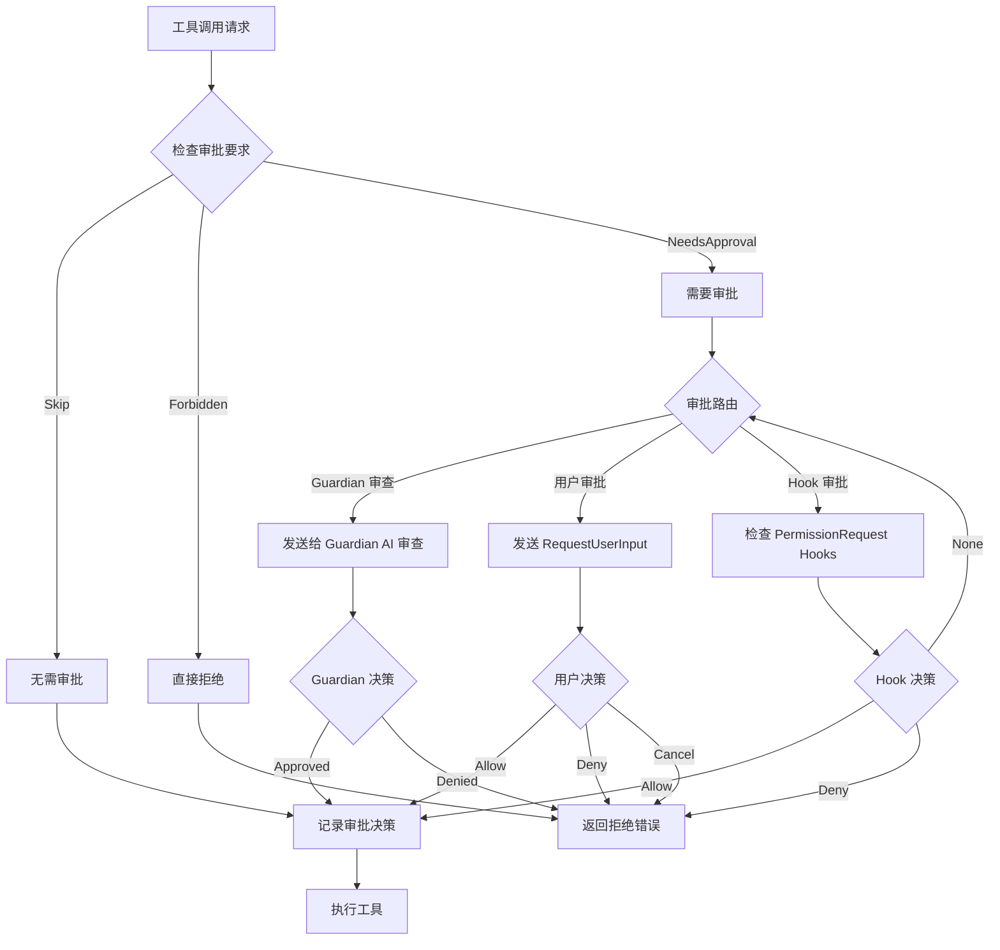

### 审批模式 (AskForApproval)

```rust
pub enum AskForApproval {
    UnlessTrusted,   // 仅不受信任的工具需要审批
    OnFailure,       // 仅失败时需要审批
    OnRequest,       // 每次请求都需要审批
    Never,           // 永不需要审批
    Granular(GranularApprovalConfig), // 细粒度配置
}
```

### ExecApprovalRequirement

工具的审批要求：

```rust
pub enum ExecApprovalRequirement {
    Skip { },
    Forbidden { reason: String },
    NeedsApproval { reason: String, destructive: bool },
}
```

### 审批流程详细代码

审批决策通过以下路径：

```mermaid
stateDiagram-v2
    [*] --> StartApproval

    StartApproval --> CheckHooks: 检查 PermissionRequest Hooks
    CheckHooks --> HookDecision: Hook 返回决策?

    HookDecision --> HookAllow: Allow
    HookDecision --> HookDeny: Deny
    HookDecision --> CheckGuardian: None

    HookAllow --> Approved: 记录决策并继续

    HookDeny --> Rejected: 返回拒绝

    CheckGuardian --> {需要 Guardian?}
    {需要 Guardian?} --> 是: SendToGuardian
    {需要 Guardian?} --> 否: RequestUser

    SendToGuardian --> GuardianReview: Guardian AI 审查
    GuardianReview --> GuardianDecision

    GuardianDecision --> GuardianApproved: Approved
    GuardianDecision --> GuardianDenied: Rejected
    GuardianDecision --> GuardianTimeout: TimedOut

    RequestUser --> UserPrompt: 发送 RequestUserInput
    UserPrompt --> UserResponse: 等待用户响应

    UserResponse --> UserAllow: Approved
    UserResponse --> UserDeny: Rejected
    UserResponse --> UserCancel: Cancel

    Approved --> [*]
    Rejected --> [*]
    TimedOut --> [*]
    Cancel --> [*]
```

---

## 结果处理

### 工具执行结果类型

```rust
pub(crate) struct AnyToolResult {
    pub(crate) call_id: String,
    pub(crate) payload: ToolPayload,
    pub(crate) result: Box<dyn ToolOutput>,
    pub(crate) post_tool_use_payload: Option<PostToolUsePayload>,
}
```

`ToolOutput` trait 定义了结果如何转换为模型可读的形式：

```rust
pub trait ToolOutput: Send {
    fn to_response_item(&self, call_id: &str, payload: &ToolPayload) -> ResponseInputItem;
    fn code_mode_result(&self, payload: &ToolPayload) -> serde_json::Value;
}
```

### 工具结果的事件通知

工具执行结果通过一系列事件通知给客户端：

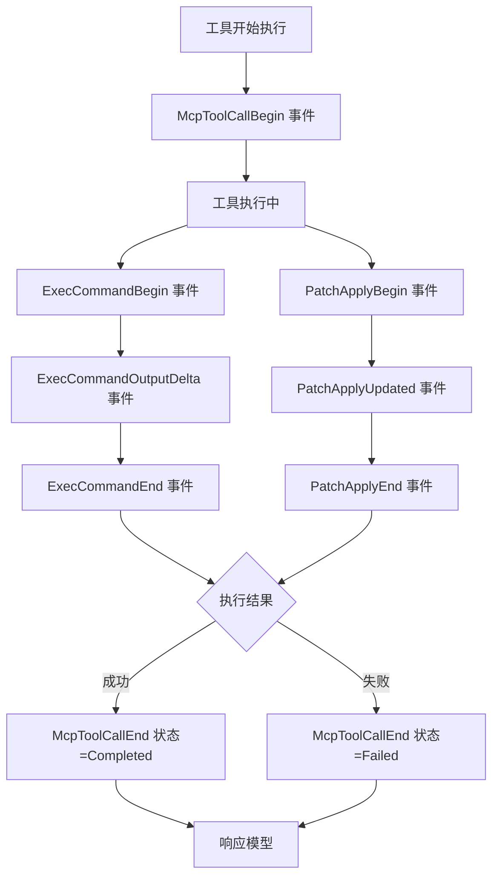

---

## 与外部工具的交互

### MCP 工具调用详细流程

MCP (Model Context Protocol) 是 Codex 与外部工具交互的主要协议：

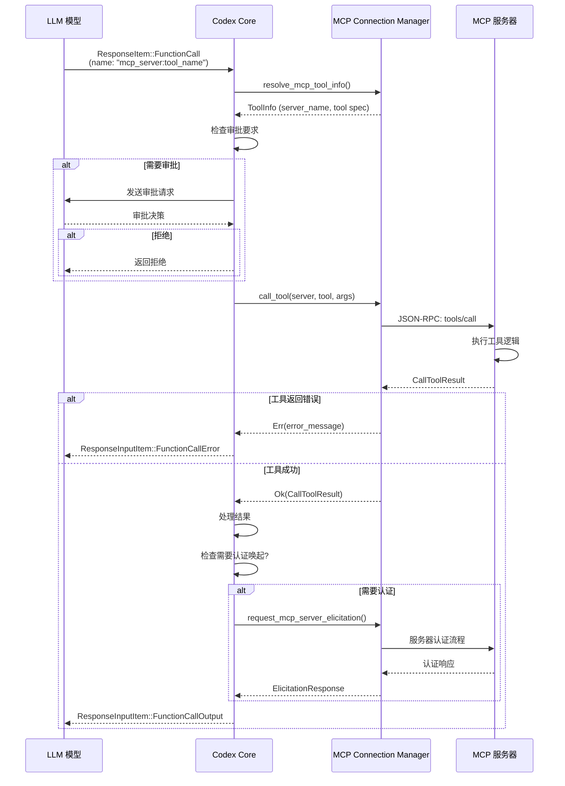

### MCP 连接管理

`McpConnectionManager` 管理所有 MCP 服务器的连接：

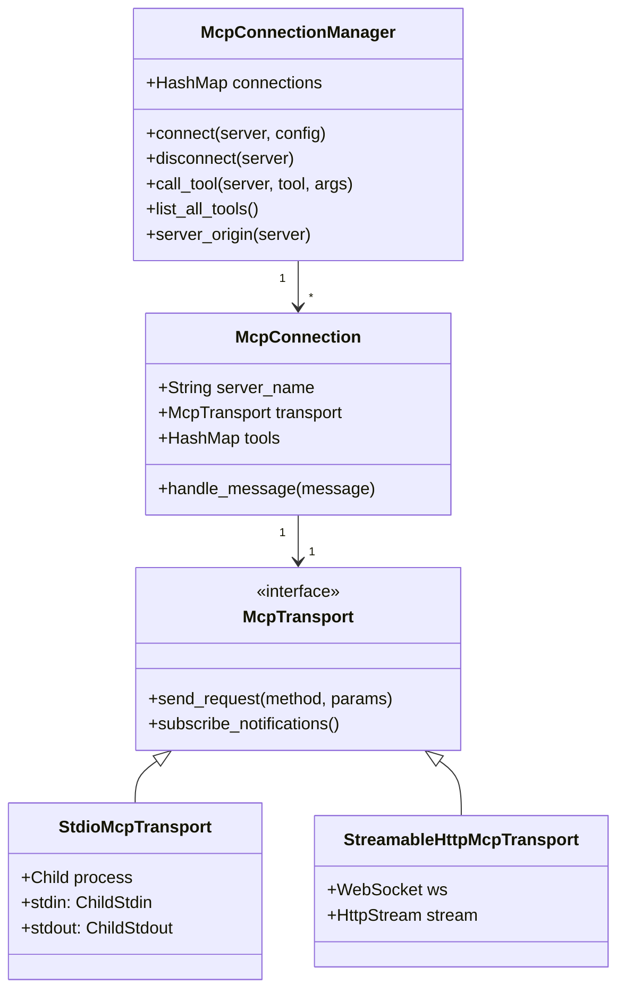

### MCP 工具调用请求结构

MCP 工具调用请求包含以下元数据：

```rust
pub struct McpInvocation {
    pub server: String,
    pub tool: String,
    pub arguments: Option<serde_json::Value>,
}
```

请求元数据 (`_meta`) 包含：

```rust
// Thread ID 用于关联
MCP_TOOL_THREAD_ID_KEY = "threadId"

// Codex Apps 专用元数据
MCP_TOOL_CODEX_APPS_META_KEY = "codex/telemetry"
    - connector_id
    - connector_name
    - call_id

// 沙箱状态（如果服务器支持）
MCP_SANDBOX_STATE_META_CAPABILITY = "codex/sandbox_state"
    - permission_profile
    - sandbox_policy
    - sandbox_cwd
```

---

## 工具调用成功判定

### 成功判定逻辑

工具调用的成功判定通过 `CallToolResult.is_error` 字段：

```rust
pub struct CallToolResult {
    pub content: Vec<Content>,
    pub is_error: Option<bool>,
    pub structured_content: Option<serde_json::Value>,
    pub meta: Option<serde_json::Value>,
}
```

判定规则：

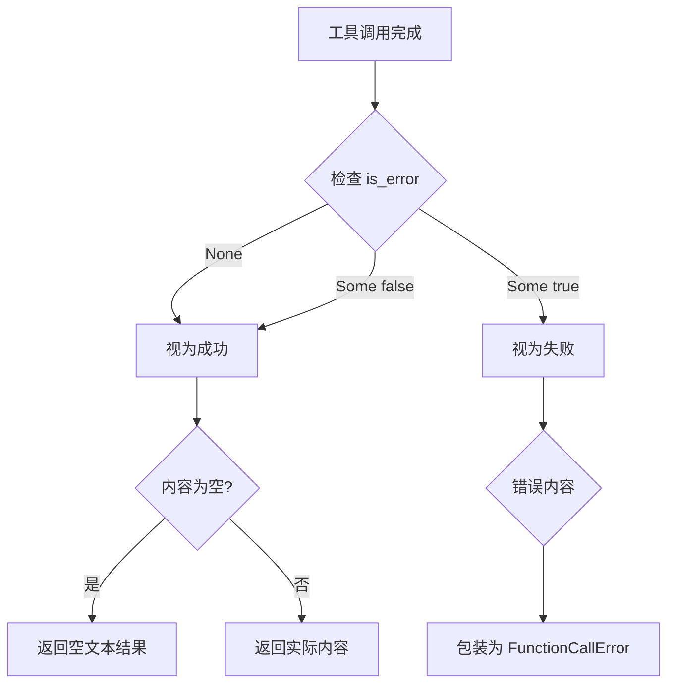

### 错误处理

错误通过 `FunctionCallError` 传递：

```rust
pub enum FunctionCallError {
    RespondToModel(String),
    ToolError(String),
    ToolRejected(String),
    ToolCancelled,
    ToolTimedOut,
}
```

这些错误类型决定模型如何响应：

- `RespondToModel`: 将错误信息发送给模型，允许模型重试
- `ToolRejected`: 工具被拒绝，可能需要用户干预
- `ToolCancelled`: 工具被用户取消
- `ToolTimedOut`: 工具执行超时

### 沙箱拒绝与重试

当工具在沙箱中被拒绝时，`ToolOrchestrator` 会尝试重试：

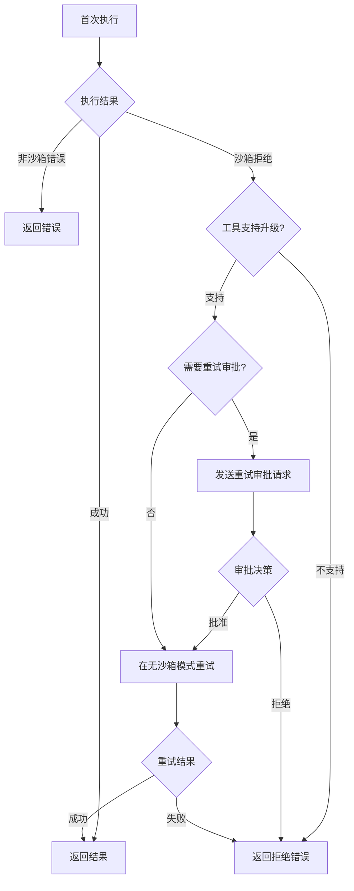

---

## 完整的工具调用生命周期

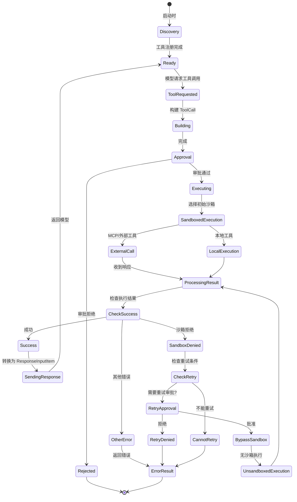

---

## 关键代码文件参考

| 文件路径 | 功能描述 |
|---------|---------|
| `core/src/tools/router.rs` | 工具路由器，负责将模型调用转换为具体工具调用 |
| `core/src/tools/orchestrator.rs` | 工具编排器，处理审批、沙箱选择、重试逻辑 |
| `core/src/tools/registry.rs` | 工具注册表，管理所有可用工具处理器 |
| `core/src/mcp_tool_call.rs` | MCP 工具调用的核心逻辑 |
| `core/src/tools/handlers/` | 各种工具的具体实现处理器 |
| `codex-mcp/src/codex_tools.rs` | MCP 工具信息结构定义 |
| `mcp-server/src/message_processor.rs` | MCP 服务器端的消息处理 |
| `mcp-server/src/codex_tool_runner.rs` | Codex MCP 工具的执行器 |
