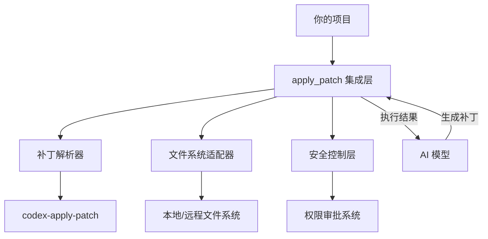
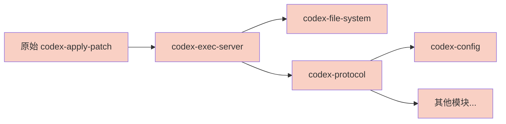
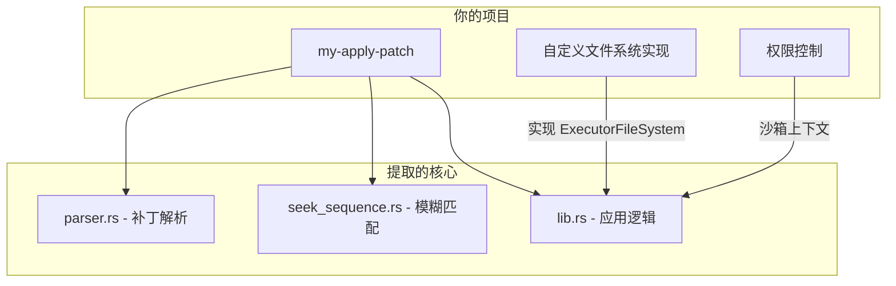
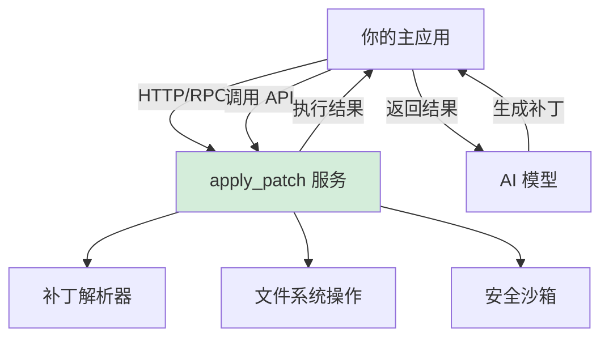
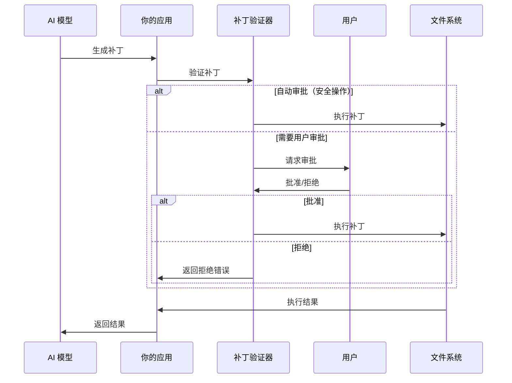
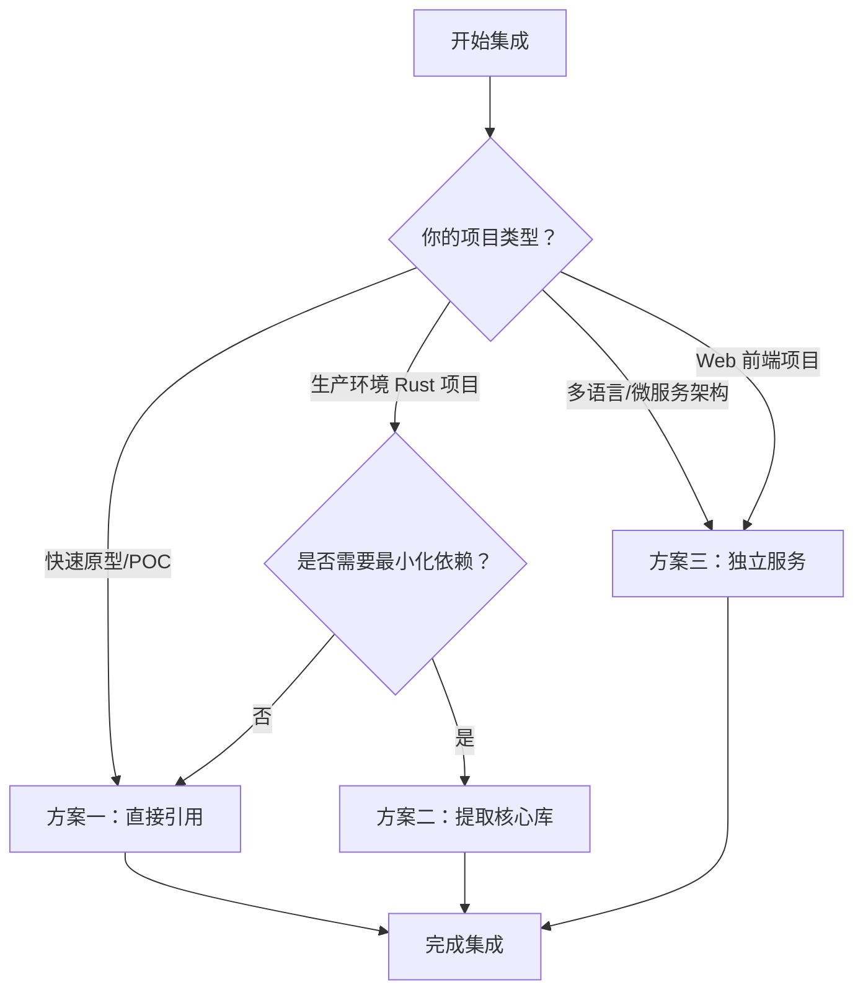
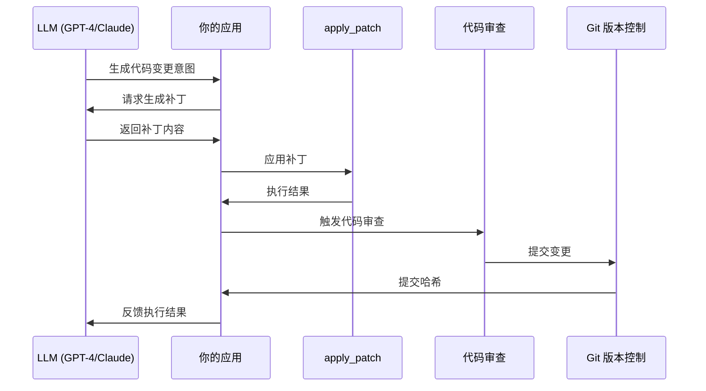

# 将 Codex apply_patch 工具集成到独立项目

## 一、集成概述

本文档详细介绍如何将 OpenAI Codex 的 `apply_patch` 工具集成到独立项目中。`apply_patch` 是一个功能强大的文件编辑工具，支持通过自定义补丁语言进行文件的创建、修改和删除操作。

### 集成的价值

- **AI 驱动的文件编辑**：为 AI 应用提供安全可靠的文件操作能力
- **自定义补丁语法**：简化的 diff 格式，易于 AI 模型生成
- **沙箱安全执行**：内置权限管理和沙箱隔离
- **模糊匹配算法**：适应不同代码风格的智能匹配

---

## 二、集成架构概览



---

## 三、核心依赖分析

### 3.1 依赖清单

要集成 `apply_patch`，你需要理解其依赖关系：

| 依赖项 | 类型 | 用途 | 集成必要性 |
|--------|------|------|-----------|
| `codex-apply-patch` | 核心 crate | 补丁解析和应用逻辑 | **必须** |
| `codex-exec-server` | 内部依赖 | `ExecutorFileSystem` 接口 | **必须** |
| `codex-utils-absolute-path` | 内部依赖 | `AbsolutePathBuf` 类型 | **必须** |
| `similar` | 外部 crate | 生成 unified diff | **必须** |
| `tree-sitter` | 外部 crate | Shell heredoc 解析 | 可选 |
| `tree-sitter-bash` | 外部 crate | Bash 语法支持 | 可选 |
| `tokio` | 外部 crate | 异步运行时 | **必须** |
| `anyhow` | 外部 crate | 错误处理 | **必须** |
| `thiserror` | 外部 crate | 错误类型定义 | **必须** |

### 3.2 依赖问题与挑战



**核心挑战**：`codex-apply-patch` 深度依赖 codex 内部模块（`codex-exec-server`、`codex-file-system`、`codex-protocol` 等），这些模块又依赖更多内部组件。

---

## 四、集成方案

### 方案一：直接引用（推荐用于快速原型）

#### 4.1.1 添加依赖

在你的 `Cargo.toml` 中添加 codex 作为 git 依赖：

```toml
[dependencies]
codex-apply-patch = { git = "https://github.com/openai/codex", subdirectory = "codex-rs/apply-patch" }
codex-exec-server = { git = "https://github.com/openai/codex", subdirectory = "codex-rs/exec-server" }
codex-utils-absolute-path = { git = "https://github.com/openai/codex", subdirectory = "codex-rs/utils/absolute-path" }
tokio = { version = "1", features = ["full"] }
anyhow = "1"
```

#### 4.1.2 基本使用示例

```rust
use codex_apply_patch::apply_patch;
use codex_exec_server::LOCAL_FS;
use codex_utils_absolute_path::AbsolutePathBuf;

#[tokio::main]
async fn main() -> anyhow::Result<()> {
    let patch = r#"*** Begin Patch
*** Add File: hello.txt
+Hello, World!
*** Update File: src/main.rs
@@ fn main() {
-    println!("Hello");
+    println!("Hello, World!");
*** End Patch"#;

    let cwd = AbsolutePathBuf::current_dir()?;
    let mut stdout = Vec::new();
    let mut stderr = Vec::new();

    apply_patch(
        patch,
        &cwd,
        &mut stdout,
        &mut stderr,
        LOCAL_FS.as_ref(),
        /*sandbox*/ None,
    )
    .await?;

    println!("执行结果:");
    println!("stdout: {}", String::from_utf8_lossy(&stdout));
    println!("stderr: {}", String::from_utf8_lossy(&stderr));

    Ok(())
}
```

#### 4.1.3 方案一优缺点

| 优点 | 缺点 |
|------|------|
| 快速集成，代码量最小 | 引入大量 codex 内部依赖 |
| 保持与上游同步 | 无法裁剪不需要的功能 |
| 完整的功能支持 | 编译时间较长 |

---

### 方案二：提取核心库（推荐用于生产环境）

#### 4.2.1 架构设计

将 `apply_patch` 的核心逻辑提取为独立库，解耦对 codex 内部的依赖：



#### 4.2.2 步骤 1：定义文件系统接口

创建你自己的 `ExecutorFileSystem` trait（可以从 codex 复制并简化）：

```rust
// src/file_system.rs
use async_trait::async_trait;
use std::io;
use std::path::Path;

// 简化版的 AbsolutePathBuf（或保留原始版本）
use my_absolute_path::AbsolutePathBuf;

#[derive(Clone, Copy, Debug, Eq, PartialEq)]
pub struct CreateDirectoryOptions {
    pub recursive: bool,
}

#[derive(Clone, Copy, Debug, Eq, PartialEq)]
pub struct RemoveOptions {
    pub recursive: bool,
    pub force: bool,
}

#[derive(Clone, Debug, Eq, PartialEq)]
pub struct FileMetadata {
    pub is_directory: bool,
    pub is_file: bool,
    pub is_symlink: bool,
    pub created_at_ms: i64,
    pub modified_at_ms: i64,
}

pub type FileSystemResult<T> = io::Result<T>;

/// 抽象文件系统接口
#[async_trait]
pub trait ExecutorFileSystem: Send + Sync {
    async fn read_file(
        &self,
        path: &AbsolutePathBuf,
        sandbox: Option<&()>,
    ) -> FileSystemResult<Vec<u8>>;

    async fn read_file_text(
        &self,
        path: &AbsolutePathBuf,
        sandbox: Option<&()>,
    ) -> FileSystemResult<String> {
        let bytes = self.read_file(path, sandbox).await?;
        String::from_utf8(bytes).map_err(|err| io::Error::new(io::ErrorKind::InvalidData, err))
    }

    async fn write_file(
        &self,
        path: &AbsolutePathBuf,
        contents: Vec<u8>,
        sandbox: Option<&()>,
    ) -> FileSystemResult<()>;

    async fn create_directory(
        &self,
        path: &AbsolutePathBuf,
        options: CreateDirectoryOptions,
        sandbox: Option<&()>,
    ) -> FileSystemResult<()>;

    async fn get_metadata(
        &self,
        path: &AbsolutePathBuf,
        sandbox: Option<&()>,
    ) -> FileSystemResult<FileMetadata>;

    async fn remove(
        &self,
        path: &AbsolutePathBuf,
        options: RemoveOptions,
        sandbox: Option<&()>,
    ) -> FileSystemResult<()>;
}
```

#### 4.2.3 步骤 2：实现本地文件系统

```rust
// src/local_file_system.rs
use async_trait::async_trait;
use std::sync::Arc;
use std::sync::LazyLock;
use tokio::fs;

use crate::file_system::*;

pub static LOCAL_FS: LazyLock<Arc<dyn ExecutorFileSystem>> =
    LazyLock::new(|| Arc::new(LocalFileSystem));

#[derive(Clone, Default)]
pub struct LocalFileSystem;

#[async_trait]
impl ExecutorFileSystem for LocalFileSystem {
    async fn read_file(
        &self,
        path: &AbsolutePathBuf,
        _sandbox: Option<&()>,
    ) -> FileSystemResult<Vec<u8>> {
        fs::read(path.as_path()).await
    }

    async fn write_file(
        &self,
        path: &AbsolutePathBuf,
        contents: Vec<u8>,
        _sandbox: Option<&()>,
    ) -> FileSystemResult<()> {
        fs::write(path.as_path(), contents).await
    }

    async fn create_directory(
        &self,
        path: &AbsolutePathBuf,
        options: CreateDirectoryOptions,
        _sandbox: Option<&()>,
    ) -> FileSystemResult<()> {
        if options.recursive {
            fs::create_dir_all(path.as_path()).await
        } else {
            fs::create_dir(path.as_path()).await
        }
    }

    async fn get_metadata(
        &self,
        path: &AbsolutePathBuf,
        _sandbox: Option<&()>,
    ) -> FileSystemResult<FileMetadata> {
        let metadata = fs::metadata(path.as_path()).await?;
        let symlink_metadata = fs::symlink_metadata(path.as_path()).await?;
        
        Ok(FileMetadata {
            is_directory: metadata.is_dir(),
            is_file: metadata.is_file(),
            is_symlink: symlink_metadata.file_type().is_symlink(),
            created_at_ms: metadata.created()
                .ok()
                .and_then(|t| t.duration_since(std::time::UNIX_EPOCH).ok())
                .map(|d| d.as_millis() as i64)
                .unwrap_or(0),
            modified_at_ms: metadata.modified()
                .ok()
                .and_then(|t| t.duration_since(std::time::UNIX_EPOCH).ok())
                .map(|d| d.as_millis() as i64)
                .unwrap_or(0),
        })
    }

    async fn remove(
        &self,
        path: &AbsolutePathBuf,
        options: RemoveOptions,
        _sandbox: Option<&()>,
    ) -> FileSystemResult<()> {
        match fs::symlink_metadata(path.as_path()).await {
            Ok(metadata) => {
                if metadata.is_dir() {
                    if options.recursive {
                        fs::remove_dir_all(path.as_path()).await
                    } else {
                        fs::remove_dir(path.as_path()).await
                    }
                } else {
                    fs::remove_file(path.as_path()).await
                }
            }
            Err(err) if err.kind() == io::ErrorKind::NotFound && options.force => Ok(()),
            Err(err) => Err(err),
        }
    }
}
```

#### 4.2.4 步骤 3：复制核心补丁逻辑

从 codex 复制以下文件到你的项目（注意版权和许可证）：

1. **parser.rs** - 补丁解析器
2. **seek_sequence.rs** - 模糊匹配算法
3. **lib.rs** - 核心应用逻辑（需要修改依赖引用）

#### 4.2.5 步骤 4：修改 lib.rs 依赖

```rust
// src/lib.rs
mod parser;
mod seek_sequence;

use std::io;
use std::path::PathBuf;
use anyhow::Context;
use anyhow::Result;
use similar::TextDiff;
use thiserror::Error;

pub use parser::Hunk;
pub use parser::ParseError;
pub use parser::parse_patch;

use crate::file_system::*;

#[derive(Debug, Error)]
pub enum ApplyPatchError {
    #[error(transparent)]
    ParseError(#[from] ParseError),
    #[error(transparent)]
    IoError(#[from] io::Error),
    #[error("{0}")]
    ComputeReplacements(String),
}

pub async fn apply_patch(
    patch: &str,
    cwd: &AbsolutePathBuf,
    stdout: &mut impl io::Write,
    stderr: &mut impl io::Write,
    fs: &dyn ExecutorFileSystem,
) -> Result<(), ApplyPatchError> {
    let hunks = parse_patch(patch).map_err(ApplyPatchError::ParseError)?;
    apply_hunks(&hunks.hunks, cwd, stdout, stderr, fs).await
}

// ... 其他核心逻辑（从 codex 复制并适配）
```

#### 4.2.6 步骤 5：Cargo.toml 配置

```toml
[package]
name = "my-apply-patch"
version = "0.1.0"
edition = "2021"

[dependencies]
tokio = { version = "1", features = ["full"] }
async-trait = "0.1"
anyhow = "1"
thiserror = "1"
similar = "2"

# 可选：如果需要 shell heredoc 解析
# tree-sitter = "0.22"
# tree-sitter-bash = "0.20"
```

#### 4.2.7 方案二优缺点

| 优点 | 缺点 |
|------|------|
| 最小化依赖，编译快速 | 需要手动维护与上游的同步 |
| 可裁剪不需要的功能 | 初始提取工作量较大 |
| 更好的项目独立性 | 可能遗漏边界情况 |

---

### 方案三：封装为独立服务

#### 4.3.1 架构设计

将 `apply_patch` 封装为独立的微服务，通过 RPC 或 HTTP API 调用：



#### 4.3.2 服务端实现

使用 `apply_patch` 的独立可执行文件（`codex-rs/apply-patch/src/main.rs`）：

```rust
// apply_patch_service/main.rs
use actix_web::{web, App, HttpServer, post, Responder, HttpResponse};
use serde::{Deserialize, Serialize};
use std::path::PathBuf;

#[derive(Deserialize)]
struct ApplyPatchRequest {
    patch: String,
    working_dir: Option<String>,
}

#[derive(Serialize)]
struct ApplyPatchResponse {
    success: bool,
    stdout: String,
    stderr: String,
    error: Option<String>,
}

#[post("/apply")]
async fn apply_patch_handler(req: web::Json<ApplyPatchRequest>) -> impl Responder {
    // 调用 codex apply_patch 库
    let result = codex_apply_patch::apply_patch(
        &req.patch,
        &cwd,
        &mut stdout,
        &mut stderr,
        codex_exec_server::LOCAL_FS.as_ref(),
        None,
    )
    .await;

    match result {
        Ok(()) => HttpResponse::Ok().json(ApplyPatchResponse {
            success: true,
            stdout: String::from_utf8_lossy(&stdout).into_owned(),
            stderr: String::from_utf8_lossy(&stderr).into_owned(),
            error: None,
        }),
        Err(e) => HttpResponse::BadRequest().json(ApplyPatchResponse {
            success: false,
            stdout: String::from_utf8_lossy(&stdout).into_owned(),
            stderr: String::from_utf8_lossy(&stderr).into_owned(),
            error: Some(e.to_string()),
        }),
    }
}

#[actix_web::main]
async fn main() -> std::io::Result<()> {
    HttpServer::new(|| {
        App::new()
            .service(apply_patch_handler)
    })
    .bind("127.0.0.1:8080")?
    .run()
    .await
}
```

#### 4.3.3 客户端调用

```rust
// 在你的项目中调用
async fn apply_patch_remote(patch: &str) -> Result<ApplyPatchResponse> {
    let client = reqwest::Client::new();
    let response = client
        .post("http://127.0.0.1:8080/apply")
        .json(&ApplyPatchRequest {
            patch: patch.to_string(),
            working_dir: None,
        })
        .send()
        .await?
        .json::<ApplyPatchResponse>()
        .await?;
    
    Ok(response)
}
```

#### 4.3.4 方案三优缺点

| 优点 | 缺点 |
|------|------|
| 完全隔离，安全性高 | 增加系统复杂度 |
| 可独立部署和扩展 | 网络延迟 |
| 支持多语言客户端 | 需要维护服务基础设施 |

---

## 五、关键接口详解

### 5.1 AbsolutePathBuf 使用

`AbsolutePathBuf` 是 codex 中用于确保路径绝对性的类型：

```rust
use codex_utils_absolute_path::AbsolutePathBuf;

// 从当前工作目录创建
let cwd = AbsolutePathBuf::current_dir()?;

// 从绝对路径创建
let abs_path = AbsolutePathBuf::from_absolute_path("/path/to/file")?;

// 相对路径解析为绝对路径
let abs = AbsolutePathBuf::resolve_path_against_base("relative/path", &cwd);

// 路径操作
let parent = abs_path.parent();
let joined = abs_path.join("subdir/file.txt");
```

### 5.2 自定义文件系统适配器

如果你的项目需要操作非本地文件系统（如远程存储、虚拟文件系统），可以实现 `ExecutorFileSystem`：

```rust
// 示例：内存文件系统
use std::collections::HashMap;
use std::sync::Mutex;

struct MemoryFileSystem {
    files: Mutex<HashMap<PathBuf, Vec<u8>>>,
}

#[async_trait]
impl ExecutorFileSystem for MemoryFileSystem {
    async fn read_file(
        &self,
        path: &AbsolutePathBuf,
        _sandbox: Option<&()>,
    ) -> FileSystemResult<Vec<u8>> {
        self.files.lock()
            .unwrap()
            .get(path.as_path())
            .cloned()
            .ok_or_else(|| io::Error::new(io::ErrorKind::NotFound, "file not found"))
    }

    async fn write_file(
        &self,
        path: &AbsolutePathBuf,
        contents: Vec<u8>,
        _sandbox: Option<&()>,
    ) -> FileSystemResult<()> {
        self.files.lock().unwrap().insert(path.to_path_buf(), contents);
        Ok(())
    }

    // ... 其他方法实现
}
```

### 5.3 沙箱上下文（可选）

如果你需要沙箱隔离，可以创建简化的沙箱上下文：

```rust
// 简化版：无沙箱
type SimpleSandboxContext = ();

// 使用时无需传递沙箱参数
apply_patch(
    patch,
    &cwd,
    &mut stdout,
    &mut stderr,
    &local_fs,
    None,  // 无沙箱
)
.await?;
```

---

## 六、安全集成

### 6.1 补丁验证

在执行补丁前，建议进行验证：

```rust
use codex_apply_patch::parse_patch;

fn validate_patch(patch: &str) -> Result<(), String> {
    let parsed = parse_patch(patch).map_err(|e| e.to_string())?;
    
    for hunk in &parsed.hunks {
        match hunk {
            Hunk::UpdateFile { path, .. } => {
                // 检查文件是否存在
                if !path.exists() {
                    return Err(format!("File not found: {:?}", path));
                }
            }
            Hunk::DeleteFile { path } => {
                if !path.exists() {
                    return Err(format!("Cannot delete non-existent file: {:?}", path));
                }
            }
            _ => {}
        }
    }
    
    Ok(())
}
```

### 6.2 权限控制

实现基本的权限审批流程：



```rust
enum ApprovalResult {
    AutoApproved,
    RequiresUserApproval,
    Rejected(String),
}

fn assess_patch_safety(patch: &str, allowed_paths: &[PathBuf]) -> ApprovalResult {
    // 检查补丁是否只操作允许的路径
    // 检查是否有危险操作（如删除关键文件）
    // 返回审批结果
    ApprovalResult::AutoApproved
}
```

---

## 七、测试策略

### 7.1 单元测试

```rust
#[cfg(test)]
mod tests {
    use super::*;
    use tempfile::tempdir;
    use std::fs;

    #[tokio::test]
    async fn test_add_file() {
        let dir = tempdir().unwrap();
        let patch = format!(
            r#"*** Begin Patch
*** Add File: {}/hello.txt
+Hello, World!
*** End Patch"#,
            dir.path().display()
        );

        let cwd = AbsolutePathBuf::from_absolute_path(dir.path()).unwrap();
        let mut stdout = Vec::new();
        let mut stderr = Vec::new();

        apply_patch(
            &patch,
            &cwd,
            &mut stdout,
            &mut stderr,
            LOCAL_FS.as_ref(),
            None,
        )
        .await
        .unwrap();

        let content = fs::read_to_string(dir.path().join("hello.txt")).unwrap();
        assert_eq!(content, "Hello, World!\n");
    }

    #[tokio::test]
    async fn test_update_file() {
        let dir = tempdir().unwrap();
        let file_path = dir.path().join("test.txt");
        fs::write(&file_path, "old content\n").unwrap();

        let patch = format!(
            r#"*** Begin Patch
*** Update File: {}
@@
-old content
+new content
*** End Patch"#,
            file_path.display()
        );

        // ... 执行补丁并验证
    }
}
```

### 7.2 集成测试

```rust
#[tokio::test]
async fn test_full_workflow() {
    // 1. 创建临时工作目录
    let dir = tempdir().unwrap();
    let cwd = AbsolutePathBuf::from_absolute_path(dir.path()).unwrap();

    // 2. 创建初始文件
    fs::write(dir.path().join("main.rs"), r#"fn main() {
    println!("Hello");
}"#).unwrap();

    // 3. 应用补丁
    let patch = r#"*** Begin Patch
*** Update File: main.rs
@@ fn main() {
-    println!("Hello");
+    println!("Hello, World!");
*** End Patch"#;

    let mut stdout = Vec::new();
    let mut stderr = Vec::new();
    apply_patch(patch, &cwd, &mut stdout, &mut stderr, LOCAL_FS.as_ref(), None)
        .await
        .unwrap();

    // 4. 验证结果
    let content = fs::read_to_string(dir.path().join("main.rs")).unwrap();
    assert!(content.contains("Hello, World!"));
}
```

---

## 八、常见问题与解决方案

### Q1: 如何处理大文件？

**问题**：默认情况下，codex 对读取文件大小有限制（512MB）。

**解决方案**：

```rust
// 如果你需要处理更大的文件，可以修改限制或分块处理
const MY_MAX_READ_SIZE: u64 = 1024 * 1024 * 1024; // 1GB
```

### Q2: 补丁匹配失败怎么办？

**问题**：`seek_sequence` 无法找到匹配的上下文行。

**解决方案**：

1. **增加上下文行数**：确保 `@@` 后有足够多的上下文（建议 3 行）
2. **使用多级定位**：对于重复代码块，使用多个 `@@` 标记
3. **检查空白字符**：确保补丁中的空白与实际文件一致

```rust
// 示例：使用多级定位
let patch = r#"*** Begin Patch
*** Update File: src/lib.rs
@@ struct MyStruct {
@@     fn process(&self) {
-        old_code();
+        new_code();
*** End Patch"#;
```

### Q3: 如何集成到 Web 应用？

**方案**：使用方案三的独立服务模式，或通过 WASM 编译为 WebAssembly：

```toml
# Cargo.toml
[lib]
crate-type = ["cdylib"]

[dependencies]
wasm-bindgen = "0.2"
```

### Q4: 如何处理编码问题？

**问题**：文件可能不是 UTF-8 编码。

**解决方案**：

```rust
// 在自定义文件系统中处理编码转换
async fn read_file_text(
    &self,
    path: &AbsolutePathBuf,
    sandbox: Option<&()>,
) -> FileSystemResult<String> {
    let bytes = self.read_file(path, sandbox).await?;
    
    // 尝试 UTF-8，失败则使用编码检测
    String::from_utf8(bytes)
        .or_else(|_| {
            // 使用 chardetng 等库检测编码
            encoding_rs::GBK.decode(bytes).0.into_owned()
        })
        .map_err(|e| io::Error::new(io::ErrorKind::InvalidData, e))
}
```

---

## 九、集成检查清单

在集成完成后，使用以下检查清单确保所有方面都已覆盖：

- [ ] **依赖配置**：`Cargo.toml` 中正确声明所有依赖
- [ ] **文件系统实现**：实现了 `ExecutorFileSystem` trait
- [ ] **路径处理**：正确使用 `AbsolutePathBuf` 处理路径
- [ ] **错误处理**：妥善处理 `ApplyPatchError` 各种情况
- [ ] **安全验证**：实现补丁验证和权限审批
- [ ] **测试覆盖**：编写单元测试和集成测试
- [ ] **文档更新**：更新项目文档说明集成方式
- [ ] **性能测试**：测试大文件和多文件操作的性能表现
- [ ] **日志监控**：集成日志系统记录补丁执行过程
- [ ] **回滚机制**：实现补丁失败后的回滚能力

---

## 十、方案选择建议

### 10.1 决策树



### 10.2 方案对比总结

| 维度 | 方案一：直接引用 | 方案二：提取核心库 | 方案三：独立服务 |
|------|-----------------|-------------------|-----------------|
| **集成难度** | ⭐ 低 | ⭐⭐⭐ 高 | ⭐⭐ 中 |
| **编译体积** | ⭐⭐⭐ 大 | ⭐ 小 | ⭐ 小（主应用） |
| **维护成本** | ⭐ 低（自动同步） | ⭐⭐⭐ 高（手动同步） | ⭐⭐ 中 |
| **性能** | ⭐⭐⭐ 最优 | ⭐⭐⭐ 最优 | ⭐⭐ 网络延迟 |
| **安全性** | ⭐⭐ 中 | ⭐⭐ 中 | ⭐⭐⭐ 隔离最好 |
| **多语言支持** | ❌ 仅 Rust | ❌ 仅 Rust | ✅ 任意语言 |
| **适用场景** | 快速原型、内部工具 | 生产级 Rust 应用 | 微服务、SaaS 平台 |

### 10.3 推荐路径

**对于大多数项目**，建议按以下路径演进：

1. **阶段一**：使用方案一快速验证功能可行性
2. **阶段二**：确认需求后，根据项目特点选择方案二或方案三
3. **阶段三**：持续优化，添加监控、日志、回滚等企业级特性

---

## 十一、许可证与合规

### 11.1 开源许可证

Codex 项目通常使用 MIT 或 Apache-2.0 许可证。在集成前，请确认：

- 阅读 `LICENSE` 文件了解具体条款
- 遵守许可证要求的版权声明
- 如果修改了源码，需要注明修改内容

### 11.2 合规建议

1. **保留原始版权声明**：不要删除 codex 源码中的版权信息
2. **注明依赖来源**：在项目文档中说明使用了 codex 的 apply_patch
3. **遵守导出限制**：某些国家/地区对加密软件有出口限制
4. **安全审计**：生产环境使用前进行安全审计

---

## 十二、进阶集成

### 12.1 与 AI 模型深度集成



### 12.2 实现补丁预览功能

```rust
// 预览补丁效果而不实际应用
async fn preview_patch(patch: &str, cwd: &AbsolutePathBuf) -> Result<String> {
    let hunks = parse_patch(patch)?;
    let mut preview = String::new();
    
    for hunk in &hunks.hunks {
        match hunk {
            Hunk::AddFile { path, contents } => {
                preview.push_str(&format!("+++ New file: {}\n", path.display()));
                preview.push_str(contents);
            }
            Hunk::UpdateFile { path, chunks, .. } => {
                let unified_diff = unified_diff_from_chunks(
                    &AbsolutePathBuf::resolve_path_against_base(path, cwd),
                    chunks,
                    LOCAL_FS.as_ref(),
                    None,
                ).await?;
                preview.push_str(&unified_diff.unified_diff);
            }
            Hunk::DeleteFile { path } => {
                preview.push_str(&format!("--- Delete file: {}\n", path.display()));
            }
        }
    }
    
    Ok(preview)
}
```

### 12.3 批量补丁处理

```rust
// 处理多个补丁文件
async fn apply_patches_batch(
    patches: Vec<(String, AbsolutePathBuf)>,
) -> Result<Vec<Result<(), ApplyPatchError>>> {
    let mut results = Vec::new();
    
    for (patch, cwd) in patches {
        let result = apply_patch(
            &patch,
            &cwd,
            &mut Vec::new(),
            &mut Vec::new(),
            LOCAL_FS.as_ref(),
            None,
        ).await;
        results.push(result);
    }
    
    Ok(results)
}
```

---

## 十三、总结

将 Codex 的 `apply_patch` 工具集成到你的项目中，可以为 AI 应用提供强大的文件编辑能力。本文档提供了三种集成方案：

1. **直接引用**：快速但依赖重
2. **提取核心库**：轻量但维护成本高
3. **独立服务**：隔离但增加复杂度

选择适合你项目的方案，并遵循文档中的最佳实践，可以确保集成的成功和安全。

### 关键要点

- ✅ **理解依赖关系**：明确核心依赖和可选依赖
- ✅ **实现文件系统接口**：根据需求定制 `ExecutorFileSystem`
- ✅ **重视安全性**：实现补丁验证和权限审批
- ✅ **充分测试**：覆盖各种边界情况
- ✅ **持续维护**：关注上游更新和安全补丁

祝你集成顺利！如有问题，可以参考 codex 的源码和测试用例。