# Agent Skills 架构分析文档

## 目录

- [1. 项目概述](#1-项目概述)
- [2. 设计理念](#2-设计理念)
- [3. 核心架构](#3-核心架构)
- [4. 组成层详解](#4-组成层详解)
- [5. 编排模式](#5-编排模式)
- [6. 生命周期流程](#6-生命周期流程)
- [7. Hook 系统](#7-hook-系统)
- [8. 平台集成](#8-平台集成)
- [9. Skill 内部结构](#9-skill-内部结构)
- [10. 架构优势](#10-架构优势)

---

## 1. 项目概述

**Agent Skills** 是一个为 AI 编码代理设计的生产级工程技能集合，涵盖了从需求定义到生产部署的完整软件开发生命周期（SDLC）。

### 1.1 核心价值

- **流程编码化**：将资深工程师的隐性知识转化为可执行的流程
- **质量守门**：通过技能强制执行工程最佳实践
- **平台无关**：支持 Claude Code、Cursor、Copilot、Gemini CLI 等多种平台
- **开源可扩展**：MIT 许可证，支持自定义技能扩展

### 1.2 规模统计

- **23 个技能**：22 个生命周期技能 + 1 个元技能
- **3 个专家角色**：code-reviewer、security-auditor、test-engineer
- **7 个斜杠命令**：spec、plan、build、test、review、code-simplify、ship
- **4 个参考清单**：testing、security、performance、accessibility

---

## 2. 设计理念

### 2.1 过程重于知识

Agent Skills 将知识转化为**可遵循的流程**，而非参考文档。每个技能都是包含步骤、检查点和退出条件的工作流。

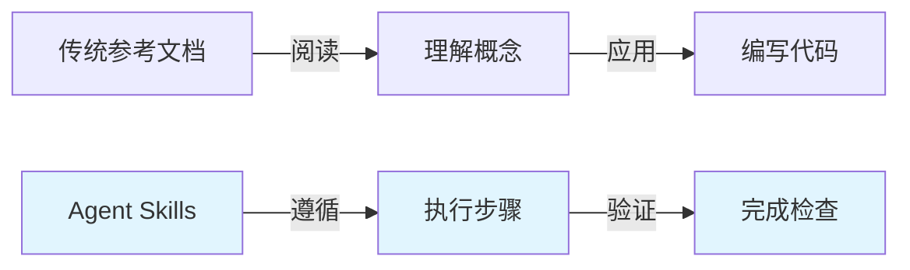

### 2.2 反合理化设计

每个技能包含**常见合理化表格**，列出代理可能用来跳过步骤的借口及其反驳。

| 合理化借口 | 现实 |
|---|---|
| "这很简单，跳过 spec 吧" | 简单功能的模糊需求是 Bug 的主要来源 |
| "测试稍后再写" | "稍后"永远不会到来，测试债务会累积 |
| "这只是一个小的重构" | 小改动经常破坏隐式契约 |

### 2.3 渐进式披露

- 仅加载技能名称和描述到启动上下文
- 完整 SKILL.md 仅在代理决定相关时加载
- 参考文件按需加载，最小化 token 消耗

---

## 3. 核心架构

### 3.1 三层组成架构

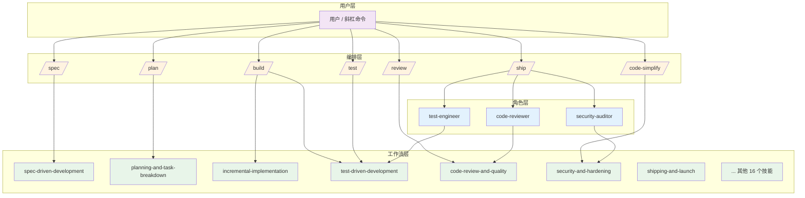

### 3.2 架构原则

1. **用户/斜杠命令是编排者**：角色不调用其他角色
2. **技能是强制路径**：意图匹配时必须调用
3. **单层深度**：最大编排深度为 1（斜杠命令 → 角色）

---

## 4. 组成层详解

### 4.1 Skills（技能层）

技能是**包含步骤的工作流**，定义了"如何做"。

#### 4.1.1 按开发阶段分类

```mermaid
graph TD
    subgraph "Define（定义）"
        S1[interview-me]
        S2[idea-refine]
        S3[spec-driven-development]
    end

    subgraph "Plan（规划）"
        S4[planning-and-task-breakdown]
    end

    subgraph "Build（构建）"
        S5[incremental-implementation]
        S6[test-driven-development]
        S7[context-engineering]
        S8[source-driven-development]
        S9[doubt-driven-development]
        S10[frontend-ui-engineering]
        S11[api-and-interface-design]
    end

    subgraph "Verify（验证）"
        S12[browser-testing-with-devtools]
        S13[debugging-and-error-recovery]
    end

    subgraph "Review（审查）"
        S14[code-review-and-quality]
        S15[code-simplification]
        S16[security-and-hardening]
        S17[performance-optimization]
    end

    subgraph "Ship（发布）"
        S18[git-workflow-and-versioning]
        S19[ci-cd-and-automation]
        S20[deprecation-and-migration]
        S21[documentation-and-adrs]
        S22[shipping-and-launch]
    end

    subgraph "Meta"
        M1[using-agent-skills]
    end

    style S1 fill:#fce4ec
    style S2 fill:#fce4ec
    style S3 fill:#fce4ec
    style S4 fill:#f3e5f5
    style S5 fill:#e3f2fd
    style S6 fill:#e3f2fd
    style S7 fill:#e3f2fd
    style S8 fill:#e3f2fd
    style S9 fill:#e3f2fd
    style S10 fill:#e3f2fd
    style S11 fill:#e3f2fd
    style S12 fill:#e8f5e9
    style S13 fill:#e8f5e9
    style S14 fill:#fff3e0
    style S15 fill:#fff3e0
    style S16 fill:#fff3e0
    style S17 fill:#fff3e0
    style S18 fill:#ffebee
    style S19 fill:#ffebee
    style S20 fill:#ffebee
    style S21 fill:#ffebee
    style S22 fill:#ffebee
    style M1 fill:#37474f
    style M1 color:#fff
```

#### 4.1.2 Skill 内部结构

每个 SKILL.md 遵循标准格式：

```markdown
---
name: skill-name
description: Guides agents through [task]. Use when [trigger conditions].
---

# Skill Title

## Overview
一两句话解释技能的作用和重要性

## When to Use
- 触发条件列表
- 排除条件

## The Workflow / Core Process
分步工作流，包含代码示例

## Specific Techniques / Patterns
详细场景指导

## Common Rationalizations
| Rationalization | Reality |
|---|---|
| 代理的借口 | 为什么是错误的 |

## Red Flags
违反技能的迹象

## Verification
完成后的检查清单
```

#### 4.1.3 关键技能示例

**spec-driven-development（规格驱动开发）**

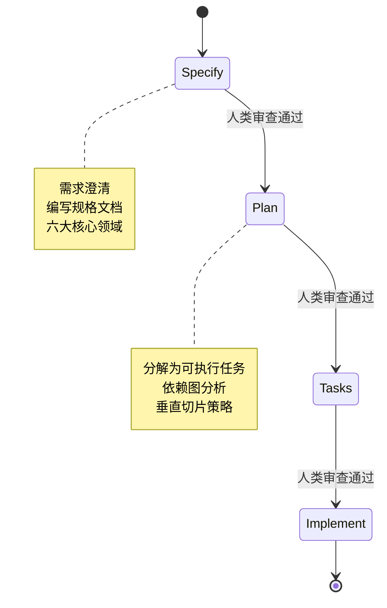

**incremental-implementation（增量实现）**

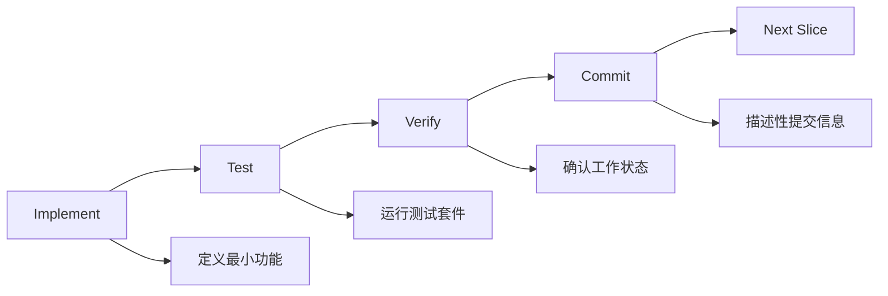

### 4.2 Agents（角色层）

角色是**具有视角和输出格式的专家**，定义了"谁来做"。

#### 4.2.1 专家角色详解

**code-reviewer（代码审查员）**

- **角色**：高级 Staff Engineer
- **视角**：五轴审查（正确性、可读性、架构、安全、性能）
- **输出格式**：结构化审查报告，按严重性分类

**security-auditor（安全审计员）**

- **角色**：安全工程师
- **视角**：漏洞检测、威胁建模、安全编码实践
- **输出格式**：按 OWASP Top 10 的审计报告

**test-engineer（测试工程师）**

- **角色**：QA 专家
- **视角**：测试策略、覆盖率分析、Prove-It 模式
- **输出格式**：测试覆盖分析和推荐测试

#### 4.2.2 角色组成规则

```mermaid
graph TD
    A[角色定义] --> B[name]
    A --> C[description]
    A --> D[Approach]
    A --> E[Output Format]
    A --> F[Rules]
    A --> G[Composition]

    B --> [小写连字符]
    C --> [包含触发条件]
    D --> [分步工作流]
    E --> [结构化模板]
    F --> [非协商规则]
    G --> [调用规则]

    style A fill:#f5f5f5
    style G fill:#ffebee
```

**重要规则**：角色不调用其他角色。如果需要协调多个角色，使用斜杠命令。

### 4.3 Commands（命令层）

斜杠命令是**面向用户的入口点**，定义了"何时执行"。

#### 4.3.1 命令映射

```mermaid
graph LR
    subgraph "用户意图"
        I1[定义需求]
        I2[规划实现]
        I3[构建功能]
        I4[验证测试]
        I5[审查代码]
        I6[简化代码]
        I7[发布部署]
    end

    subgraph "斜杠命令"
        C1[/spec]
        C2[/plan]
        C3[/build]
        C4[/test]
        C5[/review]
        C6[/code-simplify]
        C7[/ship]
    end

    subgraph "激活技能"
        S1[spec-driven-development]
        S2[planning-and-task-breakdown]
        S3[incremental-implementation + test-driven-development]
        S4[test-driven-development]
        S5[code-review-and-quality]
        S6[code-simplification]
        S7[shipping-and-launch + 并行审查]
    end

    I1 --> C1
    I2 --> C2
    I3 --> C3
    I4 --> C4
    I5 --> C5
    I6 --> C6
    I7 --> C7

    C1 --> S1
    C2 --> S2
    C3 --> S3
    C4 --> S4
    C5 --> S5
    C6 --> S6
    C7 --> S7

    style I1 fill:#f3e5f5
    style I2 fill:#f3e5f5
    style I3 fill:#f3e5f5
    style I4 fill:#f3e5f5
    style I5 fill:#f3e5f5
    style I6 fill:#f3e5f5
    style I7 fill:#f3e5f5
```

### 4.4 References（参考层）

参考材料是技能在需要时拉入的**补充清单**，存储在 `references/` 目录中。

| 参考文件 | 覆盖内容 |
|---|---|
| `testing-patterns.md` | 测试结构、命名、模拟、React/API/E2E 示例、反模式 |
| `security-checklist.md` | 提交前检查、认证、输入验证、头部、CORS、OWASP Top 10 |
| `performance-checklist.md` | Core Web Vitals 目标、前端/后端清单、测量命令 |
| `accessibility-checklist.md` | 键盘导航、屏幕阅读器、视觉设计、ARIA、测试工具 |

**设计原则**：参考材料存储在项目根目录，而非技能目录内部，避免重复。

### 4.5 Hooks（钩子系统）

钩子在会话生命周期关键点自动执行，增强技能功能。

#### 4.5.1 Hook 类型

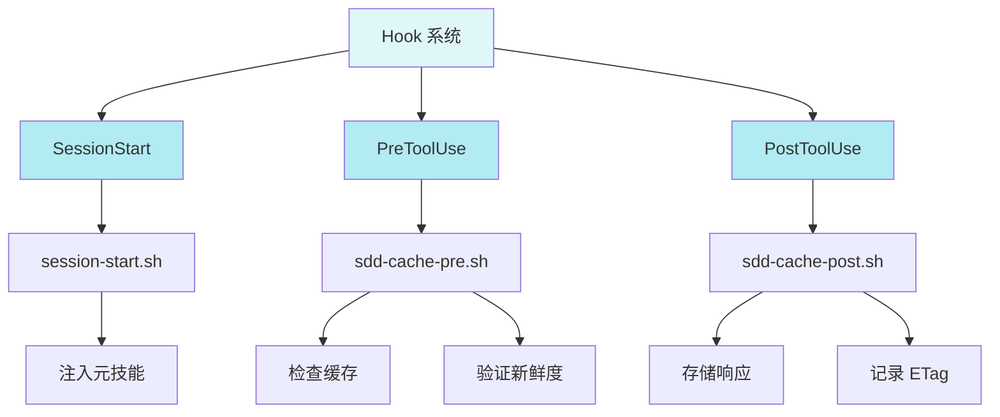

#### 4.5.2 SDD-Cache Hook

专为 `source-driven-development` 技能设计的跨会话引用缓存：

```mermaid
sequenceDiagram
    participant Agent as 代理
    participant Pre as PreToolUse Hook
    participant Server as 文档服务器
    participant Cache as .claude/sdd-cache/
    participant Post as PostToolUse Hook

    Agent->>Pre: 请求 WebFetch(URL)
    Pre->>Cache: 检查缓存条目

    alt 缓存命中
        Pre->>Server: HEAD with If-None-Match
        Server-->>Pre: 304 Not Modified
        Pre-->>Agent: 返回缓存内容
    else 缓存未命中或过期
        Pre-->>Post: 允许 WebFetch 执行
        Agent->>Server: GET URL
        Server-->>Agent: 返回内容
        Agent->>Post: WebFetch 结果
        Post->>Server: HEAD 获取 ETag
        Server-->>Post: 返回 ETag/Last-Modified
        Post->>Cache: 存储带验证器的条目
    end

    note over Pre,Cache
        新鲜性验证：仅当源确认 304 时
        才从缓存服务，不是内存读取
    end note
```

**关键特性**：
- 缓存键：`sha256(url)` - URL 唯一
- 新鲜性验证：通过 `ETag` / `Last-Modified` 委托给源服务器
- 无 TTL：信任服务器的验证器响应
- 上下文隔离：每个项目独立缓存

---

## 5. 编排模式

Agent Skills 定义了一组认可的编排模式和应避免的反模式。

### 5.1 认可的模式

#### 5.1.1 直接调用

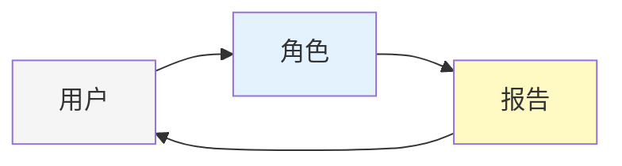

**使用场景**：一个视角对一个工件的单一视角审查。

**示例**：
- "审查这个 PR" → `code-reviewer`
- "找出 auth.ts 中的安全问题" → `security-auditor`

#### 5.1.2 单角色斜杠命令

```mermaid
graph LR
    U[/review] --> P[code-reviewer<br/>+ 技能]
    P --> R[报告]

    style U fill:#fff3e0
    style P fill:#e3f2fd
    style R fill:#fff9c4
```

**使用场景**：相同单角色调用重复发生，配置相同。

**示例**：`/review`、`/test`、`/code-simplify`

#### 5.1.3 并行扇出合并（Parallel Fan-out with Merge）

```mermaid
graph TB
    U[/ship] --> Fan[并行扇出]

    Fan --> P1[code-reviewer]
    Fan --> P2[security-auditor]
    Fan --> P3[test-engineer]

    P1 --> R1[审查报告]
    P2 --> R2[审计报告]
    P3 --> R3[覆盖报告]

    R1 --> Merge[主代理合并]
    R2 --> Merge
    R3 --> Merge

    Merge --> Decision[GO/NO-GO<br/>决策]

    Decision --> Rollback[回滚计划]

    style U fill:#fff3e0
    style Fan fill:#e0f2f1
    style P1 fill:#e3f2fd
    style P2 fill:#e3f2fd
    style P3 fill:#e3f2fd
    style Merge fill:#fff9c4
    style Decision fill:#ffcdd2
    style Rollback fill:#ffcdd2
```

**使用场景**：
- 子任务真正独立（无共享可变状态，无顺序依赖）
- 每个子代理受益于独立上下文窗口
- 合并步骤足够小可留在主上下文中
- 墙时钟延迟重要

**验证检查清单**：
- [ ] 能否同时运行所有子代理而无顺序问题？
- [ ] 每个角色产生不同*类型*的发现吗？
- [ ] 合并步骤是否适合主代理的剩余上下文？
- [ ] 用户等待时间是否足够长以至于并行性明显？

#### 5.1.4 用户驱动的顺序管道

```mermaid
graph LR
    U[用户] --> C1[/spec]
    U --> C2[/plan]
    U --> C3[/build]
    U --> C4[/test]
    U --> C5[/review]
    U --> C6[/ship]

    C1 --> C2
    C2 --> C3
    C3 --> C4
    C4 --> C5
    C5 --> C6

    style U fill:#f5f5f5
    style C1 fill:#fff3e0
    style C2 fill:#fff3e0
    style C3 fill:#fff3e0
    style C4 fill:#fff3e0
    style C5 fill:#fff3e0
    style C6 fill:#fff3e0
```

**关键**：**没有编排代理**——用户**就是**编排者。

**使用场景**：工作流有依赖关系（每步需要前一步输出），步骤间的人类判断有价值。

#### 5.1.5 研究隔离（上下文保留）

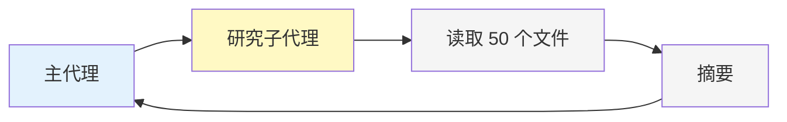

**使用场景**：
- 主会话需要专注于下游任务
- 调查结果远小于其消耗的输入
- 主代理在思考后的决策质量受益

### 5.2 反模式（应避免）

#### 5.2.1 路由角色（"元编排者"）

```mermaid
graph LR
    U[/work] --> Router[路由角色]
    Router --> CodeReviewer[code-reviewer]
    CodeReviewer --> Router
    Router --> U

    style Router fill:#ffcdd2
    style CodeReviewer fill:#e3f2fd
```

**问题**：
- 纯路由层，无领域价值
- 增加两次转述跳跃 → 信息丢失 + 约 2× token 成本
- 用户已知需要审查，可直接调用 `/review`

#### 5.2.2 角色调用角色

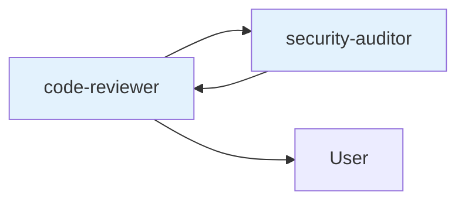

**问题**：
- 角色设计用于产生单一视角，链式调用破坏此目的
- 调用角色传递的摘要丢失被调用角色所需的上下文
- 失败模式倍增（谁的输出格式胜出？谁的规则适用？）

#### 5.2.3 顺序编排器转述

```mermaid
graph LR
    Orchestrator[编排器] --> C1[/spec]
    C1 --> Orchestrator
    Orchestrator --> C2[/plan]
    C2 --> Orchestrator
    Orchestrator --> C3[/build]

    style Orchestrator fill:#ffcdd2
```

**问题**：
- 失去捕获错误方向工作的人类检查点
- 每次交接总结上下文 —— 长管道中的累积漂移
- 双倍 token 成本：编排器轮次 + 子代理轮次

### 5.3 编排决策流程

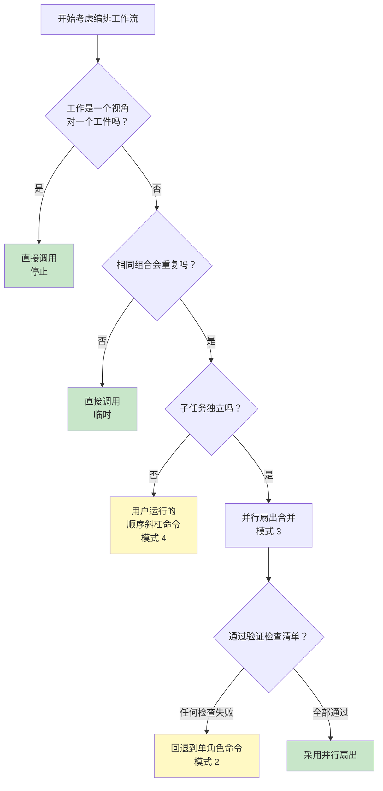

---

## 6. 生命周期流程

### 6.1 完整功能生命周期

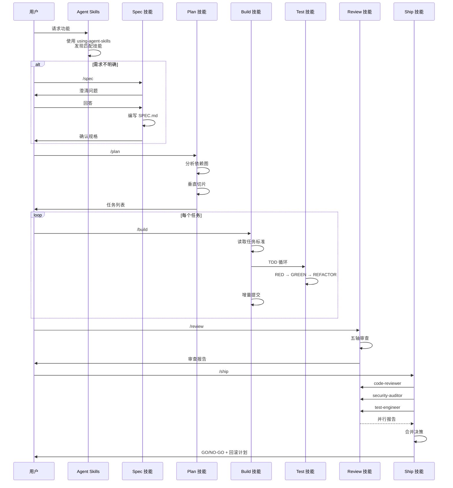

### 6.2 意图 → 技能映射

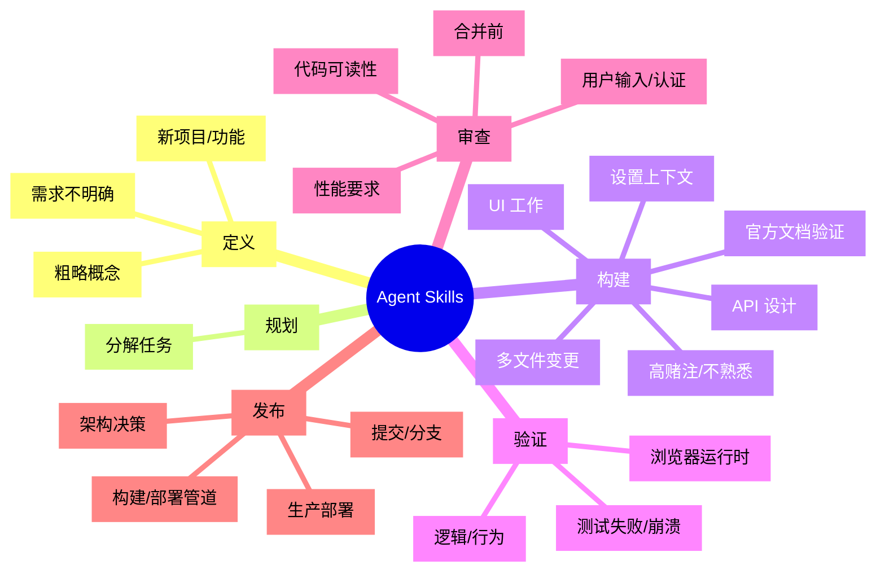

### 6.3 技能组合示例

#### 6.3.1 Bug 修复流程

```mermaid
graph LR
    Bug[Bug 报告] --> Debug[debugging-and-error-recovery]
    Debug --> Reproduce[复现问题]
    Reproduce --> TDD[test-driven-development<br/>Prove-It 模式]
    TDD --> Test[编写失败测试]
    Test --> Fix[实施修复]
    Fix --> Review[code-review-and-quality]
    Review --> Ship[shipping-and-launch<br/>如果紧急]
```

#### 6.3.2 新功能开发流程

```mermaid
graph TD
    Idea[想法] --> Interview[interview-me<br/>可选]
    Interview --> Spec[spec-driven-development]
    Spec --> Plan[planning-and-task-breakdown]
    Plan --> Context[context-engineering<br/>可选]
    Context --> Build[incremental-implementation]
    Build --> TDD[test-driven-development]
    TDD --> Review[code-review-and-quality]
    Review --> Git[git-workflow-and-versioning]
    Git --> Docs[documentation-and-adrs]
    Docs --> Ship[shipping-and-launch]
```

---

## 7. Hook 系统

### 7.1 Hook 生命周期

```mermaid
stateDiagram-v2
    [*] --> SessionStart
    SessionStart --> Active: 注入元技能

    state Active {
        [*] --> ToolUse
        ToolUse --> PreToolUse: 工具调用前
        PreToolUse --> ToolExecution: 允许执行
        PreToolUse --> ToolSkipped: 拦截

        ToolExecution --> PostToolUse: 工具调用后
        PostToolUse --> ToolUse
        ToolSkipped --> ToolUse
    }

    Active --> [*]: 会话结束
```

### 7.2 Hook 注册架构

```mermaid
graph TB
    subgraph "settings.json"
        Config[hook 配置]
    end

    subgraph "Plugin Root"
        HooksDir[hooks/]
        HooksDir --> SessionStart[session-start.sh]
        HooksDir --> SDDPre[sdd-cache-pre.sh]
        HooksDir --> SDDPost[sdd-cache-post.sh]
    end

    subgraph "执行环境"
        ENV[环境变量]
        ENV --> CLAUDE[CLAUDE_PLUGIN_ROOT]
        ENV --> CLAUDE2[CLAUDE_PROJECT_DIR]
    end

    Config --> HooksDir
    CLAUDE --> HooksDir
    CLAUDE2 --> HooksDir

    style Config fill:#e0f2f1
    style HooksDir fill:#b2dfdb
    style ENV fill:#ffccbc
```

### 7.3 SessionStart Hook

```mermaid
sequenceDiagram
    participant Claude as Claude Code
    participant Hook as session-start.sh
    participant Skill as using-agent-skills/SKILL.md
    participant Agent as 代理

    Claude->>Hook: 会话开始触发
    Hook->>Skill: 读取元技能内容
    Hook->>Hook: jq JSON 转义
    Hook->>Claude: 返回 IMPORTANT 优先级消息
    Claude->>Agent: 注入到系统提示
    Agent->>Agent: 获得技能发现流程图
```

**实现细节**：
- 检查 `jq` 是否可用
- 读取 `skills/using-agent-skills/SKILL.md`
- 使用 `jq` 正确转义和构建有效 JSON
- 返回 `priority: "IMPORTANT"` 消息

---

## 8. 平台集成

### 8.1 多平台支持

```mermaid
graph TB
    subgraph "Claude Code"
        CC[Plugin 机制]
        CC --> Skills[skills/ 自动发现]
        CC --> Agents[agents/ 自动发现]
        CC --> Commands[.claude/commands/]
    end

    subgraph "Gemini CLI"
        GC[Native Skills]
        GC --> GS[skills install]
        GC --> GM[GEMINI.md 持久上下文]
    end

    subgraph "Cursor"
        CUR[.cursor/rules/]
        CUR --> CR[复制 SKILL.md]
    end

    subgraph "GitHub Copilot"
        GH[.github/copilot-instructions.md]
        GH --> GH1[agents/ 角色定义]
        GH --> GH2[skills/ 技能内容]
    end

    subgraph "Windsurf"
        WS[.windsurfrules]
        WS --> WS1[添加技能内容]
    end

    subgraph "OpenCode"
        OC[AGENTS.md]
        OC --> OC1[skill 工具执行]
        OC --> OC2[技能驱动执行模型]
    end

    style CC fill:#e3f2fd
    style GC fill:#fff3e0
    style CUR fill:#f1f8e9
    style GH fill:#e8f5e9
    style WS fill:#fce4ec
    style OC fill:#e0f7fa
```

### 8.2 Claude Code 集成深度

#### 8.2.1 Plugin 架构

```mermaid
graph LR
    subgraph "Plugin Root"
        Plugin[.claude-plugin/]
        Plugin --> PJSON[plugin.json]
        Plugin --> PMJSON[marketplace.json]
    end

    PJSON --> Skills[skills: ./skills]
    PJSON --> Agents[agents: [./agents/*.md]]
    PJSON --> Commands[commands: ./.claude/commands]

    Skills --> Auto[自动发现技能]
    Agents --> Auto2[自动发现子代理]
    Commands --> Auto3[斜杠命令注册]

    style Plugin fill:#e0f2f1
    style Skills fill:#b2dfdb
    style Agents fill:#b2dfdb
    style Commands fill:#b2dfdb
```

#### 8.2.2 子代理 vs Agent Teams

| 特性 | Subagents | Agent Teams |
|---|---|---|
| 协调 | 主代理扇出，子代理仅报告 | 队友互相消息，共享任务列表 |
| 上下文 | 每个子代理独立上下文窗口 | 每个队友独立上下文窗口 |
| 使用场景 | 独立任务产生报告 | 需要讨论的协作工作 |
| 状态 | 稳定 | 实验性（需要环境变量） |
| 成本 | 较低 | 较高（每个队友是独立 Claude 实例） |

**Persona 兼容性**：
- 当作为子代理运行时：`skills` 和 `mcpServers` 前端字段被 honoring
- 当作为队友运行时：这些字段被**忽略**
- 队友从项目和用户设置加载技能和 MCP 服务器

#### 8.2.3 平台强制规则

Claude Code 强制执行以下规则，符合 Agent Skills 架构：

1. **子代理不能调用其他子代理** - 防止反模式 B
2. **无嵌套团队** - 队友不能生成自己的团队 - 防止反模式 D

---

## 9. Skill 内部结构

### 9.1 Skill 组件关系

```mermaid
graph TB
    subgraph "Skill 目录"
        Dir[skill-name/]
        Dir --> SkillMD[SKILL.md<br/>必需]
        Dir --> Scripts[scripts/<br/>可选]
        Dir --> Support[supporting.md<br/>可选]
    end

    SkillMD --> Frontmatter[前端元数据]
    SkillMD --> Overview[概述]
    SkillMD --> WhenToUse[何时使用]
    SkillMD --> Workflow[工作流]
    SkillMD --> Rationalizations[合理化表格]
    SkillMD --> RedFlags[红旗]
    SkillMD --> Verification[验证]

    Scripts --> Shell[.sh 脚本<br/>#!/bin/bash]
    Shell --> FailFast[set -e 失败快速]
    Shell --> StdErr[状态消息到 stderr]
    Shell --> StdOut[JSON 输出到 stdout]
    Shell --> Cleanup[清理陷阱]

    style Dir fill:#f5f5f5
    style SkillMD fill:#e8f5e9
    style Scripts fill:#fff9c4
    style Support fill:#e0f2f1
```

### 9.2 Skill 加载流程

```mermaid
sequenceDiagram
    participant Session as 会话启动
    participant Agent as 代理
    participant SkillLoader as Skill 加载器
    participant Skill as SKILL.md
    participant Support as 支持文件

    Session->>Agent: 启动上下文
    Agent->>SkillLoader: 获取可用技能
    SkillLoader->>Skill: 读取所有 SKILL.md
    Skill-->>SkillLoader: 返回 name + description
    SkillLoader-->>Agent: 注入到系统提示

    Note over Agent: 用户发出任务请求

    Agent->>Agent: 意图匹配
    Agent->>Skill: 读取完整 SKILL.md
    Skill-->>Agent: 返回完整内容

    opt 需要参考材料
        Agent->>Support: 读取支持文件
        Support-->>Agent: 返回参考内容
    end

    Agent->>Agent: 遵循技能工作流
```

**Token 意识设计**：
- 仅在代理决定相关时加载完整 SKILL.md
- 支持文件仅在需要时读取
- 保持 SKILL.md 在 500 行以下

### 9.3 命名约定

```mermaid
mindmap
  root((命名约定))
    Skill
      directory[lowercase-hyphen-separated]
      file[SKILL.md<br/>总是大写]
    Scripts
      filename[lowercase-hyphen.sh]
      shebang[#!/bin/bash]
    Supporting
      naming[lowercase-hyphen.md]
      location[存储在 references/<br/>而非技能目录内]
    Zip
      naming[skill-name.zip]
      match[必须匹配目录名]
```

---

## 10. 架构优势

### 10.1 关键优势

```mermaid
graph TB
    subgraph "生产级质量"
        Q1[流程编码化]
        Q2[质量守门]
        Q3[反合理化设计]
    end

    subgraph "高效执行"
        E1[渐进式披露]
        E2[并行编排]
        E3[Hook 自动化]
    end

    subgraph "灵活扩展"
        F1[平台无关]
        F2[插件架构]
        F3[可组合层]
    end

    Q1 --> P[资深工程师工作流]
    Q2 --> P
    Q3 --> P

    E1 --> T[最小 Token 消耗]
    E2 --> T
    E3 --> T

    F1 --> M[多工具兼容]
    F2 --> M
    F3 --> M

    style P fill:#c8e6c9
    style T fill:#fff9c4
    style M fill:#e0f2f1
```

### 10.2 设计原则总结

1. **用户/斜杠命令是编排者** - 避免深层协调树
2. **技能是强制路径** - 意图匹配时必须调用
3. **过程重于知识** - 工作流而非参考文档
4. **证据优于假设** - 每个验证步骤需要证明
5. **渐进式披露** - 主 SKILL.md 是入口点，支持文件按需加载
6. **Token 意识** - 每个部分必须证明其包含的合理性

### 10.3 适用场景

| 场景 | 推荐模式 |
|---|---|
| 单一视角审查 | 直接调用 |
| 重复单角色工作 | 单角色斜杠命令 |
| 生产部署决策 | 并行扇出合并 |
| 完整功能开发 | 用户驱动顺序命令 |
| 大量代码研究 | 研究隔离 |

---

## 附录

### A. 文件结构

```
agent-skills/
├── skills/                            # 23 个技能
│   ├── {skill-name}/
│   │   ├── SKILL.md                   # 必需
│   │   ├── scripts/                   # 可选
│   │   └── supporting-file.md         # 可选
├── agents/                            # 3 个专家角色
│   ├── code-reviewer.md
│   ├── security-auditor.md
│   └── test-engineer.md
├── references/                        # 4 个参考清单
│   ├── testing-patterns.md
│   ├── security-checklist.md
│   ├── performance-checklist.md
│   └── accessibility-checklist.md
├── hooks/                             # Hook 系统
│   ├── hooks.json
│   ├── session-start.sh
│   ├── sdd-cache-pre.sh
│   └── sdd-cache-post.sh
├── .claude/                           # Claude Code 集成
│   └── commands/                      # 7 个斜杠命令
├── .gemini/                           # Gemini CLI 集成
│   └── commands/
├── .claude-plugin/                    # 插件元数据
│   ├── plugin.json
│   └── marketplace.json
└── docs/                              # 安装指南
```

### B. 开发资源

- [Skill Anatomy](docs/skill-anatomy.md) - Skill 格式规范
- [Orchestration Patterns](references/orchestration-patterns.md) - 编排模式目录
- [AGENTS.md](AGENTS.md) - 代理集成指南
- [Getting Started](docs/getting-started.md) - 入门指南

### C. 引用来源

本文档基于以下版本的 agent-skills 分析：
- Commit: 未指定（2026/05/14 快照）
- Repository: addyosmani/agent-skills
- License: MIT