# Agent-Skills 架构分析文档

> 分析对象: `./vendors/agent-skills/`  
> 创建日期: 2026-05-14  
> 文档作者: Trea

---

## 目录

1. [项目概览](#1-项目概览)
2. [核心架构设计](#2-核心架构设计)
3. [三层组合模型](#3-三层组合模型)
4. [技能体系架构](#4-技能体系架构)
5. [Agent Persona 体系](#5-agent-persona-体系)
6. [编排模式与决策流](#6-编排模式与决策流)
7. [插件与生命周期机制](#7-插件与生命周期机制)
8. [上下文工程与 Token 优化](#8-上下文工程与-token-优化)
9. [跨平台兼容性](#9-跨平台兼容性)
10. [测试与 CI/CD 架构](#10-测试与-cicd-架构)
11. [设计原则与工程理念](#11-设计原则与工程理念)
12. [总结与评价](#12-总结与评价)

---

## 1. 项目概览

`agent-skills` 是由 Addy Osmani 主导开发的 **面向 AI 编码代理的生产级工程技能集合**。该项目将资深工程师在构建软件时遵循的工作流、质量门禁和最佳实践编码为 AI 代理可执行的标准化指令。

### 1.1 核心价值主张

| 维度 | 描述 |
|------|------|
| **目标** | 让 AI 代理始终遵循资深工程师的纪律，而非走捷径 |
| **覆盖** | 软件开发生命周期全阶段：定义 → 计划 → 构建 → 验证 → 审查 → 发布 |
| **形式** | 纯 Markdown 文档 + Bash 脚本 + 插件配置 |
| **受众** | Claude Code、Cursor、Gemini CLI、Windsurf、OpenCode、GitHub Copilot、Kiro 等 |

### 1.2 项目文件结构

```mermaid
graph TB
    ROOT["agent-skills/"]
    
    ROOT --> SKILLS["skills/ (23个技能)"]
    ROOT --> AGENTS["agents/ (3个角色)"]
    ROOT --> REFS["references/ (4个参考清单)"]
    ROOT --> HOOKS["hooks/ (会话生命周期)"]
    ROOT --> CLAUDE[".claude/commands/ (7个斜杠命令)"]
    ROOT --> GEMINI[".gemini/commands/ (7个TOML命令)"]
    ROOT --> DOCS["docs/ (平台安装指南)"]
    ROOT --> PLUGIN[".claude-plugin/ (插件配置)"]
    ROOT --> GITHUB[".github/workflows/ (CI/CD)"]
    
    SKILLS --> DEFINE["Define阶段: interview-me, idea-refine, spec-driven-development"]
    SKILLS --> PLAN["Plan阶段: planning-and-task-breakdown"]
    SKILLS --> BUILD["Build阶段: incremental-implementation, test-driven-development, context-engineering, source-driven-development, doubt-driven-development, frontend-ui-engineering, api-and-interface-design"]
    SKILLS --> VERIFY["Verify阶段: browser-testing-with-devtools, debugging-and-error-recovery"]
    SKILLS --> REVIEW["Review阶段: code-review-and-quality, code-simplification, security-and-hardening, performance-optimization"]
    SKILLS --> SHIP["Ship阶段: git-workflow-and-versioning, ci-cd-and-automation, deprecation-and-migration, documentation-and-adrs, shipping-and-launch"]
    SKILLS --> META["Meta: using-agent-skills (元技能)"]
    
    AGENTS --> CODE_REVIEWER["code-reviewer.md (高级Staff工程师)"]
    AGENTS --> SECURITY_AUDITOR["security-auditor.md (安全工程师)"]
    AGENTS --> TEST_ENGINEER["test-engineer.md (QA工程师)"]
    
    REFS --> TESTING["testing-patterns.md"]
    REFS --> SECURITY["security-checklist.md"]
    REFS --> PERFORMANCE["performance-checklist.md"]
    REFS --> ACCESSIBILITY["accessibility-checklist.md"]
```

### 1.3 关键配置文件

| 文件 | 作用 |
|------|------|
| [plugin.json](file:///d:/software/gitWorkspace/AI/vendors/agent-skills/.claude-plugin/plugin.json) | Claude Code 插件清单，定义 commands/skills/agents 路径 |
| [marketplace.json](file:///d:/software/gitWorkspace/AI/vendors/agent-skills/.claude-plugin/marketplace.json) | 插件市场发布配置，指向 GitHub 仓库 |
| [AGENTS.md](file:///d:/software/gitWorkspace/AI/vendors/agent-skills/AGENTS.md) | AI 编码代理指南，定义意图映射和执行规则 |
| [hooks.json](file:///d:/software/gitWorkspace/AI/vendors/agent-skills/hooks/hooks.json) | 会话生命周期钩子配置 |

---

## 2. 核心架构设计

### 2.1 架构总览

项目采用 **三层可组合架构**，每层职责明确、互不混淆：

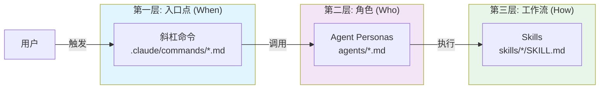

| 层级 | 文件位置 | 职责 | 一句话概括 |
|------|----------|------|-----------|
| **斜杠命令** | `.claude/commands/*.md` | 用户入口点 | **何时** 触发 |
| **Agent Persona** | `agents/*.md` | 角色与视角 | **谁** 来执行 |
| **Skill** | `skills/<name>/SKILL.md` | 工作流与退出标准 | **如何** 执行 |

### 2.2 组合规则（核心约束）

项目定义了严格的组合规则，防止架构腐化：

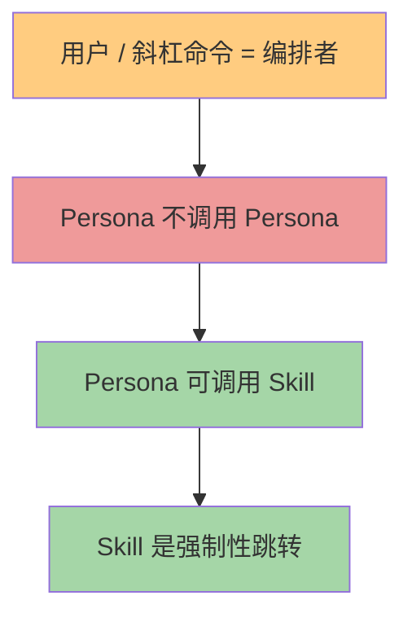

**核心约束：**
1. **用户（或斜杠命令）是编排者** — 不是另一个 Agent
2. **Persona 不调用其他 Persona** — 这是 Claude Code 的硬平台限制（subagent 无法生成 subagent）
3. **当意图匹配时，Skill 是强制性跳转** — 不可选择性跳过
4. **唯一 endorsed 的多 Persona 编排** 是并行扇出（fan-out）+ 合并步骤

---

## 3. 三层组合模型详解

### 3.1 技能层 (Skills) — "How"

技能是 **带有步骤和退出标准的工作流**，不是参考文档。

#### 3.1.1 技能解剖学

每个技能遵循统一的解剖结构：

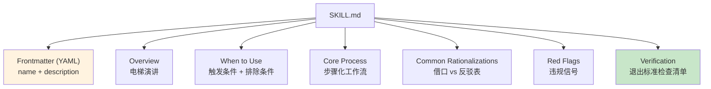

**Frontmatter 规范：**

```yaml
---
name: lowercase-hyphen-name
description: 第三人称描述技能功能 + "Use when..." 触发条件
---
```

> 描述必须包含 **what**（做什么）和 **when**（何时用），最大 1024 字符。描述中的流程摘要会导致代理跳过正文阅读。

#### 3.1.2 技能加载机制（渐进式披露）

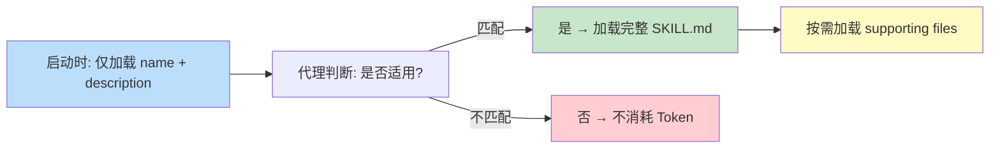

**Token 优化策略：**
- `SKILL.md` 保持在 500 行以内
- 参考材料放入独立文件（`references/`）
- 脚本执行不消耗上下文（仅输出消耗）
- 文件引用只深一层

### 3.2 Persona 层 — "Who"

Persona 是 **具有单一视角和输出格式的角色定义**。

#### 3.2.1 三个内置 Persona

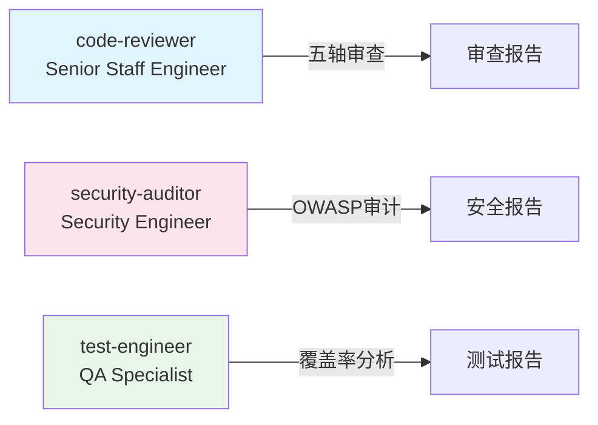

| Persona | 角色定位 | 核心能力 | 输出格式 |
|---------|----------|----------|----------|
| [code-reviewer](file:///d:/software/gitWorkspace/AI/vendors/agent-skills/agents/code-reviewer.md) | Senior Staff Engineer | 五轴代码审查 | 审查报告（Critical/Important/Suggestion） |
| [security-auditor](file:///d:/software/gitWorkspace/AI/vendors/agent-skills/agents/security-auditor.md) | Security Engineer | 漏洞检测、威胁建模 | 安全审计报告 |
| [test-engineer](file:///d:/software/gitWorkspace/AI/vendors/agent-skills/agents/test-engineer.md) | QA Specialist | 测试策略、覆盖率分析 | 测试覆盖报告 |

#### 3.2.2 Persona 生命周期

```mermaid
flowchart TD
    A["用户请求"]
    
    B{单一视角<br/>单一工件?}
    C["直接调用 Persona"]
    D["是否需要重复?"]
    E["斜杠命令包装"]
    F{"子任务独立?"]
    G["并行扇出 + 合并"]
    H["用户驱动的顺序命令"]
    
    A --> B
    B -->|"是"| C
    B -->|"否"| D
    D -->|"是"| E
    D -->|"否"| F
    F -->|"是"| G
    F -->|"否"| H
    
    style C fill:#bbdefb
    style E fill:#c8e6c9
    style G fill:#ffe0b2
    style H fill:#e1bee7
```

### 3.3 命令层 — "When"

斜杠命令是 **用户面向的入口点**，封装 Persona + Skill 的工作流。

#### 3.3.1 七个生命周期命令

| 命令 | 文件 | 触发的 Skill | 开发阶段 |
|------|------|--------------|----------|
| `/spec` | [spec.md](file:///d:/software/gitWorkspace/AI/vendors/agent-skills/.claude/commands/spec.md) | `spec-driven-development` | 定义 |
| `/plan` | [plan.md](file:///d:/software/gitWorkspace/AI/vendors/agent-skills/.claude/commands/plan.md) | `planning-and-task-breakdown` | 计划 |
| `/build` | [build.md](file:///d:/software/gitWorkspace/AI/vendors/agent-skills/.claude/commands/build.md) | `incremental-implementation` + `test-driven-development` | 构建 |
| `/test` | [test.md](file:///d:/software/gitWorkspace/AI/vendors/agent-skills/.claude/commands/test.md) | `test-driven-development` | 验证 |
| `/review` | [review.md](file:///d:/software/gitWorkspace/AI/vendors/agent-skills/.claude/commands/review.md) | `code-review-and-quality` | 审查 |
| `/code-simplify` | [code-simplify.md](file:///d:/software/gitWorkspace/AI/vendors/agent-skills/.claude/commands/code-simplify.md) | `code-simplification` | 简化 |
| `/ship` | [ship.md](file:///d:/software/gitWorkspace/AI/vendors/agent-skills/.claude/commands/ship.md) | 并行扇出所有 Persona | 发布 |

---

## 4. 技能体系架构

### 4.1 技能全景图（23个技能）

```mermaid
flowchart TB
    subgraph META["元技能"]
        M1["using-agent-skills<br/>技能发现与路由"]
    end
    
    subgraph DEFINE["Define - 定义阶段"]
        D1["interview-me<br/>需求澄清访谈"]
        D2["idea-refine<br/>创意提炼"]
        D3["spec-driven-development<br/>规范驱动开发"]
    end
    
    subgraph PLAN["Plan - 计划阶段"]
        P1["planning-and-task-breakdown<br/>任务分解"]
    end
    
    subgraph BUILD["Build - 构建阶段"]
        B1["incremental-implementation<br/>增量实现"]
        B2["test-driven-development<br/>测试驱动开发"]
        B3["context-engineering<br/>上下文工程"]
        B4["source-driven-development<br/>源码驱动开发"]
        B5["doubt-driven-development<br/>怀疑驱动开发"]
        B6["frontend-ui-engineering<br/>前端UI工程"]
        B7["api-and-interface-design<br/>API与接口设计"]
    end
    
    subgraph VERIFY["Verify - 验证阶段"]
        V1["browser-testing-with-devtools<br/>浏览器测试"]
        V2["debugging-and-error-recovery<br/>调试与错误恢复"]
    end
    
    subgraph REVIEW["Review - 审查阶段"]
        R1["code-review-and-quality<br/>代码审查与质量"]
        R2["code-simplification<br/>代码简化"]
        R3["security-and-hardening<br/>安全加固"]
        R4["performance-optimization<br/>性能优化"]
    end
    
    subgraph SHIP["Ship - 发布阶段"]
        S1["git-workflow-and-versioning<br/>Git工作流"]
        S2["ci-cd-and-automation<br/>CI/CD自动化"]
        S3["deprecation-and-migration<br/>弃用与迁移"]
        S4["documentation-and-adrs<br/>文档与ADR"]
        S5["shipping-and-launch<br/>发布与启动"]
    end
    
    M1 --> DEFINE
    DEFINE --> PLAN
    PLAN --> BUILD
    BUILD --> VERIFY
    VERIFY --> REVIEW
    REVIEW --> SHIP
    
    style META fill:#fff3e0
    style DEFINE fill:#e1f5fe
    style PLAN fill:#f3e5f5
    style BUILD fill:#e8f5e9
    style VERIFY fill:#fce4ec
    style REVIEW fill:#e0f2f1
    style SHIP fill:#fff8e1
```

### 4.2 技能分类与触发条件

#### 4.2.1 元技能 (1个)

| 技能 | 功能 | 触发时机 |
|------|------|----------|
| [using-agent-skills](file:///d:/software/gitWorkspace/AI/vendors/agent-skills/skills/using-agent-skills/SKILL.md) | 技能发现与路由 | 启动会话或决定适用技能时 |

#### 4.2.2 Define 阶段 (3个)

| 技能 | 核心方法 | 触发条件 |
|------|----------|----------|
| [interview-me](file:///d:/software/gitWorkspace/AI/vendors/agent-skills/skills/interview-me/SKILL.md) | 一问一答式访谈 | 需求模糊或用户要求"interview me" |
| [idea-refine](file:///d:/software/gitWorkspace/AI/vendors/agent-skills/skills/idea-refine/SKILL.md) | 发散/收敛思维 | 粗糙概念需要探索 |
| [spec-driven-development](file:///d:/software/gitWorkspace/AI/vendors/agent-skills/skills/spec-driven-development/SKILL.md) | 六域规范模板 | 新项目/功能/重大变更 |

#### 4.2.3 Build 阶段 (7个)

| 技能 | 核心理念 | 关键技术点 |
|------|----------|-----------|
| [incremental-implementation](file:///d:/software/gitWorkspace/AI/vendors/agent-skills/skills/incremental-implementation/SKILL.md) | 薄垂直切片 | 垂直切片、契约优先切片、风险优先切片 |
| [test-driven-development](file:///d:/software/gitWorkspace/AI/vendors/agent-skills/skills/test-driven-development/SKILL.md) | Red-Green-Refactor | 测试金字塔(80/15/5)、DAMP over DRY |
| [context-engineering](file:///d:/software/gitWorkspace/AI/vendors/agent-skills/skills/context-engineering/SKILL.md) | 正确的信息在正确的时机 | 规则文件、上下文打包、MCP集成 |
| [source-driven-development](file:///d:/software/gitWorkspace/AI/vendors/agent-skills/skills/source-driven-development/SKILL.md) | 官方文档验证 | 验证、引用、标记未验证内容 |
| [doubt-driven-development](file:///d:/software/gitWorkspace/AI/vendors/agent-skills/skills/doubt-driven-development/SKILL.md) | 对抗性审查 | CLAIM → EXTRACT → DOUBT → RECONCILE → STOP |
| [frontend-ui-engineering](file:///d:/software/gitWorkspace/AI/vendors/agent-skills/skills/frontend-ui-engineering/SKILL.md) | 组件架构与设计系统 | 设计系统、状态管理、WCAG 2.1 AA |
| [api-and-interface-design](file:///d:/software/gitWorkspace/AI/vendors/agent-skills/skills/api-and-interface-design/SKILL.md) | 契约优先设计 | Hyrum's Law、One Version Rule、边界验证 |

### 4.3 关键技能深度分析

#### 4.3.1 Spec-Driven Development 工作流

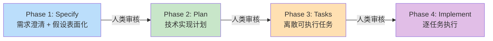

**六域规范模板：**

```
SPEC.md
├── Objective          → 构建什么？为什么？用户是谁？成功标准？
├── Tech Stack         → 框架、语言、关键依赖及版本
├── Commands           → 完整可执行命令（build/test/lint/dev）
├── Project Structure  → 目录布局及描述
├── Code Style         → 代码示例 + 关键约定
├── Testing Strategy   → 框架、位置、覆盖率、测试级别
├── Boundaries         → Always / Ask First / Never 三层系统
├── Success Criteria   → 具体的、可测试的完成条件
└── Open Questions     → 需要人类输入的未决问题
```

#### 4.3.2 Incremental Implementation 切片策略

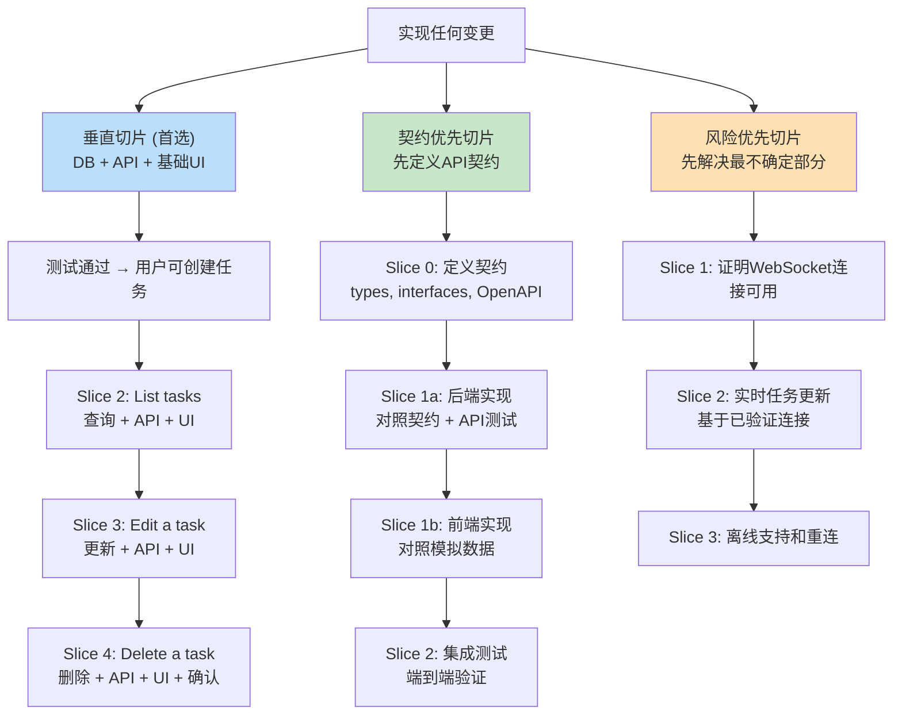

#### 4.3.3 Debugging and Error Recovery 五步法

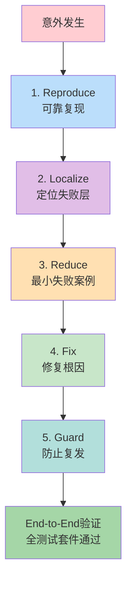

#### 4.3.4 Code Review 五轴审查

```mermaid
radarChart
    title 代码审查五维度
    axis correctness["Correctness<br/>正确性"]
    axis readability["Readability<br/>可读性"]
    axis architecture["Architecture<br/>架构"]
    axis security["Security<br/>安全性"]
    axis performance["Performance<br/>性能"]
```

**审查严重程度标签体系：**

| 标签 | 含义 | 作者操作 |
|------|------|----------|
| *(无前缀)* | 必需修改 | 合并前必须解决 |
| **Critical:** | 阻止合并 | 安全漏洞、数据丢失、功能破坏 |
| **Nit:** | 轻微、可选 | 作者可忽略 |
| **Optional:** / **Consider:** | 建议 | 值得考虑但非必需 |
| **FYI** | 信息性 | 无需操作 |

### 4.4 技能工作流示例

```mermaid
flowchart LR
    A["用户: 新功能需求"]
    B["interview-me<br/>澄清需求"]
    C["spec-driven-development<br/>编写SPEC.md"]
    D["planning-and-task-breakdown<br/>生成tasks.md"]
    E["incremental-implementation<br/>逐片实现"]
    F["test-driven-development<br/>测试验证"]
    G["code-review-and-quality<br/>代码审查"]
    H["git-workflow-and-versioning<br/>提交历史"]
    I["shipping-and-launch<br/>安全发布"]
    
    A --> B
    B --> C
    C --> D
    D --> E
    E --> F
    F --> G
    G --> H
    H --> I
    
    style C fill:#bbdefb
    style D fill:#c8e6c9
    style E fill:#e8f5e9
    style F fill:#ffe0b2
```

---

## 5. Agent Persona 体系

### 5.1 Persona 设计原则

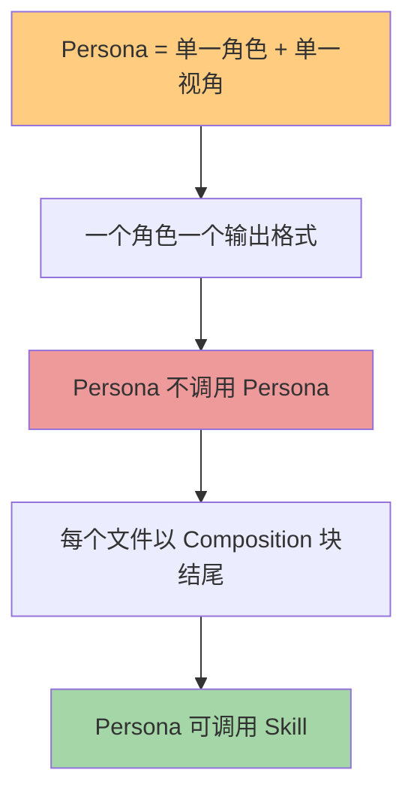

### 5.2 三种调用方式

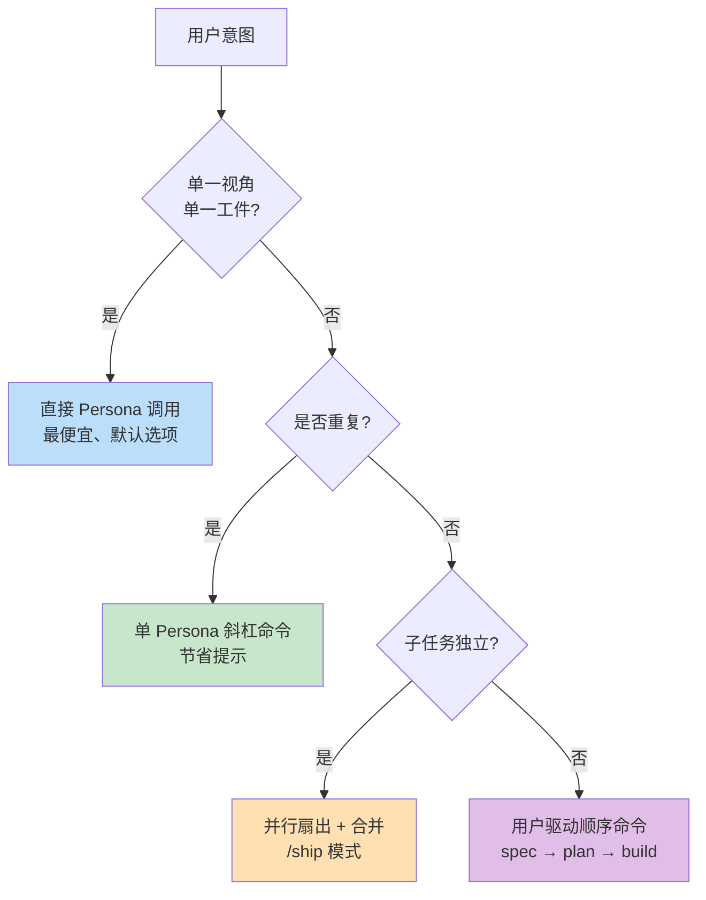

### 5.3 Claude Code 平台约束

| 约束 | 影响 | 架构应对 |
|------|------|----------|
| Subagent 无法生成 subagent | 无法构建深度 Persona 树 | 强制编排深度 ≤ 1 |
| Team 无法嵌套 | 无法递归团队协作 | 单一层级团队结构 |
| Plugin agent 忽略 hooks/mcpServers/permissionMode | 前端字段无效 | 避免依赖这些字段 |

---

## 6. 编排模式与决策流

### 6.1 五种编排模式

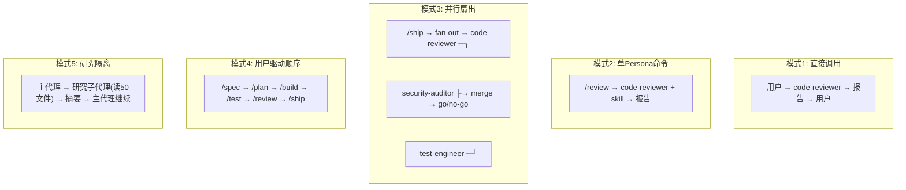

### 6.2 编排决策流

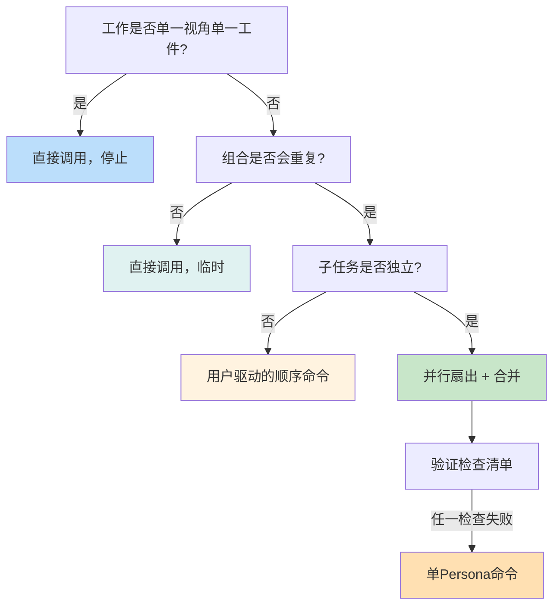

### 6.3 反模式

| 反模式 | 描述 | 为什么失败 | 正确做法 |
|--------|------|-----------|----------|
| **A. 路由器 Persona** | 决定调用哪个其他 Persona | 纯路由层、信息丢失、2× Token 成本 | 完善斜杠命令和意图映射 |
| **B. Persona 调用 Persona** | code-reviewer 内部调用 security-auditor | 单一视角设计被破坏、上下文丢失 | 在报告中推荐后续审计 |
| **C. 顺序编排器** | 自动执行 spec→plan→build | 丢失人类检查点、上下文漂移、2× Token | 保持用户为编排者 |
| **D. 深度 Persona 树** | /ship → coordinator → quality → reviewer | 每层增加延迟、调试变多级调查 | 编排深度 ≤ 1 |

### 6.4 完整生命周期流水线


---

## 7. 插件与生命周期机制

### 7.1 插件注册机制

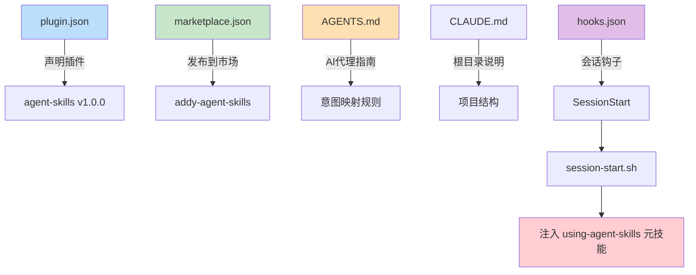

### 7.2 会话生命周期钩子


**Hook 执行流程：**

1. [session-start.sh](file:///d:/software/gitWorkspace/AI/vendors/agent-skills/hooks/session-start.sh) 检查 `jq` 是否可用
2. 若可用 → 读取 [using-agent-skills/SKILL.md](file:///d:/software/gitWorkspace/AI/vendors/agent-skills/skills/using-agent-skills/SKILL.md) 完整内容
3. 使用 `jq` 构造合法 JSON：`{priority: "IMPORTANT", message: "..."}`
4. 若无 `jq` → 输出 JSON 格式的 INFO 降级消息

### 7.3 脚本规范

| 要求 | 说明 |
|------|------|
| Shebang | `#!/bin/bash` |
| 失败快速 | `set -e` |
| 状态消息 | 写入 stderr：`echo "Message" >&2` |
| 机器输出 | 写入 stdout（JSON格式） |
| 清理 | 包含临时文件清理 trap |
| 引用路径 | `/mnt/skills/user/{skill-name}/scripts/{script}.sh` |

---

## 8. 上下文工程与 Token 优化

### 8.1 渐进式披露架构

```mermaid
flowchart TD
    A["启动: 仅加载 name + description"]
    B["代理决策: 是否匹配当前任务?"]
    C["匹配 → 加载完整 SKILL.md"]
    D["不匹配 → 不消耗 Token"]
    E["需要详细信息 → 加载 supporting files"]
    F["需要执行 → 运行 scripts/"]
    G["脚本输出消耗 Token"]
    
    A --> B
    B -->|"是"| C
    B -->|"否"| D
    C --> E
    C --> F
    F --> G
    
    style A fill:#bbdefb
    style B fill:#fff3e0
    style C fill:#c8e6c9
    style D fill:#ffcdd2
    style E fill:#ffe0b2
    style F fill:#e1bee7
    style G fill:#e0f2f1
```

### 8.2 Token 使用层级

| 阶段 | Token 消耗 | 策略 |
|------|-----------|------|
| 启动扫描 | 极低（仅 name + description） | 批量加载所有技能元数据 |
| 技能激活 | 中等（SKILL.md 全文） | 仅在匹配时加载 |
| 支持文件 | 按需（references/*.md） | 深一层引用 |
| 脚本执行 | 仅输出 | 不消耗脚本代码 Token |

### 8.3 技能描述设计原则

```yaml
# 优秀示例
description: Creates specs before coding. Use when starting a new project, feature, 
             or significant change and no specification exists yet.

# 错误示例（描述中包含流程步骤）
description: First ask questions, then write spec, then plan, then implement...
```

> **关键规则：** 描述中若包含流程步骤，代理可能阅读摘要而非正文。描述应说明 **what** 和 **when**，而非 **how**。

---

## 9. 跨平台兼容性

### 9.1 支持的平台矩阵

```mermaid
flowchart TD
    ROOT["agent-skills 核心资产"]
    
    A["纯 Markdown 技能"]
    B["YAML Frontmatter"]
    C["Bash 脚本"]
    D["插件配置"]
    
    ROOT --> A
    ROOT --> B
    ROOT --> C
    ROOT --> D
    
    A --> P1["Claude Code<br/>原生支持"]
    A --> P2["Cursor<br/>.cursor/rules/"]
    A --> P3["Gemini CLI<br/>gemini skills install"]
    A --> P4["Windsurf<br/>规则配置"]
    A --> P5["OpenCode<br/>skill 工具"]
    A --> P6["GitHub Copilot<br/>agents/ 定义"]
    A --> P7["Kiro<br/>.kiro/skills/"]
    A --> P8["Codex<br/>任意 Agent"]
    
    style P1 fill:#bbdefb
    style P2 fill:#c8e6c9
    style P3 fill:#ffe0b2
    style P4 fill:#e1bee7
    style P5 fill:#ffcdd2
    style P6 fill:#b2dfdb
    style P7 fill:#e0f2f1
    style P8 fill:#f3e5f5
```

### 9.2 平台适配策略

| 平台 | 安装方式 | 技能加载机制 | 特殊约束 |
|------|----------|-------------|----------|
| **Claude Code** | 插件市场 / 本地目录 | 自动发现，SessionStart 钩子 | Subagent 无法嵌套 |
| **Cursor** | 复制 SKILL.md 到 .cursor/rules/ | 手动引用 | 无钩子支持 |
| **Gemini CLI** | `gemini skills install` | 本地发现 | TOML 命令格式 |
| **Windsurf** | 添加到规则配置 | 手动配置 | 无斜杠命令 |
| **OpenCode** | skill 工具 | 意图映射 | 无斜杠命令，内部生命周期 |
| **GitHub Copilot** | agents/ 目录作为 Persona | 系统提示注入 | 指令文件 |
| **Kiro** | .kiro/skills/ | 项目/全局级别 | 支持 Agents.md |
| **Codex** | 任意系统提示 | 指令文件 | 纯 Markdown 兼容 |

### 9.3 OpenCode 内部生命周期映射

OpenCode 不支持斜杠命令，因此采用 **内部意图映射**：

```
DEFINE → spec-driven-development
PLAN   → planning-and-task-breakdown
BUILD  → incremental-implementation + test-driven-development
VERIFY → debugging-and-error-recovery
REVIEW → code-review-and-quality
SHIP   → shipping-and-launch
```

**执行规则：**
1. 任何匹配的技能（即使 1% 概率）必须调用
2. 使用 `skill` 工具严格遵循工作流
3. 在必需步骤（spec、plan 等）完成前，不得直接实现

---

## 10. 测试与 CI/CD 架构

### 10.1 测试体系

```mermaid
flowchart TD
    A["测试分类"]
    
    B["技能定义测试<br/>SKILL.md 格式验证"]
    C["钩子测试<br/>session-start JSON payload"]
    D["简化忽略测试<br/>simplify-ignore.sh"]
    E["插件安装测试<br/>GitHub Actions"]
    
    A --> B
    A --> C
    A --> D
    A --> E
    
    C --> F["session-start-test.sh<br/>Node.js 验证"]
    E --> G["test-plugin-install.yml<br/>validate + test-install"]
    
    style B fill:#bbdefb
    style C fill:#c8e6c9
    style F fill:#ffe0b2
    style G fill:#e1bee7
```

### 10.2 CI/CD 流水线

```mermaid
flowchart TD
    A["Push / PR / Manual Dispatch"]
    B["Job 1: Validate<br/>claude plugin validate ."]
    C["Job 2: Test Install<br/>marketplace add + install"]
    D["成功 → 插件可用"]
    
    A --> B
    B -->|"通过"| C
    C -->|"通过"| D
    
    B -->|"失败"| E["CI 失败"]
    C -->|"失败"| E
    
    style B fill:#c8e6c9
    style C fill:#ffe0b2
    style D fill:#a5d6a7
    style E fill:#ffcdd2
```

**流水线步骤：**

| 步骤 | 命令 | 验证内容 |
|------|------|----------|
| 1. Checkout | `actions/checkout@v6` | 获取代码 |
| 2. 安装 CLI | `npm install -g @anthropic-ai/claude-code` | 准备环境 |
| 3. 验证清单 | `claude plugin validate .` | marketplace.json + plugin.json |
| 4. 配置 HTTPS | `git config --global ...` | 避免 SSH 认证 |
| 5. 添加市场 | `claude plugin marketplace add ./` | 本地市场注册 |
| 6. 安装插件 | `claude plugin install agent-skills@addy-agent-skills --scope user` | 端到端安装测试 |

### 10.3 钩子测试机制

[session-start-test.sh](file:///d:/software/gitWorkspace/AI/vendors/agent-skills/hooks/session-start-test.sh) 验证：

```bash
# 1. 执行 session-start.sh
# 2. 捕获 JSON 输出
# 3. Node.js 解析验证:
#    - 有 jq 时: priority = "IMPORTANT", 包含 "agent-skills loaded."
#    - 无 jq 时: priority = "INFO", 包含 "jq is required"
```

---

## 11. 设计原则与工程理念

### 11.1 核心设计原则

```mermaid
mindmap
  root((Agent-Skills<br/>设计原则))
    流程胜于知识
      技能是工作流而非参考文档
      步骤而非事实
    具体胜于一般
      "运行 npm test" 优于 "验证测试"
    证据胜于假设
      每个验证都需要证明
    反合理化
      每个可跳过的步骤都需要反驳
    渐进式披露
      主文件是入口点
      支持文件按需加载
    Token意识
      每个部分都必须证明其价值
```

### 11.2 工程理念嵌入

项目深度嵌入了 Google 工程文化中的核心理念：

| 理念 | 来源 | 嵌入位置 |
|------|------|----------|
| **Hyrum's Law** | 软件工程中 Google | API 设计技能中的隐式契约 |
| **One Version Rule** | 工程实践指南 | API 设计中的单一版本源 |
| **Beyonce Rule** | Google 测试文化 | TDD 技能中的测试规则 |
| **测试金字塔 (80/15/5)** | Google 测试实践 | TDD 技能的测试分布 |
| **变更规模 (~100行)** | 代码审查实践 | 代码审查与 Git 工作流 |
| **Chesterton's Fence** | 工程审慎 | 代码简化技能 |
| **Trunk-Based Development** | Google 版本控制 | Git 工作流技能 |
| **Shift Left** | 安全工程 | CI/CD 技能 |
| **代码即负债** | 工程哲学 | 弃用与迁移技能 |

### 11.3 反合理化机制

每个技能都包含 **Common Rationalizations** 表，防止代理跳过重要步骤：

```
| 借口 | 现实 |
|------|------|
| "这很简单，不需要规范" | 简单任务不需要长规范，但仍需验收标准 |
| "我写完代码后再写规范" | 那是文档，不是规范。规范的价值在于编码前强制清晰 |
| "规范会拖慢我们" | 15分钟规范防止数小时返工 |
| "需求反正会变化" | 这就是为什么规范是活文档 |
```

---

## 12. 总结与评价

### 12.1 架构优势

| 维度 | 优势 | 说明 |
|------|------|------|
| **解耦** | 三层架构 | 入口点/角色/工作流清晰分离 |
| **可扩展** | 技能独立 | 新增技能无需修改其他层 |
| **跨平台** | 纯 Markdown | 任何接受系统提示的 Agent 都可用 |
| **Token 优化** | 渐进式披露 | 仅加载需要的内容 |
| **质量控制** | 验证步骤 | 每个技能都有退出标准 |
| **防错** | 反合理化表 | 阻止代理走捷径 |
| **工程纪律** | Google 最佳实践 | 嵌入真实工程经验 |

### 12.2 架构约束

| 约束 | 来源 | 影响 |
|------|------|------|
| 编排深度 ≤ 1 | 平台限制 + 设计选择 | 防止深度 Persona 树 |
| Persona 不互相调用 | Claude Code 硬限制 | 仅支持并行扇出 |
| 插件 agent 忽略部分字段 | 平台实现 | hooks/mcpServers 无效 |
| 技能描述 ≤ 1024 字符 | 上下文注入限制 | 必须精简 |

### 12.3 创新点

1. **反合理化表** — 独特设计，专门应对 LLM 的合理化倾向
2. **三层可组合架构** — 清晰职责分离，避免编排混乱
3. **渐进式披露** — 优雅解决 Token 限制问题
4. **并行扇出 + 合并** — 唯一 endorsed 的多 Agent 编排模式
5. **验证非协商** — 每个技能强制证据要求
6. **平台约束利用** — 将 Claude Code 限制转化为架构优势

### 12.4 架构全景图

```mermaid
flowchart TB
    subgraph USER["用户层"]
        U1["开发者 / 产品经理"]
    end
    
    subgraph INTERFACE["接口层"]
        C1["斜杠命令 (Claude Code)<br/>/spec /plan /build /test /review /ship"]
        C2["意图映射 (OpenCode/Cursor)<br/>自动技能发现"]
        C3["直接 Persona 调用<br/>code-reviewer / security-auditor"]
    end
    
    subgraph PERSONA["角色层"]
        P1["code-reviewer"]
        P2["security-auditor"]
        P3["test-engineer"]
    end
    
    subgraph SKILLS["技能层 (23个)"]
        S1["Define (3)"]
        S2["Plan (1)"]
        S3["Build (7)"]
        S4["Verify (2)"]
        S5["Review (4)"]
        S6["Ship (5)"]
        S7["Meta (1)"]
    end
    
    subgraph REFS["参考层"]
        R1["testing-patterns"]
        R2["security-checklist"]
        R3["performance-checklist"]
        R4["accessibility-checklist"]
    end
    
    subgraph HOOKS["钩子层"]
        H1["SessionStart"]
        H2["SDD Cache"]
        H3["Simplify Ignore"]
    end
    
    U1 --> C1
    U1 --> C2
    U1 --> C3
    
    C1 --> P1
    C1 --> P2
    C1 --> P3
    
    C2 --> S1
    C2 --> S2
    C2 --> S3
    
    C3 --> P1
    C3 --> P2
    C3 --> P3
    
    P1 --> S5
    P2 --> S5
    P3 --> S4
    
    S1 --> S2
    S2 --> S3
    S3 --> S4
    S4 --> S5
    S5 --> S6
    
    S3 --> R1
    S5 --> R2
    S5 --> R3
    S3 --> R4
    
    H1 --> S7
    
    style USER fill:#e3f2fd
    style INTERFACE fill:#f3e5f5
    style PERSONA fill:#e8f5e9
    style SKILLS fill:#fff3e0
    style REFS fill:#e0f2f1
    style HOOKS fill:#fce4ec
```

### 12.5 关键文件索引

| 类别 | 文件 | 用途 |
|------|------|------|
| 插件配置 | [plugin.json](file:///d:/software/gitWorkspace/AI/vendors/agent-skills/.claude-plugin/plugin.json) | Claude Code 插件定义 |
| 市场配置 | [marketplace.json](file:///d:/software/gitWorkspace/AI/vendors/agent-skills/.claude-plugin/marketplace.json) | 市场发布配置 |
| 代理指南 | [AGENTS.md](file:///d:/software/gitWorkspace/AI/vendors/agent-skills/AGENTS.md) | AI Agent 行为规范 |
| 项目说明 | [CLAUDE.md](file:///d:/software/gitWorkspace/AI/vendors/agent-skills/CLAUDE.md) | 项目结构与约定 |
| 技能解剖 | [skill-anatomy.md](file:///d:/software/gitWorkspace/AI/vendors/agent-skills/docs/skill-anatomy.md) | 技能格式规范 |
| 编排模式 | [orchestration-patterns.md](file:///d:/software/gitWorkspace/AI/vendors/agent-skills/references/orchestration-patterns.md) | 编排模式目录 |
| 元技能 | [using-agent-skills/SKILL.md](file:///d:/software/gitWorkspace/AI/vendors/agent-skills/skills/using-agent-skills/SKILL.md) | 技能发现与路由 |
| 会话钩子 | [session-start.sh](file:///d:/software/gitWorkspace/AI/vendors/agent-skills/hooks/session-start.sh) | 会话初始化 |
| CI/CD | [test-plugin-install.yml](file:///d:/software/gitWorkspace/AI/vendors/agent-skills/.github/workflows/test-plugin-install.yml) | 插件安装验证 |

---

## 附录

### A. 缩略语表

| 缩写 | 全称 |
|------|------|
| SDD | Spec-Driven Development |
| TDD | Test-Driven Development |
| DDD | Doubt-Driven Development |
| ADR | Architecture Decision Record |
| OWASP | Open Web Application Security Project |
| WCAG | Web Content Accessibility Guidelines |
| MCP | Model Context Protocol |
| CI/CD | Continuous Integration / Continuous Deployment |

### B. Mermaid 图表索引

| 图表 | 章节 |
|------|------|
| 项目文件结构 | 1.2 |
| 三层组合模型 | 2.1 |
| 组合规则 | 2.2 |
| 技能解剖学 | 3.1.1 |
| 技能加载机制 | 3.1.2 |
| 内置 Persona | 3.2.1 |
| Persona 生命周期 | 3.2.2 |
| 技能全景图 | 4.1 |
| Spec-Driven 工作流 | 4.3.1 |
| 增量实现切片 | 4.3.2 |
| 调试五步法 | 4.3.3 |
| 代码审查雷达图 | 4.3.4 |
| 技能工作流示例 | 4.4 |
| Persona 设计原则 | 5.1 |
| 三种调用方式 | 5.2 |
| 五种编排模式 | 6.1 |
| 编排决策流 | 6.2 |
| 完整生命周期 | 6.4 |
| 插件注册机制 | 7.1 |
| 会话生命周期 | 7.2 |
| 渐进式披露 | 8.1 |
| 平台支持矩阵 | 9.1 |
| 测试体系 | 10.1 |
| CI/CD 流水线 | 10.2 |
| 设计原则思维导图 | 11.1 |
| 架构全景图 | 12.4 |
